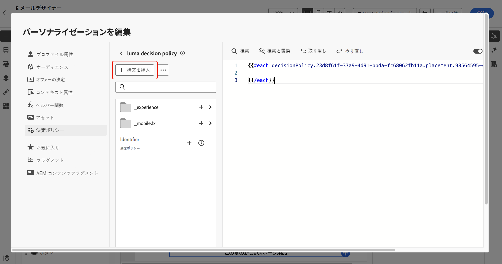
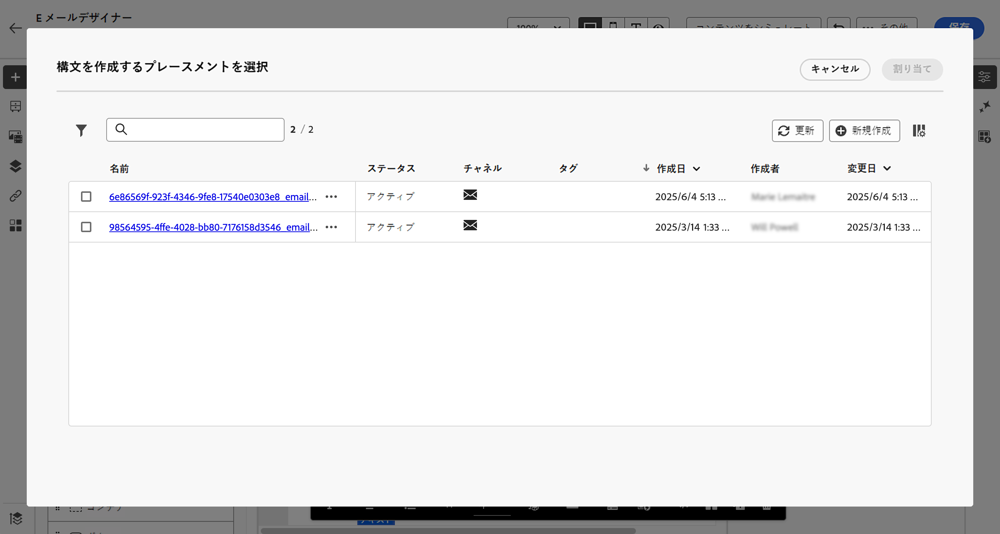
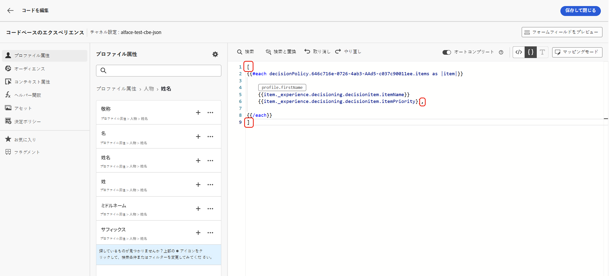
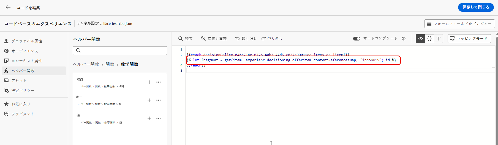
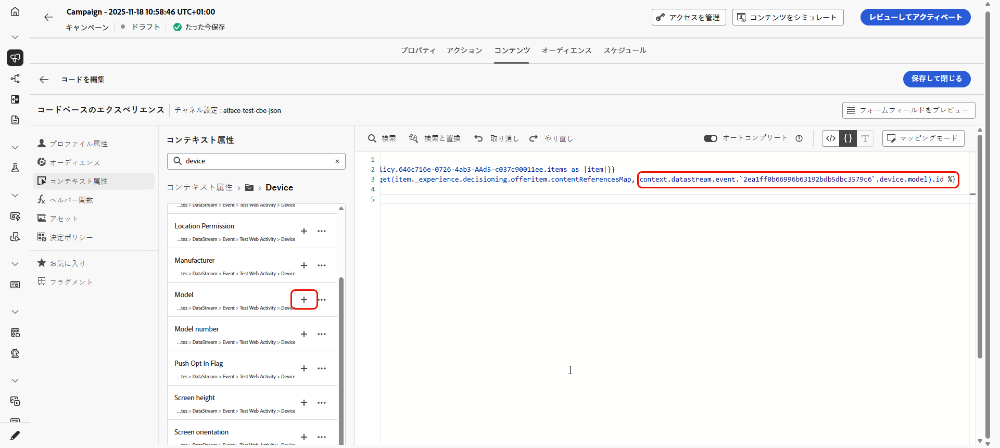
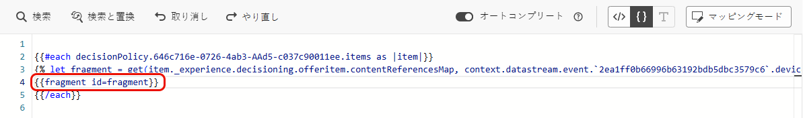

# メッセージでの決定ポリシーの使用 {#create-decision}

決定ポリシーを作成すると、返された決定項目にリンクされたポリシーと属性を、パーソナライゼーション用にコンテンツで使用できるようになります。 これを行うには、まず、決定ポリシーに関連付けられたコードをコンテンツに挿入する必要があります。 完了したら、その属性をパーソナライゼーションに活用できます。

## 決定ポリシーコードの挿入 {#insert-code}

1. パーソナライゼーションエディターを開き、**[!UICONTROL 決定ポリシー]**&#x200B;メニューにアクセスします。

1. **[!UICONTROL ポリシーを挿入]** （コードベースのエクスペリエンス）または **[!UICONTROL 構文を挿入]** （メール）を選択して、決定ポリシーに対応するコードを追加します。

   +++メールでの決定ポリシーコードの挿入

   

   メールの場合、コンポーネントに事前に関連付けられたプレースメントがない場合は、リストから 1 つ選択して「**[!UICONTROL 割り当て]**」をクリックします。

   

   +++

   +++コードベースのエクスペリエンスでの決定ポリシーコードの挿入

   

   +++

   >[!NOTE]
   >
   >コード挿入ボタンが表示されない場合は、親コンポーネントに対して決定ポリシーが既に設定されていることがあります。

1. 決定ポリシーのコードが追加されます。このシーケンスは、決定ポリシーを返して欲しい回数だけ繰り返します。例えば、[決定を作成する](#add-decision)際に、2 つの項目を返すように選択した場合、同じシーケンスが 2 回繰り返されます。

## 決定項目の属性の活用 {#attributes}

必要なすべての決定属性を、そのコード内に追加できるようになりました。利用可能な属性は、**[!UICONTROL オファー]**&#x200B;カタログのスキーマに保存されます。カスタム属性は、**`_<imsOrg`>** フォルダーに保存され、標準属性は **`_experience`** フォルダーに保存されます。[オファーカタログのスキーマの詳細情報](catalogs.md)


>[!NOTE]
>
>決定ポリシー項目のトラッキングの場合、決定ポリシーのコンテンツに対して、`trackingToken` 属性を次のように追加する必要があります。
>>`trackingToken: {{item._experience.decisioning.decisionitem.trackingToken}}`

属性を追加するには、横にある「+」アイコンをクリックします。 必要な数の属性をコードに追加できます。


`#each` ループを角括弧 `[ ]` で囲み、閉じ括弧 `/each` の直前にコンマを追加します。


また、パーソナライゼーションエディターで使用できる他の属性（プロファイル属性など）を追加することもできます。


## フラグメントの活用 {#fragments}

決定ポリシーにフラグメントを含む決定項目が含まれている場合は、決定ポリシーコードでこれらのフラグメントを活用できます。[詳しくは、フラグメントを参照してください。](../content-management/fragments.md)

>[!AVAILABILITY]
>
>この機能は現在、一連の組織でのみ使用できます（限定提供）。詳しくは、アドビ担当者にお問い合わせください。

例えば、複数のモバイルデバイスモデルに対して異なるコンテンツを表示するとします。決定ポリシーで使用している決定項目に、これらのデバイスに対応するフラグメントが追加されていることを確認します。[方法についてはこちらを参照してください](items.md#attributes)。

{width=70%}

完了したら、次のいずれかの方法を使用できます。

>[!BEGINTABS]

>[!TAB コードを直接挿入する]

以下のコードブロックを決定ポリシーコードにコピー＆ペーストするだけです。`variable` をフラグメント ID に、`placement` をフラグメント参照キーに置き換えます。

```

{{fragment id = variable}}
```

>[!TAB 詳細な手順に従う]

1. 「**[!UICONTROL ヘルパー関数]**」に移動し、コードパネルに **Let** 関数 ` {{variable}}` を追加します。ここでフラグメントの変数を宣言できます。

   

1. **Map**／**Get** 関数 `` を使用して、式を作成します。マップは、決定項目で参照されるフラグメントです。文字列は、決定項目で&#x200B;**[!UICONTROL フラグメント参照キー]**&#x200B;として入力したデバイスモデルに指定できます。

   

1. また、このデバイスモデル ID を含むコンテキスト属性を使用することもできます。

   

1. フラグメントに選択した変数をフラグメント ID として追加します。

   

>[!ENDTABS]

フラグメント ID と参照キーは、決定項目の「**[!UICONTROL フラグメント]**」セクションから選択されます。

>[!WARNING]
>
>フラグメントキーが正しくない場合や、フラグメントコンテンツが有効でない場合、レンダリングは失敗し、Edge 呼び出しでエラーが発生します。

### フラグメント使用時のガードレール {#fragments-guardrails}

**決定項目とコンテキストの属性**

決定項目属性とコンテキスト属性は、[!DNL Journey Optimizer] フラグメントではデフォルトではサポートされていません。 ただし、以下に説明するように、代わりにグローバル変数を使用できます。

例えば、フラグメントで *sport* 変数を使用するとします。

1. フラグメント内でこの変数を参照します。例：

   ```
   Elevate your practice with new {{sport}} gear!
   ```

1. 決定ポリシーブロック内で、**Let** 関数を使用して変数を定義します。 次の例では、決定項目属性を使用して *sport* が定義されています。

   ```
   {#each decisionPolicy.13e1d23d-b8a7-4f71-a32e-d833c51361e0.items as |item|}}
   
   {{fragment id = get(item._experience.decisioning.offeritem.contentReferencesMap, "placement1").id }}
   {{/each}}
   ```

**決定項目フラグメントコンテンツの検証**

* これらのフラグメントは動的な性質を持つため、キャンペーンで使用する場合、決定項目で参照されるフラグメントでは、キャンペーンコンテンツ作成時のメッセージ検証がスキップされます。

* フラグメントコンテンツの検証は、フラグメントの作成中と公開中にのみ行われます。

* JSON フラグメントの場合、JSON オブジェクトの有効性は保証されません。 式フラグメントコンテンツが決定項目で使用できるように、有効な JSON であることを確認します。

実行時に、キャンペーンコンテンツ（決定項目のフラグメントコンテンツを含む）が検証されます。 検証に失敗した場合、キャンペーンはレンダリングされません。

## 次の手順 {#final-steps}

コンテンツの準備が整ったら、キャンペーンまたはジャーニーをレビューして公開します。

* [ジャーニーの公開](../building-journeys/publishing-the-journey.md)
* [キャンペーンのレビューとアクティブ化](../campaigns/review-activate-campaign.md)
* [コードベースのエクスペリエンスの公開とアクティブ化](../code-based/publish-code-based.md)

コードベースのエクスペリエンスの場合、開発者が API または SDK 呼び出しを実行して、チャネル設定で定義されたサーフェスのコンテンツを取得すると、変更が web ページまたはアプリに適用されます。

>[!NOTE]
>
>現在、決定を使用して、[コードベースのエクスペリエンス](../code-based/create-code-based.md)キャンペーンまたはジャーニーのユーザーインターフェイスのコンテンツをシミュレートすることはできません。回避策について詳しくは、[この節](../code-based/code-based-decisioning-implementations.md)を参照してください。

決定のパフォーマンスを確認するために、カスタムの [Customer Journey Analytics レポートダッシュボード](cja-reporting.md)を作成できます。

