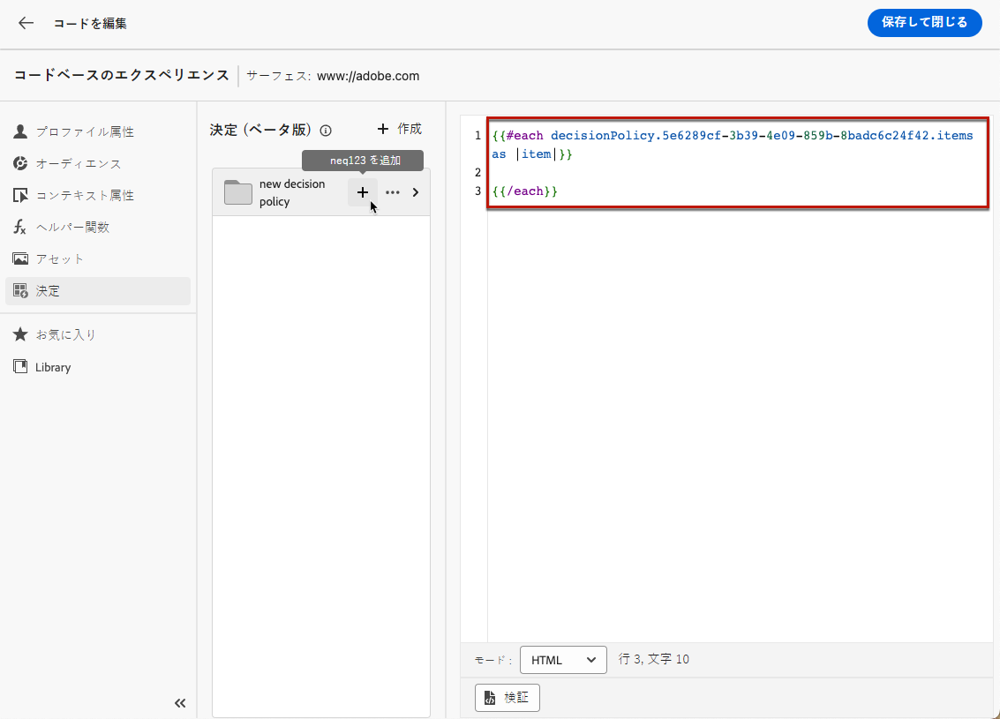
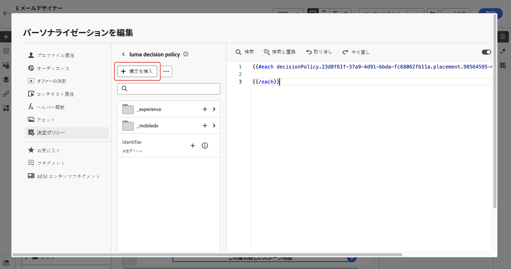
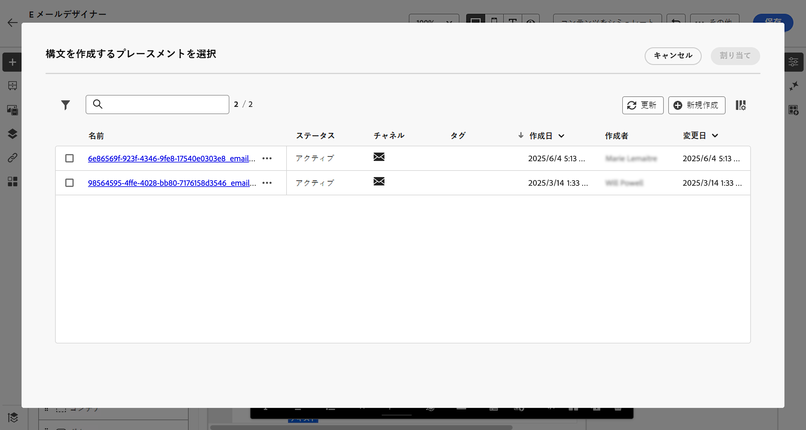
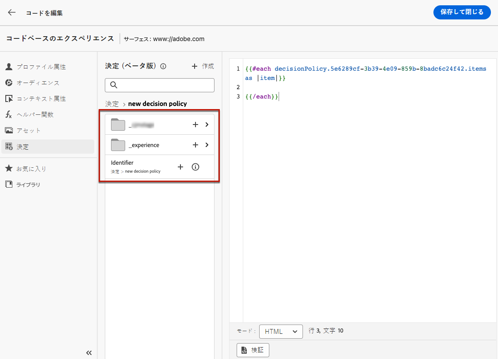
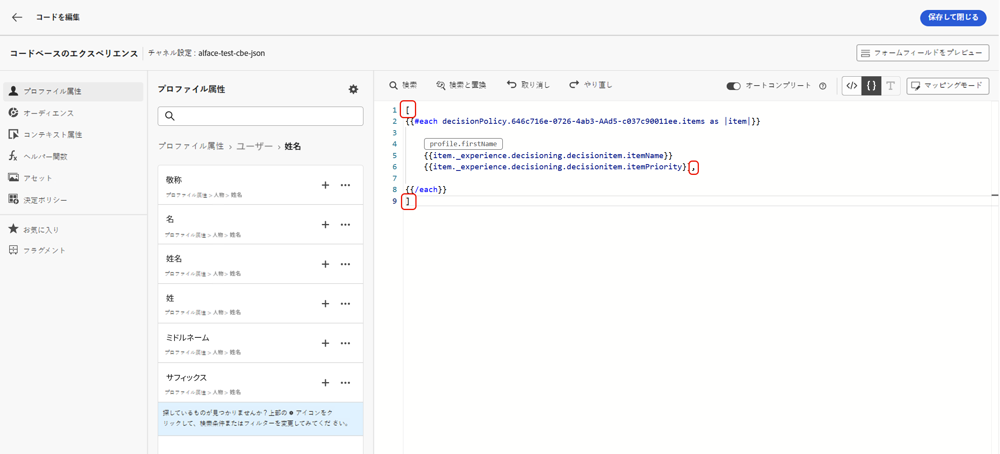
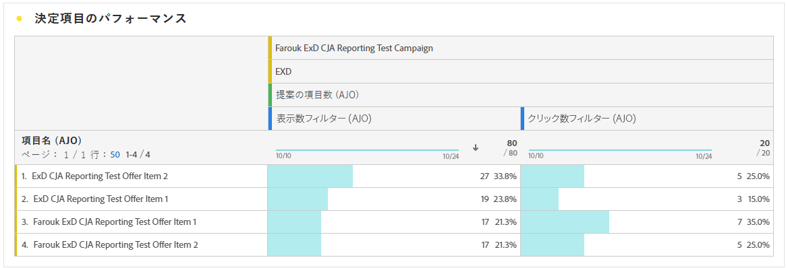

# メッセージでの決定ポリシーの使用 {#create-decision}

決定ポリシーをコンテンツに追加したら、返された決定項目の属性をパーソナライズに使用できます。 これには、まず決定ポリシーコードをコンテンツに挿入します。

>[!CAUTION]
>
>決定ポリシーは、**コードベースのエクスペリエンス**、**SMS**、**プッシュ通知**&#x200B;の各チャネルについてすべてのお客様が利用できます。
>
>**電子メール** チャネルの決定は、制限付き可用性でのみ使用できます。 アクセスをリクエストするには、Adobe担当者にお問い合わせください。 リリースサイクルと可用性フェーズについて詳しくは、[Journey Optimizer リリースサイクル](../rn/releases.md)を参照してください。

## 決定ポリシーコードの挿入 {#insert}

>[!BEGINTABS]

>[!TAB  コードベースのエクスペリエンス ]

1. コードベースのエクスペリエンスを編集し、**[!UICONTROL 決定ポリシー]**&#x200B;に移動します。

2. 決定ポリシーコードを追加するには、「**[!UICONTROL ポリシーを挿入]**」を選択します。

   

>[!NOTE]
>
>コードベースのエクスペリエンスの場合、決定ポリシーにフラグメントを含む決定項目が含まれている場合は、決定ポリシーコードでこれらのフラグメントを活用できます。 [ フラグメントの活用方法について](fragments-decision-policies.md)

>[!TAB メール]

1. **Personalization Editor**&#x200B;を開き、**[!UICONTROL Decision policies]**&#x200B;に移動します。

2. 決定ポリシーのコードを追加するには、**[!UICONTROL 構文を挿入]**&#x200B;を選択します。

   

   >[!NOTE]
   >
   >挿入オプションが表示されない場合は、親コンポーネントに対して既に決定ポリシーが設定されている可能性があります。

3. プレースメントがまだコンポーネントに割り当てられていない場合は、リストから1つを選択し、**[!UICONTROL 割り当て]**&#x200B;をクリックします。

   

   >[!NOTE]
   >
   >同じ電子メールで複数の決定ポリシー（例えば、ヘッダーに1つ、フッターに1つ）を使用する場合、同じオファーがプレースメント間で重複が排除されます。各領域で異なるオファーが受信されます。 複数の領域で同じオファーを表示するには、決定ポリシーを追加するときに&#x200B;**[!UICONTROL 決定出力を再利用]**&#x200B;します。 [決定ポリシーの作成方法を確認](create-decision-policy.md)。

>[!TAB SMS]

1. **Personalization Editor**&#x200B;を開き、**[!UICONTROL Decision policies]**&#x200B;に移動します。

2. 決定ポリシーのコードを追加するには、**[!UICONTROL 構文を挿入]**&#x200B;を選択します。

   

>[!TAB プッシュ]

1. **Personalization Editor**&#x200B;を開き、**[!UICONTROL Decision policies]**&#x200B;に移動します。

2. 決定ポリシーのコードを追加するには、**[!UICONTROL 構文を挿入]**&#x200B;を選択します。

   

>[!IMPORTANT]
>
>プッシュ通知を使用したエクスペリエンス決定には、モバイル SDKの特定のバージョンが必要です。 この機能を実装する前に、[ リリースノート ](https://developer.adobe.com/client-sdks/home/release-notes/){target="_blank"}を確認して、必要なバージョンを特定し、それに応じてアップグレードされていることを確認してください。 また、[このセクション ](https://developer.adobe.com/client-sdks/home/current-sdk-versions/){target="_blank"}では、お使いのプラットフォームで利用可能なすべてのSDK バージョンを表示できます。

>[!ENDTABS]

決定ポリシーコードが追加されます。 返された決定項目の属性を使用して、コンテンツをパーソナライズできるようになりました。

>[!NOTE]
>
>コードベースのエクスペリエンスとメールチャネルの場合、この順序を、返す決定項目ごとに1回繰り返します。 例えば、[決定を作成](create-decision-policy.md)するときに2つの項目を返す場合は、シーケンスを2回繰り返します。 SMS チャネルとプッシュチャネルの場合、1つの決定項目のみを返すことができます。

## 決定項目属性によるパーソナライズ {#attributes}

コンテンツに決定ポリシーのコードを追加すると、返された決定項目のすべての属性がパーソナライゼーションに使用できるようになります。 [ パーソナライゼーションの使用方法を説明](../personalization/personalize.md)。

属性は、「オファー」の[ カタログスキーマ ](catalogs.md)に保存されます。 パーソナライゼーションエディターの次のフォルダーに表示されます。
* **カスタム属性**: `_\<imsOrg\>` フォルダー
* **標準属性**: `_experience` フォルダー

決定項目の属性とコンテキスト属性は、[!DNL Journey Optimizer] フラグメントではデフォルトでサポートされていません。 ただし、以下に説明するように、代わりにグローバル変数を使用できます。

属性を追加するには、属性の横にある&#x200B;**`+`** アイコンをクリックします。 必要なだけ属性を追加できます。 プロファイルデータなど、その他のパーソナライゼーション属性を含めることもできます。

* **電子メール**&#x200B;および&#x200B;**コードベースの** チャネルの場合、角括弧`#each`を使用して`[ ]` ループ内の属性をラップし、終了`/each` タグの前にコンマを追加します。

  +++例を参照

  

  +++

* **SMS**&#x200B;および&#x200B;**プッシュ** チャネルの場合は、決定ポリシーの構文コードの後に属性を挿入してください。 この構文は、常に1行目に保持する必要があります。

  +++例を参照

  

  +++

  >[!NOTE]
  >SMSまたはプッシュコンテンツ（タイトルや本文など）に画像アセット属性を挿入すると、属性値はURLとして表示されます。 これらのフィールドでは、画像自体はレンダリングされません。

* 決定項目の追跡を有効にするには、`trackingToken`属性を追加します：`trackingToken: {{item._experience.decisioning.decisionitem.trackingToken}}`

## コンテンツのプレビューとテスト

コンテンツを制作したら、ジャーニーやキャンペーンをアクティブ化する前に、コンテンツをプレビューし、テストします。 決定項目は、シミュレーションインターフェイスで選択したプロファイルに基づいてレンダリングされます。 [ コンテンツのプレビューとテストの方法について説明します](../content-management/preview-test.md)。

## 次の手順 {#final-steps}

コンテンツの準備ができたら、キャンペーンやジャーニーをレビューして公開します。

* [ジャーニーの公開](../building-journeys/publish-journey.md)
* [キャンペーンのレビューとアクティベーション](../campaigns/review-activate-campaign.md)

コードベースのエクスペリエンスの場合、開発者が API または SDK 呼び出しを実行して、チャネル設定で定義されたサーフェスのコンテンツを取得すると、変更が web ページまたはアプリに適用されます。

>[!NOTE]
>
>現在、[ コードベースのエクスペリエンス ](../code-based/create-code-based.md)のキャンペーンまたはジャーニーに対して、決定ベースのコンテンツをシミュレートすることはできません。 回避策は[こちら](../code-based/code-based-decisioning-implementations.md)で利用できます。

## レポートダッシュボードの使用

決定のパフォーマンスを確認するには、キャンペーンやジャーニーレポートに表示されている、すぐに使用できる決定指標を使用するか、Customer Journey Analyticsダッシュボードをカスタム構築してパフォーマンスを測定し、意思決定ポリシーやオファーがどのように配信され、エンゲージメントされているのかを把握します。 [意思決定レポートの詳細](cja-reporting.md)。

