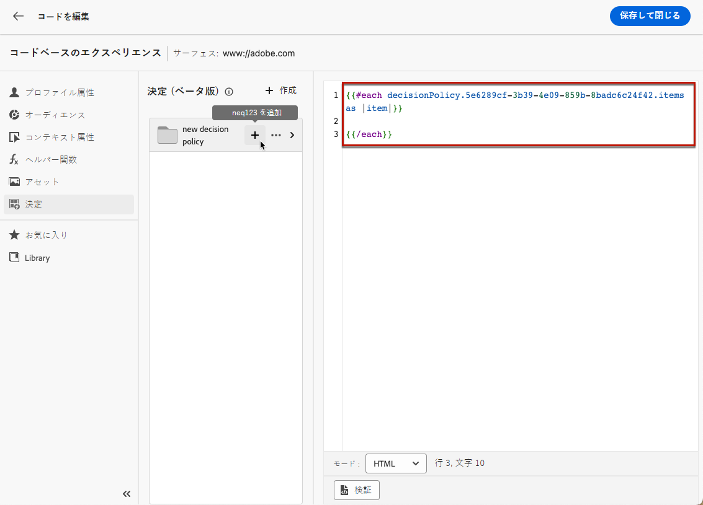
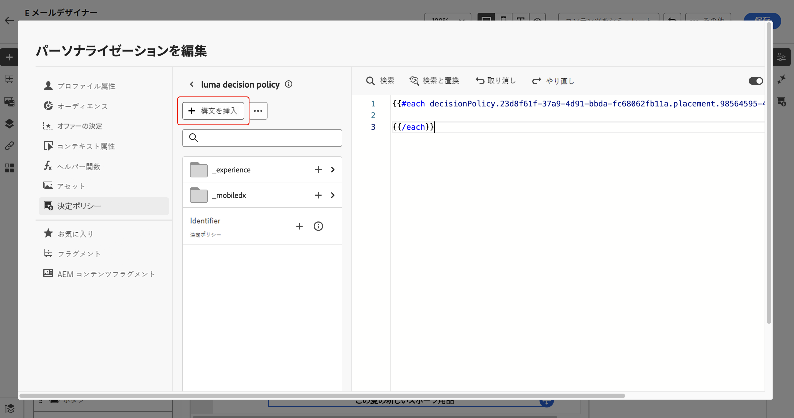
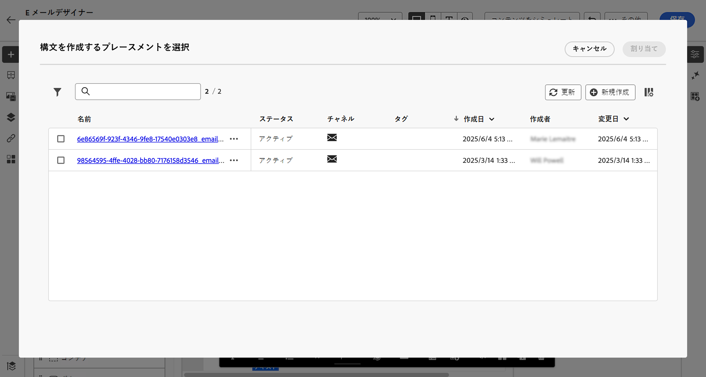
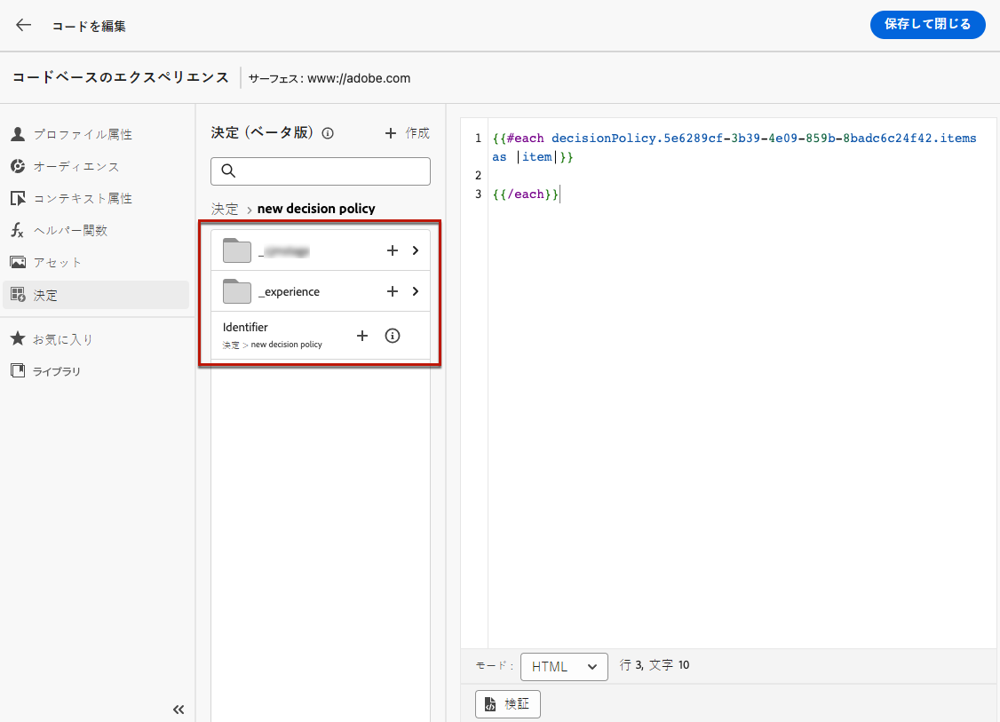
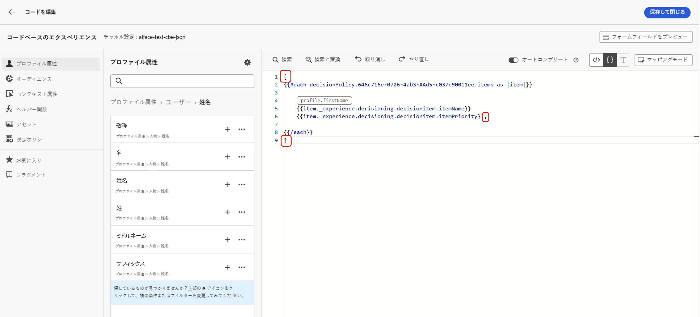
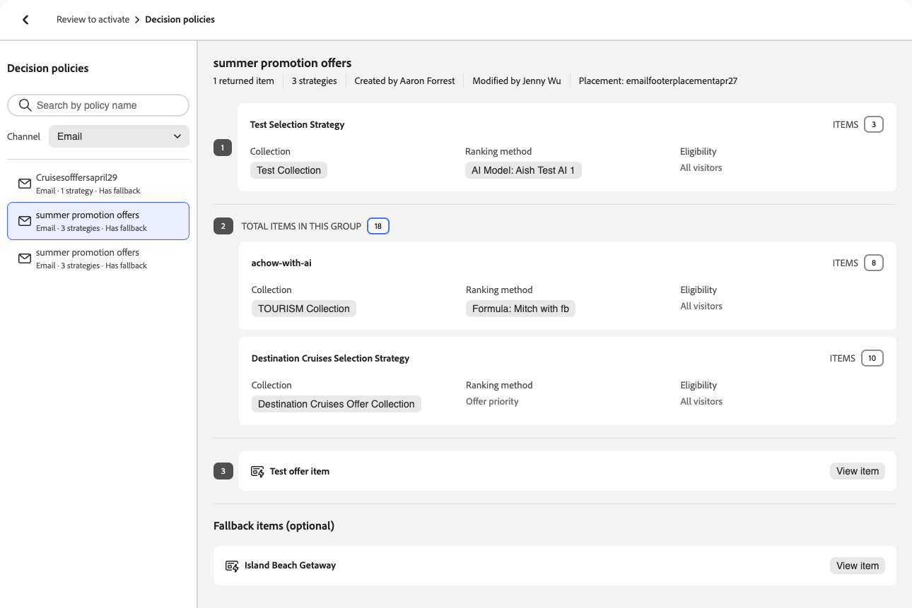
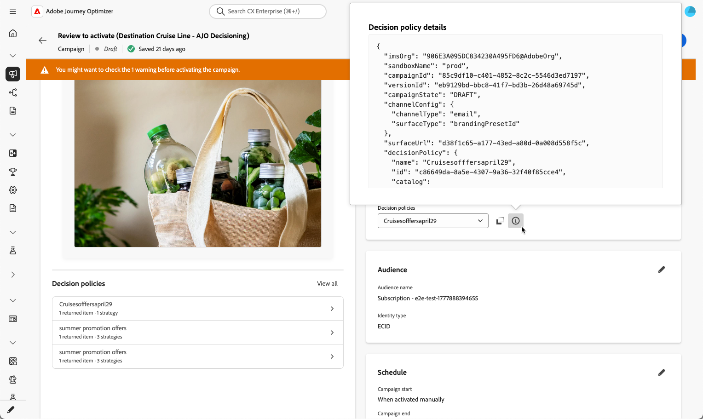
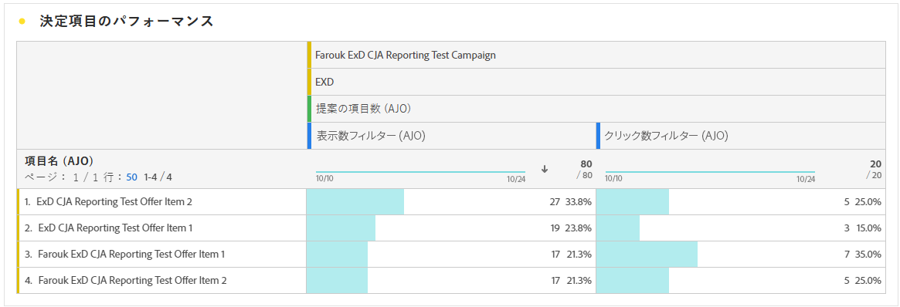

# メッセージでの決定ポリシーの使用 {#create-decision}

決定ポリシーをコンテンツに追加したら、返された決定項目の属性をパーソナライズに使用できます。 これには、まず決定ポリシーコードをコンテンツに挿入します。

>[!CAUTION]
>
>決定ポリシーは、**コードベースのエクスペリエンス**、**SMS**、**プッシュ通知**、および&#x200B;**電子メール** チャネルのすべての顧客が利用できます。

## 決定ポリシーコードの挿入 {#insert}

>[!BEGINTABS]

>[!TAB  コードベースのエクスペリエンス ]

1. コードベースのエクスペリエンスを編集し、**[!UICONTROL 決定ポリシー]**&#x200B;に移動します。

2. 決定ポリシーコードを追加するには、「**[!UICONTROL ポリシーを挿入]**」を選択します。

   

>[!NOTE]
>
>コードベースのエクスペリエンスの場合、決定ポリシーにフラグメントを含む決定項目が含まれている場合は、決定ポリシーコードでこれらのフラグメントを活用できます。 [ フラグメントの活用方法について](fragments-decision-policies.md)

>[!TAB メール]

1. **Personalization Editor**&#x200B;を開き、**[!UICONTROL Decision policies]**&#x200B;に移動します。

2. 決定ポリシーのコードを追加するには、**[!UICONTROL 構文を挿入]**&#x200B;を選択します。

   

   >[!NOTE]
   >
   >挿入オプションが表示されない場合は、親コンポーネントに対して既に決定ポリシーが設定されている可能性があります。

3. プレースメントがまだコンポーネントに割り当てられていない場合は、リストから1つを選択し、**[!UICONTROL 割り当て]**&#x200B;をクリックします。

   

   >[!NOTE]
   >
   >同じ電子メールで複数の決定ポリシー（例えば、ヘッダーに1つ、フッターに1つ）を使用する場合、同じオファーがプレースメント間で重複が排除されます。2回レンダリングされません。 2番目の決定ポリシーでは、フォールバックオファーを設定していない限り、コンテンツは返されず、空白のスペースが表示されます。この場合、フォールバックが代わりに表示されます。

電子メールDesignerで&#x200B;**[!UICONTROL 独自の]** モードを使用する場合は、決定ポリシーコードを挿入することもできます。 **[!UICONTROL 決定ポリシー]**&#x200B;に移動し、**[!UICONTROL 構文を挿入]**&#x200B;を選択します。プレースメント選択UIが表示され、プレースメントを直接割り当てることができます。 [独自のメールコンテンツをコーディングする方法について説明します](../email/code-content.md)。

>[!AVAILABILITY]
>
>**[!UICONTROL 独自の]** モードをコード化して決定ポリシーを挿入すると、使用制限があります。

>[!NOTE]
>
>**[!UICONTROL 独自の]** モードをコード化すると、**[!UICONTROL 繰り返しグリッド]** コンポーネントが使用できないため、ポリシーごとに1つの決定項目のみを返すことができます。

>[!TAB SMS]

1. **Personalization Editor**&#x200B;を開き、**[!UICONTROL Decision policies]**&#x200B;に移動します。

2. 決定ポリシーのコードを追加するには、**[!UICONTROL 構文を挿入]**&#x200B;を選択します。

   

>[!TAB プッシュ]

1. **Personalization Editor**&#x200B;を開き、**[!UICONTROL Decision policies]**&#x200B;に移動します。

2. 決定ポリシーのコードを追加するには、**[!UICONTROL 構文を挿入]**&#x200B;を選択します。

   

>[!IMPORTANT]
>
>プッシュ通知を使用したエクスペリエンス決定には、モバイル SDKの特定のバージョンが必要です。 この機能を実装する前に、[ リリースノート ](https://developer.adobe.com/client-sdks/home/release-notes){target="_blank"}を確認して、必要なバージョンを特定し、それに応じてアップグレードされていることを確認してください。 また、[このセクション ](https://developer.adobe.com/client-sdks/home/current-sdk-versions){target="_blank"}では、お使いのプラットフォームで利用可能なすべてのSDK バージョンを表示できます。

>[!ENDTABS]

決定ポリシーコードが追加されます。 返された決定項目の属性を使用して、コンテンツをパーソナライズできるようになりました。

>[!NOTE]
>
>コードベースのエクスペリエンスとメールチャネルの場合、この順序を、返す決定項目ごとに1回繰り返します。 例えば、[決定を作成](create-decision-policy.md)するときに2つの項目を返す場合は、シーケンスを2回繰り返します。 SMS チャネルとプッシュチャネルの場合、1つの決定項目のみを返すことができます。

## 決定項目属性によるパーソナライズ {#attributes}

コンテンツに決定ポリシーのコードを追加すると、返された決定項目のすべての属性がパーソナライゼーションに使用できるようになります。 [ パーソナライゼーションの使用方法を説明](../personalization/personalize.md)。

属性は、「オファー」の[ カタログスキーマ ](catalogs.md)に保存されます。 パーソナライゼーションエディターの次のフォルダーに表示されます。
* **カスタム属性**: `_\<imsOrg\>` フォルダー
* **標準属性**: `_experience` フォルダー

決定項目の属性とコンテキスト属性は、[!DNL Journey Optimizer] フラグメントではデフォルトでサポートされていません。 ただし、以下に説明するように、代わりにグローバル変数を使用できます。

属性を追加するには、属性の横にある&#x200B;**`+`** アイコンをクリックします。 必要なだけ属性を追加できます。 プロファイルデータなど、その他のパーソナライゼーション属性を含めることもできます。

* **電子メール**&#x200B;および&#x200B;**コードベースの** チャネルの場合、角括弧`[ ]`を使用して`#each` ループ内の属性をラップし、終了`/each` タグの前にコンマを追加します。

  +++例を参照

  

  +++

* **SMS**&#x200B;および&#x200B;**プッシュ** チャネルの場合は、決定ポリシーの構文コードの後に属性を挿入してください。 この構文は、常に1行目に保持する必要があります。

  +++例を参照

  

  +++

  >[!NOTE]
  >SMSまたはプッシュコンテンツ（タイトルや本文など）に画像アセット属性を挿入すると、属性値はURLとして表示されます。 これらのフィールドでは、画像自体はレンダリングされません。

* 決定項目の追跡を有効にするには、`trackingToken`属性を追加します：`trackingToken: {{item._experience.decisioning.decisionitem.trackingToken}}`

## コンテンツのプレビューとテスト

コンテンツを制作したら、ジャーニーやキャンペーンをアクティブ化する前に、コンテンツをプレビューし、テストします。 決定項目は、シミュレーションインターフェイスで選択したプロファイルに基づいてレンダリングされます。 [詳しくは、コンテンツのプレビューとテストの方法を参照してください](../content-management/preview-test.md)。

## 次の手順 {#final-steps}

コンテンツの準備ができたら、キャンペーンやジャーニーをレビューして公開します。

* [ジャーニーの公開](../building-journeys/publish-journey.md)
* [キャンペーンのレビューとアクティベーション](../campaigns/review-activate-campaign.md)

コードベースのエクスペリエンスの場合、開発者が API または SDK 呼び出しを実行して、チャネル設定で定義されたサーフェスのコンテンツを取得すると、変更が web ページまたはアプリに適用されます。

## キャンペーン概要からの決定ポリシーの詳細の表示 {#decision-policy-summary}

アクションまたはAPI トリガーの[campaign](../campaigns/get-started-with-campaigns.md)がコンテンツ内で決定ポリシーを使用すると、キャンペーンの概要ページに、キャンペーンで使用されているすべてのポリシーを一覧表示する&#x200B;**[!UICONTROL 決定ポリシー]** セクションが表示されます。

また、各決定ポリシーの技術的な詳細にアクセスしてクリップボードにコピーすることもできます。これは、Adobe サポートまたはエンジニアリングチームの問題のトラブルシューティングに役立ちます。

決定ポリシーの詳細と技術情報にアクセスするには、次の手順に従います。

1. [設定](../campaigns/review-activate-campaign.md#action-campaign-review)中に&#x200B;**[!UICONTROL レビューをクリックしてアクティブ化]**&#x200B;するか、**[!UICONTROL キャンペーン]** リストからキャンペーンを開いて、キャンペーンの概要を開きます。

1. 「**[!UICONTROL 決定ポリシー]**」セクションには、キャンペーンで使用されているすべてのポリシーが一覧表示されます。

   

1. 決定ポリシーを選択するか、**[!UICONTROL すべて表示]**&#x200B;をクリックします。 以下のような各ポリシーの詳細を確認できます。

   * 決定ポリシーで使用される戦略
   * 返される項目の数
   * 各選択戦略に使用されるコレクション、ランキング方法、実施要件ルール
   * 決定項目が対象外の場合に使用されるフォールバックオファー

   

1. コレクションをクリックすると、そのコレクションに含まれるすべての決定項目が表示されます。

1. 決定項目をクリックして詳細にアクセスし、必要に応じて編集します。新しいブラウザータブが開きます。 または、**[!UICONTROL 項目を表示]**&#x200B;をクリックして、コレクションに含まれていない決定項目を表示します。

   

1. また、各選択戦略に使用されるランキング方法と実施要件ルールに関する情報を表示することもできます。

   {width="80%"}

1. キャンペーンの概要に戻って、**[!UICONTROL アクション]** セクションから決定ポリシーを選択し、**情報** アイコンをクリックして、決定ポリシーの技術的な詳細にアクセスすることもできます。

   

1. 「**クリップボードにコピー**」アイコンをクリックして、決定ポリシーのJSON表現をクリップボードにコピーします。

   コピーされたJSONには、組織名とID、サンドボックス名、決定ポリシーID、完全な決定ポリシー構造が含まれます。 この情報をAdobe サポートまたはエンジニアリングチームと共有することで、意思決定ポリシーの問題をより迅速にトラブルシューティングできます。

## レポートダッシュボードの使用

決定のパフォーマンスを確認するには、キャンペーンやジャーニーレポートに表示されている、すぐに使用できる決定指標を使用するか、Customer Journey Analyticsダッシュボードをカスタム構築してパフォーマンスを測定し、意思決定ポリシーやオファーがどのように配信され、エンゲージメントされているのかを把握します。 [意思決定レポートの詳細](cja-reporting.md)。

