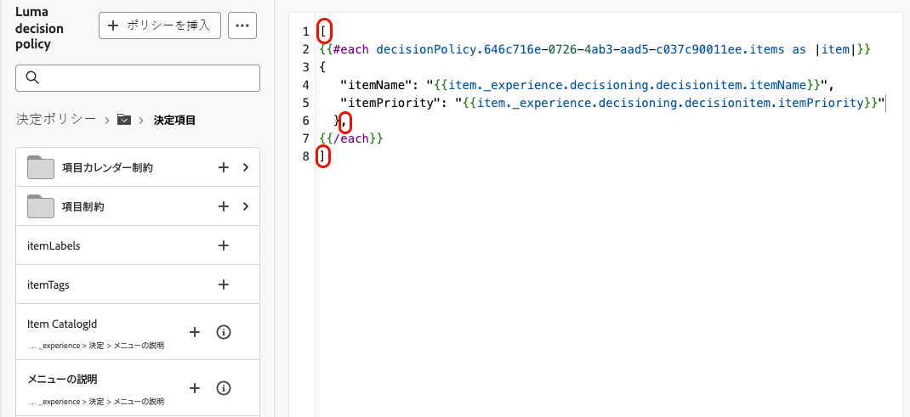

# メッセージでの決定ポリシーの使用 {#create-decision}

コンテンツに決定ポリシーを追加したら、返された決定項目の属性をパーソナライゼーションに使用できます。 これを行うには、まず決定ポリシーコードをコンテンツに挿入します。

>[!CAUTION]
>
>決定ポリシーは、すべてのお客様が **コードベースのエクスペリエンス**、**SMS**、および **プッシュ通知** チャネルで利用できます。
>
>**メール** チャネルの決定は、限定提供（LA）でのみ利用できます。 アクセス権をリクエストするには、Adobe担当者にお問い合わせください。 詳細情報 [&#x200B; 可用性ラベル &#x200B;](../rn/releases.md#availability-labels)。

## 決定ポリシーコードの挿入 {#insert}

>[!BEGINTABS]

>[!TAB  コードベースのエクスペリエンス ]

1. コードベースのエクスペリエンスを編集し、**[!UICONTROL 決定ポリシー]** に移動します。

2. **[!UICONTROL ポリシーを挿入]** を選択して、決定ポリシーコードを追加します。

   

>[!NOTE]
>
>コードベースのエクスペリエンスの場合、決定ポリシーにフラグメントを含む決定項目が含まれている場合、これらのフラグメントを決定ポリシーコードで活用できます。 [&#x200B; フラグメントの活用方法を学ぶ &#x200B;](../experience-decisioning/fragments-decision-policies.md)

>[!TAB メール]

1. **Personalization エディターを開き**&#x200B;**[!UICONTROL Decision Policies]** に移動します。

2. **[!UICONTROL 構文を挿入]** を選択して、決定ポリシーのコードを追加します。

   

   >[!NOTE]
   >
   >挿入オプションが表示されない場合は、親コンポーネントに対して決定ポリシーが既に設定されている可能性があります。

3. 構成部品にプレースメントがまだ割り当てられていない場合は、リストからプレースメントを 1 つ選択し、「**[!UICONTROL 割り当て]**」をクリックします。

   

>[!TAB SMS]

1. **Personalization エディターを開き**&#x200B;**[!UICONTROL Decision Policies]** に移動します。

2. **[!UICONTROL 構文を挿入]** を選択して、決定ポリシーのコードを追加します。

   

>[!TAB プッシュ]

1. **Personalization エディターを開き**&#x200B;**[!UICONTROL Decision Policies]** に移動します。

2. **[!UICONTROL 構文を挿入]** を選択して、決定ポリシーのコードを追加します。

   

>[!IMPORTANT]
>
>プッシュ通知を使用した Experience Decisioning では、特定のバージョンの Mobile SDKが必要です。 この機能を実装する前に、[&#x200B; リリースノート &#x200B;](https://developer.adobe.com/client-sdks/home/release-notes/){target="_blank"} を確認して、必要なバージョンを特定し、それに応じてアップグレードしていることを確認します。 また、お使いのプラットフォームで利用可能なすべてのSDK バージョンを確認することもできます [&#x200B; この節 &#x200B;](https://developer.adobe.com/client-sdks/home/current-sdk-versions/){target="_blank"}。

>[!ENDTABS]

決定ポリシーコードが追加されます。 返された決定項目の属性を使用して、コンテンツをパーソナライズできるようになりました。

>[!NOTE]
>
>コードベースのエクスペリエンスおよびメールチャネルの場合は、返す決定項目ごとに 1 回、このシーケンスを繰り返します。 例えば、（決定の作成 [&#x200B; 時に 2 つの項目を返すよう選択した場合は、シーケンスを 2 回繰り返します。](create-decision-policy.md) SMS およびプッシュチャネルの場合、返される決定項目は 1 つだけです。

## 決定項目属性を使用したパーソナライズ {#attributes}

コンテンツに決定ポリシーのコードを追加すると、返された決定項目のすべての属性をパーソナライゼーションで使用できるようになります。 [&#x200B; パーソナライゼーションの操作方法を説明します &#x200B;](../personalization/personalize.md)。

属性は「オファー」 [&#x200B; カタログスキーマ &#x200B;](catalogs.md) に保存されます。 パーソナライゼーションエディターから次のフォルダーに表示されます。
* **カスタム属性**:`_\<imsOrg\>` フォルダー
* **標準属性**:`_experience` フォルダー

決定項目属性とコンテキスト属性は、[!DNL Journey Optimizer] フラグメントではデフォルトではサポートされていません。 ただし、以下に説明するように、代わりにグローバル変数を使用できます。

属性を追加するには、属性の横にある「**`+`**」アイコンをクリックします。 必要な数の属性を追加できます。 また、プロファイルデータなど、他のパーソナライゼーション属性を含めることもできます。

* **メール** および **コードベース** チャネルの場合は、角かっこ `#each` を使用して属性を `[ ]` ループ内にラップし、終了 `/each` タグの前にコンマを追加します。

  +++例を参照

  

  +++

* **SMS** チャネルおよび **プッシュ** チャネルの場合、決定ポリシーの構文コードの後に属性が挿入されていることを確認してください。 この構文は、常に 1 行目に配置する必要があります。

  +++例を参照

  

  +++

  >[!NOTE]
  >SMS またはプッシュコンテンツに画像アセット属性（タイトルや本文など）を挿入する場合、属性値は URL として表示されます。 これらのフィールドでは、画像自体はレンダリングされません。

* 決定項目のトラッキングを有効にするには、`trackingToken` 属性を追加します。`trackingToken: {{item._experience.decisioning.decisionitem.trackingToken}}`

## コンテンツのプレビューとテスト

コンテンツを作成した後、ジャーニーまたはキャンペーンをアクティブ化する前に、プレビューおよびテストします。 決定項目は、シミュレーションインターフェイスで選択したプロファイルに基づいてレンダリングされます。 [&#x200B; コンテンツのプレビューとテストの方法を説明します &#x200B;](../content-management/preview-test.md)。

## 次の手順 {#final-steps}

コンテンツの準備が整ったら、キャンペーンまたはジャーニーをレビューして公開します。

* [ジャーニーの公開](../building-journeys/publish-journey.md)
* [キャンペーンのレビューとアクティベーション](../campaigns/review-activate-campaign.md)

コードベースのエクスペリエンスの場合、開発者が API または SDK 呼び出しを実行して、チャネル設定で定義されたサーフェスのコンテンツを取得すると、変更が web ページまたはアプリに適用されます。

>[!NOTE]
>
>現在、[&#x200B; コードベースのエクスペリエンス &#x200B;](../code-based/create-code-based.md) キャンペーンやジャーニーの決定ベースのコンテンツをシミュレートすることはできません。 回避策が [&#x200B; こちら &#x200B;](../code-based/code-based-decisioning-implementations.md) で利用できます。

## レポートダッシュボードの使用

決定のパフォーマンスを確認するには、キャンペーンレポートやジャーニーレポートで標準の意思決定指標を表示するか、カスタム Customer Journey Analytics ダッシュボードを作成してパフォーマンスを測定し、意思決定ポリシーやオファーがどのように配信され、関与しているかに関するインサイトを得ることができます。 [&#x200B; 決定レポートの詳細情報 &#x200B;](cja-reporting.md)。

