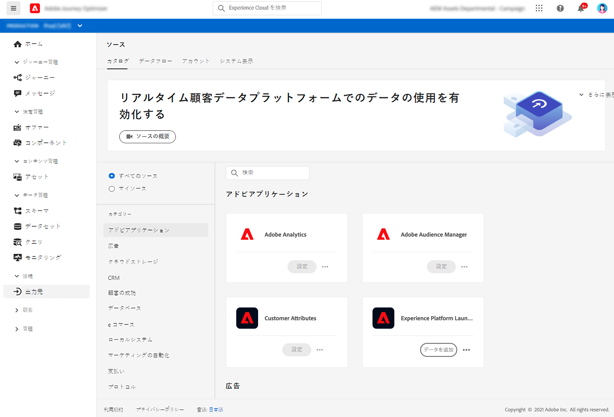

# ソースコネクタの概要 {#sources-gs}

Adobe Experience Platform を使用すると、データを外部ソースから取得しながら、Platform サービスを使用して受信データの構造化、ラベル付け、拡張をおこなうことができます。Adobe・アプリケーション、クラウド・ベースのストレージ、データベースなど、様々なソースからデータを取り込むことができます。

[このドキュメント](https://experienceleague.adobe.com/docs/experience-platform/sources/home.html?lang=ja){target=&quot;_blank&quot;}で、ソースコネクタを使用して外部ソースからデータを取り込む方法について説明します。
