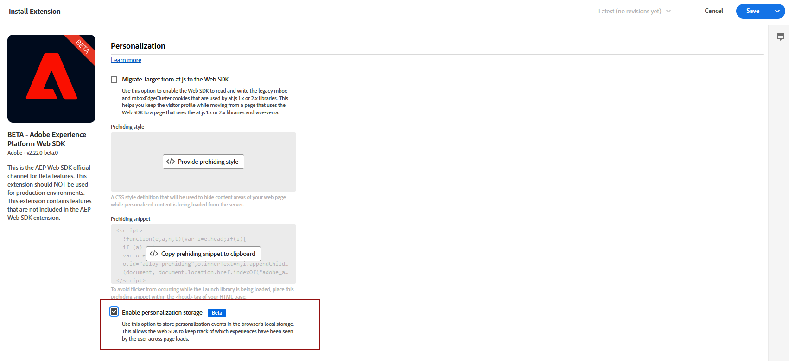
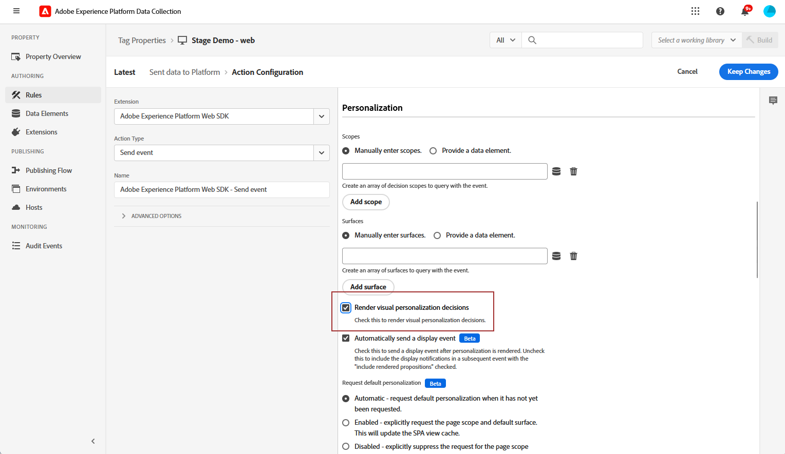
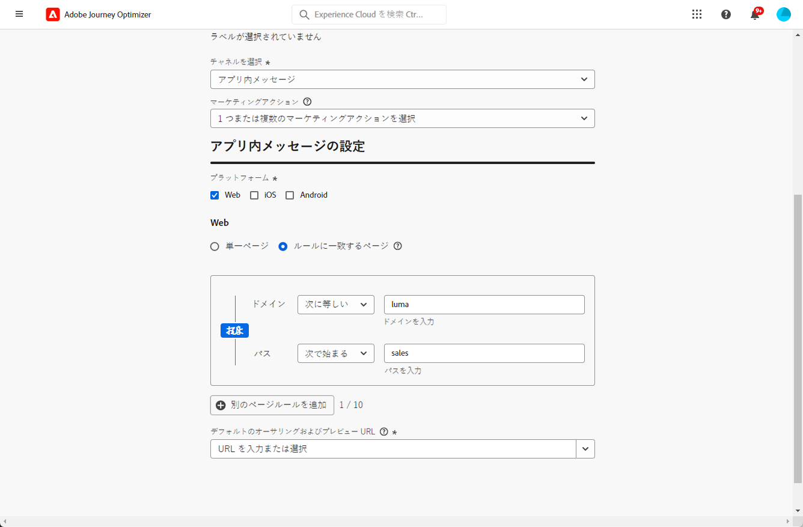

# Web アプリ内チャネルの設定 {#configure-in-app-web}

## 前提条件 {#prerequisites}

* **Adobe Experience Platform Web SDK** 拡張機能の最新バージョンを使用していることを確認します。

* **Adobe Experience Platform Web SDK** 拡張機能を&#x200B;**タグのプロパティ**&#x200B;にインストールし、「**パーソナライゼーションストレージ**」オプションを有効にします。

  この設定は、クライアントにイベント履歴を保存するために不可欠で、ルールビルダーで頻度ルールを実装するための前提条件です。[詳細情報](https://experienceleague.adobe.com/docs/experience-platform/tags/extensions/client/web-sdk/web-sdk-extension-configuration.html?lang=ja)

  

## プラットフォームにデータを送信済みルールの設定 {#configure-sent-data-trigger}

1. **Adobe Experience Platform データ収集**&#x200B;インスタンスにアクセスし、**Adobe Experience Platform Web SDK** 拡張機能で設定した&#x200B;**タグのプロパティ**&#x200B;に移動します。

1. **オーサリング**&#x200B;メニューから「**ルール**」を選択してから、「**新しいルールを作成**」または「**ルールを追加**」を選択します。

   

1. 「**イベント**」セクションで「**追加**」をクリックし、次のように設定します。

   * **拡張機能**：コア

   * **イベントタイプ**：読み込まれたライブラリ（ページ上部）

   

1. 「**変更を保持**」をクリックして、イベント設定を保存します。

1. 「**アクション**」セクションで「**追加**」をクリックし、次のように設定します。

   * **拡張機能**：Adobe Experience Platform Web SDK

   * **アクションタイプ**：イベントを送信

   

1. **アクション**&#x200B;タイプの「**パーソナライゼーション**」セクションで、「**視覚的なパーソナライゼーションの決定をレンダリング**」オプションを有効にします。

   

1. 「**決定コンテキスト**」セクションで、提供するエクスペリエンスを決定する&#x200B;**キー**&#x200B;と&#x200B;**値**&#x200B;のペアを定義します。

   

1. 「**変更を保持**」をクリックして&#x200B;**アクション**&#x200B;の設定を保存します。

1. **公開フロー**&#x200B;メニューに移動します。新しい&#x200B;**ライブラリ**&#x200B;を作成するか、既存の&#x200B;**ライブラリ**&#x200B;を選択して、そこに新しく作成した&#x200B;**ルール**&#x200B;を追加します。[詳細情報](https://experienceleague.adobe.com/docs/experience-platform/tags/publish/libraries.html?lang=ja#create-a-library)

1. **ライブラリ**&#x200B;から、「**開発用に保存およびビルド**」を選択します。

   

## 手動ルールの設定 {#configure-manual-trigger}

1. **Adobe Experience Platform データ収集**&#x200B;インスタンスにアクセスし、**Adobe Experience Platform Web SDK** 拡張機能で設定した&#x200B;**タグプロパティ**&#x200B;に移動します。

1. **オーサリング**&#x200B;メニューから「**ルール**」を選択してから、「**新しいルールを作成**」または「**ルールを追加**」を選択します。

   

1. 「**イベント**」セクションで「**追加**」をクリックし、次のように設定します。

   * **拡張機能**：コア

   * **イベントタイプ**：クリック

   

1. **クリック設定**&#x200B;で、評価する&#x200B;**セレクター**&#x200B;を定義します。

   

1. 「**変更を保持**」をクリックして、**イベント**&#x200B;設定を保存します。

1. 「**アクション**」セクションで「**追加**」をクリックし、次のように設定します。

   * **拡張機能**：Adobe Experience Platform Web SDK

   * **アクションタイプ**：ルールセットを評価

   

1. **アクション**&#x200B;タイプの「**ルールセットアクションを評価**」セクションで、「**視覚的なパーソナライゼーションの決定をレンダリング**」オプションを有効にします。

   

1. 「**決定コンテキスト**」セクションで、実現するエクスペリエンスを決定する&#x200B;**キー**&#x200B;と&#x200B;**値**&#x200B;のペアを定義します。

1. **公開フロー**&#x200B;メニューにアクセスし、新しい&#x200B;**ライブラリ**&#x200B;を作成するか、既存の&#x200B;**ライブラリ**&#x200B;を選択して、新しく作成した&#x200B;**ルール**&#x200B;を追加します。[詳細情報](https://experienceleague.adobe.com/docs/experience-platform/tags/publish/libraries.html?lang=ja#create-a-library)

1. **ライブラリ**&#x200B;から、「**開発用に保存およびビルド**」を選択します。

   

## アプリ内 Web 設定の作成 {#in-app-config}

1. **[!UICONTROL チャネル]**/**[!UICONTROL 一般設定]**/**[!UICONTROL チャネル設定]** メニューにアクセスし、「**[!UICONTROL チャネル設定を作成]**」をクリックします。

   

1. 設定の名前と説明（オプション）を入力し、設定するチャネルを選択します。

   >[!NOTE]
   >
   > 名前は、文字（A ～ Z）で始める必要があります。使用できるのは英数字のみです。アンダースコア（`_`）、ドット（`.`）、ハイフン（`-`）も使用できます。

1. 設定にカスタムデータ使用ラベルまたはコアデータ使用ラベルを割り当てるには、「**[!UICONTROL アクセスを管理]**」を選択します。 [オブジェクトレベルのアクセス制御（OLAC）について詳しくは、こちらを参照してください](../administration/object-based-access.md)。

1. **[!UICONTROL マーケティングアクション]** を選択し、この設定を使用してメッセージに同意ポリシーを関連付けます。 マーケティングアクションに関連するすべての同意ポリシーは、顧客の環境設定に従って活用されます。 [詳細情報](../action/consent.md#surface-marketing-actions)

1. **アプリ内メッセージ** チャネルを選択します。

1. アプリ設定を定義します。 変更を行うには、次の 2 つのオプションがあります。

   * **[!UICONTROL ページ URL]** を入力して、特定のページに変更を適用できます。

   * 同じパターンに従う複数の URL をターゲットにするルールを作成できます。

+++ ページ一致ルールを作成する方法。

      1. **[!UICONTROL ルールに一致するページ]** をアプリ設定として選択し、**[!UICONTROL ページ URL]** を入力します。

      1. **[!UICONTROL 設定ルールを編集]** ウィンドウで、「**[!UICONTROL ドメイン]**」および「**[!UICONTROL ページ]**」フィールドの条件を定義します。
      1. 条件ドロップダウンから、条件をさらにパーソナライズします。

         例えば、Luma web サイトのすべての販売製品ページに表示される要素を編集する場合は、ドメイン／次で始まる／Luma およびページ／次を含む／販売を選択します。

         

      1. 必要に応じて、「**[!UICONTROL 別のページルールを追加]**」をクリックして別のルールを作成します。

      1. **[!UICONTROL デフォルトのオーサリングおよびプレビュー URL]** を選択します。

      1. 変更を保存します。ルールは、**[!UICONTROL キャンペーンを作成]**&#x200B;画面に表示されます。

+++

1. アプリ内 web 設定を送信します。

キャンペーン内で [web アプリ内を作成 ](../in-app/create-in-app-web.md) できるようになりました。
