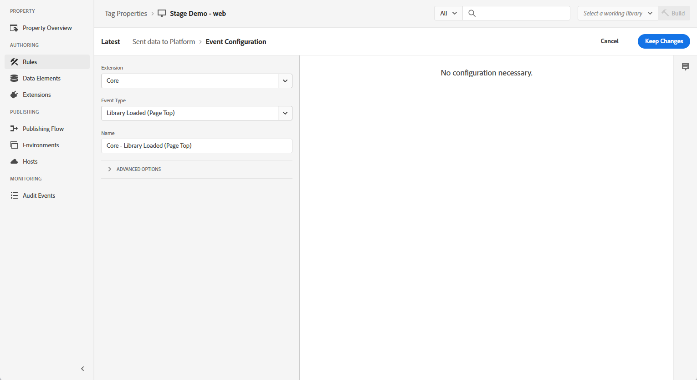
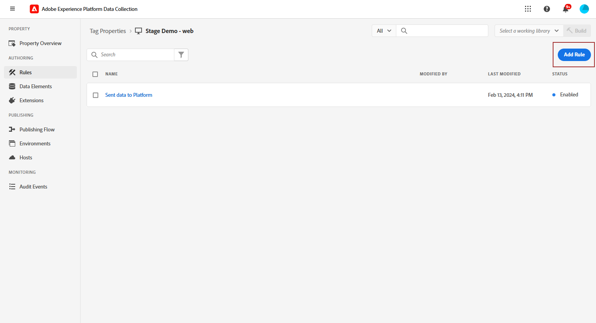

# Web アプリ内チャネルの設定 {#configure-in-app-web}

## 前提条件 {#prerequisites}

* の最新バージョンを使用していることを確認します。 **Adobe Experience Platform Web SDK** 拡張子。

* をインストールします。 **Adobe Experience Platform Web SDK** 拡張機能 **タグのプロパティ** をクリックし、 **パーソナライズストレージ** オプション。

  この設定は、イベント履歴をクライアントに保存するために必要です。これは、ルールビルダーに頻度ルールを実装するための前提条件です。 [詳細情報](https://experienceleague.adobe.com/docs/experience-platform/tags/extensions/client/web-sdk/web-sdk-extension-configuration.html?lang=en)

  

## 「プラットフォームに送信されたデータ」ルールを設定する {#configure-sent-data-trigger}

1. 次にアクセス： **Adobe Experience Platform Data Collection** インスタンスとに移動します。 **タグのプロパティ** 設定済み **Adobe Experience Platform Web SDK** 拡張子。

1. 次から： **オーサリング** メニュー、選択 **ルール** その後 **新規ルールを作成** または **ルールを追加**.

   

1. Adobe Analytics の **イベント** セクションで、 **追加** 次のように設定します。

   * **拡張**：コア

   * **イベントタイプ**：読み込まれたライブラリ（ページ上部）。

   

1. クリック **変更を保持** をクリックして、イベント設定を保存します。

1. Adobe Analytics の **アクション** セクションで、 **追加** 次のように設定します。

   * **拡張**: Adobe Experience Platform Web SDK

   * **アクションタイプ**：イベントの送信

   

1. Adobe Analytics の **パーソナライズ** セクション内の **アクション** タイプ、有効 **視覚的なパーソナライゼーションの決定をレンダリング** オプション。

   

1. Adobe Analytics の **決定コンテキスト** 「 」セクションで、 **キー** および **値** 配信するエクスペリエンスを決定するペア。

   

1. を保存します。 **アクション** クリックによる設定 **変更を保持**.

1. 次に移動： **公開フロー** メニュー。 新規作成 **ライブラリ** または既存の **ライブラリ** 新しく作成した **ルール** それに対して [詳細情報](https://experienceleague.adobe.com/docs/experience-platform/tags/publish/libraries.html?lang=en#create-a-library)

1. お使いの **ライブラリ**&#x200B;を選択します。 **開発用に保存およびビルド**.

   

## 手動ルールの設定 {#configure-manual-trigger}

1. 次にアクセス： **Adobe Experience Platform Data Collection** インスタンスとに移動します。 **タグのプロパティ** 設定済み **Adobe Experience Platform Web SDK** 拡張子。

1. 次から： **オーサリング** メニュー、選択 **ルール** その後 **新規ルールを作成** または **ルールを追加**.

   

1. Adobe Analytics の **イベント** セクションで、 **追加** 次のように設定します。

   * **拡張**：コア

   * **イベントタイプ**：クリック

   

1. Adobe Analytics の **設定をクリック**、 **セレクター** それが評価されます。

   

1. クリック **変更を保持** 保存する **イベント** 設定。

1. Adobe Analytics の **アクション** セクションで、 **追加** 次のように設定します。

   * **拡張**: Adobe Experience Platform Web SDK

   * **アクションタイプ**：ルールセットを評価します

   

1. Adobe Analytics の **ルールセットアクションを評価** セクション内の **アクション** タイプ、有効 **視覚的なパーソナライゼーションの決定をレンダリング** オプション。

   

1. Adobe Analytics の **決定コンテキスト** 「 」セクションで、 **キー** および **値** 配信するエクスペリエンスを決定するペア。

1. 次にアクセス： **公開フロー** メニュー、新規作成 **ライブラリ** または既存の **ライブラリ** 新しく作成した **ルール**. [詳細情報](https://experienceleague.adobe.com/docs/experience-platform/tags/publish/libraries.html?lang=en#create-a-library)

1. お使いの **ライブラリ**&#x200B;を選択します。 **開発用に保存およびビルド**.

   

