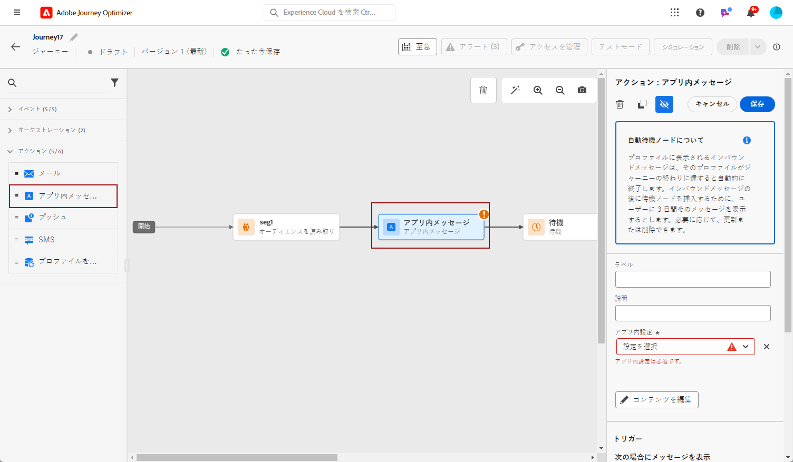

# ジャーニーでのアプリ内メッセージの作成 {#create-in-app-journey}

1. ジャーニーを開き、パレットの「**[!UICONTROL アクション]**」セクションから&#x200B;**[!UICONTROL アプリ内]**&#x200B;アクティビティをドラッグ＆ドロップします。

   プロファイルがジャーニーの終了に達すると、表示されたアプリ内メッセージは自動的に期限切れになります。そのため、適切なタイミングを確保するために、アプリ内アクティビティの後に待機アクティビティが自動的に追加されます。

   

1. メッセージの&#x200B;**[!UICONTROL ラベル]**&#x200B;と&#x200B;**[!UICONTROL 説明]**&#x200B;を入力します。

1. 使用する[アプリ内サーフェス](inapp-configuration.md)を選択します。

   

1. これで、「**[!UICONTROL コンテンツを編集]**」ボタンでコンテンツのデザインを開始できます。[詳細情報](design-in-app.md)

1. 「**[!UICONTROL トリガーを編集]**」をクリックして、トリガーを設定します。

   

1. **[!UICONTROL アプリ内メッセージのトリガー]**&#x200B;ウィンドウから、メッセージをトリガーするイベントと条件を選択します。

   1. トリガーで複数のイベントまたは条件を考慮する場合は、「**[!UICONTROL 条件を追加]**」をクリックします。
   1. **[!UICONTROL イベントを選択]**&#x200B;ドロップダウンから、トリガーのイベントのタイプを選択します。
   1. イベントのリンク方法を選択します。例えば、メッセージを表示するために&#x200B;**両方**&#x200B;のトリガーを true にする場合は「**[!UICONTROL および]**」を選択し、トリガーの&#x200B;**いずれか**&#x200B;が true の場合にメッセージを表示する場合は「**[!UICONTROL または]**」を選択します。
   1. 「**[!UICONTROL グループを作成]**」をクリックして、トリガーをグループ化します。

   

1. アプリ内メッセージがアクティブとなっている場合の、トリガーの頻度を選択します。

   * **[!UICONTROL 毎回]**：**[!UICONTROL モバイルアプリトリガー]**&#x200B;ドロップダウンで選択したイベントが発生した場合に、常にメッセージを表示します。
   * **[!UICONTROL 1 度だけ]**：**[!UICONTROL モバイルアプリトリガー]**&#x200B;ドロップダウンで選択したイベントが初めて発生した場合にのみ、このメッセージを表示します。
   * **[!UICONTROL クリックスルーまで]**：**[!UICONTROL モバイルアプリトリガー]**&#x200B;ドロップダウンで選択したイベントが、「クリック」アクションで SDK によって操作イベントが送信されるまでに発生した場合に、このメッセージが表示されます。
   * **[!UICONTROL X 回]**：「**[!UICONTROL 表示回数]**」フィールドで設定した値によって決定される、特定の回数だけメッセージを表示します。

1. アプリ内メッセージをトリガーする曜日と特定の時間を選択し、「**[!UICONTROL 保存]**」をクリックします。

1. 必要に応じて、追加のアクションまたはイベントをドラッグ＆ドロップして、ジャーニーフローを完了します。[詳細情報](../building-journeys/about-journey-activities.md)

1. アプリ内メッセージの準備が整ったら、設定を完了し、ジャーニーを公開してアクティブ化します。

ジャーニーの設定方法について詳しくは、[このページ](../building-journeys/journey-gs.md)を参照してください。

## アプリ内アクティビティの制限 {#in-app-activity-limitations}

* この機能は、現在、ヘルスケアのお客様は利用できません。

* パーソナライゼーションには、プロファイル属性のみを含めることができます。

* アプリ内表示は、ジャーニーの存続期間に関連付けられています。つまり、プロファイルのジャーニーが終了すると、そのジャーニー内のすべてのアプリ内メッセージがそのプロファイルに表示されなくなります。その結果、ジャーニーアクティビティからアプリ内メッセージを直接停止することはできません。代わりに、ジャーニー全体を終了して、アプリ内メッセージがプロファイルに表示されないようにする必要があります。

* テストモードでは、アプリ内表示はジャーニーの存続期間によって異なります。テスト中にジャーニーが早く終了しないようにするには、**[!UICONTROL 待機]**&#x200B;アクティビティの&#x200B;**[!UICONTROL 待機時間]**&#x200B;の値を調整します。

* **[!UICONTROL 反応]**&#x200B;アクティビティを使用して、アプリ内のオープンまたはクリックに反応することはできません。

* ユーザープロファイルがキャンバス内のアプリ内アクティビティに到達してから、そのアプリ内メッセージが表示され始めるまでの間にアクティベーションの遅延が発生する場合があります。

## アプリ内レポート {#inapp-report}

ジャーニーの&#x200B;**[!UICONTROL グローバルレポート]**&#x200B;の「**[!UICONTROL アプリ内]**」タブには、ジャーニーで送信されたアプリ内配信に関する主な情報が詳しく表示されます。

詳しくは、[ジャーニーグローバルレポート](../reports/journey-global-report.md)を参照してください。

+++アプリ内レポートで使用できる様々な指標およびウィジェットの詳細を説明します。

**[!UICONTROL アプリ内パフォーマンス]** KPI では、次のような、アプリ内メッセージに対する訪問者のエンゲージメントに関する主な情報を詳しく示します。

* **[!UICONTROL ユニークインプレッション数]**：アプリ内メッセージが配信されたユニークユーザーの数。

* **[!UICONTROL インプレッション数]**：すべてのユーザーに配信されたアプリ内メッセージの合計数。

* **[!UICONTROL クリック率]**：メッセージを表示したユーザーと比較して、アプリ内メッセージに含まれるボタンを操作したユーザーの割合。

* **[!UICONTROL 解除率]**：受信者が解除したアプリ内メッセージの割合。

**[!UICONTROL アプリ内の概要]**&#x200B;グラフは、対象期間のアプリ内インプレッション数の変化を示します。

**[!UICONTROL ボタン別のクリック数]**&#x200B;のグラフとテーブルには、ボタン別の受信者の動作に関する使用可能なデータが含まれています。

* **[!UICONTROL クリック数]**：アプリ内メッセージに含まれるボタンで操作した受信者の合計数。

* **[!UICONTROL クリック率]**：メッセージを表示したユーザーと比較して、アプリ内メッセージに含まれるボタンを操作したユーザーの割合。
+++

**関連トピック：**

* [アプリ内メッセージのデザイン](design-in-app.md)
* [アプリ内メッセージのテストおよび送信](send-in-app.md)
* [アプリ内レポート](../reports/campaign-global-report.md#inapp-report)
* [アプリ内設定](inapp-configuration.md)
