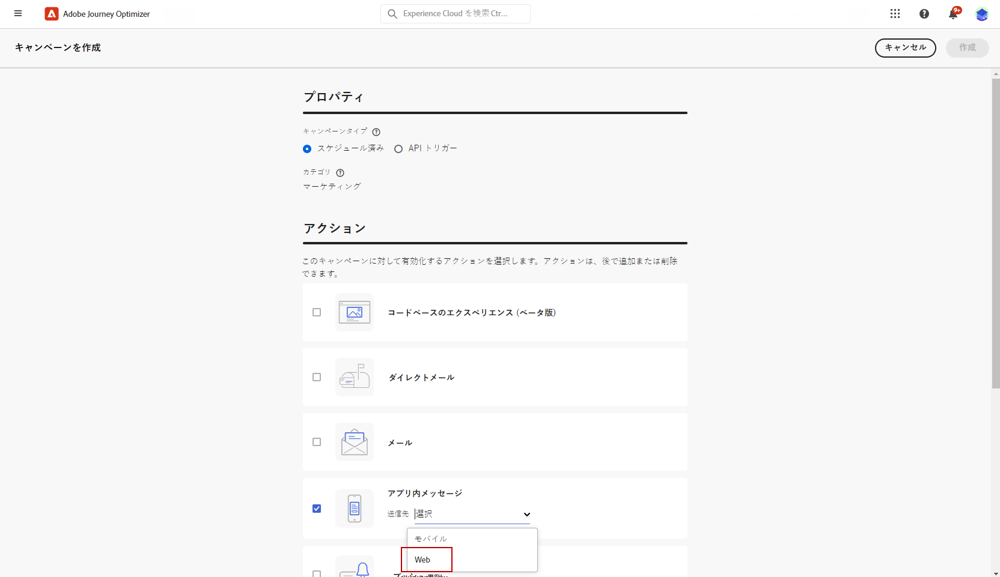
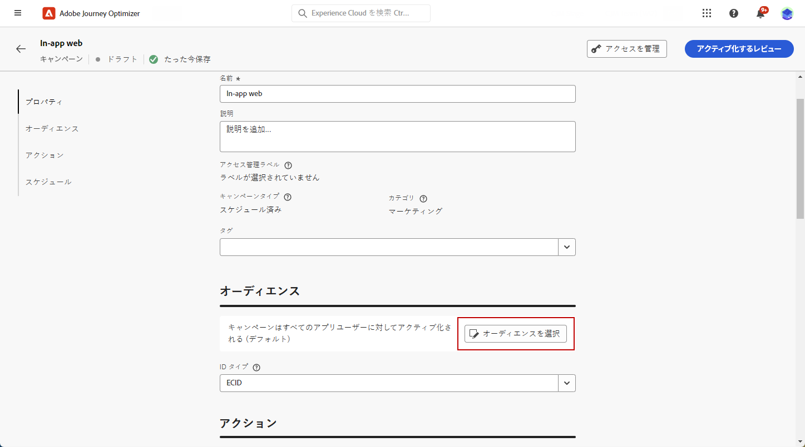
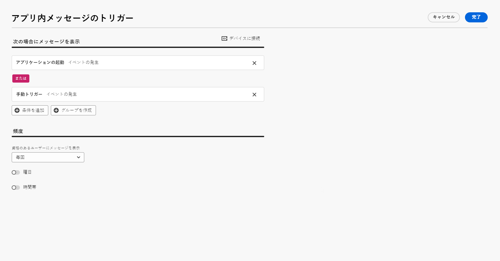
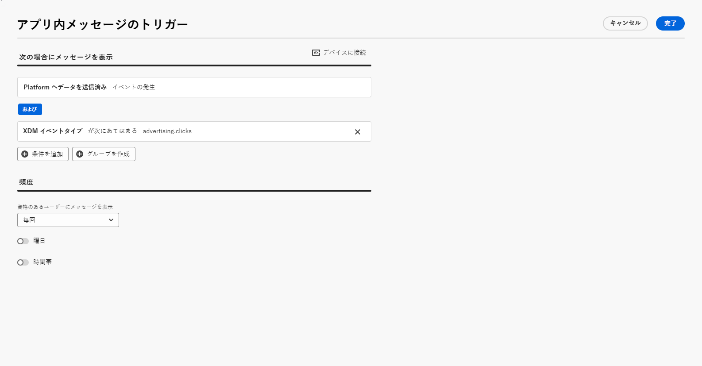
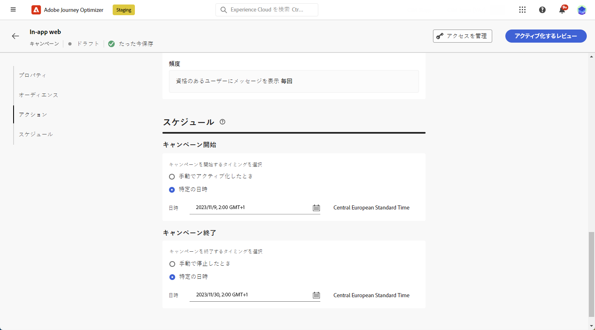
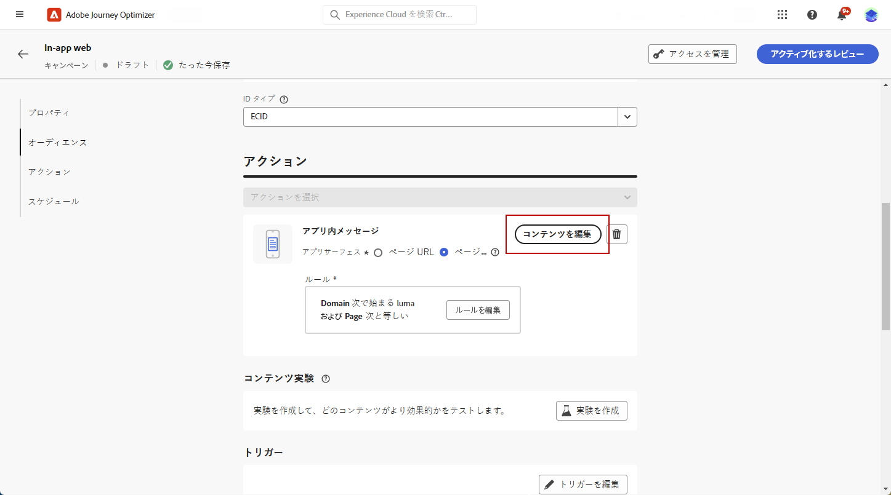

# Web アプリ内メッセージの作成 {#create-in-app-web}

## Web アプリ内チャネルの設定 {#configure-web-inapp}

Web アプリ内チャネルを設定するには、次の手順に従います。

* Web アプリ内メッセージをサポートするには、web SDK タグ拡張機能をインストールします。[詳細情報](https://experienceleague.adobe.com/docs/experience-platform/tags/extensions/client/web-sdk/web-sdk-extension-configuration.html?lang=ja)

* トリガーをカスタマイズします。Web アプリ内メッセージは、プラットフォームへのデータの送信トリガーと手動トリガーの 2 種類のトリガーをサポートします。[詳細情報](https://experienceleague.adobe.com/docs/experience-platform/edge/personalization/ajo/web-in-app-messaging.html?lang=ja)

* Web アプリ内設定を作成します。[詳細情報](inapp-configuration.md)

## Web アプリ内メッセージキャンペーンの作成 {#create-inapp-web-campaign}

1. **[!UICONTROL キャンペーン]**&#x200B;メニューにアクセスし、「**[!UICONTROL キャンペーンを作成]**」をクリックします。

1. キャンペーンの実行タイプ（スケジュール済みまたは API トリガー）を選択します。キャンペーンのタイプについて詳しくは、[ このページ ](../campaigns/create-campaign.md#campaigntype) を参照してください。

1. **[!UICONTROL アクション]**&#x200B;ドロップダウンから、「**[!UICONTROL アプリ内メッセージ]**」を選択します。

   

1. アプリ設定を選択または作成します。[詳細情報](inapp-configuration.md#channel-prerequisites)

## Web アプリ内メッセージキャンペーンの定義 {#configure-inapp}

1. 「**[!UICONTROL プロパティ]**」セクションで、**[!UICONTROL タイトル]**&#x200B;と&#x200B;**[!UICONTROL 説明]**&#x200B;の説明を入力します。

1. カスタムまたはコアのデータ使用ラベルをアプリ内メッセージに割り当てるには、「**[!UICONTROL アクセスを管理]**」を選択します。[詳細情報](../administration/object-based-access.md)

1. 「**[!UICONTROL オーディエンスを選択]**」ボタンをクリックして、使用可能な Adobe Experience Platform オーディエンスのリストからターゲットオーディエンスを定義します。[詳細情報](../audience/about-audiences.md)

   

1. 「**[!UICONTROL ID 名前空間]**」フィールドで、選択したオーディエンスから個人を識別するために使用する名前空間を選択します。[詳細情報](../event/about-creating.md#select-the-namespace)

1. **[!UICONTROL アクション]**&#x200B;メニューには、**[!UICONTROL アプリ設定]**&#x200B;として以前に設定した設定が表示されます。必要に応じて、ここで変更を行うか、「**[!UICONTROL ルールを編集]**」をクリックしてルールを更新できます。

1. 「**[!UICONTROL 実験を作成]**」をクリックしてコンテンツ実験の設定を開始し、パフォーマンスを測定してターゲットオーディエンスに最適なオプションを特定するための処理を作成します。[詳細情報](../content-management/content-experiment.md)

1. 「**[!UICONTROL トリガーを編集]**」をクリックして、メッセージをトリガーするイベントと条件を選択します。ルールビルダーを使用すると、条件と値を指定して、条件が満たされた場合にアプリ内メッセージの送信などの一連のアクションをトリガーできます。

   1. 必要に応じて、イベントのドロップダウンをクリックしてトリガーを変更します。

      +++使用可能なトリガーについては、こちらを参照してください。

      | パッケージ | トリガー | 定義 |
      |---|---|---|
      | Platform | Platform にデータを送信済み | モバイルアプリがエッジエクスペリエンスイベントを発行してデータを Adobe Experience Platform に送信するとトリガーされます。通常、API は AEP Edge 拡張機能から [sendEvent](https://developer.adobe.com/client-sdks/documentation/edge-network/api-reference/#sendevent) を呼び出します。 |
      | 手動 | 手動トリガー | 2 つの関連データ要素：キーは、データセットを定義する定数（例：性別、色、価格など）です。値は、そのセットに属する変数（例：男性／女性、緑、100 など）です。 |

+++

   1. トリガーで複数のイベントまたは条件を考慮する場合は、「**[!UICONTROL 条件を追加]**」をクリックします。

   1. **[!UICONTROL トリガー]**&#x200B;をさらに追加してルールをさらに拡張する場合は、**[!UICONTROL または]**&#x200B;条件を選択します。

      

   1. カスタム&#x200B;**[!UICONTROL 特性]**&#x200B;を追加してルールを微調整する場合は、**[!UICONTROL And]** 条件を選択します。

      +++使用可能な特性についてはこちらを参照。

      | パッケージ | 特性 | 定義 |
      |---|---|---|
      | Platform | XDM イベントタイプ | 指定されたイベントタイプに一致するとトリガーされます。 |
      | Platform | XDM 値 | 指定された XDM 値に一致するとトリガーされます。 |

+++

      

   1. 「**[!UICONTROL グループを作成]**」をクリックして、トリガーをグループ化します。

1. アプリ内メッセージがアクティブとなっている場合のトリガーの頻度を選択します。次のオプションがあります。

   * **[!UICONTROL 毎回]**：**[!UICONTROL モバイルアプリトリガー]**&#x200B;ドロップダウンで選択したイベントが発生した場合に、常にメッセージを表示します。
   * **[!UICONTROL 1 度だけ]**：**[!UICONTROL モバイルアプリトリガー]**&#x200B;ドロップダウンで選択したイベントが初めて発生した場合にのみ、このメッセージを表示します。
   * **[!UICONTROL クリックスルーまで]**：**[!UICONTROL モバイルアプリトリガー]**&#x200B;ドロップダウンで選択したイベントが、「クリック」アクションで SDK によって操作イベントが送信されるまでに発生した場合に、このメッセージが表示されます。
   * **[!UICONTROL X 回]**：このメッセージを X 回表示します。

1. 必要に応じて、アプリ内メッセージを表示する&#x200B;**[!UICONTROL 曜日]**&#x200B;または&#x200B;**[!UICONTROL 時刻]**&#x200B;を選択します。

1. キャンペーンは、特定の日付に実行するか、繰り返し頻度で実行するように設計されています。キャンペーンの&#x200B;**[!UICONTROL スケジュール]**&#x200B;を設定する方法については、[この節](../campaigns/create-campaign.md#schedule)を参照してください。

   

1. これで、「**[!UICONTROL コンテンツを編集]**」ボタンでコンテンツのデザインを開始できます。[詳細情報](design-in-app.md)

   

**関連トピック：**

* [アプリ内メッセージのテストおよび送信](send-in-app.md)
* [アプリ内レポート](../reports/campaign-global-report-cja-inapp.md)
* [アプリ内設定](inapp-configuration.md)
