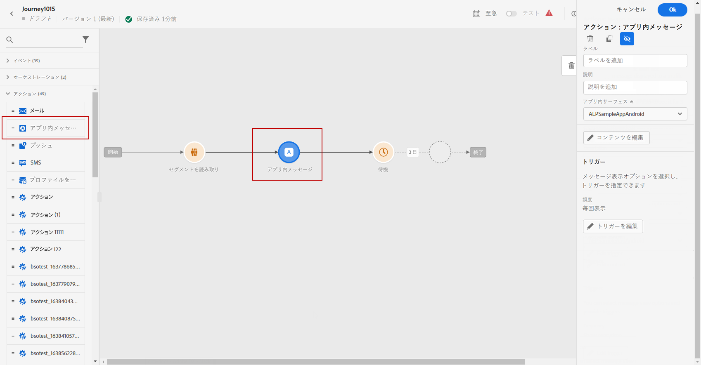
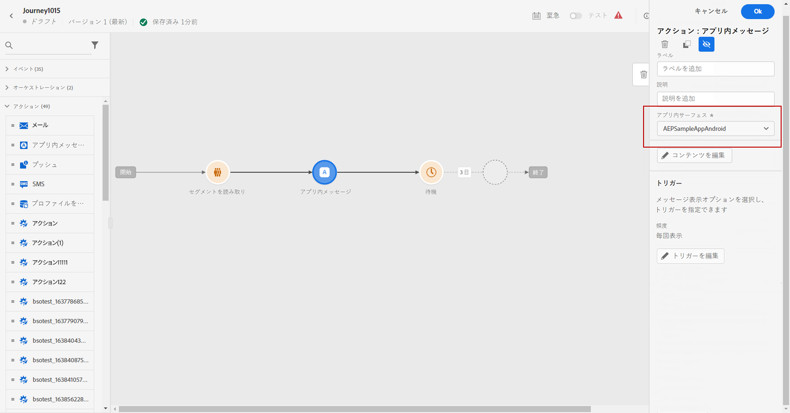
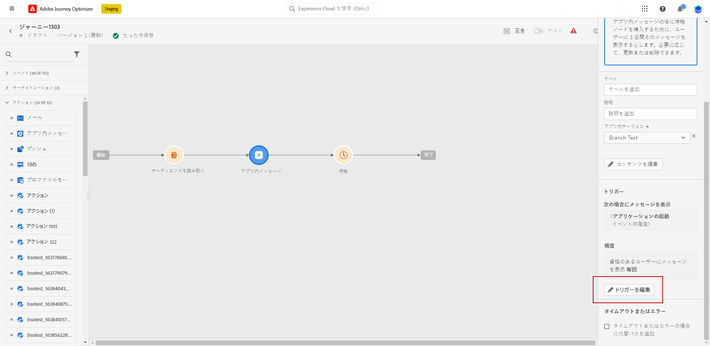
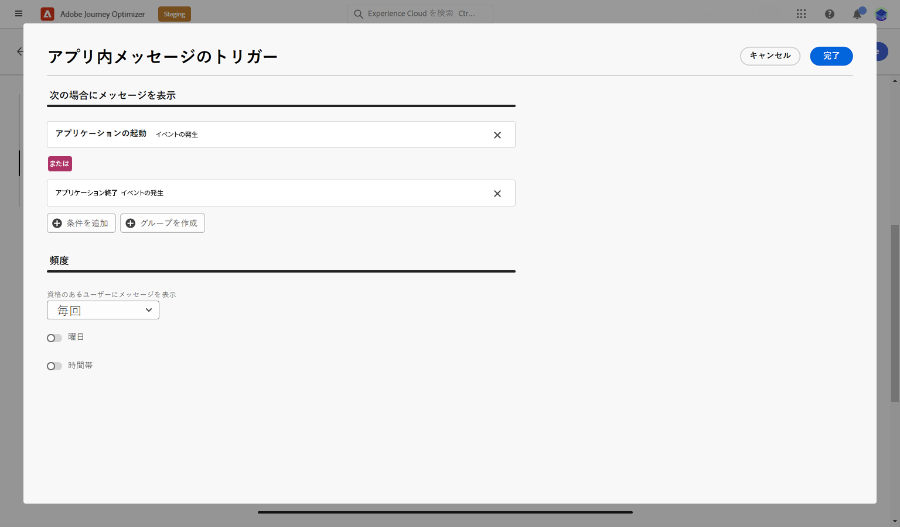
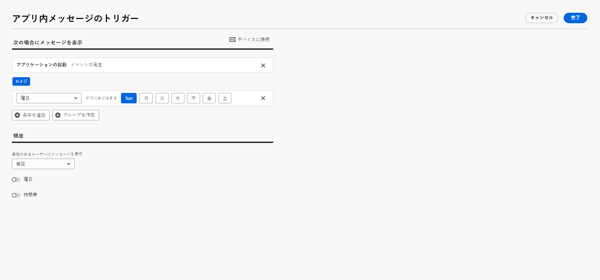
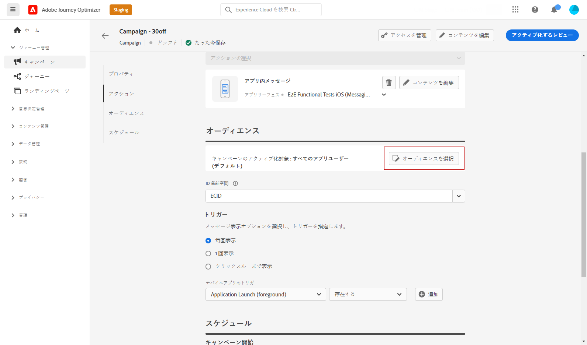
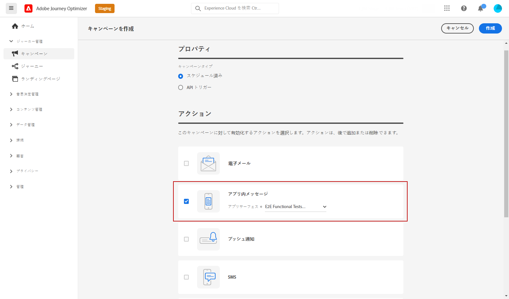
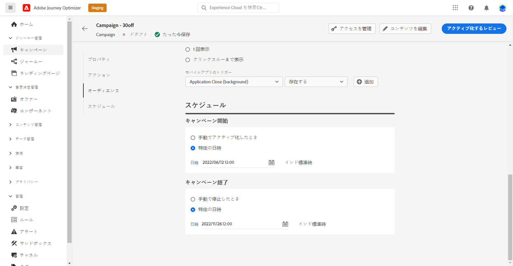
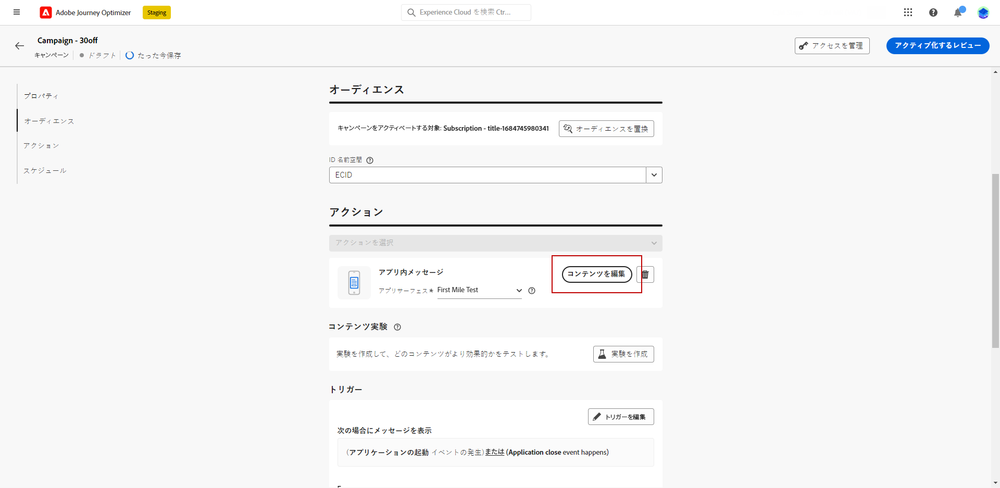

# アプリ内メッセージの作成  {#create-in-app}

>[!CONTEXTUALHELP]
>id="ajo_campaigns_inapp_triggers"
>title="アプリ内トリガーの管理"
>abstract="メッセージをアクティブ化する特定のイベントと条件を選択することで、トリガーを効率的に制御します。ルールビルダーを使用すると、ユーザーは正確な条件と値を定義できます。これらの条件を満たすと、アプリ内メッセージの配信を含む一連のアクションが開始されます。"

アプリ内メッセージは、キャンペーンまたはジャーニーに追加できます。次に説明する手順に従って、両方のコンテキストでアプリ内メッセージを作成します。

アプリ内メッセージは、オペレーティングシステムでのプッシュ通知のオプトインまたはオプトアウトのユーザーの選択の影響を受けません。

>[!BEGINTABS]

>[!TAB ジャーニーへのアプリ内メッセージの追加]

アプリ内メッセージをジャーニーに追加するには、次の手順に従います。

1. ジャーニーを開き、パレットの「**[!UICONTROL アクション]**」セクションから&#x200B;**[!UICONTROL アプリ内]**&#x200B;アクティビティをドラッグ＆ドロップします。

   プロファイルがジャーニーの終了に達すると、表示されたアプリ内メッセージは自動的に期限切れになります。そのため、適切なタイミングを確保するために、アプリ内アクティビティの後に待機アクティビティが自動的に追加されます。

   

1. メッセージの&#x200B;**[!UICONTROL ラベル]**&#x200B;と&#x200B;**[!UICONTROL 説明]**&#x200B;を入力します。

1. 使用する[アプリ内設定](inapp-configuration.md#channel-prerequisites)を選択します。

   

1. これで、「**[!UICONTROL コンテンツを編集]**」ボタンでコンテンツのデザインを開始できます。[詳細情報](design-in-app.md)

1. 「**[!UICONTROL トリガーを編集]**」をクリックして、メッセージをトリガーするイベントと条件を選択します。ルールビルダーを使用すると、条件と値を指定して、条件が満たされた場合にアプリ内メッセージの送信などの一連のアクションをトリガーできます。

   

   1. 必要に応じて、イベントのドロップダウンをクリックしてトリガーを変更します。

      +++使用可能なトリガーについては、こちらを参照してください。

      | パッケージ | トリガー | 定義 |
      |---|---|---|
      | Platform にデータを送信 | Platform にデータを送信済み | モバイルアプリがエッジエクスペリエンスイベントを発行してデータを Adobe Experience Platform に送信するとトリガーされます。通常、API は AEP Edge 拡張機能から [sendEvent](https://developer.adobe.com/client-sdks/documentation/edge-network/api-reference/#sendevent) を呼び出します。 |
      | コアトラッキング | アクションを追跡 | モバイルコード API [trackAction](https://developer.adobe.com/client-sdks/documentation/mobile-core/api-reference/#trackaction) で提供される従来の機能を呼び出すとトリガーされます。 |
      | コアトラッキング | 状態を追跡 | モバイルコード API [trackState](https://developer.adobe.com/client-sdks/documentation/mobile-core/api-reference/#trackstate) で提供される従来の機能を呼び出すとトリガーされます。 |
      | コアトラッキング | PII を収集 | モバイルコード API [collectPII](https://developer.adobe.com/client-sdks/documentation/mobile-core/api-reference/#collectpii) で提供される従来の機能を呼び出すとトリガーされます。 |
      | アプリケーションライフサイクル | アプリケーションの起動 | 実行のたびに（クラッシュおよびインストールを含む）トリガーされます。また、ライフサイクルセッションのタイムアウトを超えた場合に、SignatureInfo オブジェクトのバックグラウンドからの再開時にもトリガーされます。 |
      | アプリケーションライフサイクル | アプリケーションのインストール | インストール後または再インストール後の最初の実行時にトリガーされます。 |
      | アプリケーションライフサイクル | アプリケーションの更新 | アップグレード後またはバージョン番号の変更時の最初の実行時にトリガーされます。 |
      | アプリケーションライフサイクル | アプリケーションのクローズ | アプリケーションをクローズするとトリガーされます。 |
      | アプリケーションライフサイクル | アプリケーションのクラッシュ | アプリケーションが終了前にバックグラウンドにならなかった場合にトリガーされます。このイベントは、アプリケーションがクラッシュした後の起動時に送信されます。Adobe Mobile クラッシュレポートには、キャッチできないグローバルな例外ハンドラーは実装されていません。 |
      | Places | POI にエントリ | 設定した目標地点（POI）に顧客がエントリすると、Places SDK によってトリガーされます。 |
      | Places | POI を終了 | 設定した目標地点（POI）を顧客が終了すると、Places SDK によってトリガーされます。 |

+++

   1. トリガーで複数のイベントまたは条件を考慮する場合は、「**[!UICONTROL 条件を追加]**」をクリックします。

   1. **[!UICONTROL トリガー]**&#x200B;をさらに追加してルールをさらに拡張する場合は、**[!UICONTROL または]**&#x200B;条件を選択します。

      

   1. **[!UICONTROL 特性]**&#x200B;を追加してルールを微調整する場合は、**[!UICONTROL および]**&#x200B;条件を選択します。

      +++使用可能な特性についてはこちらを参照。

      | パッケージ | 特性 | 定義 |
      |---|---|---|
      | デバイス情報 | 通信事業者名 | リストに含まれる通信事業者名のいずれかに一致するとトリガーされます。 |
      | デバイス情報 | デバイス名 | デバイス名のいずれかに一致するとトリガーされます。 |
      | デバイス情報 | ロケール | リストに含まれる言語のいずれかに一致するとトリガーされます。 |
      | デバイス情報 | OS バージョン | 指定された OS バージョンのいずれかに一致するとトリガーされます。 |
      | デバイス情報 | 以前の OS バージョン | 指定された以前の OS バージョンのいずれかに一致するとトリガーされます。 |
      | デバイス情報 | 実行モード | 実行モードがアプリケーションまたは拡張機能の場合にトリガーされます。 |
      | アプリケーションライフサイクル | アプリ ID | 指定されたアプリ ID に一致するとトリガーされます。 |
      | アプリケーションライフサイクル | 曜日 | 指定された曜日に一致するとトリガーされます。 |
      | アプリケーションライフサイクル | 初回使用以降の日数 | 初回使用以降の指定された日数に一致するとトリガーされます。 |
      | アプリケーションライフサイクル | 前回使用以降の日数 | 前回使用以降の指定された日数に一致するとトリガーされます。 |
      | アプリケーションライフサイクル | アップグレード以降の日数 | 前回のアップグレード以降の指定された日数に一致するとトリガーされます。 |
      | アプリケーションライフサイクル | インストール日 | 指定されたインストール日に一致するとトリガーされます。 |
      | アプリケーションライフサイクル | 起動回数 | 指定された起動回数に一致するとトリガーされます。 |
      | アプリケーションライフサイクル | 時刻 | 指定された時刻に一致するとトリガーされます。 |
      | Places | 現在の POI | 指定された目標地点（POI）に顧客がエントリすると、Places SDK によってトリガーされます。 |
      | Places | 最後にエントリした POI | 顧客が最後にエントリした目標地点（POI）に応じて、Places SDK によってトリガーされます。 |
      | Places | 前回離脱した POI | 顧客が前回離脱した目標地点（POI）に応じて、Places SDK によってトリガーされます。 |

+++

      

   1. 「**[!UICONTROL グループを作成]**」をクリックして、トリガーをグループ化します。

      

   1. アプリ内メッセージがアクティブな場合のトリガーの頻度を選択します。

      * **[!UICONTROL 毎回表示する]**：**[!UICONTROL モバイルアプリトリガー]**&#x200B;ドロップダウンで選択したイベントが発生した場合に、常にメッセージを表示します。
      * **[!UICONTROL 1 度だけ表示]**：**[!UICONTROL モバイルアプリトリガー]**&#x200B;ドロップダウンで選択したイベントが初めて発生した場合にのみ、このメッセージを表示します。
      * **[!UICONTROL クリックスルーまで表示]**：**[!UICONTROL モバイルアプリトリガー]**&#x200B;ドロップダウンで選択したイベントが、「クリック」アクションで SDK によって操作イベントが送信されるまでに発生した場合に、このメッセージが表示されます。

1. 必要に応じて、追加のアクションまたはイベントをドラッグ＆ドロップして、ジャーニーフローを完了します。[詳細情報](../building-journeys/about-journey-activities.md)

1. アプリ内メッセージの準備が整ったら、設定を完了し、ジャーニーを公開してアクティブ化します。

ジャーニーの設定方法について詳しくは、[このページ](../building-journeys/journey-gs.md)を参照してください。

>[!TAB キャンペーンへのアプリ内メッセージの追加]

キャンペーンにアプリ内メッセージを追加するには、次の手順に従います。

1. **[!UICONTROL キャンペーン]**&#x200B;メニューにアクセスし、「**[!UICONTROL キャンペーンを作成]**」をクリックします。

1. 実施するキャンペーンのタイプを選択します。

   * **Scheduled - Marketing**：キャンペーンをすぐに実行するか、指定日に実行します。スケジュール済みキャンペーンは、マーケティングメッセージを送信することを目的としています。ユーザーインターフェイスから設定および実行されます。

   * **API トリガー - マーケティング／トランザクション**：API 呼び出しを使用してキャンペーンを実行します。API トリガーキャンペーンは、マーケティングメッセージまたはトランザクションメッセージのいずれか、つまり、個人が実行したアクション（パスワードのリセット、買い物かごの購入など）に続いて送信されるメッセージを送信することを目的としています。

1. 「**[!UICONTROL プロパティ]**」セクションで、**[!UICONTROL タイトル]**&#x200B;と&#x200B;**[!UICONTROL 説明]**&#x200B;の説明を入力します。

1. カスタムまたはコアのデータ使用ラベルをアプリ内メッセージに割り当てるには、「**[!UICONTROL アクセスを管理]**」を選択します。[詳細情報](../administration/object-based-access.md)

1. 「**[!UICONTROL オーディエンスを選択]**」ボタンをクリックして、使用可能な Adobe Experience Platform オーディエンスのリストからターゲットオーディエンスを定義します。[詳細情報](../audience/about-audiences.md)

   

1. 「**[!UICONTROL ID 名前空間]**」フィールドで、選択したオーディエンスから個人を識別するために使用する名前空間を選択します。[詳細情報](../event/about-creating.md#select-the-namespace)

1. 「**[!UICONTROL アクション]**」セクションで、「**[!UICONTROL アプリ内メッセージ]**」を選択し、新しい設定を選択または作成します。

   アプリ内設定について詳しくは、[このページ](inapp-configuration.md)を参照してください。

   

1. 「**[!UICONTROL 実験を作成]**」をクリックしてコンテンツ実験の設定を開始し、パフォーマンスを測定してターゲットオーディエンスに最適なオプションを特定するための処理を作成します。[詳細情報](../content-management/content-experiment.md)

1. 「**[!UICONTROL トリガーを編集]**」をクリックして、メッセージをトリガーするイベントと条件を選択します。ルールビルダーを使用すると、条件と値を指定して、条件が満たされた場合にアプリ内メッセージの送信などの一連のアクションをトリガーできます。

   1. 必要に応じて、イベントのドロップダウンをクリックしてトリガーを変更します。

      +++使用可能なトリガーについては、こちらを参照してください。

      | パッケージ | トリガー | 定義 |
      |---|---|---|
      | Platform にデータを送信 | Platform にデータを送信済み | モバイルアプリがエッジエクスペリエンスイベントを発行してデータを Adobe Experience Platform に送信するとトリガーされます。通常、API は AEP Edge 拡張機能から [sendEvent](https://developer.adobe.com/client-sdks/documentation/edge-network/api-reference/#sendevent) を呼び出します。 |
      | コアトラッキング | アクションを追跡 | モバイルコード API [trackAction](https://developer.adobe.com/client-sdks/documentation/mobile-core/api-reference/#trackaction) で提供される従来の機能を呼び出すとトリガーされます。 |
      | コアトラッキング | 状態を追跡 | モバイルコード API [trackState](https://developer.adobe.com/client-sdks/documentation/mobile-core/api-reference/#trackstate) で提供される従来の機能を呼び出すとトリガーされます。 |
      | コアトラッキング | PII を収集 | モバイルコード API [collectPII](https://developer.adobe.com/client-sdks/documentation/mobile-core/api-reference/#collectpii) で提供される従来の機能を呼び出すとトリガーされます。 |
      | アプリケーションライフサイクル | アプリケーションの起動 | 実行のたびに（クラッシュおよびインストールを含む）トリガーされます。また、ライフサイクルセッションのタイムアウトを超えた場合に、SignatureInfo オブジェクトのバックグラウンドからの再開時にもトリガーされます。 |
      | アプリケーションライフサイクル | アプリケーションのインストール | インストール後または再インストール後の最初の実行時にトリガーされます。 |
      | アプリケーションライフサイクル | アプリケーションの更新 | アップグレード後またはバージョン番号の変更時の最初の実行時にトリガーされます。 |
      | アプリケーションライフサイクル | アプリケーションのクローズ | アプリケーションをクローズするとトリガーされます。 |
      | アプリケーションライフサイクル | アプリケーションのクラッシュ | アプリケーションが終了前にバックグラウンドにならなかった場合にトリガーされます。このイベントは、アプリケーションがクラッシュした後の起動時に送信されます。Adobe Mobile クラッシュレポートには、キャッチできないグローバルな例外ハンドラーは実装されていません。 |
      | Places | POI にエントリ | 設定した目標地点（POI）に顧客がエントリすると、Places SDK によってトリガーされます。 |
      | Places | POI を終了 | 設定した目標地点（POI）を顧客が終了すると、Places SDK によってトリガーされます。 |

+++

   1. トリガーで複数のイベントまたは条件を考慮する場合は、「**[!UICONTROL 条件を追加]**」をクリックします。

   1. **[!UICONTROL トリガー]**&#x200B;をさらに追加してルールをさらに拡張する場合は、**[!UICONTROL または]**&#x200B;条件を選択します。

      

   1. **[!UICONTROL 特性]**&#x200B;を追加してルールを微調整する場合は、**[!UICONTROL および]**&#x200B;条件を選択します。

      +++使用可能な特性についてはこちらを参照。

      | パッケージ | 特性 | 定義 |
      |---|---|---|
      | デバイス情報 | 通信事業者名 | リストに含まれる通信事業者名のいずれかに一致するとトリガーされます。 |
      | デバイス情報 | デバイス名 | デバイス名のいずれかに一致するとトリガーされます。 |
      | デバイス情報 | ロケール | リストに含まれる言語のいずれかに一致するとトリガーされます。 |
      | デバイス情報 | OS バージョン | 指定された OS バージョンのいずれかに一致するとトリガーされます。 |
      | デバイス情報 | 以前の OS バージョン | 指定された以前の OS バージョンのいずれかに一致するとトリガーされます。 |
      | デバイス情報 | 実行モード | 実行モードがアプリケーションまたは拡張機能の場合にトリガーされます。 |
      | アプリケーションライフサイクル | アプリ ID | 指定されたアプリ ID に一致するとトリガーされます。 |
      | アプリケーションライフサイクル | 曜日 | 指定された曜日に一致するとトリガーされます。 |
      | アプリケーションライフサイクル | 初回使用以降の日数 | 初回使用以降の指定された日数に一致するとトリガーされます。 |
      | アプリケーションライフサイクル | 前回使用以降の日数 | 前回使用以降の指定された日数に一致するとトリガーされます。 |
      | アプリケーションライフサイクル | アップグレード以降の日数 | 前回のアップグレード以降の指定された日数に一致するとトリガーされます。 |
      | アプリケーションライフサイクル | インストール日 | 指定されたインストール日に一致するとトリガーされます。 |
      | アプリケーションライフサイクル | 起動回数 | 指定された起動回数に一致するとトリガーされます。 |
      | アプリケーションライフサイクル | 時刻 | 指定された時刻に一致するとトリガーされます。 |
      | Places | 現在の POI | 指定された目標地点（POI）に顧客がエントリすると、Places SDK によってトリガーされます。 |
      | Places | 最後にエントリした POI | 顧客が最後にエントリした目標地点（POI）に応じて、Places SDK によってトリガーされます。 |
      | Places | 前回離脱した POI | 顧客が前回離脱した目標地点（POI）に応じて、Places SDK によってトリガーされます。 |

+++

      

   1. 「**[!UICONTROL グループを作成]**」をクリックして、トリガーをグループ化します。

1. アプリ内メッセージがアクティブとなっている場合のトリガーの頻度を選択します。次のオプションがあります。

   * **[!UICONTROL 毎回]**：**[!UICONTROL モバイルアプリトリガー]**&#x200B;ドロップダウンで選択したイベントが発生した場合に、常にメッセージを表示します。
   * **[!UICONTROL 1 度だけ]**：**[!UICONTROL モバイルアプリトリガー]**&#x200B;ドロップダウンで選択したイベントが初めて発生した場合にのみ、このメッセージを表示します。
   * **[!UICONTROL クリックスルーまで]**：**[!UICONTROL モバイルアプリトリガー]**&#x200B;ドロップダウンで選択したイベントが、「クリック」アクションで SDK によって操作イベントが送信されるまでに発生した場合に、このメッセージが表示されます。
   * **[!UICONTROL X 回]**：このメッセージを X 回表示します。

1. 必要に応じて、アプリ内メッセージを表示する&#x200B;**[!UICONTROL 曜日]**&#x200B;または&#x200B;**[!UICONTROL 時刻]**&#x200B;を選択します。

1. キャンペーンは、特定の日付に実行するか、繰り返し頻度で実行するように設計されています。キャンペーンの&#x200B;**[!UICONTROL スケジュール]**&#x200B;を設定する方法については、[この節](../campaigns/create-campaign.md#schedule)を参照してください。

   

1. これで、「**[!UICONTROL コンテンツを編集]**」ボタンでコンテンツのデザインを開始できます。[詳細情報](design-in-app.md)

   

>[!ENDTABS]

## ハウツービデオ{#video}

* 以下のビデオでは、キャンペーンでアプリ内メッセージを作成、設定および公開する方法を示しています。

  +++こちらのビデオをご覧ください

  >[!VIDEO](https://video.tv.adobe.com/v/3410430?quality=12&learn=on)

+++

* 以下のビデオでは、アプリ内メッセージの A/B テストを行うためのコンテンツ実験を設定および分析する方法を示しています。

  +++こちらのビデオをご覧ください

  >[!VIDEO](https://video.tv.adobe.com/v/3419898)

+++

* 以下のビデオでは、ジャーニーでアプリ内メッセージを作成する方法と、ジャーニーをテストして公開する方法を示しています。

  +++こちらのビデオをご覧ください

  >[!VIDEO](https://video.tv.adobe.com/v/3423077)

+++

**関連トピック：**

* [アプリ内メッセージのデザイン](design-in-app.md)
* [アプリ内メッセージのテストおよび送信](send-in-app.md)
* [アプリ内レポート](../reports/campaign-global-report-cja-inapp.md)
* [アプリ内設定](inapp-configuration.md)