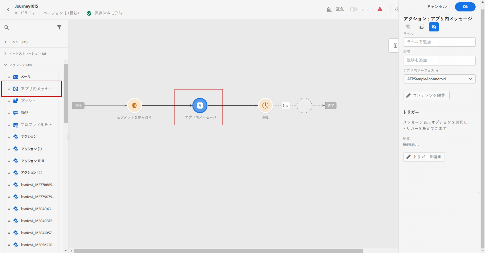
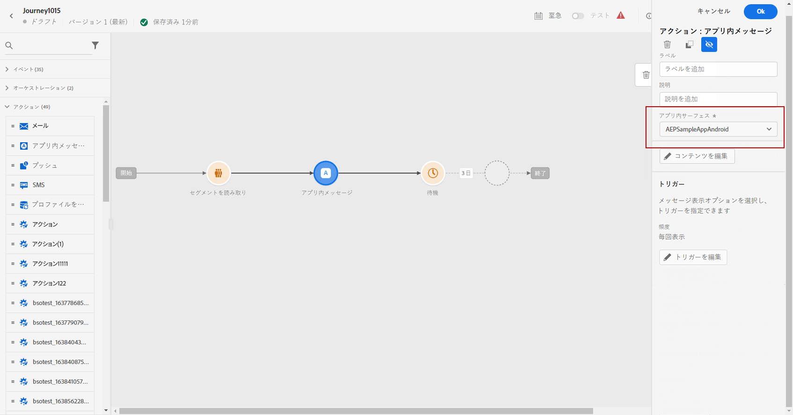
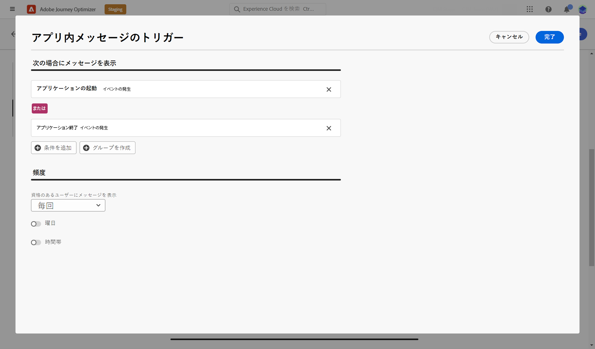
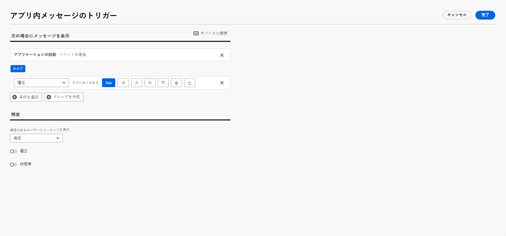
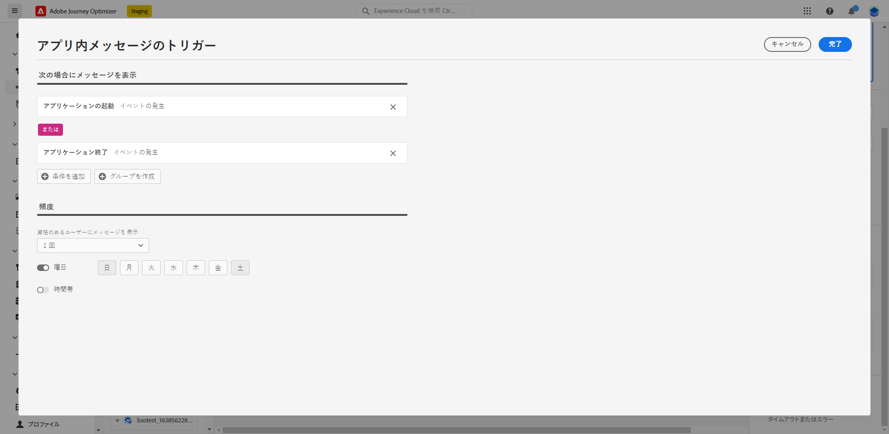
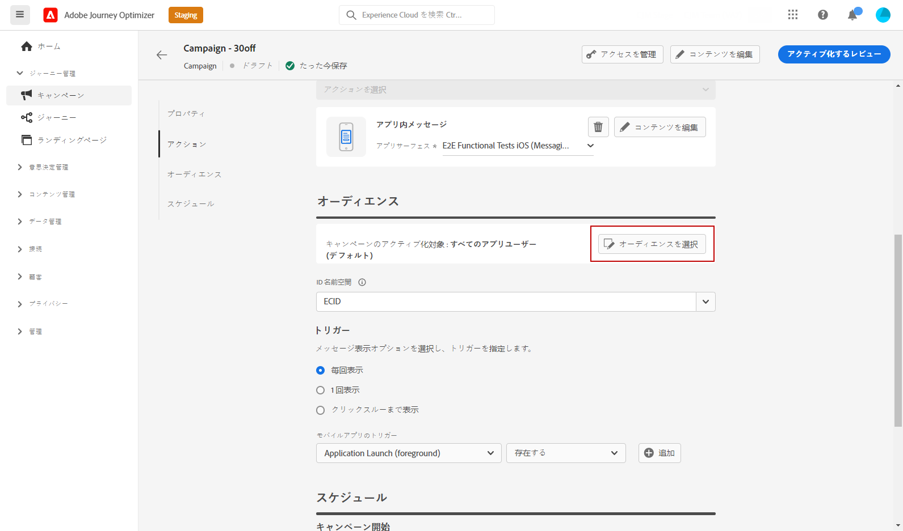
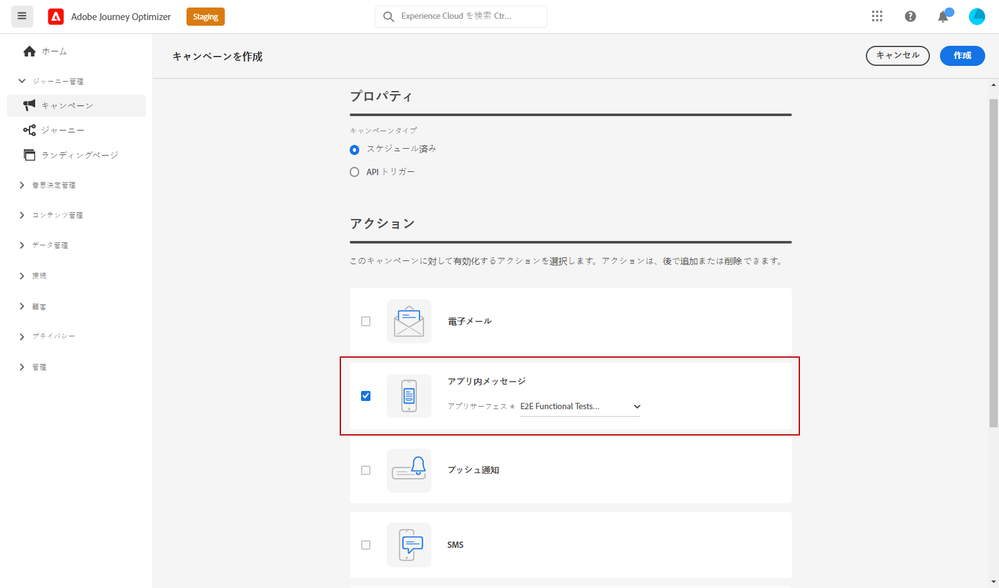
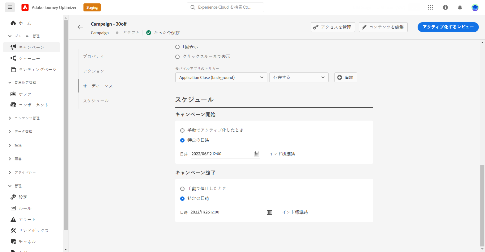
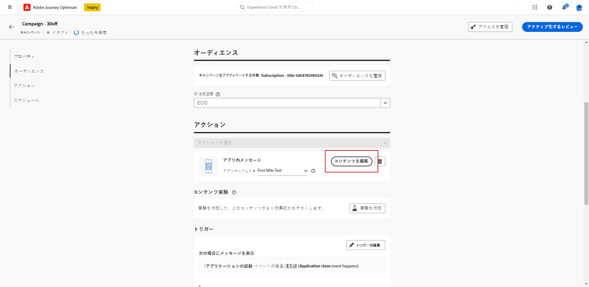

# アプリ内メッセージの作成 {#create-in-app}

>[!CONTEXTUALHELP]
>id="ajo_campaigns_inapp_triggers"
>title="アプリ内トリガーの管理"
>abstract="メッセージをアクティベートする特定のイベントと基準を選択することで、トリガーを効率的に制御できます。 ルールビルダーを利用すれば、正確な条件と値を定義できます。 これらの条件が満たされると、アプリ内メッセージの配信を含む、一連のアクションが開始されます。"

キャンペーンまたはジャーニーにアプリ内メッセージを追加できます。 両方のコンテキストでアプリ内メッセージを作成するには、次の手順に従います。

アプリ内メッセージは、オペレーティングシステムでのプッシュ通知のオプトインまたはオプトアウトに関するユーザーの選択の影響を受けないことに注意してください。

>[!BEGINTABS]

>[!TAB  アプリ内メッセージをジャーニーに追加]

ジャーニーにアプリ内メッセージを追加するには、次の手順に従います。

1. [ ジャーニー](../building-journeys/journey-gs.md)を開き、パレットの&#x200B;**[!UICONTROL アクション]** セクションから&#x200B;**[!UICONTROL アクション]** アクティビティをドラッグ&amp;ドロップします。 [ アクションアクティビティ ](../building-journeys/journey-action.md)の詳細をご覧ください。

   >[!IMPORTANT]
   >
   >従来のネイティブチャネルアクティビティ（電子メール、プッシュ、SMS、アプリ内、web、コードベースのエクスペリエンス、コンテンツカード）は、2026年3月のリリースで廃止されました。 これらのアクティビティを使用する既存のジャーニーは、変更なしで引き続き機能します。移行は必要ありません。

1. アクションタイプとして「**[!UICONTROL アプリ内]**」を選択します。

   

   >[!NOTE]
   >
   >プロファイルがジャーニーの終わりに到達すると、プロファイルに表示されるアプリ内メッセージはすべて自動的に期限切れになります。 そのため、アプリ内アクションの後、適切なタイミングを確保するために、3日間の&#x200B;**待機** アクティビティが自動的に追加されます。 [詳細情報](../building-journeys/wait-activity.md#auto-wait-node)

1. ジャーニーキャンバスでアクションを識別するには、**[!UICONTROL ラベル]**&#x200B;を入力します。

1. 「**[!UICONTROL 設定アクション]**」ボタンをクリックします。

1. 「**[!UICONTROL アクション]**」タブに移動します。 そこから、使用するアプリ内設定を選択または作成します。 [詳細情報](inapp-configuration.md#channel-prerequisites)

   

1. 「**[!UICONTROL コンテンツを編集]**」ボタンを選択し、必要に応じてコンテンツを作成します。 [詳細情報](design-in-app.md)

1. 「**[!UICONTROL トリガーを編集]**」をクリックして、メッセージをトリガーするイベントと条件を選択します。 ルールビルダーを利用すれば、条件と値を指定して一致する場合に、アプリ内メッセージの送信などの一連のアクションをトリガーできます。 [詳細情報](design-in-app.md)

   1. 必要に応じて、「イベント」ドロップダウンをクリックして、トリガーを変更します。

      +++ 利用可能なトリガーを見る

      | パッケージ | トリガー | 定義 |
      |---|---|---|
      | データをPlatformに送信 | Platformにデータを送信しました | モバイルアプリがエッジエクスペリエンスイベントを発行してAdobe Experience Platformにデータを送信するとトリガーされます。 通常、AEP Edge拡張機能から[sendEvent](https://developer.adobe.com/client-sdks/documentation/edge-network/api-reference/#sendevent)をAPI呼び出します。 |
      | コアトラッキング | アクションの追跡 | モバイルコード API [trackAction](https://developer.adobe.com/client-sdks/documentation/mobile-core/api-reference/#trackaction)で提供されている従来の機能が呼び出されたときにトリガーされます。 |
      | コアトラッキング | 状態を追跡 | モバイルコード API [trackState](https://developer.adobe.com/client-sdks/documentation/mobile-core/api-reference/#trackstate)で提供されている従来の機能が呼び出されたときにトリガーされます。 |
      | コアトラッキング | PIIの収集 | モバイルコード API [collectPII](https://developer.adobe.com/client-sdks/documentation/mobile-core/api-reference/#collectpii)で提供されている従来の機能が呼び出されたときにトリガーされます。 |
      | アプリケーションのライフサイクル | アプリケーション起動 | クラッシュやインストールを含む、すべての実行でトリガーされます。 また、ライフサイクルセッションのタイムアウトを超えた場合に、バックグラウンドからの再開でもトリガーされます。 |
      | アプリケーションのライフサイクル | アプリケーションインストール | インストールまたは再インストール後の最初の実行時にトリガーされます。 |
      | アプリケーションのライフサイクル | アプリケーションの更新 | アップグレード後の最初の実行時、またはバージョン番号が変更されたときにトリガーされます。 |
      | アプリケーションのライフサイクル | アプリケーションを閉じる | アプリケーションが閉じられたときにトリガーされます。 |
      | アプリケーションのライフサイクル | アプリケーションクラッシュ | アプリケーションが閉じる前にバックグラウンド化されていない場合にトリガーされます。 イベントは、クラッシュ後にアプリケーションが起動されたときに送信されます。 Adobe Mobile クラッシュレポートでは、グローバルな捕捉されない例外ハンドラーが実装されません。 |
      | Places | POIを入力 | お客様が設定したPOI （Point of Interest）に入ると、Places SDKによってトリガーされます。 |
      | Places | 出口POI | お客様が設定したPOI （Point of Interest）を終了したときにPlaces SDKによってトリガーされます。 |

      +++

   1. トリガーが複数のイベントまたは条件を検討する場合は、**[!UICONTROL 条件を追加]**&#x200B;をクリックします。

   1. ルールをさらに拡張するために&#x200B;**[!UICONTROL トリガー]**&#x200B;を追加する場合は、**[!UICONTROL または]**&#x200B;条件を選択します。

      

   1. **[!UICONTROL 特性]**&#x200B;を追加し、ルールをより詳細に調整する場合は、**[!UICONTROL および]**&#x200B;条件を選択します。

      +++ 利用可能な特性を見る

      | パッケージ | 特性 | 定義 |
      |---|---|---|
      | デバイス情報 | 通信事業者名 | リストのキャリア名のいずれかが満たされたときにトリガーされます。 |
      | デバイス情報 | デバイス名 | いずれかのデバイス名に一致したときにトリガーされます。 |
      | デバイス情報 | ロケール | リストの言語のいずれかが満たされたときにトリガーされます。 |
      | デバイス情報 | OS バージョン | 指定されたOS バージョンのいずれかが満たされたときにトリガーされます。 |
      | デバイス情報 | 以前のOS バージョン | 指定された以前のOS バージョンのいずれかが満たされたときにトリガーされます。 |
      | デバイス情報 | 実行モード | 実行モードがアプリケーションまたは拡張機能の場合にトリガーされます。 |
      | アプリケーションのライフサイクル | アプリ ID | 指定されたアプリ IDが満たされたときにトリガーされます。 |
      | アプリケーションのライフサイクル | 曜日 | 指定された曜日に達したときにトリガーされます。 |
      | アプリケーションのライフサイクル | 初回使用からの日 | 最初に使用してから指定した日数が満たされたときにトリガーされます。 |
      | アプリケーションのライフサイクル | 前回の使用日 | 最後に使用してから指定した日数が満たされたときにトリガーされます。 |
      | アプリケーションのライフサイクル | アップグレードからの日 | 前回のアップグレードが実行されてから指定された日数が経過したときにトリガーされます。 |
      | アプリケーションのライフサイクル | インストール日 | 指定されたインストール日に達したときにトリガーされます。 |
      | アプリケーションのライフサイクル | ローンチ | 指定された起動数に達したときにトリガーされます。 |
      | アプリケーションのライフサイクル | 時間帯 | 指定した時刻に達したときにトリガーされます。 |
      | Places | 現在のPOI | Places SDKによって、お客様が指定されたPOI （Point of Interest）に入ったときにトリガーされます。 |
      | Places | 最後に入力したPOI | Places SDKによって、お客様が最後に入力したPOI （Point of Interest）に応じてトリガーされます。 |
      | Places | 前回離脱したPOI | Places SDKによって、お客様が最後に離脱したPoint of Interest （POI）に応じてトリガーされます。 |

      +++

      

   1. 「**[!UICONTROL グループ化]**」をクリックして、トリガーをグループ化します。

      

   1. アプリ内メッセージがアクティブな場合のトリガーの頻度を選択します。

      * **[!UICONTROL 毎回表示]**: **[!UICONTROL モバイルアプリトリガー]** ドロップダウンで選択したイベントが発生した場合は、必ずメッセージを表示します。
      * **[!UICONTROL 1回表示]**：このメッセージは、ユーザーセッションごとに1回だけ表示され、閉じるまで、すべてのウィンドウまたはアクティビティで表示されます。 特定の画面に制限したり、自動的に却下したりするには、メッセージングデリゲートでカスタムロジックを使用します。
      * **[!UICONTROL クリックスルーまで表示]**: **[!UICONTROL モバイルアプリトリガー]** ドロップダウンで選択したイベントが、SDKによって「クリック」操作でインタラクティブイベントが送信されるまで発生した場合、このメッセージを表示します。

1. 「**[!UICONTROL アクションを追加]**」ボタンをクリックすると、アプリ内メッセージに1つ以上のインバウンドアクションを追加できます。 [詳細情報](../building-journeys/journey-action.md#multi-action)

1. ジャーニーキャンバスに戻ります。 必要に応じて、追加のアクションまたはイベントをドラッグ&amp;ドロップして、ジャーニーフローを完了します。 [詳細情報](../building-journeys/about-journey-activities.md)

ジャーニーの作成、設定、公開の方法について詳しくは、[このページ ](../building-journeys/journey-gs.md)を参照してください。

>[!NOTE]
>
>プッシュ通知を送信した直後にアプリ内メッセージを表示する場合は、**Wait** アクティビティを使用して、アプリ内メッセージのペイロード時間を反映させます。 通常5～15分の待機が推奨されますが、ペイロードの複雑さやパーソナライゼーションのニーズによって正確な時間は異なります。

>[!TAB  キャンペーンにアプリ内メッセージを追加]

キャンペーンにアプリ内メッセージを追加するには、次の手順に従います。

1. **[!UICONTROL キャンペーン]** メニューにアクセスし、**[!UICONTROL キャンペーンの作成]**&#x200B;をクリックします。

1. 実行するキャンペーンのタイプを選択します

   * **スケジュール済み – マーケティング**: キャンペーンを即時または指定した日付に実行します。 スケジュール型キャンペーンは、マーケティングメッセージの送信を目的としています。 これらはユーザーインターフェイスから設定され、実行されます。

   * **API トリガー – マーケティング/トランザクション**: API呼び出しを使用してキャンペーンを実行します。 API トリガー型のキャンペーンは、マーケティングまたはトランザクションメッセージ（個人が実行したアクションに続いて送信されるメッセージ：パスワードリセット、カート購入など）の送信を目的としています。

1. **[!UICONTROL プロパティ]** セクションから、**[!UICONTROL タイトル]**&#x200B;と&#x200B;**[!UICONTROL 説明]**&#x200B;の説明を入力します。

1. カスタムまたはコアのデータ使用ラベルをアプリ内メッセージに割り当てるには、**[!UICONTROL アクセスを管理]**&#x200B;を選択します。 [詳細情報](../administration/object-based-access.md)。

1. 「**[!UICONTROL オーディエンスを選択]**」ボタンをクリックして、利用可能なAdobe Experience Platform オーディエンスのリストからターゲットとするオーディエンスを定義します。 [詳細情報](../audience/about-audiences.md)。

   

1. 「**[!UICONTROL ID名前空間]**」フィールドで、選択したオーディエンスから個人を識別するために使用する名前空間を選択します。 [詳細情報](../event/about-creating.md#select-the-namespace)。

1. **[!UICONTROL アクション]** セクションで、**[!UICONTROL アプリ内メッセージ]**&#x200B;を選択し、新しい設定を選択または作成します。

   アプリ内設定について詳しくは、[このページ ](inapp-configuration.md)を参照してください。

   

1. 「**[!UICONTROL 実験を作成]**」をクリックして、コンテンツ実験の設定を開始し、パフォーマンスを測定し、ターゲットオーディエンスに最適なオプションを特定する処理を作成します。 [詳細情報](../content-management/content-experiment.md)

1. 「**[!UICONTROL トリガーを編集]**」をクリックして、メッセージをトリガーするイベントと条件を選択します。 ルールビルダーを利用すれば、条件と値を指定して一致する場合に、アプリ内メッセージの送信などの一連のアクションをトリガーできます。

   1. 必要に応じて、「イベント」ドロップダウンをクリックして、トリガーを変更します。

      +++ 利用可能なトリガーを見る

      | パッケージ | トリガー | 定義 |
      |---|---|---|
      | データをPlatformに送信 | Platformにデータを送信しました | モバイルアプリがエッジエクスペリエンスイベントを発行してAdobe Experience Platformにデータを送信するとトリガーされます。 通常、AEP Edge拡張機能から[sendEvent](https://developer.adobe.com/client-sdks/documentation/edge-network/api-reference/#sendevent)をAPI呼び出します。 |
      | コアトラッキング | アクションの追跡 | モバイルコード API [trackAction](https://developer.adobe.com/client-sdks/documentation/mobile-core/api-reference/#trackaction)で提供されている従来の機能が呼び出されたときにトリガーされます。 |
      | コアトラッキング | 状態を追跡 | モバイルコード API [trackState](https://developer.adobe.com/client-sdks/documentation/mobile-core/api-reference/#trackstate)で提供されている従来の機能が呼び出されたときにトリガーされます。 |
      | コアトラッキング | PIIの収集 | モバイルコード API [collectPII](https://developer.adobe.com/client-sdks/documentation/mobile-core/api-reference/#collectpii)で提供されている従来の機能が呼び出されたときにトリガーされます。 |
      | アプリケーションのライフサイクル | アプリケーション起動 | クラッシュやインストールを含む、すべての実行でトリガーされます。 また、ライフサイクルセッションのタイムアウトを超えた場合に、バックグラウンドからの再開でもトリガーされます。 |
      | アプリケーションのライフサイクル | アプリケーションインストール | インストールまたは再インストール後の最初の実行時にトリガーされます。 |
      | アプリケーションのライフサイクル | アプリケーションの更新 | アップグレード後の最初の実行時、またはバージョン番号が変更されたときにトリガーされます。 |
      | アプリケーションのライフサイクル | アプリケーションを閉じる | アプリケーションが閉じられたときにトリガーされます。 |
      | アプリケーションのライフサイクル | アプリケーションクラッシュ | アプリケーションが閉じる前にバックグラウンド化されていない場合にトリガーされます。 イベントは、クラッシュ後にアプリケーションが起動されたときに送信されます。 Adobe Mobile クラッシュレポートでは、グローバルな捕捉されない例外ハンドラーが実装されません。 |
      | Places | POIを入力 | お客様が設定したPOI （Point of Interest）に入ると、Places SDKによってトリガーされます。 |
      | Places | 出口POI | お客様が設定したPOI （Point of Interest）を終了したときにPlaces SDKによってトリガーされます。 |

      +++

   1. トリガーが複数のイベントまたは条件を検討する場合は、**[!UICONTROL 条件を追加]**&#x200B;をクリックします。

   1. ルールをさらに拡張するために&#x200B;**[!UICONTROL トリガー]**&#x200B;を追加する場合は、**[!UICONTROL または]**&#x200B;条件を選択します。

      

   1. **[!UICONTROL 特性]**&#x200B;を追加し、ルールをより詳細に調整する場合は、**[!UICONTROL および]**&#x200B;条件を選択します。

      +++ 利用可能な特性を見る

      | パッケージ | 特性 | 定義 |
      |---|---|---|
      | デバイス情報 | 通信事業者名 | リストのキャリア名のいずれかが満たされたときにトリガーされます。 |
      | デバイス情報 | デバイス名 | いずれかのデバイス名に一致したときにトリガーされます。 |
      | デバイス情報 | ロケール | リストの言語のいずれかが満たされたときにトリガーされます。 |
      | デバイス情報 | OS バージョン | 指定されたOS バージョンのいずれかが満たされたときにトリガーされます。 |
      | デバイス情報 | 以前のOS バージョン | 指定された以前のOS バージョンのいずれかが満たされたときにトリガーされます。 |
      | デバイス情報 | 実行モード | 実行モードがアプリケーションまたは拡張機能の場合にトリガーされます。 |
      | アプリケーションのライフサイクル | アプリ ID | 指定されたアプリ IDが満たされたときにトリガーされます。 |
      | アプリケーションのライフサイクル | 曜日 | 指定された曜日に達したときにトリガーされます。 |
      | アプリケーションのライフサイクル | 初回使用からの日 | 最初に使用してから指定した日数が満たされたときにトリガーされます。 |
      | アプリケーションのライフサイクル | 前回の使用日 | 最後に使用してから指定した日数が満たされたときにトリガーされます。 |
      | アプリケーションのライフサイクル | アップグレードからの日 | 前回のアップグレードが実行されてから指定された日数が経過したときにトリガーされます。 |
      | アプリケーションのライフサイクル | インストール日 | 指定されたインストール日に達したときにトリガーされます。 |
      | アプリケーションのライフサイクル | ローンチ | 指定された起動数に達したときにトリガーされます。 |
      | アプリケーションのライフサイクル | 時間帯 | 指定した時刻に達したときにトリガーされます。 |
      | Places | 現在のPOI | Places SDKによって、お客様が指定されたPOI （Point of Interest）に入ったときにトリガーされます。 |
      | Places | 最後に入力したPOI | Places SDKによって、お客様が最後に入力したPOI （Point of Interest）に応じてトリガーされます。 |
      | Places | 前回離脱したPOI | Places SDKによって、お客様が最後に離脱したPoint of Interest （POI）に応じてトリガーされます。 |

      +++

      

   1. 「**[!UICONTROL グループ化]**」をクリックして、トリガーをグループ化します。

1. アプリ内メッセージがアクティブな場合のトリガー頻度を選択します。 次のオプションを使用できます。

   * **[!UICONTROL 毎回]**: **[!UICONTROL モバイルアプリのトリガー]** ドロップダウンで選択したイベントが発生すると、常にメッセージが表示されます。
   * **[!UICONTROL 1回]**: **[!UICONTROL モバイルアプリトリガー]** ドロップダウンで選択されたイベントが初めて発生した場合にのみ、このメッセージを表示します。
   * **[!UICONTROL クリックするまで]**: **[!UICONTROL モバイルアプリトリガー]** ドロップダウンで選択されたイベントがSDKによって「クリック」アクションでインタラクティブイベントが送信されるまで発生した場合、このメッセージを表示します。
   * **[!UICONTROL X回]**：このメッセージをX回表示します。

1. 必要に応じて、アプリ内メッセージを表示する&#x200B;**[!UICONTROL 曜日]**&#x200B;または&#x200B;**[!UICONTROL 時刻]**&#x200B;を選択します。

1. キャンペーンは、特定の日付または定期的な頻度で実行するように設計されています。 キャンペーンの&#x200B;**[!UICONTROL スケジュール]**&#x200B;を[このセクション ](../campaigns/create-campaign.md#schedule)で設定する方法について説明します。

   

1. **[!UICONTROL コンテンツを編集]** ボタンでコンテンツのデザインを開始できるようになりました。 [詳細情報](design-in-app.md)

   

キャンペーンの作成、設定およびアクティベート方法について詳しくは、[このページ ](../campaigns/get-started-with-campaigns.md)を参照してください。

>[!ENDTABS]

## チュートリアルビデオ{#video}

* 次のビデオは、キャンペーンでアプリ内メッセージを作成、設定、公開する方法を示しています。

  +++ビデオを見る

  >[!VIDEO](https://video.tv.adobe.com/v/3410430?quality=12&learn=on)

  +++

* 次のビデオは、アプリ内メッセージをA/B テストするためのコンテンツ実験を設定および分析する方法を示しています。

  +++ビデオを見る

  >[!VIDEO](https://video.tv.adobe.com/v/3419898/?learn=on&autoplay=true)

  +++

* 以下のビデオでは、ジャーニーでアプリ内メッセージを作成する方法と、ジャーニーをテストして公開する方法を示します。

  +++ビデオを見る

  >[!VIDEO](https://video.tv.adobe.com/v/3423077/?learn=on&autoplay=true)

  +++

**関連トピック：**

* [アプリ内メッセージのデザイン](design-in-app.md)
* [アプリ内メッセージのテストと送信](send-in-app.md)
* [アプリ内レポート](../reports/campaign-global-report-cja-inapp.md)
* [アプリ内設定](inapp-configuration.md)