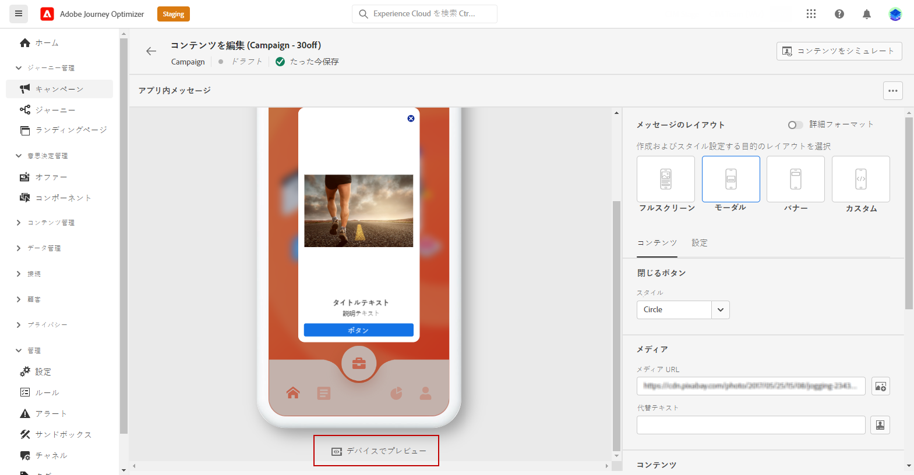

# アプリ内メッセージの作成  {#create-in-app}

>[!AVAILABILITY]
>
>アプリ内機能は現在、一部のユーザーのみを対象としたベータ版として利用できます。ベータ版プログラムに参加するには、アドビカスタマーケアにお問い合わせください。

## キャンペーンとアプリ内メッセージの作成{#create-in-app-in-a-campaign}

アプリ内メッセージを作成するには、次の手順に従います。

1. **[!UICONTROL キャンペーン]**&#x200B;メニューにアクセスし、「**[!UICONTROL キャンペーンを作成]**」をクリックします。

1. 「**[!UICONTROL プロパティ]**」セクションで、キャンペーンを実行するタイミングを指定します。

1. 「**[!UICONTROL アクション]**」セクションで、**[!UICONTROL アプリ内メッセージ]**&#x200B;と、アプリ内メッセージにあらかじめ設定されている&#x200B;**[!UICONTROL アプリサーフェス]**&#x200B;を選択します。次に、「**[!UICONTROL 作成]**」をクリックします。

   [アプリ内設定について詳しくはこちらを参照してください](inapp-configuration.md)。

   

1. 「**[!UICONTROL プロパティ]**」セクションで、キャンペーンの&#x200B;**[!UICONTROL タイトル]**&#x200B;と&#x200B;**[!UICONTROL 説明]**&#x200B;を編集します。

1. アプリ内メッセージにカスタムまたはコアのデータ使用状況ラベルを割り当てるには、「 **[!UICONTROL アクセスを管理]**. [詳細情報](../administration/object-based-access.md)。

1. 「**[!UICONTROL オーディエンスを選択]**」ボタンをクリックして、使用可能な Adobe Experience Platform セグメントのリストからターゲットオーディエンスを定義します。 [詳細情報](../segment/about-segments.md)。

   

1. 「**[!UICONTROL ID 名前空間]**」フィールドで、選択したセグメントから個人を識別するために使用する名前空間を選択します。[詳細情報](../event/about-creating.md#select-the-namespace)。

1. クリック **[!UICONTROL 編集トリガー]** メッセージをトリガーするイベントと条件を選択するには：

   1. クリック **[!UICONTROL 追加] 条件** 複数のイベントや条件をトリガーで考慮する場合。
   1. イベントのリンク方法を選択します。例えば、メッセージを表示するために「**両方**」のトリガーを true にする場合は「**[!UICONTROL および]**」を選択し、トリガーの「**どちらか**」が true の場合にメッセージを表示する場合は「**[!UICONTROL または]**」を選択します。
   1. クリック **[!UICONTROL グループ化]** を使用して、トリガーをグループ化します。

   

1. アプリ内メッセージがアクティブな場合のトリガーの頻度を選択します。

   * **[!UICONTROL 毎回]**:イベントが **[!UICONTROL モバイルアプリトリガー]** ドロップダウンが発生します。
   * **[!UICONTROL 1 回]**:このメッセージは、 **[!UICONTROL モバイルアプリトリガー]** ドロップダウンが発生します。
   * **[!UICONTROL クリックスルーまで]**:このメッセージを、 **[!UICONTROL モバイルアプリトリガー]** ドロップダウンは、SDK が「クリック済み」のアクションと共にインタラクションイベントを送信するまで発生します。
   * **[!UICONTROL X 回]**:このメッセージを X 回表示します。

1. 必要に応じて、選択します **[!UICONTROL 曜日]** または **[!UICONTROL 時刻]** アプリ内メッセージが表示されます。

1. キャンペーンは、特定の日付に実行するか、繰り返し頻度で実行するように設計されています。キャンペーンの&#x200B;**[!UICONTROL スケジュール]**&#x200B;を設定する方法については、[この節](../campaigns/create-campaign.md#schedule)を参照してください。

   

1. これで、「**[!UICONTROL コンテンツを編集]**」ボタンでコンテンツのデザインを開始できます。

   

## アプリ内メッセージの送信{#in-app-send}

### デバイスでのプレビュー {#preview-device}

特定のデバイスでアプリ内通知をプレビューできます。

1. 「**[!UICONTROL デバイスでプレビュー]**」をクリックします。

   

1. **[!UICONTROL デバイスに接続]**&#x200B;ウィンドウから、「**[!UICONTROL 開始]**」をクリックします。

1. アプリケーションの&#x200B;**[!UICONTROL ベース URL]** を入力し、「**[!UICONTROL 次へ]**」をクリックします。

   

1. デバイスで QR コードをスキャンし、表示された PIN コードを入力します。

アプリ内メッセージをデバイスで直接トリガーできるようになり、実際のデバイスでメッセージをプレビューし、レビューできます。

### アプリ内通知のレビューとアクティブ化{#in-app-review}

アプリ内メッセージを作成し、そのコンテンツを定義してパーソナライズしたら、そのメッセージをレビューしてアクティブ化できます。

手順は次のとおりです。

1. 「**[!UICONTROL アクティブ化するレビュー]**」ボタンを使用して、メッセージの概要を表示します。

   概要では、必要に応じてキャンペーンを変更し、パラメーターが正しくないか、または見つからないかを確認できます。

   

1. キャンペーンが正しく設定されていることを確認してから、「**[!UICONTROL アクティブ化]**」をクリックします。

これで、キャンペーンがアクティブ化されました。キャンペーンで設定されたアプリ内通知は、すぐに送信されるか、指定日に送信されます。

送信後は、キャンペーンレポートまたはジャーニーレポート内で、アプリ内メッセージの影響を測定できます。 レポートについて詳しくは、[この節](../reports/campaign-global-report.md#inapp-report)を参照してください。

**関連トピック：**

* [アプリ内メッセージのデザイン](design-in-app.md)
* [アプリ内レポート](../reports/campaign-global-report.md#inapp-report)
* [アプリ内設定](inapp-configuration.md)

## チュートリアルビデオ{#video}

以下のビデオでは、キャンペーンでアプリ内メッセージを作成、設定および公開する方法を示しています。

>[!VIDEO](https://video.tv.adobe.com/v/3410430?quality=12&learn=on)
