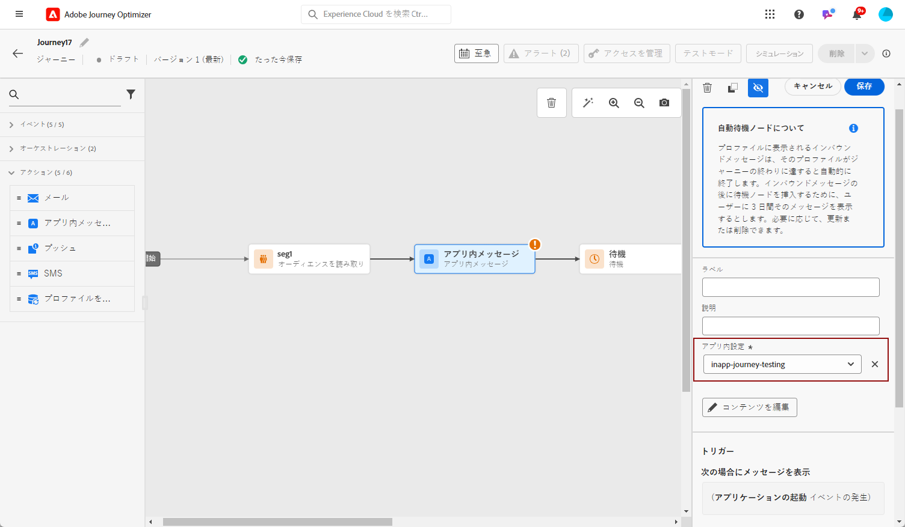
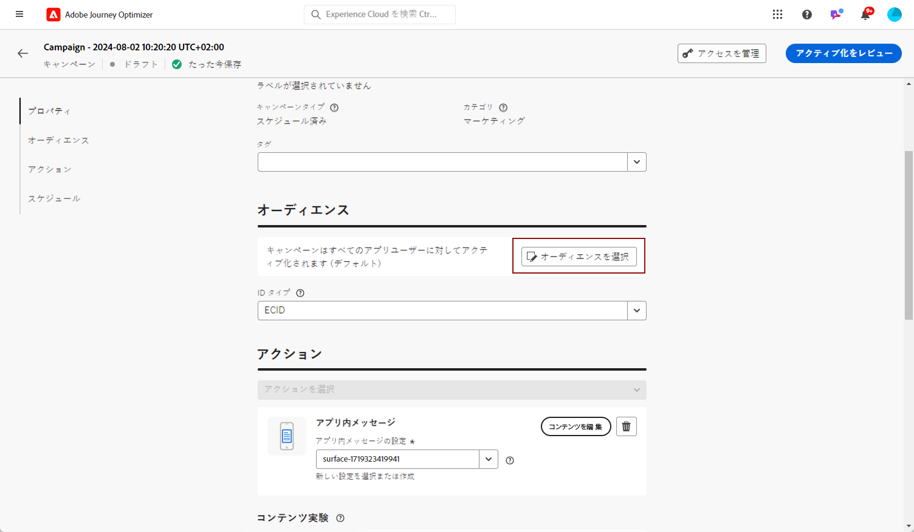
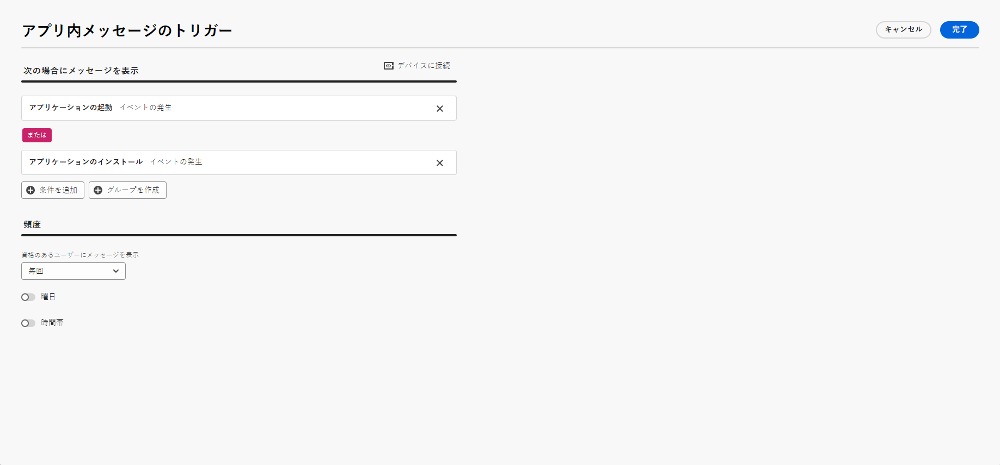
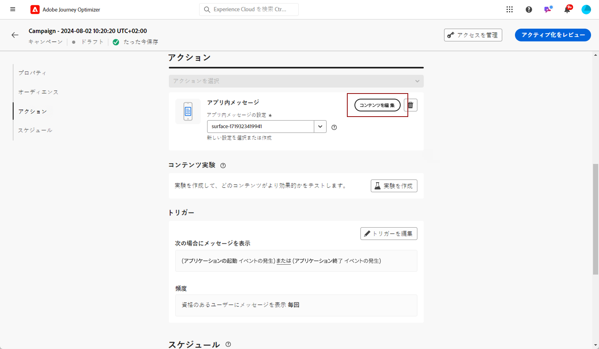

# アプリ内メッセージの作成  キャンペーン内 {#create-in-app}

<!--
>[!BEGINTABS]

>[!TAB Add an In-app message to a journey]

>[!AVAILABILITY]
>
>The In-app activity is currently available as a beta to select users only. To join the beta program, contact Adobe Customer Care.

1. Open your journey, then drag and drop an **[!UICONTROL In-app]** activity from the **[!UICONTROL Actions]** section of the palette.

    When a profile reaches the end of their journey, any in-app messages displayed to them will automatically expire. For that reason, a Wait activity is automatically added after your In-app activity to ensure proper timing.

    

1. Enter a **[!UICONTROL Label]** and **[!UICONTROL Description]** for your message.

1. Choose the [In-app surface](inapp-configuration.md) to use.

    

1. You can now start designing your content with the **[!UICONTROL Edit content]** button. [Learn more](design-in-app.md)

1. Click **[!UICONTROL Edit trigger]** to configure your Trigger. 

    

1. Choose the frequency of your trigger when your In-app message is active:

    * **[!UICONTROL Show every time]**: Always show the message when the events selected in the **[!UICONTROL Mobile app trigger]** drop-down occur.
    * **[!UICONTROL Show once]**: Only show this message the first time the events selected in the **[!UICONTROL Mobile app trigger]** drop-down occur.
    * **[!UICONTROL Show until click through]**: Show this message when the events selected in the **[!UICONTROL Mobile app trigger]** drop-down occur until an interact event is sent by the SDK with an action of "clicked".

1. From the **[!UICONTROL Mobile app trigger]** dropdown(s), choose the event(s) and criteria that will trigger your message:

    1. From the left drop-down, select the event required to trigger the message.
    1. From the right drop-down, select the validation required on the selected event.
    1. Click the **[!UICONTROL Add]** button if you want the trigger to consider multiple events or criteria. Then, repeat the steps above.
    1. Select how your events are linked, e.g. choose **[!UICONTROL And]** if you want **both** triggers to be true in order for a message to be shown or choose **[!UICONTROL Or]** if you want the message to be shown if **either** of the triggers are true.
    1. Click **[!UICONTROL Save]** when your Triggers have been configured.

    
    
1. If necessary, complete your journey flow by dragging and dropping additional actions or events. [Learn more](../building-journeys/about-journey-activities.md)

1. Once your In-app message is ready, finalize the configuration and publish your journey to activate it.

For more information on how to configure a journey, refer to [this page](../building-journeys/journey-gs.md).

>[!TAB Add an In-app message to a campaign]
-->

キャンペーンにアプリ内メッセージを追加するには、次の手順に従います。

1. **[!UICONTROL キャンペーン]**&#x200B;メニューにアクセスし、「**[!UICONTROL キャンペーンを作成]**」をクリックします。

1. 「**[!UICONTROL プロパティ]**」セクションで、キャンペーンの実行タイプ（スケジュール済みまたは API トリガー）を選択します。キャンペーンのタイプについて詳しくは、[このページ](../campaigns/create-campaign.md#campaigntype)を参照してください。

1. 「**[!UICONTROL アクション]**」セクションで、**[!UICONTROL アプリ内メッセージ]**&#x200B;と、アプリ内メッセージにあらかじめ設定されている&#x200B;**[!UICONTROL アプリサーフェス]**&#x200B;を選択します。次に、「**[!UICONTROL 作成]**」をクリックします。

   アプリ内設定について詳しくは、[このページ](inapp-configuration.md)を参照してください。

   

1. 「**[!UICONTROL プロパティ]**」セクションで、**[!UICONTROL タイトル]**&#x200B;と&#x200B;**[!UICONTROL 説明]**&#x200B;の説明を入力します。

1. カスタムまたはコアのデータ使用ラベルをアプリ内メッセージに割り当てるには、「**[!UICONTROL アクセスを管理]**」を選択します。[詳細情報](../administration/object-based-access.md)

1. 「**[!UICONTROL オーディエンスを選択]**」ボタンをクリックして、使用可能な Adobe Experience Platform オーディエンスのリストからターゲットオーディエンスを定義します。[詳細情報](../audience/about-audiences.md)

   

1. 「**[!UICONTROL ID 名前空間]**」フィールドで、選択したオーディエンスから個人を識別するために使用する名前空間を選択します。[詳細情報](../event/about-creating.md#select-the-namespace)

1. 「**[!UICONTROL 実験を作成]**」をクリックしてコンテンツ実験の設定を開始し、パフォーマンスを測定してターゲットオーディエンスに最適なオプションを特定するための処理を作成します。[詳細情報](../campaigns/content-experiment.md)

1. 「**[!UICONTROL トリガーを編集]**」をクリックして、メッセージをトリガーするイベントと条件を選択します。ルールビルダーを使用すると、条件と値を指定して、条件が満たされた場合にアプリ内メッセージの送信などの一連のアクションをトリガーできます。

   1. 必要に応じて、イベントのドロップダウンをクリックしてトリガーを変更します。

   1. トリガーで複数のイベントまたは条件を考慮する場合は、「**[!UICONTROL 条件を追加]**」をクリックします。

   1. **[!UICONTROL トリガー]**&#x200B;をさらに追加してルールをさらに拡張する場合は、**[!UICONTROL または]**&#x200B;条件を選択します。

      

   1. **[!UICONTROL 特性]**&#x200B;を追加してルールを微調整する場合は、**[!UICONTROL および]**&#x200B;条件を選択します。

      +++使用可能な特性についてはこちらを参照。

      | パッケージ | 特性 | 定義 |
      |---|---|---|
      | デバイス情報 | 通信事業者名 | リストに含まれる通信事業者名のいずれかに一致するとトリガーされます。 |
      | デバイス情報 | デバイス名 | デバイス名のいずれかに一致するとトリガーされます。 |
      | デバイス情報 | ロケール | リストに含まれる言語のいずれかに一致するとトリガーされます。 |
      | デバイス情報 | OS バージョン | 指定された OS バージョンのいずれかに一致するとトリガーされます。 |
      | デバイス情報 | 以前の OS バージョン | 指定された以前の OS バージョンのいずれかに一致するとトリガーされます。 |
      | デバイス情報 | 実行モード | 実行モードがアプリケーションまたは拡張機能の場合にトリガーされます。 |
      | アプリケーションライフサイクル | アプリ ID | 指定されたアプリ ID に一致するとトリガーされます。 |
      | アプリケーションライフサイクル | 曜日 | 指定された曜日に一致するとトリガーされます。 |
      | アプリケーションライフサイクル | 初回使用以降の日数 | 初回使用以降の指定された日数に一致するとトリガーされます。 |
      | アプリケーションライフサイクル | 前回使用以降の日数 | 前回使用以降の指定された日数に一致するとトリガーされます。 |
      | アプリケーションライフサイクル | アップグレード以降の日数 | 前回のアップグレード以降の指定された日数に一致するとトリガーされます。 |
      | アプリケーションライフサイクル | インストール日 | 指定されたインストール日に一致するとトリガーされます。 |
      | アプリケーションライフサイクル | 起動回数 | 指定された起動回数に一致するとトリガーされます。 |
      | アプリケーションライフサイクル | 時刻 | 指定された時刻に一致するとトリガーされます。 |
      | Places | 現在の POI | 指定された目標地点（POI）に顧客がエントリすると、Places SDK によってトリガーされます。 |
      | Places | 最後にエントリした POI | 顧客が最後にエントリした目標地点（POI）に応じて、Places SDK によってトリガーされます。 |
      | Places | 前回離脱した POI | 顧客が前回離脱した目標地点（POI）に応じて、Places SDK によってトリガーされます。 |

+++

      

   1. 「**[!UICONTROL グループを作成]**」をクリックして、トリガーをグループ化します。

1. アプリ内メッセージがアクティブとなっている場合のトリガーの頻度を選択します。次のオプションがあります。

   * **[!UICONTROL 毎回]**：**[!UICONTROL モバイルアプリトリガー]**&#x200B;ドロップダウンで選択したイベントが発生した場合に、常にメッセージを表示します。
   * **[!UICONTROL 1 度だけ]**：**[!UICONTROL モバイルアプリトリガー]**&#x200B;ドロップダウンで選択したイベントが初めて発生した場合にのみ、このメッセージを表示します。
   * **[!UICONTROL クリックスルーまで]**：**[!UICONTROL モバイルアプリトリガー]**&#x200B;ドロップダウンで選択したイベントが、「クリック」アクションで SDK によって操作イベントが送信されるまでに発生した場合に、このメッセージが表示されます。
   * **[!UICONTROL X 回]**：このメッセージを X 回表示します。

1. 必要に応じて、アプリ内メッセージを表示する&#x200B;**[!UICONTROL 曜日]**&#x200B;または&#x200B;**[!UICONTROL 時刻]**&#x200B;を選択します。

1. キャンペーンは、特定の日付に実行するか、繰り返し頻度で実行するように設計されています。キャンペーンの&#x200B;**[!UICONTROL スケジュール]**&#x200B;を設定する方法については、[この節](../campaigns/create-campaign.md#schedule)を参照してください。

   

1. これで、「**[!UICONTROL コンテンツを編集]**」ボタンでコンテンツのデザインを開始できます。[詳細情報](design-in-app.md)

   

<!--
>[!ENDTABS]
-->

## ハウツービデオ{#video}

* 以下のビデオでは、キャンペーンでアプリ内メッセージを作成、設定および公開する方法を示しています。

  >[!VIDEO](https://video.tv.adobe.com/v/3410430?quality=12&learn=on)

* 以下のビデオでは、アプリ内メッセージの A/B テストを行うためのコンテンツ実験を設定および分析する方法を示しています。

  >[!VIDEO](https://video.tv.adobe.com/v/3419898)

**関連トピック：**

* [アプリ内メッセージのデザイン](design-in-app.md)
* [アプリ内メッセージのテストおよび送信](send-in-app.md)
* [アプリ内レポート](../reports/campaign-global-report.md#inapp-report)
* [アプリ内設定](inapp-configuration.md)