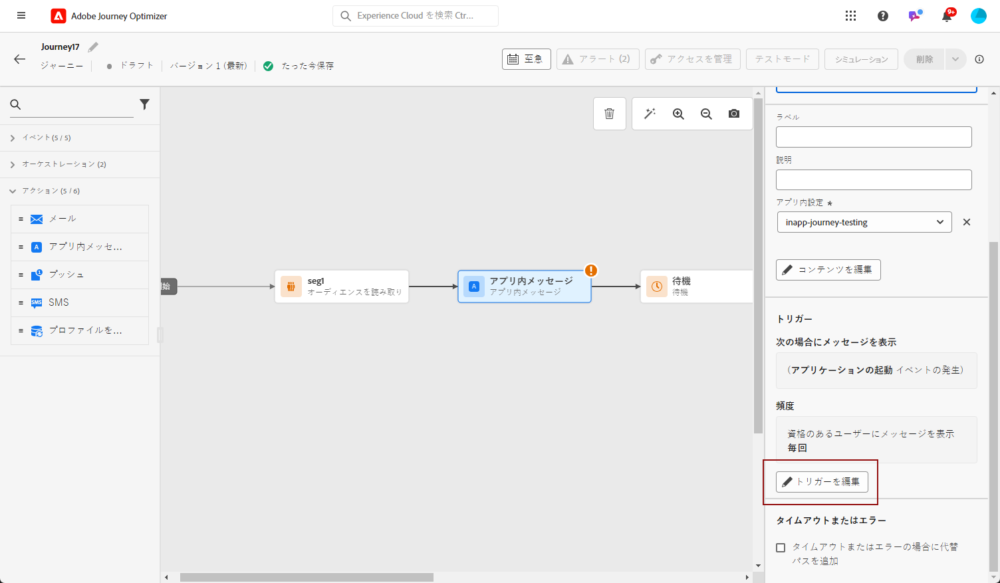
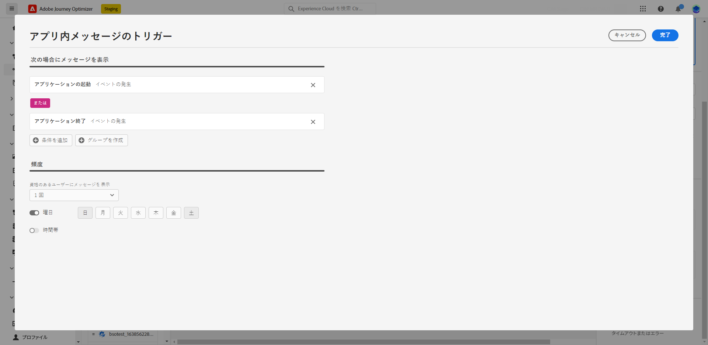
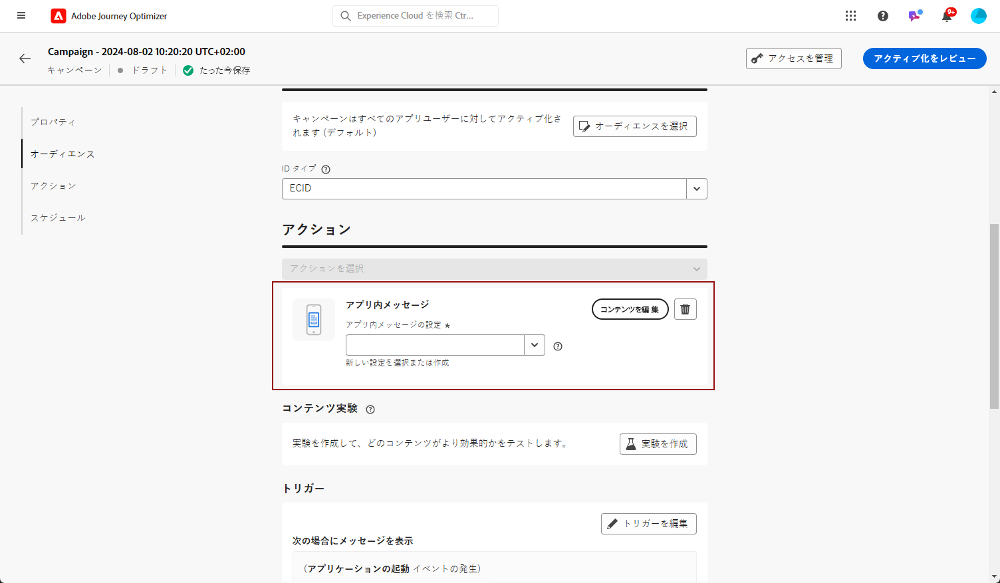
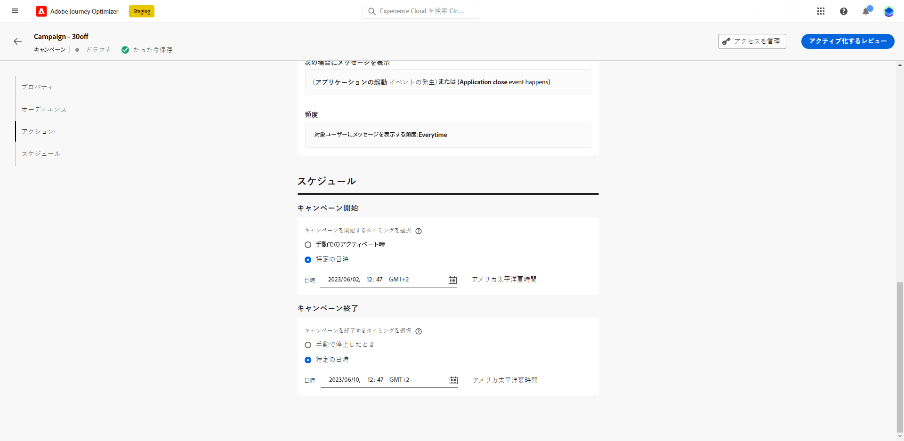

# アプリ内メッセージの作成  {#create-in-app}

アプリ内メッセージは、キャンペーンのコンテキストで作成されます。

>[!BEGINTABS]

>[!TAB ジャーニーへのアプリ内メッセージの追加]

>[!AVAILABILITY]
>
>アプリ内アクティビティは現在、一部のユーザーのみを対象としたベータ版として利用できます。ベータ版プログラムに参加するには、アドビカスタマーケアにお問い合わせください。

1. ジャーニーを開き、パレットの「**[!UICONTROL アクション]**」セクションから&#x200B;**[!UICONTROL アプリ内]**&#x200B;アクティビティをドラッグ＆ドロップします。

   プロファイルがジャーニーの終了に達すると、表示されたアプリ内メッセージは自動的に期限切れになります。そのため、適切なタイミングを確保するために、アプリ内アクティビティの後に待機アクティビティが自動的に追加されます。

   

1. メッセージの&#x200B;**[!UICONTROL ラベル]**&#x200B;と&#x200B;**[!UICONTROL 説明]**&#x200B;を入力します。

1. 使用する[アプリ内サーフェス](inapp-configuration.md)を選択します。

   

1. これで、「**[!UICONTROL コンテンツを編集]**」ボタンでコンテンツのデザインを開始できます。[詳細情報](design-in-app.md)

1. 「**[!UICONTROL トリガーを編集]**」をクリックして、トリガーを設定します。

   

1. アプリ内メッセージがアクティブな場合のトリガーの頻度を選択します。

   * **[!UICONTROL 毎回表示する]**：**[!UICONTROL モバイルアプリトリガー]**&#x200B;ドロップダウンで選択したイベントが発生した場合に、常にメッセージを表示します。
   * **[!UICONTROL 1 度だけ表示]**：**[!UICONTROL モバイルアプリトリガー]**&#x200B;ドロップダウンで選択したイベントが初めて発生した場合にのみ、このメッセージを表示します。
   * **[!UICONTROL クリックスルーまで表示]**：**[!UICONTROL モバイルアプリトリガー]**&#x200B;ドロップダウンで選択したイベントが、「クリック」アクションで SDK によって操作イベントが送信されるまでに発生した場合に、このメッセージが表示されます。

1. **[!UICONTROL モバイルアプリトリガー]**&#x200B;ドロップダウンから、メッセージをトリガーするイベントと条件を選択します。

   1. 左側のドロップダウンから、メッセージのトリガーに必要なイベントを選択します。
   1. 右側のドロップダウンから、選択したイベントに必要な検証を選択します。
   1. トリガーで複数のイベントまたは条件を考慮する場合は、「**[!UICONTROL 追加]**」ボタンをクリックします。次に、上記の手順を繰り返します。
   1. イベントのリンク方法を選択します。例えば、メッセージを表示するために「**両方**」のトリガーを true にする場合は「**[!UICONTROL および]**」を選択し、トリガーの「**どちらか**」が true の場合にメッセージを表示する場合は「**[!UICONTROL または]**」を選択します。
   1. トリガーが設定されたら、「**[!UICONTROL 保存]**」をクリックします。

   

1. 必要に応じて、追加のアクションまたはイベントをドラッグ＆ドロップして、ジャーニーフローを完了します。[詳細情報](../building-journeys/about-journey-activities.md)

1. アプリ内メッセージの準備が整ったら、設定を完了し、ジャーニーを公開してアクティブ化します。

ジャーニーの設定方法について詳しくは、[このページ](../building-journeys/journey-gs.md)を参照してください。

>[!TAB キャンペーンへのアプリ内メッセージの追加]

1. **[!UICONTROL キャンペーン]**&#x200B;メニューにアクセスし、「**[!UICONTROL キャンペーンを作成]**」をクリックします。

1. 「**[!UICONTROL プロパティ]**」セクションで、キャンペーンの実行タイプ（スケジュール済みまたは API トリガー）を選択します。キャンペーンのタイプについて詳しくは、[このページ](../campaigns/create-campaign.md#campaigntype)を参照してください。

1. 「**[!UICONTROL アクション]**」セクションで、**[!UICONTROL アプリ内メッセージ]**&#x200B;と、アプリ内メッセージにあらかじめ設定されている&#x200B;**[!UICONTROL アプリサーフェス]**&#x200B;を選択します。次に、「**[!UICONTROL 作成]**」をクリックします。

   アプリ内設定について詳しくは、[このページ](inapp-configuration.md)を参照してください。

   

1. 「**[!UICONTROL プロパティ]**」セクションで、**[!UICONTROL タイトル]**&#x200B;と&#x200B;**[!UICONTROL 説明]**&#x200B;の説明を入力します。

1. カスタムまたはコアのデータ使用ラベルをアプリ内メッセージに割り当てるには、「**[!UICONTROL アクセスを管理]**」を選択します。[詳細情報](../administration/object-based-access.md)。

1. 「**[!UICONTROL オーディエンスを選択]**」ボタンをクリックして、使用可能な Adobe Experience Platform セグメントのリストからターゲットオーディエンスを定義します。 [詳細情報](../segment/about-segments.md)。

   

1. 「**[!UICONTROL ID 名前空間]**」フィールドで、選択したセグメントから個人を識別するために使用する名前空間を選択します。[詳細情報](../event/about-creating.md#select-the-namespace)。

1. 「**[!UICONTROL トリガーを編集]**」をクリックして、メッセージをトリガーするイベントと条件を選択します。

   1. トリガーで複数のイベントまたは条件を考慮する場合は、「**条件を追加**」をクリックします。
   1. イベントのリンク方法を選択します。例えば、メッセージを表示するために&#x200B;**両方**&#x200B;のトリガーを true にする場合は「**[!UICONTROL および]**」を選択し、トリガーの&#x200B;**いずれか**&#x200B;が true の場合にメッセージを表示する場合は「**[!UICONTROL または]**」を選択します。
   1. 「**[!UICONTROL グループを作成]**」をクリックして、トリガーをグループ化します。

   

1. アプリ内メッセージがアクティブとなっている場合のトリガーの頻度を選択します。次のオプションがあります。

   * **[!UICONTROL 毎回]**：**[!UICONTROL モバイルアプリトリガー]**&#x200B;ドロップダウンで選択したイベントが発生した場合に、常にメッセージを表示します。
   * **[!UICONTROL 1 度だけ]**：**[!UICONTROL モバイルアプリトリガー]**&#x200B;ドロップダウンで選択したイベントが初めて発生した場合にのみ、このメッセージを表示します。
   * **[!UICONTROL クリックスルーまで]**：**[!UICONTROL モバイルアプリトリガー]**&#x200B;ドロップダウンで選択したイベントが、「クリック」アクションで SDK によって操作イベントが送信されるまでに発生した場合に、このメッセージが表示されます。
   * **[!UICONTROL X 回]**：このメッセージを X 回表示します。

1. 必要に応じて、アプリ内メッセージを表示する&#x200B;**[!UICONTROL 曜日]**&#x200B;または&#x200B;**[!UICONTROL 時刻]**&#x200B;を選択します。

1. キャンペーンは、特定の日付に実行するか、繰り返し頻度で実行するように設計されています。キャンペーンの&#x200B;**[!UICONTROL スケジュール]**&#x200B;を設定する方法については、[この節](../campaigns/create-campaign.md#schedule)を参照してください。

   

1. これで、「**[!UICONTROL コンテンツを編集]**」ボタンでコンテンツのデザインを開始できます。[詳細情報](design-in-app.md)

   

>[!ENDTABS]

## チュートリアルビデオ{#video}

以下のビデオでは、キャンペーンでアプリ内メッセージを作成、設定および公開する方法を示しています。

>[!VIDEO](https://video.tv.adobe.com/v/3410430?quality=12&learn=on)

**関連トピック：**

* [アプリ内メッセージのデザイン](design-in-app.md)
* [アプリ内メッセージのテストおよび送信](send-in-app.md)
* [アプリ内レポート](../reports/campaign-global-report.md#inapp-report)
* [アプリ内設定](inapp-configuration.md)