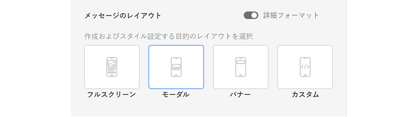
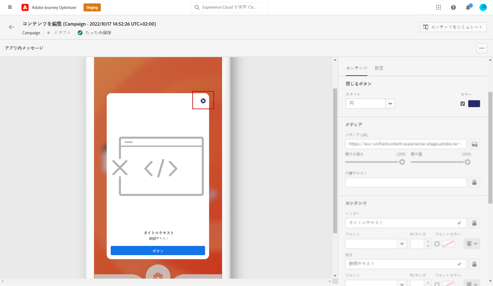
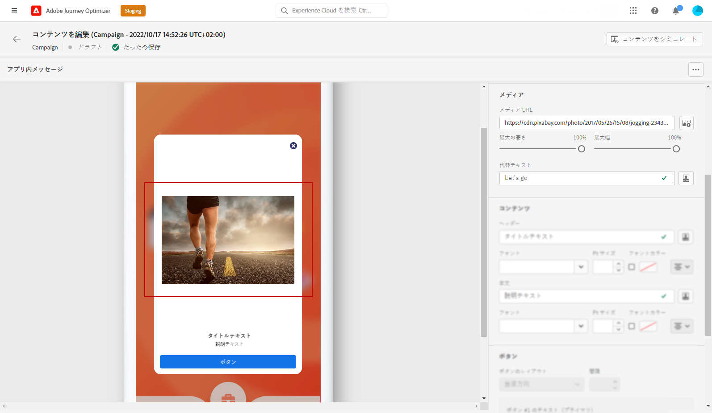
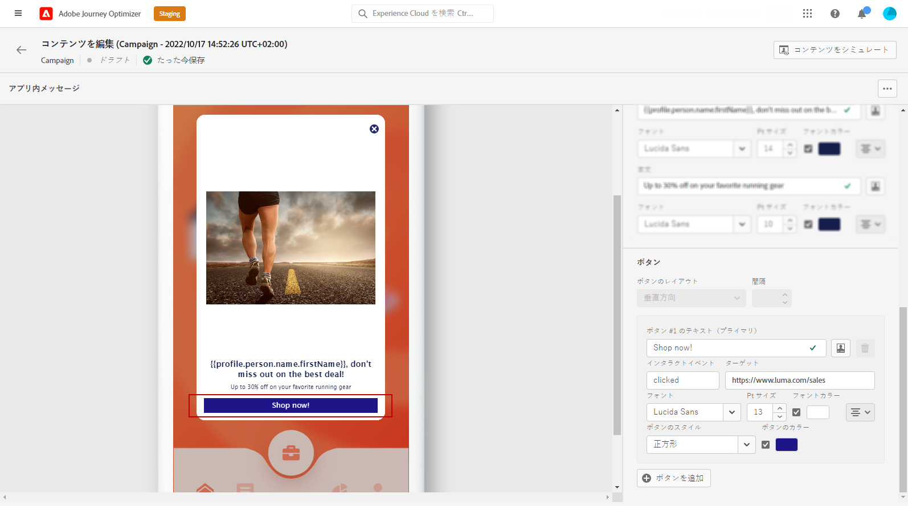
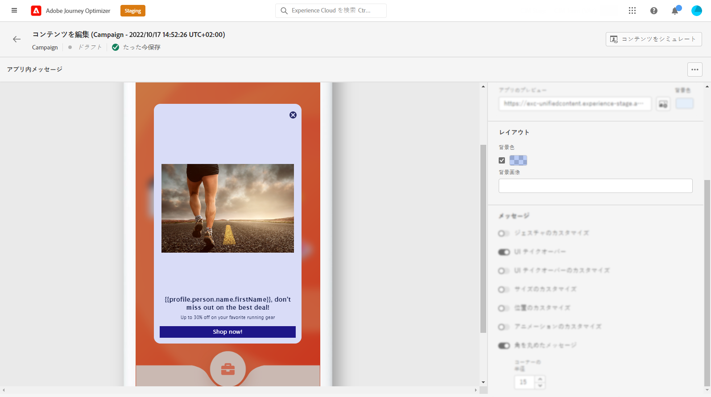
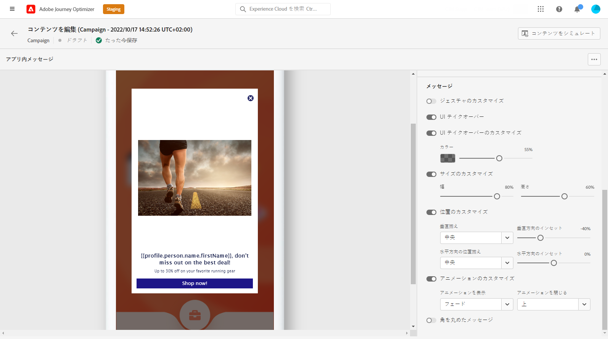

# アプリ内コンテンツのデザイン {#design-content}

アプリ内コンテンツを編集して、メッセージのレイアウトと表示、テキスト、ボタンのオプションなどのエクスペリエンスオプションを設定できます。

メッセージの内容を設定するには、 **[!UICONTROL コンテンツを編集]** ボタンをクリックし、画面の右側のセクションにあるオプションを使用して、アプリ内メッセージコンテンツをデザインします。

この **[!UICONTROL 詳細フォーマット]** 切り替えは、エクスペリエンスをカスタマイズする追加のオプションをアクティブにします。

アプリ内メッセージを作成し、そのコンテンツを定義してパーソナライズしたら、そのメッセージを確認してアクティブ化できます。 その後、キャンペーンスケジュールに従って通知が送信されます。 詳しくは、[このページ](create-in-app.md#in-app-send)を参照してください。

## メッセージのレイアウト {#message-layout}

次の **[!UICONTROL メッセージのレイアウト]** 「 」セクションで、メッセージングのニーズに応じて、4 つの異なるレイアウトオプションのいずれかを選択します。

* **[!UICONTROL 全画面表示]**:このタイプのレイアウトは、オーディエンスデバイスの画面全体に適用されます。

   メディア（画像、ビデオ）、テキストおよびボタンのコンポーネントをサポートします。

* **[!UICONTROL モーダル]**:このレイアウトは、大きなアラートスタイルのウィンドウに表示されます。アプリケーションはバックグラウンドに表示されます。

   メディア（画像、ビデオ）、テキストおよびボタンのコンポーネントをサポートします。

* **[!UICONTROL バナー]**:このタイプのレイアウトは、ネイティブの OS アラートメッセージとして表示されます。

   追加できるのは **[!UICONTROL ヘッダー]** および **[!UICONTROL 本文]** をメッセージに追加します。

* **[!UICONTROL カスタム]**:カスタムメッセージモードでは、事前設定済みのメッセージメッセージを 1 つ直接読み込んで編集することがHTMLできます。

   * 選択 **[!UICONTROL 作成]** をクリックして、rawHTMLコードを入力または貼り付けます。

      左側のパネルを使用して、Journey Optimizerのパーソナライゼーション機能を活用します。 詳しくは、[この節](../personalization/personalize.md)を参照してください。

   * 選択 **[!UICONTROL インポート]** をクリックして、HTMLコンテンツを含むHTMLまたは.zip ファイルを読み込みます。

## 「コンテンツ」タブ {#content-tab}

次の **コンテンツ** 「 」タブでは、次の項目を定義してパーソナライズできます。通知の内容と **閉じる** 」ボタンをクリックします。 また、アプリ内通知にメディアを追加したり、このタブからアクションボタンを追加したりできます。

### 閉じるボタン {#close-button}

を選択します。 **[!UICONTROL スタイル]** の **[!UICONTROL 閉じるボタン]**.

使用可能なスタイルは次のとおりです。

* **[!UICONTROL シンプル]**
* **[!UICONTROL 円]**
* **[!UICONTROL カスタム画像]** を Media URL またはアセットから削除します。

+++詳細書式設定のその他のオプション

この **[!UICONTROL 詳細書式設定モード]** がオンになっている場合は、 **[!UICONTROL カラー]** オプションを使用して、ボタンの色と不透明度を選択します。

+++

### メディア {#add-media}

この **[!UICONTROL メディア]** 「 」フィールドを使用すると、アプリ内メッセージにメディアを追加して、エンドユーザーにとって魅力的なエクスペリエンスを作成できます。

メディア URL を入力するか、 **[!UICONTROL アセットを選択]** アイコンを使用して、Assets ライブラリに保存されているアセットをアプリ内メッセージに直接追加できます。 [アセット管理の詳細情報](../design/assets-essentials.md)。また、 **[!UICONTROL 代替テキスト]** 画面読み上げアプリケーション用

+++詳細書式設定のその他のオプション

この **[!UICONTROL 詳細書式設定モード]** がオンになっている場合は、 **[!UICONTROL 最大高さ]** および **[!UICONTROL 最大幅]** メディアの

+++

### ヘッダーと本文 {#title-body}

メッセージを作成するには、 **[!UICONTROL ヘッダー]** および **[!UICONTROL 本文]** フィールド。

以下を使用： **[!UICONTROL パーソナライズ]** アイコンを使用してパーソナライゼーションを追加します。 パーソナライゼーションの詳細については、Adobe Journey Optimizer式エディターを参照してください [この節](../personalization/personalize.md).

+++詳細書式設定のその他のオプション

この **[!UICONTROL 詳細書式設定モード]** がオンになっている場合は、 **[!UICONTROL ヘッダー]** および **[!UICONTROL 本文]**:

* の **[!UICONTROL フォント]**
* の **[!UICONTROL Pt サイズ]**
* の **[!UICONTROL フォントカラー]**
* の **[!UICONTROL 整列]**
+++

### ボタン {#add-buttons}

ユーザーがアプリ内メッセージを操作するためのボタンを追加します。

ボタンをパーソナライズするには：

1. 「ボタン#1 」テキスト（プライマリ）フィールドを編集します。 また、 **[!UICONTROL パーソナライズ]** アイコンを使用して、コンテンツとパーソナライゼーションデータを定義します。

1. 選択 **[!UICONTROL Interact イベント]** これは、ユーザーが操作した後のボタンのアクションを定義します。

1. Web URL またはディープリンクを **[!UICONTROL ターゲット]** フィールドに入力します。

1. 複数のボタンを追加するには、 **[!UICONTROL 追加ボタン]**.

+++詳細書式設定のその他のオプション

この **[!UICONTROL 詳細書式設定モード]** がオンになっている場合は、 **[!UICONTROL ボタン]**:

* の **[!UICONTROL フォント]**
* の **[!UICONTROL Pt サイズ]**
* の **[!UICONTROL フォントカラー]**
* の **[!UICONTROL 整列]**
* の **[!UICONTROL ボタンのスタイル]**
* の **[!UICONTROL 半径]**
* の **[!UICONTROL ボタンの色]**

+++

## 「設定」タブ {#settings-tab}

次の **設定** 「 」タブで、メッセージのレイアウトを定義し、アプリ内メッセージをプレビューできます。 また、詳細な書式設定オプションにアクセスすることもできます。

### プレビュー {#preview-tab}

この **[!UICONTROL アプリのプレビュー]** アプリ内メッセージの背景を追加できます。

* URL リンクからのメディア。

* Assets ライブラリ内のアセット。

* 背景色。

### レイアウト {#layout-options}

この **[!UICONTROL 背景画像]** フィールドを使用して、アプリ内メッセージに背景を追加できます。

* URL リンクからのメディア。

* 背景色。

### メッセージ {#message-tab}

デフォルトで有効になっている「 UI テイクオーバー」オプションを使用すると、アプリ内メッセージの背景を暗くして、コンテンツに焦点を合わせることができます。

+++詳細書式設定のその他のオプション

この **[!UICONTROL 詳細書式設定モード]** がオンになっている場合は、次のオプションを使用して、メッセージをさらにパーソナライズできます。

* **[!UICONTROL ジェスチャーをカスタマイズ]**:では、ユーザスワイプの操作をカスタマイズできます。 dismis を選択した場合、カスタムインタラクションイベントやターゲットの宛先を追加できます。

* **[!UICONTROL UI テイクオーバーのカスタマイズ]**:背景に表示する色とその不透明度を選択できます。

* **[!UICONTROL サイズをカスタマイズ]**:では、アプリ内通知の幅と高さを調整できます。

* **[!UICONTROL 位置をカスタマイズ]**:では、ユーザーの画面でのアプリ内メッセージの位置をカスタマイズできます。 垂直および水平の位置は変更できます。

* **[!UICONTROL アニメーションをカスタマイズ]**:を使用すると、アプリ内通知がユーザーのデバイスの左または上から表示される場合など、表示と解除のアニメーションをカスタマイズできます。

* **[!UICONTROL メッセージの丸い角]**:を使用すると、 **[!UICONTROL 角丸の半径]**.

+++

**関連トピック：**

* [アプリ内メッセージの作成](create-in-app.md)
* [アプリ内レポート](inapp-report.md)
* [アプリ内設定](inapp-configuration.md)

