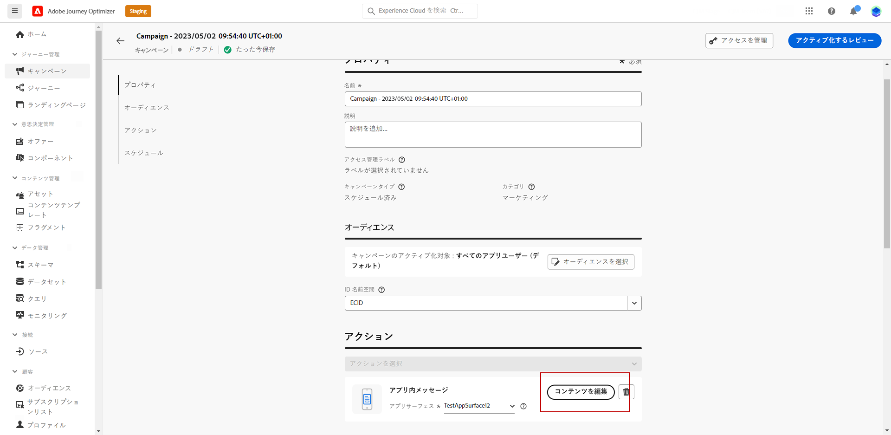

# アプリ内コンテンツのデザイン {#design-content}

アプリ内コンテンツを編集して、メッセージのレイアウトと表示、テキスト、ボタンの各オプションを含むエクスペリエンスのオプションを設定することができます。

メッセージコンテンツを設定するには、ボタンをクリック **[!UICONTROL Edit content]** し、画面の右側にあるオプションを使用して、アプリ内メッセージコンテンツをデザインします。

**[!UICONTROL Advanced formatting]**&#x200B;このオプションを選択すると、操作性がカスタマイズされます。

アプリ内メッセージとそのコンテンツが定義され、カスタマイズされた後で、メッセージを確認し、アクティブ化することができます。 通知は、キャンペーンのスケジュールに従って送信されます。 詳しくは、このページ ](create-in-app.md#in-app-send) を [ 参照してください。

## メッセージレイアウト {#message-layout}

**[!UICONTROL Message Layout]**&#x200B;セクションで、メッセージの必要に応じて、4種類のレイアウトオプションのいずれかを選択します。

* **[!UICONTROL Fullscreen]**: この種類のレイアウトは、対象ユーザー向けデバイスの画面全体に適用されます。

   これにより、メディア (イメージ、ビデオ)、テキストコンポーネント、ボタンコンポーネントをサポートしています。

* **[!UICONTROL Modal]**: 大きなアラートスタイルウィンドウにこのレイアウトが表示されても、アプリケーションはバックグラウンドで表示されたままになります。

   これにより、メディア (イメージ、ビデオ)、テキストコンポーネント、ボタンコンポーネントをサポートしています。

* **[!UICONTROL Banner]**: この種類のレイアウトは、ネイティブ OS 警告メッセージとして表示されます。

   メッセージに追加 **[!UICONTROL Header]** できるのは、と **[!UICONTROL Body]** a のみです。

* **[!UICONTROL Custom]**「カスタムメッセージ」モードを使用すると、事前に設定された HTML メッセージの1つを直接読み込み、編集することができます。

   * このオプションを選択 **[!UICONTROL Compose]** すると、未処理の HTML コードを入力またはペーストすることができます。

      左側のペインを使用して、旅のオプティマイザーのパーソナライズ機能を活用してください。 詳細については、ここ ](../personalization/personalize.md) を [ 参照してください。

   * このオプションを選択 **[!UICONTROL Import]** すると、html コンテンツを含む html ファイルまたは .zip ファイルがインポートされます。

## 「コンテンツ」タブ {#content-tab}

**「コンテンツ** 」タブでは、通知のコンテンツと「閉じる **」ボタンの** スタイルを定義してカスタマイズできます。アプリ内通知にメディアを追加したり、このタブからアクションボタンを追加したりすることもできます。

### 「閉じる」ボタン {#close-button}

**[!UICONTROL Style]**「」の **[!UICONTROL Close button]** を選択します。

使用可能なスタイルは、次のとおりです。

* **[!UICONTROL Simple]**
* **[!UICONTROL Circle]**
* **[!UICONTROL Custom image]** メディア URL またはアセット

詳細な書式設定を使用したその他のオプション

**[!UICONTROL Advanced formatting mode]**&#x200B;がオンの場合は、ボタンのカラーと不透明度を選択するオプションをオン **[!UICONTROL Color]** にできます。

+++

### メディア {#add-media}

このフィールドを使用して、 **[!UICONTROL Media]** メディアをアプリ内メッセージに追加することで、エンドユーザーに魅力的なエクスペリエンスを作成できます。

メディアの URL を入力するか、 **[!UICONTROL Select Assets]** アイコンをクリックして、アセットライブラリに保存されているアセットをアプリ内メッセージに直接追加します。 [アセットの管理 ](../email/assets-essentials.md) について詳しく説明します。「スクリーンを読む」アプリケーションを追加 **[!UICONTROL Alternative text]** することもできます。

詳細な書式設定を使用したその他のオプション

**[!UICONTROL Advanced formatting mode]**&#x200B;がオンになっている場合は、メディアのおよび **[!UICONTROL Max width]** をカスタマイズ **[!UICONTROL Max height]** することができます。

+++

### ヘッダーと本文 {#title-body}

メッセージを作成するには、「」フィールドと **[!UICONTROL Body]** 「」フィールドに **[!UICONTROL Header]** コンテンツを入力します。

このアイコンを使用して、 **[!UICONTROL Personalization]** パーソナライズを追加します。 この節 ](../personalization/personalize.md) では、Adobe の旅のオプティマイザー式エディター [ のパーソナル化について詳しく説明します。

詳細な書式設定を使用したその他のオプション

**[!UICONTROL Advanced formatting mode]**&#x200B;がオンになっている場合は、および **[!UICONTROL Body]** 次のいずれかの **[!UICONTROL Header]** オプションを選択できます。

* 、 **[!UICONTROL Font]**
* 、 **[!UICONTROL Pt size]**
* 、 **[!UICONTROL Font Color]**
* 、 **[!UICONTROL Alignment]**
+++

### ボタン {#add-buttons}

アプリ内メッセージの操作に使用するボタンを追加します。

ボタンをカスタマイズするには、次のようにします。

1. ボタン #1 テキスト (第 1) フィールドを編集します。 また、 **[!UICONTROL Personalization]** このアイコンを使用してコンテンツとパーソナル化データを定義することもできます。

1. **[!UICONTROL Interact event]**&#x200B;ユーザーが操作を行った後にボタンの動作を定義するを選択します。

1. フィールドに **[!UICONTROL Target]** WEB URL またはディープリンクを入力します。

1. 複数のボタンを追加するには、をクリック **[!UICONTROL Add button]** します。

詳細な書式設定を使用したその他のオプション

**[!UICONTROL Advanced formatting mode]**&#x200B;がオンになっている場合は、次のいずれかの **[!UICONTROL Buttons]** オプションを選択できます。

* 、 **[!UICONTROL Font]**
* 、 **[!UICONTROL Pt size]**
* 、 **[!UICONTROL Font Color]**
* 、 **[!UICONTROL Alignment]**
* 、 **[!UICONTROL Button style]**
* 、 **[!UICONTROL Radius]**
* 、 **[!UICONTROL Button color]**

+++

## 「設定」タブ {#settings-tab}

**「設定** 」タブでは、メッセージのレイアウトを定義し、アプリ内メッセージをプレビューすることができます。また、詳細なフォーマットオプションを選択することもできます。

### プレビュー {#preview-tab}

を使用すると、 **[!UICONTROL App Preview]** アプリ内メッセージの後ろに背景を追加できます。

* URL リンクによって作成されたメディアを指定します。

* アセットライブラリのアセットです。

* 背景色を設定します。

### Dtp {#layout-options}

**[!UICONTROL Background image]**&#x200B;次のフィールドを使用して、アプリ内メッセージに背景を追加することができます。

* URL リンクによって作成されたメディアを指定します。

* 背景色を設定します。

### メッセージ {#message-tab}

「UI の引き継ぎ」オプションは、初期設定で有効になっています。これを使用すると、アプリ内メッセージの背景を暗くして、コンテンツを中心に表示させることができます。

詳細な書式設定を使用したその他のオプション

**[!UICONTROL Advanced formatting mode]**&#x200B;に切り替えた場合は、次のオプションを使用してメッセージをカスタマイズすることができます。

* **[!UICONTROL Customize gestures]**: ユーザーのスワイプ操作がどのようになるかをカスタマイズすることができます。 「閉じる」が選択されている場合は、インタラクティブイベントやターゲットの設定を追加できます。

* **[!UICONTROL Customize UI takeover]**: 背景とその不透明度に表示するカラーを選択できます。

* **[!UICONTROL Customize size]**: アプリ内の通知の幅と高さを調整することができます。

* **[!UICONTROL Customize position]**&#x200B;次の操作を行います。ユーザーの画面上でのアプリ内メッセージの位置をカスタマイズすることができます。 このような場合は、縦方向と横方向の整列を変更することができます。

* **[!UICONTROL Customize animation]**: アプリケーション内通知がユーザーのデバイスの左側または上部に表示される場合など、アニメーションを終了するかどうかを設定することができます。

* **[!UICONTROL Message round corner]**: を変更することによって、 **[!UICONTROL Corner radius]** アプリ内通知にラウンドコーナーを追加することができます。

+++

**関連トピック:**

* [アプリ内メッセージの作成](create-in-app.md)
* [アプリ内レポート](inapp-report.md)
* [アプリ内設定](inapp-configuration.md)
