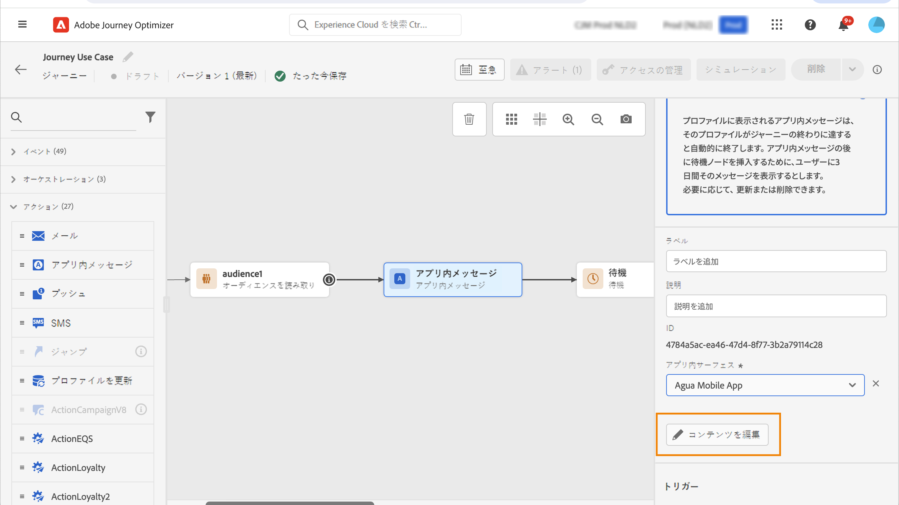
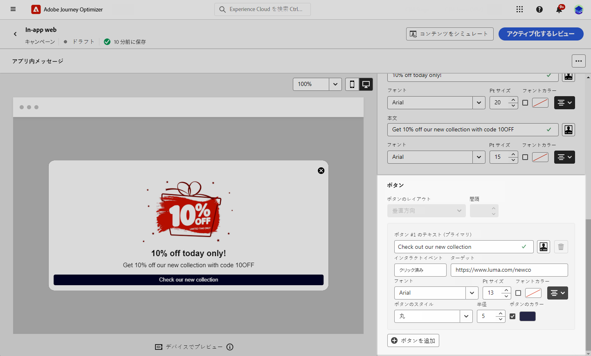
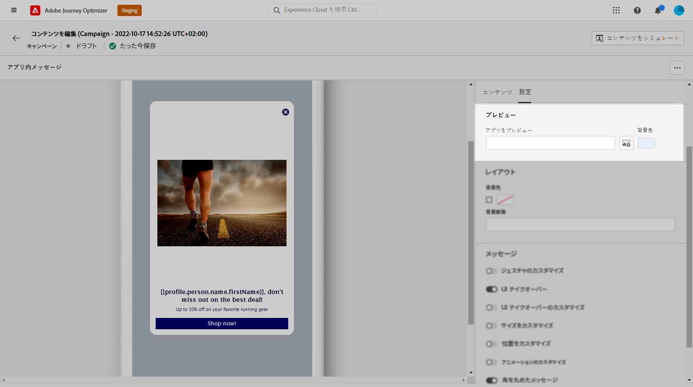

# アプリ内コンテンツのデザイン {#design-content}

>[!CONTEXTUALHELP]
>id="ajo_campaigns_inapp_content"
>title="アプリ内コンテンツの定義"
>abstract="アプリ内メッセージのコンテンツとスタイルをカスタマイズします。また、メディアやアクションボタンを追加して、メッセージをより魅力的で効果的にすることもできます。"

アプリ内コンテンツを編集して、エクスペリエンスオプションを設定できます。

* **[!UICONTROL Campaign]** で、**[!UICONTROL アクション]**&#x200B;メニューからメッセージコンテンツを設定するには、「**[!UICONTROL コンテンツを編集]**」ボタンをクリックします。

  

* **[!UICONTROL ジャーニー]**&#x200B;では、アプリ内&#x200B;**[!UICONTROL アクション]**&#x200B;の詳細メニューから、「**[!UICONTROL コンテンツを編集]**」ボタンを使用してコンテンツのデザインを開始できます。

  

**[!UICONTROL 詳細フォーマット]**&#x200B;の切り替えにより、エクスペリエンスをカスタマイズするための追加オプションがアクティブになります。

アプリ内メッセージを作成し、そのコンテンツを定義してパーソナライズしたら、そのメッセージをレビューしてアクティブ化できます。その後、キャンペーンスケジュールに従って通知が送信されます。詳しくは、[このページ](send-in-app.md)を参照してください。

## メッセージのレイアウト {#message-layout}

>[!CONTEXTUALHELP]
>id="ajo_campaigns_inapp_authoring_message_layout"
>title="アプリ内コンテンツの定義"
>abstract="メッセージレイアウトには、メッセージの枠を組むための一般的に使用されるテンプレートが用意されています。カスタムレイアウトには、カスタム HTML メッセージをアップロードまたは作成するためのオプションが用意されています。"

「**[!UICONTROL メッセージレイアウト]**」セクションから、メッセージのニーズに応じて、4 つの異なるレイアウトオプションのいずれかを選択します。

* **[!UICONTROL 全画面表示]**：このタイプのレイアウトは、オーディエンスデバイスの画面全体に適用されます。

  メディア（画像、ビデオ）、テキストおよびボタンのコンポーネントをサポートします。

* **[!UICONTROL モーダル]**：このレイアウトは、大きなアラートスタイルのウィンドウに表示されます。アプリケーションはバックグラウンドに表示されます。

  メディア（画像、ビデオ）、テキストおよびボタンのコンポーネントをサポートします。

* **[!UICONTROL バナー]**：このタイプのレイアウトは、ネイティブの OS アラートメッセージとして表示されます。

  **[!UICONTROL ヘッダー]**&#x200B;と&#x200B;**[!UICONTROL 本文]**&#x200B;のみをメッセージに追加できます。

* **[!UICONTROL カスタム]**：カスタムメッセージモードでは、事前設定された HTML メッセージの 1 つを直接読み込んで編集できます。

   * 「**[!UICONTROL 作成]**」を選択して、Raw HTML コードを入力または貼り付けます。

     左側のパネルを使用して、Journey Optimizer パーソナライゼーション機能を利用します。詳しくは、[この節](../personalization/personalize.md)を参照してください。

   * 「**[!UICONTROL 読み込み]**」を選択して、HTML コンテンツを含む HTML または .zip ファイルを読み込みます。

## 「コンテンツ」タブ {#content-tab}

「**コンテンツ**」タブから、通知のコンテンツと「**閉じる**」ボタンのスタイルを定義してパーソナライズできます。また、アプリ内通知にメディアを追加したり、このタブからアクションボタンを追加したりできます。

### 「閉じる」ボタン {#close-button}

>[!CONTEXTUALHELP]
>id="ajo_campaigns_inapp_authoring_close"
>title="「閉じる」ボタンのスタイルを選択します。"
>abstract="「閉じる」ボタンのセクションには、メッセージの閉じるボタンのバリエーションを選択するオプションと、カスタム画像をアップロードするオプションが表示されます。"

**[!UICONTROL 「閉じる」ボタン]**&#x200B;の&#x200B;**[!UICONTROL スタイル]**&#x200B;を選択します。

使用可能なスタイルは次のとおりです。

* **[!UICONTROL シンプル]**
* **[!UICONTROL 円]**
* **[!UICONTROL カスタム画像]**：メディア URL またはアセットから。

+++詳細フォーマットを使用したその他のオプション

**[!UICONTROL 詳細フォーマットモード]**&#x200B;がオンになっている場合は、「**[!UICONTROL カラー]**」オプションをチェックして、ボタンのカラーと不透明度を選択できます。

+++

### メディア {#add-media}

>[!CONTEXTUALHELP]
>id="ajo_campaigns_inapp_authoring_media"
>title="アプリ内メッセージにメディアを追加して、エンドユーザーにとって魅力的なエクスペリエンスを作成します。"
>abstract="コンテンツへの直接リンクを提供するか、アセットセレクターを使用して Asset Essentials でメディアを選択し、メッセージに追加します。"

「**[!UICONTROL メディア]**」フィールドを使用すると、アプリ内メッセージにメディアを追加して、エンドユーザーにとって魅力的なエクスペリエンスを作成できます。

メディア URL を入力するか、「**[!UICONTROL アセットを選択]**」アイコンをクリックして、アセットライブラリに保存されているアセットをアプリ内メッセージに直接追加します。[アセット管理の詳細情報](../integrations/assets.md)。画面読み上げアプリケーション用の&#x200B;**[!UICONTROL 代替テキスト]**&#x200B;を追加することもできます。

+++詳細フォーマットを使用したその他のオプション

**[!UICONTROL 詳細フォーマットモード]**&#x200B;がオンになっている場合、メディアの&#x200B;**[!UICONTROL 最大の高さ]**&#x200B;と&#x200B;**[!UICONTROL 最大幅]**&#x200B;をカスタマイズできます。

+++

### コンテンツ {#title-body}

>[!CONTEXTUALHELP]
>id="ajo_campaigns_inapp_authoring_content"
>title="メッセージを作成するには、「ヘッダー」フィールドと「本文」フィールドにコンテンツを入力します。"
>abstract="ヘッダーと本文の両方をここに追加できます。パーソナライゼーショントークンを含めるには、パーソナライゼーションダイアログを開きます。"

メッセージを作成するには、「**[!UICONTROL ヘッダー]**」フィールドと「**[!UICONTROL 本文]**」フィールドにコンテンツを入力します。

「**[!UICONTROL パーソナライゼーション]**」アイコンを使用してパーソナライゼーションを追加します。Adobe Journey Optimizer パーソナライゼーションエディターでのパーソナライゼーションについて詳しくは、[この節](../personalization/personalize.md)を参照してください。

+++詳細フォーマットを使用したその他のオプション

**[!UICONTROL 詳細フォーマットモード]**&#x200B;がオンになっている場合は、**[!UICONTROL ヘッダー]**&#x200B;と&#x200B;**[!UICONTROL 本文]**&#x200B;を選択できます。

* **[!UICONTROL フォント]**
* **[!UICONTROL Pt サイズ]**
* **[!UICONTROL フォントカラー]**
* **[!UICONTROL 整列]**
+++

### ボタン {#add-buttons}

>[!CONTEXTUALHELP]
>id="ajo_campaigns_inapp_authoring_buttons"
>title="ユーザーがアプリ内メッセージを操作するためのボタンを追加します。"
>abstract="このセクションでは、コールトゥアクションボタンをメッセージに追加できます。各ボタンにカスタムテキストとターゲットを含めることができます。"

ユーザーがアプリ内メッセージを操作するためのボタンを追加します。

ボタンをパーソナライズするには：

1. 「ボタン #1」テキスト（プライマリ）フィールドを編集します。また、**[!UICONTROL パーソナライゼーション]**&#x200B;アイコンを使用して、コンテンツとパーソナライゼーションデータを定義することもできます。

1. ユーザーが操作した後のボタンのアクションを定義する「**[!UICONTROL インタラクトイベント]**」を選択します。

1. Web URL またはディープリンクを「**[!UICONTROL ターゲット]**」フィールドに入力します。

1. 複数のボタンを追加するには、「**[!UICONTROL ボタンを追加]**」をクリックします。

+++詳細フォーマットを使用したその他のオプション

**[!UICONTROL 詳細フォーマットモード]**&#x200B;がオンになっている場合は、**[!UICONTROL ボタン]**&#x200B;の次のオプションを選択できます。

* **[!UICONTROL フォント]**
* **[!UICONTROL Pt サイズ]**
* **[!UICONTROL フォントカラー]**
* **[!UICONTROL 整列]**
* **[!UICONTROL ボタンのスタイル]**
* **[!UICONTROL 半径]**
* **[!UICONTROL ボタンのカラー]**

+++

## 「設定」タブ {#settings-tab}

「**設定**」タブでは、メッセージのレイアウトを定義し、アプリ内メッセージをプレビューできます。また、詳細フォーマットオプションにアクセスすることもできます。

### プレビュー {#preview-tab}

>[!CONTEXTUALHELP]
>id="ajo_campaigns_inapp_authoring_preview"
>title="アプリ内メッセージをプレビューします。"
>abstract="これは、メッセージをデバイスのメッセージ概要に送信する際に表示されるプレビュー画像です。"

>[!NOTE]
>
>プレビューは、モバイルアプリ内メッセージでのみ使用できます。

「**[!UICONTROL アプリのプレビュー]**」を使用すると、アプリ内メッセージに次の背景を追加できます。

* URL リンクからのメディア。

* アセットライブラリ内のアセット。

* 背景色。

### レイアウト {#layout-options}

>[!CONTEXTUALHELP]
>id="ajo_campaigns_inapp_authoring_layout"
>title="アプリ内メッセージのメッセージレイアウトを定義します。"
>abstract="このセクションでは、アプリ内メッセージに背景を追加できます。これには、UI テイクオーバーを有効にする必要があります。"

「**[!UICONTROL 背景画像]**」フィールドを使用すると、アプリ内メッセージに次の背景を追加できます。

* URL リンクからのメディア。

* 背景色。

### メッセージ {#message-tab}

>[!CONTEXTUALHELP]
>id="ajo_campaigns_inapp_authoring_message_advanced"
>title="メッセージの詳細設定を定義します。"
>abstract="このセクションでは、特に詳細フォーマットが有効になっている場合に、アプリ内コンテンツのパーソナライゼーションを強化できます。"

デフォルトで有効になっている「UI テイクオーバー」オプションを使用すると、アプリ内メッセージの背景を暗くして、コンテンツへのフォーカスを強調することができます。

+++詳細フォーマットを使用したその他のオプション

**[!UICONTROL 詳細フォーマットモード]**&#x200B;がオンの場合は、次のオプションを使用して、メッセージをさらにパーソナライズできます。

* **[!UICONTROL ジェスチャのカスタマイズ]**：ユーザーのスワイプ操作をカスタマイズできます。解除を選択した場合、カスタムインタラクトイベントやターゲット宛先を追加できます。

* **[!UICONTROL UI テイクオーバーのカスタマイズ]**：背景に表示するカラーとその不透明度を選択できます。

* **[!UICONTROL サイズのカスタマイズ]**：アプリ内通知の幅と高さを調整できます。

* **[!UICONTROL 位置のカスタマイズ]**：ユーザーの画面でのアプリ内メッセージの位置をカスタマイズできます。垂直方向と水平方向の配置を変更できます。

* **[!UICONTROL アニメーションのカスタマイズ]**：アプリ内通知がユーザーのデバイスの左または上から表示される場合など、表示と解除のアニメーションをカスタマイズできます。

* **[!UICONTROL メッセージの角丸]**：**[!UICONTROL コーナーの半径]**&#x200B;を変更することで、アプリ内通知のコーナーに角丸を追加できます。

+++

## 「データ」タブ {#data-tab}

「**データ**」タブから、**[!UICONTROL キー]** と&#x200B;**[!UICONTROL 値]**&#x200B;を定義して、ペイロードにカスタム変数を含めることができます。これらのキーと値のペアを使用すると、特定の設定に応じて、追加のデータを渡すことができます。

詳しくは、[開発者用ドキュメント](https://developer.adobe.com/client-sdks/edge/adobe-journey-optimizer/in-app-message/tutorials/messaging-metadata/)を参照してください。

1. 「**[!UICONTROL データ]**」タブから、「**[!UICONTROL キーと値のペアを追加]**」を選択します。

   

1. 「**[!UICONTROL キー]**」フィールドと「**[!UICONTROL 値]**」フィールドに入力します。

   

1. 「」をクリックして、必要なペアを削除します。

**関連トピック：**

* [アプリ内メッセージの作成](create-in-app.md)
* [アプリ内レポート](../reports/campaign-global-report-cja-inapp.md)
* [アプリ内設定](inapp-configuration.md)

## チュートリアルビデオ{#video}

次のビデオでは、アプリ内メッセージの作成およびテスト方法を示します。

>[!VIDEO](https://video.tv.adobe.com/v/3410471?quality=12&learn=on)
