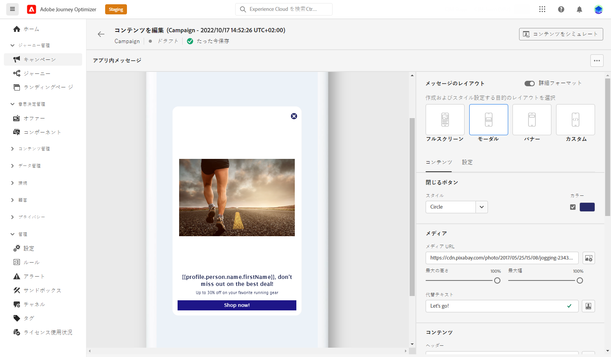

# アプリ内チャネルの概要 {#gs-in-app}

アプリ内メッセージとは、特定の目標地点に向かってユーザーに送信できる通知です。 アプリ内通知を使用して、サービスの提案、新機能のプロモーション、特別オファーのオンボーディング、新しいユーザーのオンボーディングをおこなうことができます。

Journey Optimizerを使用してアプリ内通知を作成し、メッセージのレイアウトと表示、テキストおよびボタンオプションなどのエクスペリエンスオプションを設定します。

## 前提条件{#prerequisites-in-app}

アプリ内メッセージを送信する前に、次の操作が必要です。

* アプリ内チャネルを設定します。 [詳細情報](inapp-configuration.md)

* 開始する前に、Journey Optimizerキャンペーンに対する正しい権限を持っていることを確認してください。 [詳細情報](../campaigns/get-started-with-campaigns.md#campaign-prerequisites)

完了したら、最初のアプリ内メッセージを作成、設定および送信できます。 これを実現する方法については、 [この節](create-in-app.md).

**関連トピック：**

* [アプリ内メッセージの作成](create-in-app.md)
* [アプリ内メッセージのデザイン](design-in-app.md)
* [アプリ内レポート](inapp-report.md)
* [アプリ内設定](inapp-configuration.md)
