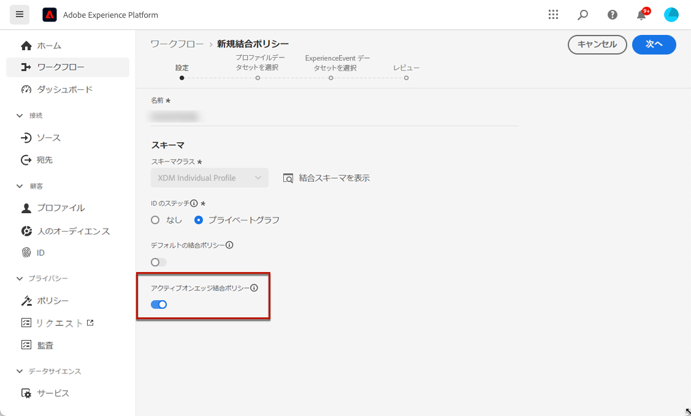

# アプリ内チャネルの前提条件 {#inapp-configuration}

## 配信の前提条件 {#delivery-prerequisites}

アプリ内メッセージが正しく配信されるようにするには、次の設定を定義する必要があります。

* Adobe Analytics の [Adobe Experience Platform Data Collection](https://experienceleague.adobe.com/docs/experience-platform/edge/datastreams/overview.html?lang=ja){target="_blank"}を使用する場合、データストリームが（など）定義されていることを確認します。 **[!UICONTROL Adobe Experience Platform]** Adobe Experience Platform Edge を使用しているサービスと **[!UICONTROL Adobe Journey Optimizer]** オプションが有効です。

  これにより、Journey Optimizer インバウンドイベントが Adobe Experience Platform Edge で正しく処理されます。[詳細情報](https://experienceleague.adobe.com/docs/experience-platform/edge/datastreams/configure.html?lang=ja){target="_blank"}

  

* [Adobe Experience Platform](https://experienceleague.adobe.com/docs/experience-platform/profile/home.html?lang=ja){target="_blank"}, make sure you have the default merge policy with the **[!UICONTROL Active-On-Edge Merge Policy]** option enabled. To do this, select a policy under the **[!UICONTROL Customer]** > **[!UICONTROL Profiles]** > **[!UICONTROL Merge Policies]** Experience Platform menu. [Learn more](https://experienceleague.adobe.com/docs/experience-platform/profile/merge-policies/ui-guide.html?lang=ja#configure){target="_blank"} で

  この結合ポリシーは、[!DNL Journey Optimizer] インバウンドチャネルで使用すると、エッジでインバウンドキャンペーンを正しくアクティブ化して公開できます。[詳細情報](https://experienceleague.adobe.com/docs/experience-platform/profile/merge-policies/ui-guide.html?lang=ja){target="_blank"}

  

## チャネル設定の前提条件 {#channel-prerequisites}

1. 次にアクセス： **[!UICONTROL アプリのサーフェス]** メニューとクリック **[!UICONTROL アプリサーフェスを作成]**.

1. **[!UICONTROL アプリサーフェス]**&#x200B;に名前を追加します。

   

1. 次から： **[!UICONTROL Apple iOS]** ドロップダウンで、Apple iOS用のモバイルアプリケーションを設定します。

+++ 詳細情報

   1. 次を入力： **[!UICONTROL iOS Bundle ID]**. **バンドル ID** について詳しくは、[Apple ドキュメント](https://developer.apple.com/documentation/appstoreconnectapi/bundle_ids)を参照してください。

   1. （オプション） **[!UICONTROL サンドボックス]** プッシュ通知の送信元。 特定のサンドボックスを選択するには、必要なアクセス権限が必要です。

      サンドボックス管理について詳しくは、 [このページ](../administration/sandboxes.md#assign-sandboxes).

   1. を有効にします。 **[!UICONTROL プッシュ資格情報]** 必要に応じて.p8 auth キーファイルをドラッグ&amp;ドロップするオプション。

      また、 **[!UICONTROL プッシュ資格情報を手動で入力する]** オプションを使用して、APNs 認証キーを直接コピー&amp;ペーストできます。

   1. を入力します。 **[!UICONTROL キー ID]** および **[!UICONTROL チーム ID]**.

      

+++

1. 次から： **[!UICONTROL Android]** 」ドロップダウンで、Android 用のモバイルアプリケーションを設定します。

+++ 詳細情報

   1. 次を入力： **[!UICONTROL Android パッケージ名]**. **パッケージ名**&#x200B;について詳しくは、[Android ドキュメント](https://support.google.com/admob/answer/9972781?hl=ja#:~:text=The%20package%20name%20of%20an,supported%20third%2Dparty%20Android%20stores)を参照してください。

   1. （オプション） **[!UICONTROL サンドボックス]** プッシュ通知の送信元。 特定のサンドボックスを選択するには、必要なアクセス権限が必要です。

      サンドボックス管理について詳しくは、 [このページ](../administration/sandboxes.md#assign-sandboxes).

   1. を有効にします。 **[!UICONTROL プッシュ資格情報]** オプションを使用し、必要に応じて.json 秘密鍵ファイルをドラッグ&amp;ドロップします。

      また、 **[!UICONTROL プッシュ資格情報を手動で入力する]** オプションを使用して、FCM 秘密鍵を直接コピー&amp;ペーストできます。

      

1. **[!UICONTROL アプリサーフェス]**&#x200B;の設定が完了したら、「**[!UICONTROL 保存]**」をクリックします。

   

   アプリ内メッセージを含む新しいキャンペーンを作成する際に、**[!UICONTROL アプリサーフェス]**&#x200B;を使用できるようになりました。 [詳細情報](create-in-app.md)

1. アプリサーフェスを作成したら、モバイルプロパティを作成する必要があります。

   詳しい手順は、[このページ](https://experienceleague.adobe.com/docs/experience-platform/tags/admin/companies-and-properties.html?lang=ja#for-mobile)を参照してください。

   

1. 新しく作成したプロパティの拡張機能メニューから、次の拡張機能をインストールします。

   * Adobe Experience Platform Edge Network
   * Adobe Journey Optimizer
   * AEP Assurance
   * 同意
   * ID
   * Mobile Core
   * プロファイル

   詳しい手順は、[このページ](https://experienceleague.adobe.com/docs/experience-platform/tags/ui/extensions/overview.html?lang=ja#add-a-new-extension)を参照してください。

   

アプリ内チャネルが設定されました。 ユーザーへのアプリ内メッセージの送信を開始できます。

## コンテンツ実験の前提条件 {#experiment-prerequisites}

アプリ内チャネルでコンテンツ実験を有効にするには、 [データセット](../data/get-started-datasets.md) アプリ内実装で使用される [datastream](https://experienceleague.adobe.com/docs/experience-platform/datastreams/overview.html?lang=ja){target="_blank"} は、レポート設定にも含まれます。

つまり、実験レポートを設定する際に、web データストリームに存在しないデータセットを追加すると、web データはコンテンツ実験レポートに表示されません。

コンテンツ実験のレポート用にデータセットを追加する方法については、[この節](../campaigns/reporting-configuration.md#add-datasets)を参照してください。

>[!NOTE]
>
>データセットは、[!DNL Journey Optimizer] レポートシステムによって読み取り専用で使用され、データ収集やデータの取り込みには影響しません。

次の事前定義された[フィールドグループ](https://experienceleague.adobe.com/docs/experience-platform/xdm/tutorials/create-schema-ui.html?lang=ja#field-group){target="_blank"} for your dataset schema: `AEP Web SDK ExperienceEvent` and `Consumer Experience Event` (as defined in [this page](https://experienceleague.adobe.com/docs/platform-learn/implement-web-sdk/initial-configuration/configure-schemas.html?lang=ja#add-field-groups){target="_blank"}）を使用してい&#x200B;**ない**&#x200B;場合は、次のフィールドグループを追加する必要があります：`Experience Event - Proposition Interactions`、`Application Details`、`Commerce Details`、`Web Details`。これらは、[!DNL Journey Optimizer] のコンテンツ実験レポートで、各プロファイル参加している実験と処理を追跡するために必要です。

>[!NOTE]
>
>これらのフィールドグループを追加しても、通常のデータ収集には影響しません。実験が実行されているページに対してのみ追加され、他のすべての追跡は変更されません。

## ハウツービデオ{#video}

* 以下のビデオでは、アプリサーフェスメニューにアクセスするための&#x200B;**アプリ設定を管理**&#x200B;権限を割り当てる方法を示します。

  +++こちらのビデオをご覧ください

  >[!VIDEO](https://video.tv.adobe.com/v/3421607)

+++

**関連トピック：**

* [アプリ内メッセージの作成 ](create-in-app.md)
* [キャンペーンの作成](../campaigns/create-campaign.md)
* [アプリ内メッセージのデザイン](design-in-app.md)
* [アプリ内レポート](../reports/campaign-global-report.md#inapp-report)

