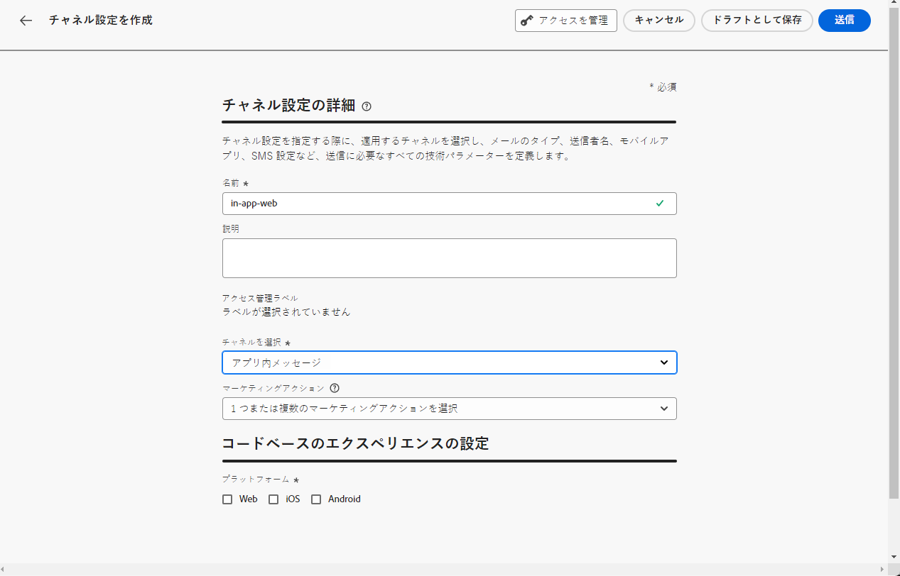

# 前提条件と設定 {#inapp-configuration}

## 設定の手順 {#inapp-steps}

[!DNL Journey Optimizer] を使用してジャーニーとキャンペーンでアプリ内メッセージを送信するには、次の設定手順を実行する必要があります。

1. ジャーニーでアプリ内メッセージのみを使用する予定がある場合でも、開始する前に、Journey Optimizer キャンペーンに対する正しい権限を持っていることを確認してください。キャンペーン権限は引き続き必要です。[詳細情報](../campaigns/get-started-with-campaigns.md#campaign-prerequisites)。
1. Adobe Experience Platform データ収集データストリームで Adobe Journey Optimizer を有効にし、Adobe Experience Platform のデフォルトの結合ポリシーを確認します。詳しくは、以下の[配信の前提](#delivery-prerequisites)を参照してください。
1. 管理／チャネル／チャネル設定でアプリ内メッセージチャネル設定を作成する方法について詳しくは、[この節](#channel-prerequisites)を参照してください。
1. コンテンツ実験を使用している場合は、[この節](#experiment-prerequisite)に記載されている要件に従ってください。

完了したら、最初のアプリ内メッセージを作成、設定および送信できます。 これを実現する方法については、[この節](create-in-app.md)を参照してください。

## 配信の前提条件 {#delivery-prerequisites}

アプリ内メッセージが正常に配信されるようにするには、次の設定を定義する必要があります。

* [Adobe Experience Platform データ収集](https://experienceleague.adobe.com/docs/experience-platform/edge/datastreams/overview.html?lang=ja){target="_blank"}で、**[!UICONTROL Adobe Experience Platform]** サービスの下にある「**[!UICONTROL Adobe Journey Optimizer]**」オプションを有効にするなど、データストリームが定義されていることを確認します。

  これにより、Journey Optimizer インバウンドイベントが Adobe Experience Platform Edge で正しく処理されます。[詳細情報](https://experienceleague.adobe.com/docs/experience-platform/edge/datastreams/configure.html?lang=ja){target="_blank"}

  

* [Adobe Experience Platform](https://experienceleague.adobe.com/docs/experience-platform/profile/home.html?lang=ja){target="_blank"} で、デフォルトの結合ポリシーが設定され、「**[!UICONTROL Active-On-Edge 結合ポリシー]**」オプションが有効になっているとを確認します。それには、**[!UICONTROL 顧客r]**／**[!UICONTROL プロファイル]**／**[!UICONTROL 結合ポリシー]** Experience Platform メニューでポリシーを選択します。[詳細情報](https://experienceleague.adobe.com/docs/experience-platform/profile/merge-policies/ui-guide.html?lang=ja#configure){target="_blank"}

  この結合ポリシーは、[!DNL Journey Optimizer] インバウンドチャネルで使用すると、エッジでインバウンドキャンペーンを正しくアクティブ化して公開できます。[詳細情報](https://experienceleague.adobe.com/docs/experience-platform/profile/merge-policies/ui-guide.html?lang=ja){target="_blank"}

  >[!NOTE]
  >
  >カスタムの&#x200B;**[!UICONTROL データセット設定]**&#x200B;マージポリシーを使用する場合は、指定したマージポリシー内に&#x200B;**[!UICONTROL ジャーニーインバウンド]**&#x200B;データセットを必ず追加してください。

  

* Journey Optimizer モバイルエクスペリエンスの配信に関するトラブルシューティングを行うには、**Adobe Experience Platform Assurance** 内の **Edge Delivery** ビューを使用できます。このプラグインを使用すると、リクエスト呼び出しを詳細に検査し、期待されるエッジ呼び出しが予想どおりに発生するかどうかを確認し、ID マップ、セグメントメンバーシップ、同意設定などのプロファイルデータを調べることができます。また、リクエストが認定されたアクティビティを確認し、認定されなかったアクティビティを特定することもできます。

  **Edge Delivery** プラグインを使用すると、インバウンド実装を効果的に理解してトラブルシューティングを行うために必要なインサイトを得ることができます。

  [詳しくは、Edge Delivery ビューを参照してください](https://experienceleague.adobe.com/ja/docs/experience-platform/assurance/view/edge-delivery)

## アプリ内設定の作成 {#channel-prerequisites}

1. **[!UICONTROL チャネル]**／**[!UICONTROL 一般設定]**／**[!UICONTROL チャネル設定]**&#x200B;メニューにアクセスし、「**[!UICONTROL チャネル設定を作成]**」をクリックします。

   

1. 設定の名前と説明（オプション）を入力し、設定するチャネルを選択します。

   >[!NOTE]
   >
   > 名前は、文字（A ～ Z）で始める必要があります。使用できるのは英数字のみです。アンダースコア（`_`）、ドット（`.`）、ハイフン（`-`）も使用できます。

1. 設定にカスタムまたはコアのデータ使用ラベルを割り当てるには、「**[!UICONTROL アクセスを管理]**」を選択します。[オブジェクトレベルのアクセス制御（OLAC）について詳しくは、こちらを参照してください](../administration/object-based-access.md)。

1. この設定を使用してメッセージに同意ポリシーを関連付けるには、「**[!UICONTROL マーケティングアクション]**」を選択します。顧客の環境設定に従うために、そのマーケティングアクションに関連付けられているすべての同意ポリシーが活用されます。[詳細情報](../action/consent.md#surface-marketing-actions)

1. **アプリ内メッセージ**&#x200B;チャネルを選択します。

   

1. 設定を定義するプラットフォームを選択します。 これにより、各プラットフォームに対してターゲットアプリを指定し、複数のプラットフォーム間で一貫したコンテンツ配信を確保できます。

   >[!NOTE]
   >
   >iOSおよびAndroidのプラットフォームの場合、配信はアプリ ID のみに基づきます。 両方のアプリが同じアプリ ID を共有する場合、**[!UICONTROL チャネル設定]** で選択したプラットフォームに関係なく、コンテンツは両方に配信されます。

   

1. Web の場合：

   * **[!UICONTROL ページ URL]** を入力して、特定のページに変更を適用できます。

   * 同じパターンに従う複数の URL をターゲットにするルールを作成できます。

+++ ページ一致ルールを作成する方法。

      1. アプリ設定として「**[!UICONTROL ページ一致ルール]**」を選択し、**[!UICONTROL ページ URL]** を入力します。

      1. **[!UICONTROL 設定ルールを編集]**&#x200B;ウィンドウで、「**[!UICONTROL ドメイン]**」フィールドと「**[!UICONTROL ページ]**」フィールドの条件を定義します。
      1. 条件ドロップダウンから、条件をさらにパーソナライズします。

         例えば、Luma web サイトのすべての販売製品ページに表示される要素を編集する場合は、ドメイン／次で始まる／Luma およびページ／次を含む／販売を選択します。

         

      1. 必要に応じて、「**[!UICONTROL 別のページルールを追加]**」をクリックして、別のルールを作成します。

      1. **[!UICONTROL デフォルトのオーサリングおよびプレビュー URL]** を選択します。

      1. 変更を保存します。ルールは、**[!UICONTROL キャンペーンを作成]**&#x200B;画面に表示されます。

+++

1. iOS および Android の場合：

   * **[!UICONTROL アプリ ID]** を入力します。

1. 変更を送信します。

アプリ内メッセージを作成する際に、設定を選択できるようになりました。

## レポーティングの前提条件 {#experiment-prerequisites}

>[!NOTE]
>
>データセットは、[!DNL Journey Optimizer] レポートシステムによって読み取り専用で使用され、データ収集やデータの取り込みには影響しません。

アプリ内チャネルのレポーティングを有効にするには、レポーティング設定に、アプリ内実装[データストリーム](https://experienceleague.adobe.com/docs/experience-platform/datastreams/overview.html?lang=ja){target="_blank"}で使用する[データセット](../data/get-started-datasets.md)も含まれていることを確認する必要があります。

つまり、レポーティングを設定する際に、アプリデータストリームに存在しないデータセットを追加すると、アプリデータはレポートに表示されません。

レポーティング用にデータセットを追加する方法について詳しくは、[この節](../reports/reporting-configuration.md#add-datasets)を参照してください。

データセットのスキーマに `AEP Web SDK ExperienceEvent` および `Consumer Experience Event`（[このページ](https://experienceleague.adobe.com/docs/platform-learn/implement-web-sdk/initial-configuration/configure-schemas.html?lang=ja#add-field-groups){target="_blank"}で定義）の定義済み[フィールドグループ](https://experienceleague.adobe.com/docs/experience-platform/xdm/tutorials/create-schema-ui.html?lang=ja#field-group){target="_blank"}を使用して&#x200B;**いない**&#x200B;場合は、`Experience Event - Proposition Interactions`、`Application Details`、`Commerce Details` および `Web Details` のフィールドグループを追加する必要があります。これらは、各プロファイルが参加しているキャンペーンやジャーニーを追跡するため、[!DNL Journey Optimizer] レポートに必要です。

[詳しくは、「レポーティング設定」を参照してください。](../reports/reporting-configuration.md)

>[!NOTE]
>
>これらのフィールドグループを追加しても、通常のデータ収集には影響しません。キャンペーンまたはジャーニーが実行されているページに対してのみ追加され、他のすべてのトラッキングは変更されません

**関連トピック：**

* [アプリ内メッセージの作成 ](create-in-app.md)
* [キャンペーンの作成](../campaigns/create-campaign.md)
* [アプリ内メッセージのデザイン](design-in-app.md)
* [アプリ内レポート](../reports/campaign-global-report-cja-inapp.md)

