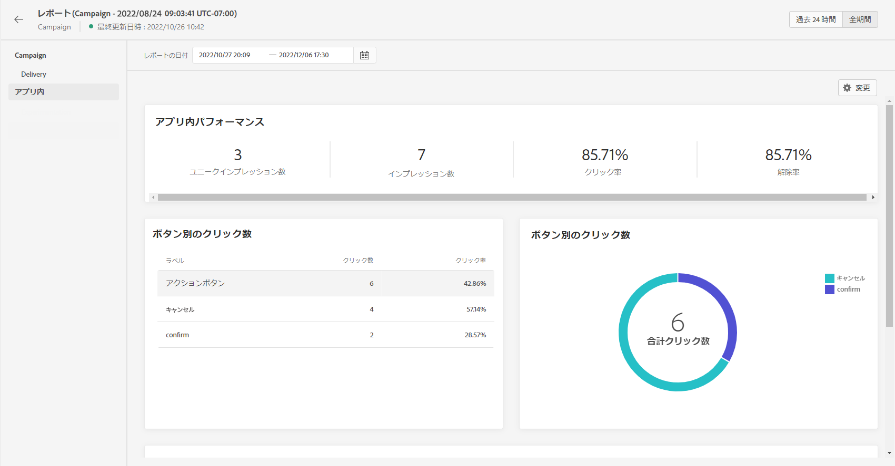

# アプリ内レポート {#inapp-report}

アプリ内レポートは、キャンペーンレポートで使用できます。

キャンペーンのレポートページには次のタブが表示されます。

* [キャンペーン](../reports/campaign-global-report.md#campaign-live)
* [メール](../reports/campaign-global-report.md#email-live)
* [プッシュ](../reports/campaign-global-report.md#push-live)
* [SMS](../reports/campaign-global-report.md#sms-live)
* [アプリ内](#in-app-global)

キャンペーンの&#x200B;**[!UICONTROL グローバルレポート]**&#x200B;は、キャンペーンの成功とエラーの詳細を示す様々なウィジェットに分かれています。必要に応じて、各ウィジェットのサイズを変更したり削除したりできます。詳しくは、この[節](../reports/global-report.md#modify-dashboard)を参照してください。

Adobe Journey Optimizerで使用可能なすべての指標の詳細なリストについては、[このページ](../reports/global-report.md#list-of-components-global.md)を参照してください。

## 「アプリ内」タブ {#inapp-global}

キャンペーンの&#x200B;**[!UICONTROL グローバルレポート]**&#x200B;の「**[!UICONTROL アプリ内]**」タブには、キャンペーンで送信されたアプリ内配信に関する主な情報が詳しく表示されます。

+++アプリ内レポートで使用できる様々な指標およびウィジェットの詳細を説明します。

**[!UICONTROL アプリ内パフォーマンス]** KPI では、次のような、アプリ内メッセージに対する訪問者のエンゲージメントに関する主な情報を詳しく示します。

* **[!UICONTROL ユニークインプレッション数]**：アプリ内メッセージが配信されたユニークユーザーの数。

* **[!UICONTROL インプレッション数]**：すべてのユーザーに配信されたアプリ内メッセージの合計数。

* **[!UICONTROL クリック率]**：メッセージを表示したユーザーと比較して、アプリ内メッセージに含まれるボタンを操作したユーザーの割合。

* **[!UICONTROL 解除率]**：受信者が解除したアプリ内メッセージの割合。

**[!UICONTROL アプリ内の概要]**&#x200B;グラフは、対象期間のアプリ内インプレッション数の変化を示します。

**[!UICONTROL ボタン別のクリック数]**&#x200B;のグラフとテーブルには、ボタン別の受信者の動作に関する使用可能なデータが含まれています。

* **[!UICONTROL クリック数]**：アプリ内メッセージに含まれるボタンで操作した受信者の合計数。

* **[!UICONTROL クリック率]**：メッセージを表示したユーザーと比較して、アプリ内メッセージに含まれるボタンを操作したユーザーの割合。
+++

**関連トピック：**

* [アプリ内メッセージの作成](../in-app/create-in-app.md)
* [アプリ内メッセージのデザイン](../in-app/design-in-app.md)
* [アプリ内設定](../in-app/inapp-configuration.md)

>[!BEGINTABS]

>[!TAB ジャーニーへのプッシュの追加]

1. ジャーニーを開き、パレットの「アクション」セクションからプッシュアクティビティをドラッグ&amp;ドロップします。

1. メッセージに関する基本情報（ラベル、説明、カテゴリ）を入力し、使用するメッセージサーフェスを選択します。

>[!TAB キャンペーンへのプッシュの追加]

1. スケジュール済みまたは API トリガーキャンペーンを新しく作成し、 **[!UICONTROL プッシュ通知]** を選択します。 **[!UICONTROL アプリサーフェス]** を使用します。

1. 「**[!UICONTROL 作成]**」をクリックします。

1. 「**[!UICONTROL プロパティ]**」セクションで、キャンペーンの&#x200B;**[!UICONTROL タイトル]**&#x200B;と&#x200B;**[!UICONTROL 説明]**&#x200B;を編集します。

1. 「**[!UICONTROL オーディエンスを選択]**」ボタンをクリックして、使用可能な Adobe Experience Platform セグメントのリストからターゲットオーディエンスを定義します。 

1. 「**[!UICONTROL ID 名前空間]**」フィールドで、選択したセグメントから個人を識別するために使用する名前空間を選択します。

1. キャンペーンは、特定の日付に実行するか、繰り返し頻度で実行するように設計されています。設定方法を学ぶ **[!UICONTROL スケジュール]** キャンペーンの

1. 次の **[!UICONTROL アクショントリガー]** メニューから、 **[!UICONTROL 頻度]** プッシュ通知の次の情報：

   * 1 回
   * 毎日
   * 毎週
   * 毎月

>[!ENDTABS]

テスト 2:

1. これはテストです

>[!BEGINTABS]

>[!TAB ジャーニーへのプッシュの追加]

    1. ジャーニーを開き、パレットの「アクション」セクションからプッシュアクティビティをドラッグ&amp;ドロップします。
    
    1. メッセージに関する基本情報（ラベル、説明、カテゴリ）を入力し、使用するメッセージサーフェスを選択します。

>[!TAB キャンペーンへのプッシュの追加]

    1. 新しいスケジュール済みまたは API トリガーキャンペーンを作成します。**[!UICONTROL プッシュ通知]**アクションとして選択し、**[!UICONTROL アプリサーフェス]**を使用します。
    
    1. クリック**[!UICONTROL 作成]**.
    
    1. **[!UICONTROL プロパティ]**セクションで、キャンペーンの**[!UICONTROL タイトル]**と**[!UICONTROL 説明]**.
    
    1. **[!UICONTROL オーディエンスを選択]**ボタンを使用して、使用可能なAdobe Experience Platformセグメントのリストからターゲットにするオーディエンスを定義します。
    
    1. **[!UICONTROL ID 名前空間]**フィールドで、選択したセグメントの個人を識別するために使用する名前空間を選択します。
    
    1. キャンペーンは、特定の日付に実行するか、繰り返し頻度で実行するように設計されています。設定方法**[!UICONTROL スケジュール]**個のキャンペーンを作成します。
    
    1. **[!UICONTROL アクショントリガー]**メニューで、**[!UICONTROL 頻度]**のプッシュ通知を以下に示します。
    
    * 1 回
    *日
    *毎週
    *毎月

>[!ENDTABS]

1. これはテストの一部です
