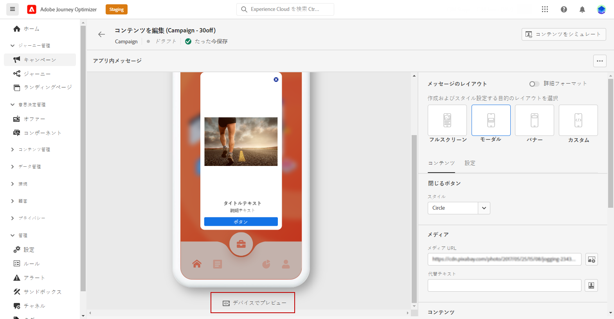
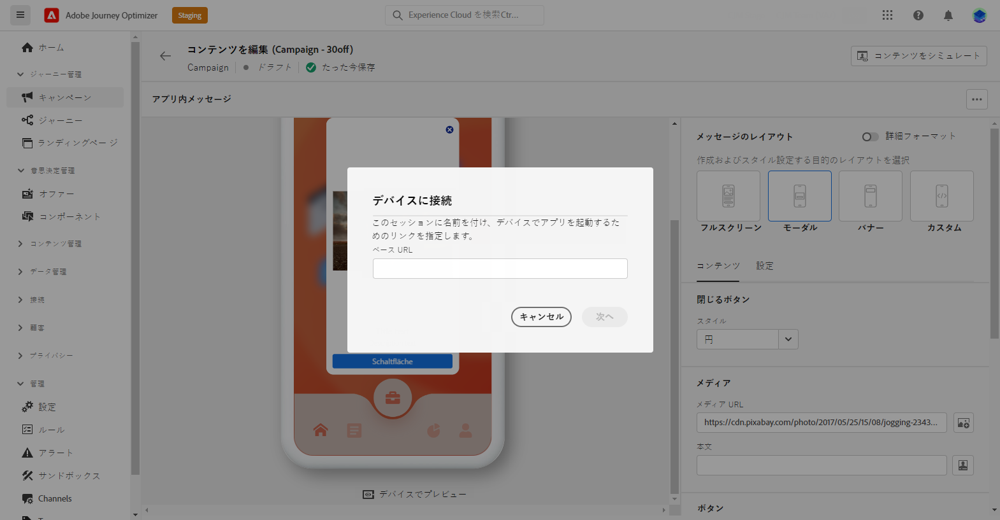
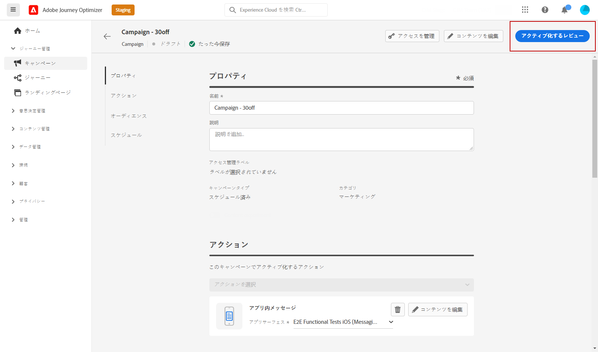

# アプリ内通知の確認および送信 {#create-in-app}

## デバイスでのプレビュー {#preview-device}

すべてのユーザーに公開される前にアプリ内通知を確認する場合は、特定のデバイスでプレビューできます。この機能を使用すると、選択したデバイスで意図したとおりに通知が表示され、機能するようになり、オーディエンスのユーザーエクスペリエンスが向上します。

手順は次のとおりです。

1. 「**[!UICONTROL デバイスでプレビュー]**」をクリックします。

   

1. **[!UICONTROL デバイスに接続]**&#x200B;ウィンドウから、「**[!UICONTROL 開始]**」をクリックします。

1. アプリケーションの&#x200B;**[!UICONTROL ベース URL]** を入力し、「**[!UICONTROL 次へ]**」をクリックします。

   

1. デバイスで QR コードをスキャンし、表示された PIN コードを入力します。

アプリ内メッセージをデバイスで直接トリガーできるようになり、実際のデバイスでメッセージをプレビューし、レビューできます。

## テストプロファイルでプレビュー {#simulate}

アプリ内メッセージを定義したら、テストプロファイルを使用してメッセージをプレビューできます。パーソナライズされたコンテンツを挿入した場合は、そのコンテンツがメッセージにどのように表示されるかを、テストプロファイルデータを使用して確認できます。

これを行うには、「**[!UICONTROL コンテンツをシミュレート]**」をクリックし、テストプロファイルを追加し、テストプロファイルデータを使用してメッセージを確認します。

テストプロファイルの選択およびコンテンツのプレビュー方法について詳しくは、[コンテンツ管理](../content-management/preview-test.md)の節を参照してください。

## アプリ内通知のレビューとアクティブ化{#in-app-review}

>[!IMPORTANT]
>
> キャンペーンが承認ポリシーの対象となっている場合、アプリ内通知を送信できるようにするには、承認をリクエストする必要があります。[詳細情報](../test-approve/gs-approval.md)

アプリ内メッセージを作成し、そのコンテンツを定義してパーソナライズしたら、そのメッセージをレビューしてアクティブ化できます。

手順は次のとおりです。

1. 「**[!UICONTROL アクティブ化するレビュー]**」ボタンを使用して、メッセージの概要を表示します。

   概要では、必要に応じてキャンペーンを変更し、パラメーターが正しくないか、または見つからないかを確認できます。

   

1. キャンペーンが正しく設定されていることを確認してから、「**[!UICONTROL アクティブ化]**」をクリックします。

これで、キャンペーンがアクティブ化されました。キャンペーンで設定されたアプリ内通知は、すぐに送信されるか、指定日に送信されます。

送信したら、キャンペーンまたはジャーニーレポート内でアプリ内メッセージの影響を測定できます。レポートについて詳しくは、[この節](../reports/campaign-global-report-cja-inapp.md)を参照してください。

**関連トピック：**

* [アプリ内メッセージの作成 ](create-in-app.md)
* [アプリ内メッセージのデザイン](design-in-app.md)
* [アプリ内レポート](../reports/campaign-global-report-cja-inapp.md)
* [アプリ内設定](inapp-configuration.md)
