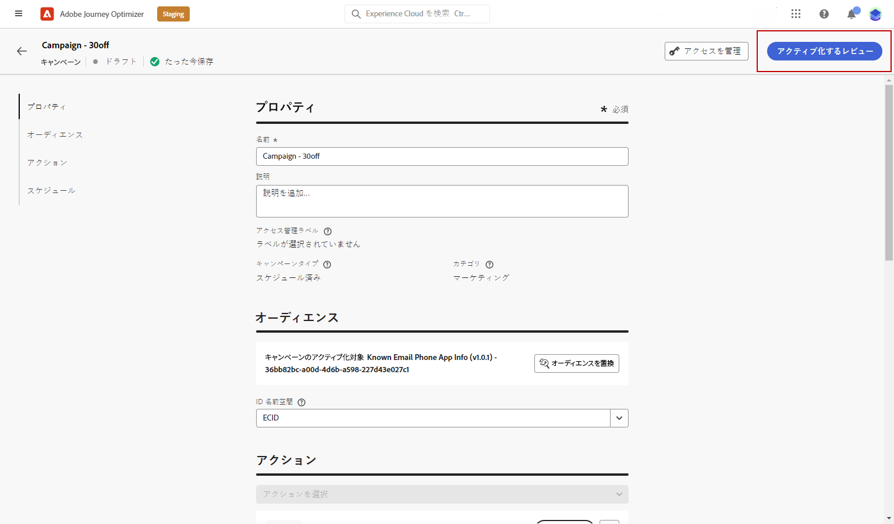

# アプリ内通知のテストおよび送信 {#create-in-app}

## デバイスでのプレビュー {#preview-device}

すべてのユーザーに対してアプリ内通知のプレビューを提供する場合は、特定のデバイスでプレビューできます。 この機能を使用すると、選択したデバイスで意図したとおりに通知が表示され、機能するようになり、オーディエンスのユーザーエクスペリエンスが向上します。

手順は次のとおりです。

1. 「**[!UICONTROL デバイスでプレビュー]**」をクリックします。

   

1. **[!UICONTROL デバイスに接続]**&#x200B;ウィンドウから、「**[!UICONTROL 開始]**」をクリックします。

1. アプリケーションの&#x200B;**[!UICONTROL ベース URL]** を入力し、「**[!UICONTROL 次へ]**」をクリックします。

   

1. デバイスで QR コードをスキャンし、表示された PIN コードを入力します。

アプリ内メッセージをデバイスで直接トリガーできるようになり、実際のデバイスでメッセージをプレビューし、レビューできます。

## アプリ内通知のレビューとアクティブ化{#in-app-review}

アプリ内メッセージを作成し、そのコンテンツを定義してパーソナライズしたら、そのメッセージをレビューしてアクティブ化できます。

手順は次のとおりです。

1. 「**[!UICONTROL アクティブ化するレビュー]**」ボタンを使用して、メッセージの概要を表示します。

   概要では、必要に応じてキャンペーンを変更し、パラメーターが正しくないか、または見つからないかを確認できます。

   

1. キャンペーンが正しく設定されていることを確認してから、「**[!UICONTROL アクティブ化]**」をクリックします。

これで、キャンペーンがアクティブ化されました。キャンペーンで設定されたアプリ内通知は、すぐに送信されるか、指定日に送信されます。

送信したら、キャンペーンまたはジャーニーレポート内でアプリ内メッセージの影響を測定できます。レポートについて詳しくは、[この節](../reports/campaign-global-report.md#inapp-report)を参照してください。

**関連トピック：**

* [アプリ内メッセージの作成 ](create-in-app.md)
* [アプリ内メッセージのデザイン](design-in-app.md)
* [アプリ内レポート](../reports/campaign-global-report.md#inapp-report)
* [アプリ内設定](inapp-configuration.md)
