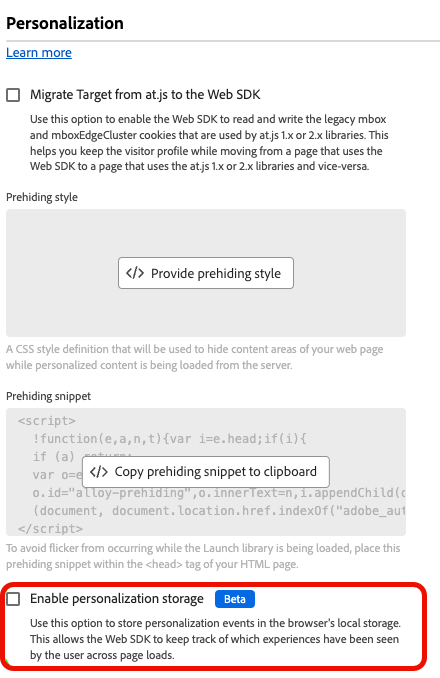
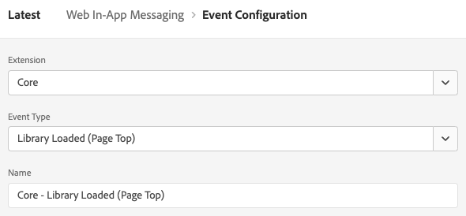
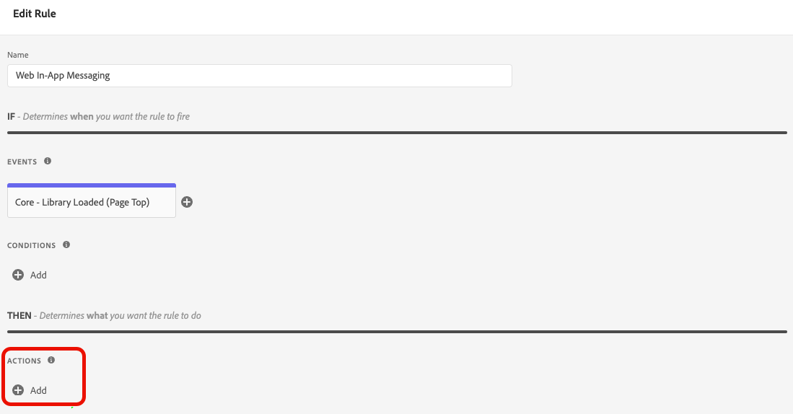
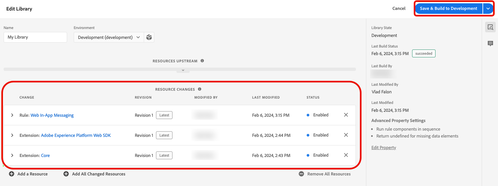

# Web SDKでのWeb アプリ内メッセージングサポートの設定

アプリ内メッセージとは、web アプリケーション内のユーザーに送信し、特定の顧客接点に誘導する通知です。

これらの通知は、新機能のプロモーション、特別オファーの提供、ユーザーオンボーディングの促進など、さまざまな目的で使用できます。

アプリ内メッセージを使用することで、オーディエンスと効果的にエンゲージし、アプリケーションの重要な側面に誘導できます。

## 前提条件 {#prerequisites}

### Web SDK タグ拡張機能のバージョン {#extension-version}

Web アプリ内メッセージ機能には、最新バージョンのWeb SDK タグ拡張機能が必要です。

### Web アプリ内メッセージ用のCSPの設定 {#csp}

Web アプリ内メッセージを設定する場合は、CSPに次のディレクティブを含める必要があります。

```
default-src  blob:;
```

CSPの設定について詳しくは、[&#x200B; データ収集ドキュメント &#x200B;](https://experienceleague.adobe.com/docs/experience-platform/edge/use-cases/configuring-a-csp.html?lang=ja){target="_blank"}を参照してください。

## Web SDK タグ拡張機能を使用したWeb アプリ内メッセージの設定 {#tag-extension}

以下の設定内容については、[Web SDK タグ拡張機能の設定ページ &#x200B;](https://experienceleague.adobe.com/docs/experience-platform/tags/extensions/client/web-sdk/web-sdk-extension-configuration.html?lang=ja){target="_blank"}を参照してください。

Web SDK タグ拡張機能を[&#x200B; インストール &#x200B;](https://experienceleague.adobe.com/docs/experience-platform/tags/extensions/client/web-sdk/web-sdk-extension-configuration.html?lang=ja#install-the-web-sdk-tag-extension){target="_blank"}したら、次の手順に従って、Web アプリ内メッセージ用の拡張機能を設定します。

「**[!UICONTROL Personalization]**」セクションで、「**[!UICONTROL パーソナライゼーションストレージを有効にする]**」オプションを確認します。 このオプションを使用すると、Web SDKは、ページ読み込み全体でどのエクスペリエンスがユーザーに表示されたかを追跡できます。



Web アプリ内メッセージは、次の2種類のトリガーをサポートしています。

* [Experience Platformへのデータの送信](#send-data-platform)
* [メッセージを手動でトリガーする](#manual-trigger)

使用するトリガーに応じてWeb SDK タグ拡張機能を設定するには、次の節を参照してください。

### **[!UICONTROL Experience Platformにデータを送信]**&#x200B;トリガーの設定手順 {#send-data-platform}

1. Web SDK拡張機能を含むタグプロパティを選択し、次の設定で[新しいルール &#x200B;](https://experienceleague.adobe.com/docs/experience-platform/tags/ui/managing-resources/rules.html#create-a-rule){target="_blank"}を作成します。

   * **[!UICONTROL 拡張機能]**: [!UICONTROL Core]
   * **[!UICONTROL イベントタイプ]**: [!UICONTROL &#x200B; ライブラリが読み込まれました（ページトップ） &#x200B;]

   

1. 「**[!UICONTROL 変更を保持]**」を選択して、イベント設定を保存します。

1. 作成したルールにアクションを追加する必要があります。[!DNL Actions] セクションで、**[!UICONTROL 追加]**&#x200B;を選択します。

   次の&#x200B;**[!UICONTROL アクション]**&#x200B;設定を使用します。

   * **[!UICONTROL 拡張機能]**: [!UICONTROL Adobe Experience Platform Web SDK]
   * **[!UICONTROL アクションの種類]**: [!UICONTROL &#x200B; イベントの送信]

   

1. 画面の右側の&#x200B;**[!UICONTROL Personalization]** セクションで、**[!UICONTROL 視覚的なパーソナライゼーションの決定をレンダリング]** オプションを有効にします。

   

1. 画面の右側の&#x200B;**[!UICONTROL 決定コンテキスト]** セクションで、キャンペーン設定で使用した&#x200B;**[!UICONTROL キー]**/**[!UICONTROL 値]**&#x200B;のペアを定義して、アプリ内メッセージの対象にします。

   

1. 設定を保存するには、**[!UICONTROL 変更を保持]**&#x200B;を選択します。

1. 次に、新しく作成したルールをタグプロパティライブラリに追加する必要があります。 これを行うには、**[!UICONTROL 公開フロー]**&#x200B;に移動し、以前に作成したルールを選択します。

   

1. ルールをライブラリに追加したら、**[!UICONTROL 開発に保存してビルド]**&#x200B;を選択します。

   

これで設定プロセスが完了し、メッセージをユーザーに表示する準備が整いました。

### 手動トリガーを使用するための設定手順 {#manual-trigger}

1. Web SDK拡張機能を含むタグプロパティを選択し、次の設定を使用して[新しいルール &#x200B;](https://experienceleague.adobe.com/docs/experience-platform/tags/ui/managing-resources/rules.html#create-a-rule){target="_blank"}を作成します。

   * **[!UICONTROL 拡張機能]**: [!UICONTROL Core]
   * **[!UICONTROL イベントタイプ]**: [!UICONTROL &#x200B; クリック &#x200B;]

1. ページ上の特定の要素のトリガーを設定します。これは、選択したCSS セレクターによって識別されます。

   

1. 作成したルールにアクションを追加する必要があります。 [!DNL Actions] セクションで、**[!UICONTROL 追加]**&#x200B;を選択し、次の&#x200B;**[!UICONTROL アクション]**&#x200B;設定を使用します。

   * **[!UICONTROL 拡張機能]**: [!UICONTROL Adobe Experience Platform Web SDK]
   * **[!UICONTROL アクションの種類]**: [!UICONTROL &#x200B; ルールセットの評価]

   

1. 画面の右側で、**[!UICONTROL 視覚的なパーソナライゼーション決定のレンダリング]** オプションを有効にします。

   

1. 画面の右側の&#x200B;**[!UICONTROL 決定コンテキスト]** セクションで、キャンペーン設定で使用した&#x200B;**[!UICONTROL キー]**/**[!UICONTROL 値]**&#x200B;のペアを定義して、アプリ内メッセージの対象にします。

   

1. 設定を保存するには、**[!UICONTROL 変更を保持]**&#x200B;を選択します。

1. 新しく作成したルールをタグプロパティライブラリに追加します。 これを行うには、**[!UICONTROL 公開フロー]**&#x200B;に移動し、以前に作成したルールを選択します。

   

1. ルールをライブラリに追加したら、**[!UICONTROL 開発に保存してビルド]**&#x200B;を選択します。

   

これで設定プロセスが完了し、メッセージをユーザーに表示する準備が整いました。

## Web SDK JavaScript ライブラリを使用したWeb アプリ内メッセージの設定 {#js-library}

Web SDK タグ拡張機能を使用する代わりに、Web SDK JavaScript ライブラリから直接Web アプリ内メッセージを設定することもできます。

Adobe Journey Optimizerのweb アプリ内メッセージは、2つの方法で表示できます。

### 方法1：パーソナライゼーションコンテンツを自動的に取得する {#automatic}

Web SDKでページ読み込み時にパーソナライゼーションコンテンツを自動的に取得するには、次の例に示すように、`sendEvent` コマンドを使用します。

```js
  alloy("sendEvent", {
      renderDecisions: true,
      personalization: {
          surfaces: ['#welcome']
      }
  });
```

### 方法2：ユーザーアクションに基づいてパーソナライゼーションコンテンツを手動で取得する {#manual}

ユーザーが特定のアクションを実行した後にのみパーソナライゼーションコンテンツを表示するには、次の例に示すように`evaluateRulesets` コマンドを使用します。

この例では、ユーザーがweb サイトの「**[!UICONTROL 今すぐ購入]**」ボタンをクリックすると、パーソナライゼーションコンテンツが表示されます。

```js
 alloy("evaluateRulesets", {
     renderDecisions: true,
     personalization: {
         decisionContext: {
             "userAction": "buy_now"
         }
     }
 });
```

### パーソナライゼーションストレージの設定 {#personalization-storage}

`personalizationStorageEnabled`設定オプションを使用して、ユーザーがページにアクセスするたびに、アプリ内メッセージを設定された回数だけ表示するか、ユーザーに表示するかを選択できます。

[Web SDK設定](https://experienceleague.adobe.com/docs/experience-platform/edge/fundamentals/configuring-the-sdk.html?lang=ja){target="_blank"}で、必要に応じて`personalizationStorageEnabled` オプションを設定します。

* `personalizationStorageEnabled: true`さんが、[&#x200B; キャンペーン &#x200B;](create-in-app-web.md#configure-inapp)で定義した頻度でアプリ内メッセージをトリガーします。
* `personalizationStorageEnabled: false`は、ページが読み込まれるたびにアプリ内メッセージをトリガーします。
