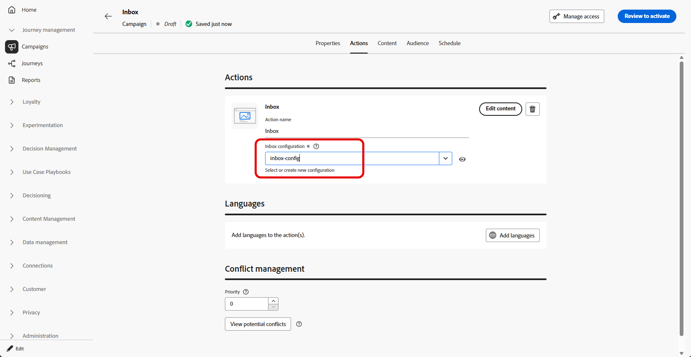

# インボックスの作成 {#inbox-create}

>[!BEGINSHADEBOX]

**このページ：**&#x200B;受信トレイのアクションを使用して、オーディエンスをターゲティングし、スケジュールまたはトリガー化するキャンペーンを作成します。これにより、ユーザーが受信トレイで再訪問できる永続的なメッセージを配信できます。

>[!ENDSHADEBOX]

受信トレイを作成する前に、[受信トレイ設定](inbox-configuration.md)の手順を完了してください。 チャネル設定では、ターゲットアプリケーションやweb サイト、ページやルール、受信トレイがレンダリングされる場所を特定します。

キャンペーンを通じてメッセージの受信トレイを作成するには、次の手順に従います。

1. キャンペーンの作成. [詳細情報](../campaigns/create-campaign.md)

1. 実行するキャンペーンのタイプを選択します。

   * **[!UICONTROL Scheduled - Marketing]**：キャンペーンをすぐに実行するか、指定日に実行します。 スケジュール済みキャンペーンは、**マーケティング**&#x200B;メッセージを送信することを目的としています。 ユーザーインターフェイスから設定および実行します。

   * **[!UICONTROL API トリガー - マーケティング／トランザクション]**：API 呼び出しを使用してキャンペーンを実行します。 API トリガー型のキャンペーンは、**マーケティング**&#x200B;または&#x200B;**トランザクション**&#x200B;のメッセージ、つまり個人が実行したアクションに続いて送信されるメッセージ（パスワードのリセット、買い物かごの購入など）の送信を目的としています。[APIを使用してキャンペーンをトリガーする方法を説明](../campaigns/api-triggered-campaigns.md)

1. 「**[!UICONTROL プロパティ]**」タブで、キャンペーンの名前と説明を指定します。

1. 「**[!UICONTROL アクション]**」タブから、**[!UICONTROL 受信トレイ]** アクションを選択します。

   

1. 新しい[受信トレイ設定](inbox-configuration.md)を選択または作成します。

   

1. 「コンテンツ」タブにアクセスして、コンテンツデザイナーを使用してメッセージをデザインします。 [詳細情報](inbox-design.md)

1. 「**[!UICONTROL オーディエンス]**」タブで、「**[!UICONTROL オーディエンスを選択]**」ボタンをクリックして、使用可能なAdobe Experience Platform オーディエンスのリストを表示します。 [詳しくは、オーディエンスを参照してください](../audience/about-audiences.md)

1. 「**[!UICONTROL ID 名前空間]**」フィールドで、選択したセグメントから個人を識別するために使用する名前空間を選択します。 [詳しくは、名前空間を参照してください](../event/about-creating.md#select-the-namespace)

1. キャンペーンを特定の日付にスケジュールすることや、定期的に繰り返すように設定することができます。 [詳細情報](../campaigns/create-campaign.md#schedule)

1. キャンペーンを確認し、アクティブ化して、受信トレイにメッセージを送信します。

[&#x200B; コンテンツカードキャンペーン &#x200B;](../content-card/create-content-card.md)の作成時に、この受信トレイを選択できるようになりました。
