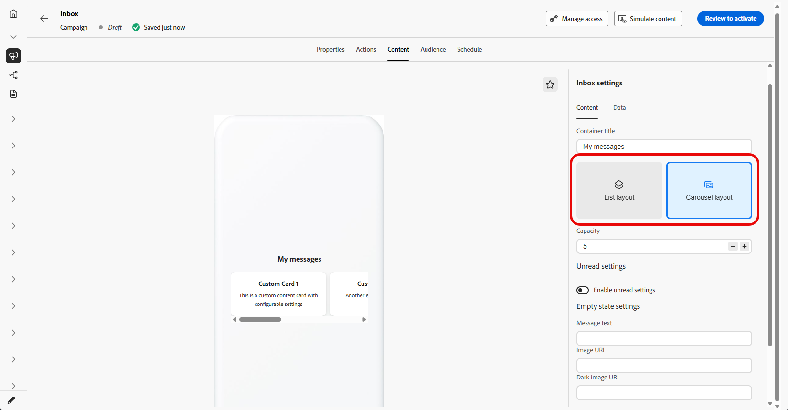
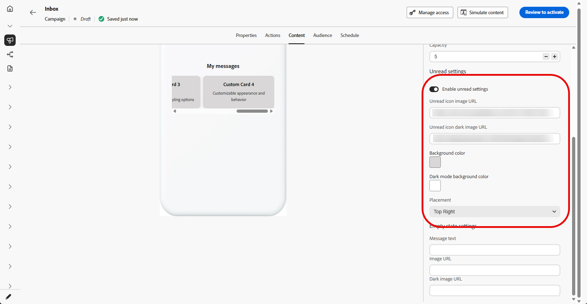
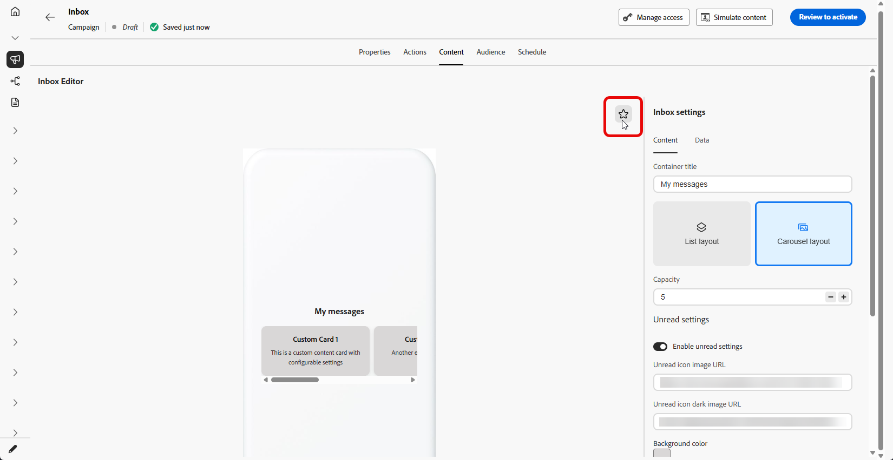

# 受信トレイのデザイン {#inbox-design}

インボックスデザインは、インボックスサーフェス内のターゲットプロファイルに各メッセージがどのようにレンダリングされるかを制御します。 この設定には、受信トレイのテンプレート、リストと拡張されたプレゼンテーション、新しいメッセージと既に表示されたメッセージを区別する読み取り状態インジケーターが含まれます。

受信トレイ キャンペーンを作成する手順について詳しくは、[受信トレイを作成](inbox-create.md)を参照してください。

1. 作成した&#x200B;**[!UICONTROL 受信トレイ キャンペーンの]** コンテンツ [&#x200B; タブを開きます](inbox-create.md)。

1. **[!UICONTROL コンテナタイトル]**&#x200B;を設定します。

1. 受信トレイのレイアウトを選択：

   * **[!UICONTROL リストレイアウト]**: プロファイルがメッセージをスクロールして開くことができるように、各コンテンツカードを縦のリストで表示します。

   * **[!UICONTROL カルーセルレイアウト]**：水平カルーセルにカードが表示されるため、プロファイルはインボックスの画面から離れることなく、ハイライトをスワイプしたり横に移動したりできます。

   

1. 受信トレイ **capacity**&#x200B;を指定します。受信トレイに保持するように設定されているコンテンツカードの最大数です。

1. **[!UICONTROL 未読の設定]**&#x200B;を切り替え、未読のメッセージを表示する方法を設定します。

   * **[!UICONTROL 未読のアイコン画像URL]**：未読のアイテムの横または上に表示される画像を指定します。ダークモード URLを追加して、アプリまたはサイトでダークテーマが使用されている場合でもアイコンが表示され、ブランドに準拠するようにします。

   * **[!UICONTROL 背景色]**：明るい色を設定し、必要に応じてダークモードを設定すると、未読の処理がブランドと一致し、受信トレイの背景に対して読み取り可能なままになります。

   * **[!UICONTROL 配置]**: ドロップダウンを使用して、未読アイコンをレイアウトに合わせて表示する場所を選択します。

   

1. **[!UICONTROL 空の状態]**&#x200B;で、表示するメッセージがない場合に表示するプロファイルを設定します。

   * **[!UICONTROL メッセージテキスト]**：受信トレイが空であることを説明する短いテキストまたは次の手順を示す短いテキスト。

   * **[!UICONTROL 画像URL]**：空の領域を表示する代わりに、空の状態を補強するライトモードのオプションのイラストまたはグラフィック。

   * **[!UICONTROL 暗い画像のURL]**：暗いモード用に調整されたオプションの画像。低いコントラストや厳しいエッジを使用せずに、空の状態が正しく表示されます。

   

1. **[!UICONTROL データ]** セクションで、**[!UICONTROL メタデータを追加]**&#x200B;をクリックして、ペイロードにカスタムキーと値のペアを追加します。

1.  アイコンをクリックして、受信トレイのダークモードのプレビューを開き、ダークテーマの色と画像を確認します。

   
