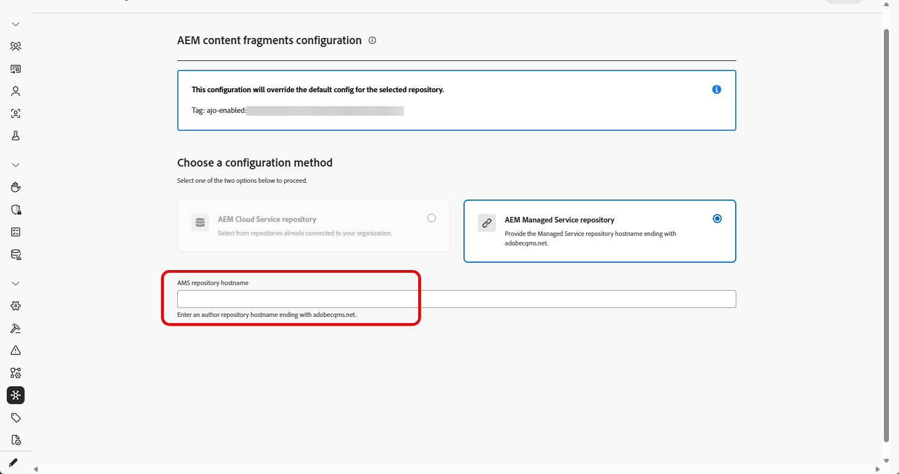
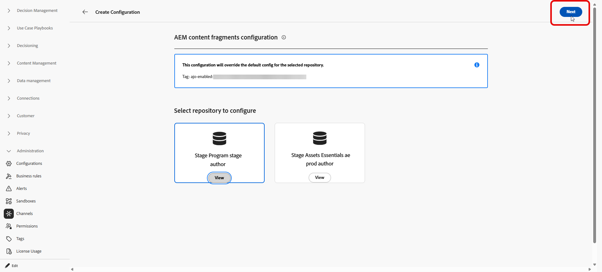
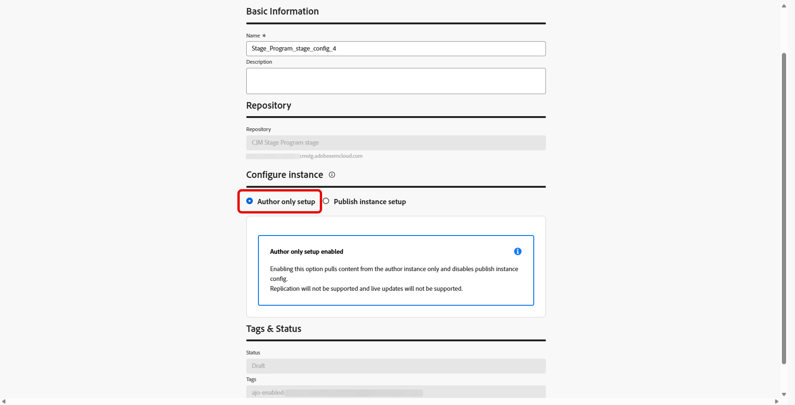
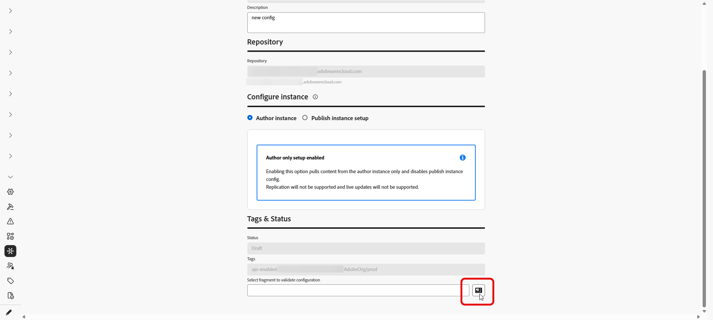

# Adobe Experience Manager リポジトリアクセスの設定 {#aem-admin-settings}

Adobe Journey Optimizerは&#x200B;**[!DNL Adobe Experience Manager as a Cloud Service]**&#x200B;と統合されているため、**コンテンツフラグメント**&#x200B;をジャーニーとキャンペーンで使用できます。 **コンテンツフラグメント**&#x200B;は、デフォルトでAdobe Experience Manager パブリッシュリポジトリから読み取られます。管理者は、**[!UICONTROL AEM統合]** メニューでオーサー専用に切り替えたり、パブリッシュアクセスを調整したりできます。

➡️ リポジトリが設定されたら、[Journey Optimizerでのオーサリングタスクと選択タスクのExperience Manager コンテンツフラグメントの操作](../integrations/aem-fragments.md)を続行します。

## リポジトリの設定 {#configure-ui}

>[!NOTE]
>
> **[!UICONTROL AEM Integration]**&#x200B;は、リポジトリ設定&#x200B;**をサンドボックス**&#x200B;ごとに保存します。 各サンドボックスは独自の統合機能を保持し、サンドボックス間では適用されません。

Journey Optimizerには、組織、サンドボックス、Adobe Experience Manager リポジトリごとに1つの統合機能が保存されます。 同じ組み合わせで新しい統合機能を保存すると、以前の設定が置き換えられ、最新の設定のみが保持されます。

リポジトリを設定するには：

1. **[!UICONTROL 管理]** > **[!UICONTROL チャネル]** > **[!UICONTROL AEM統合]**&#x200B;にアクセスします。

1. 「**[!UICONTROL 統合を作成]**」をクリックします。

   

1. **[!DNL Adobe Experience Manager Managed Services]**&#x200B;を使用する場合は、**[!UICONTROL カスタム AMS リポジトリ ID]** フィールドに`adobecqms.net`で終わるリポジトリホスト名を入力します。

   

1. 設定するリポジトリを選択し、**[!UICONTROL 次へ]**&#x200B;をクリックします。

   さらに、**[!UICONTROL 表示]**&#x200B;をクリックして、このリポジトリにアクセスできます。

   >[!IMPORTANT]
   >
   >同じ組織、サンドボックス、およびリポジトリの新しい設定を保存すると、デフォルトの設定（**publish** リポジトリ）が&#x200B;**置換**&#x200B;されます。

   

1. **[!UICONTROL 名前]**&#x200B;と&#x200B;**[!UICONTROL 説明]**&#x200B;を入力します。

1. 設定の選択：

   +++ 作成者専用の設定

   Journey OptimizerがAdobe Experience Manager **author**&#x200B;環境からのみコンテンツフラグメントを読み取る必要がある場合、「**[!UICONTROL オーサー専用セットアップ]**」を選択します。 オーサーからパブリッシュおよびライブパブリッシュの更新へのレプリケーションはサポートされていません。

   

   +++

   +++ インスタンス設定の公開

   1. 「**[!UICONTROL パブリッシュインスタンス設定]**」を選択して、パブリッシュインスタンス設定を有効にします。

      

   1. オプションで&#x200B;**[!UICONTROL トークンをパブリッシュインスタンスに送信]**&#x200B;することを有効にして、パブリッシュインスタンスへのリクエストにサービス資格情報を含めます。

   1. 認証用に有効な&#x200B;**[!UICONTROL サービス資格情報JSON]**&#x200B;を貼り付けます。

   1. 組織がデフォルトのAEM パブリッシュホスト （`publish-XX-XX.adobeaemcloud.com`）にアクセスしてコンテンツを取得できない場合は、オプションでカスタムドメインを指定します。

      

   +++

1. インスタンスの設定が完了したら、コンテンツフラグメントを選択して、統合が機能することを確認します。

   

1. **Content Advisor** ウィンドウで、テストするフラグメントを選択し、**[!UICONTROL 選択]**&#x200B;をクリックします。

1. 「**[!UICONTROL 保存]**」をクリックします。

1. テストコンテンツフラグメントを選択して保存すると、検証が自動的に実行されます。 検証が失敗した場合は、エラーリストが表示され、設定を修正できます。

   

1. このリポジトリ統合を編集または無効にするには、**[!UICONTROL AEM統合]** メニューから以前に作成した設定にアクセスします。

この設定を保存すると、Journey Optimizerはその設定を現在のサンドボックスに保存します。 その後、**Content Advisor** セレクターでコンテンツを参照して選択する際に、そのリポジトリとその設定を使用できます。

