# Dynamic Media の操作 {#aem-dynamic}

>[!AVAILABILITY]
>
>この統合は、一連の組織のみが使用できます（限定提供）。アクセスするには、アドビ担当者にお問い合わせください。

アセットセレクターで Dynamic Media がサポートされるようになり、Journey Optimizer内で承認済みの Dynamic Media レンディションをシームレスに選択して使用できるようになりました。 Adobe Experience Managerでアセットに加えた変更は、Journey Optimizer コンテンツに即座に反映され、手動で更新することなく、常に最新のバージョンを使用できます。

この統合は、Dynamic Media Manager as a Cloud Serviceを使用しているお客様のみが利用できます。

Adobe Experience Manager as a Cloud Serviceの Dynamic Media について詳しくは、[Experience Manager ドキュメント ](https://experienceleague.adobe.com/ja/docs/experience-manager-cloud-service/content/assets/dynamicmedia/dynamic-media){target="_blank"} を参照してください。

## Dynamic Media の追加と管理 {#dynamic-media}

Adobe Experience Manager as a Cloud Serviceから Dynamic Media をJourney Optimizer コンテンツに直接挿入することで、あらゆる画面やブラウザーに対してコンテンツを強化および最適化します。  その後、必要に応じてサイズ変更、切り抜き、拡大およびその他の調整を行うことができます。

1. **[!UICONTROL HTML コンポーネント]** をコンテンツにドラッグ&amp;ドロップします。

1. **[!UICONTROL ソースコードを表示]** を選択します。

   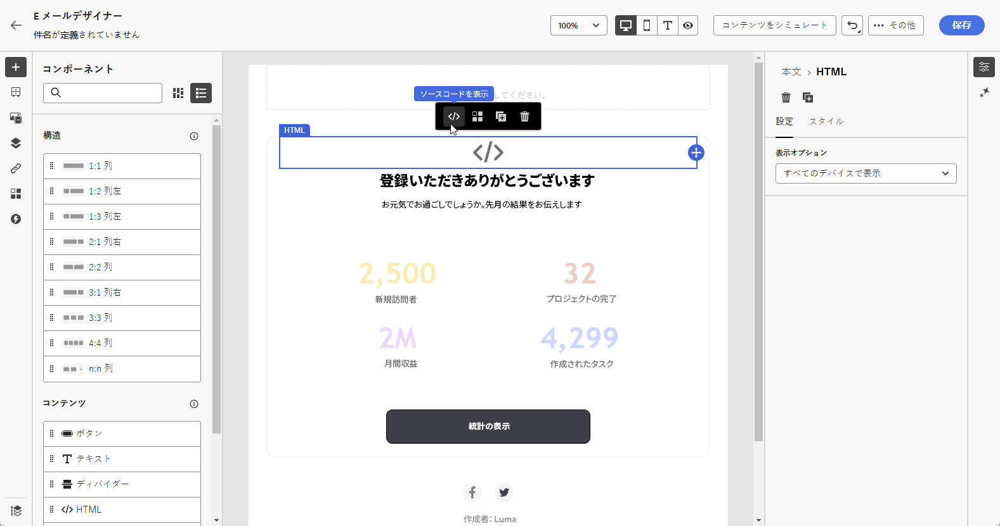

1. **[!UICONTROL アセットセレクターを編集]** メニューで、**[!UICONTROL HTMLに移動し]** 「**[!UICONTROL Assetsセレクターを開く]** をクリックします。

   または、アセットの URL をコピー&amp;ペーストすることもできます。

   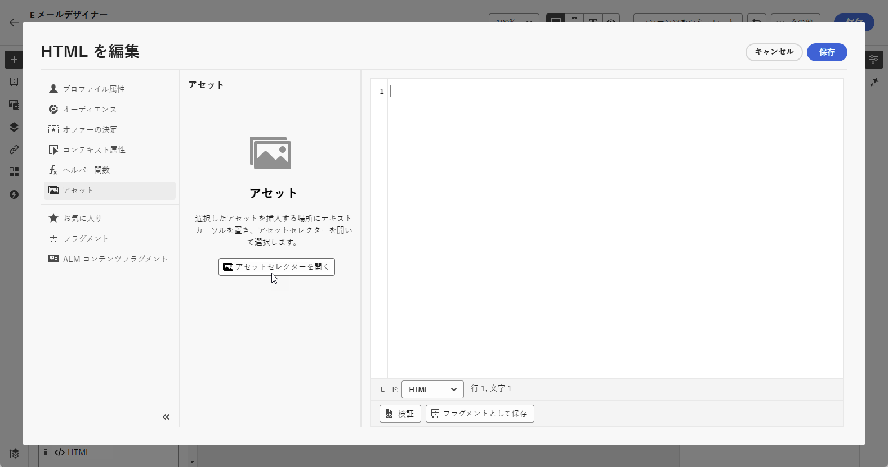

1. AEM アセットを参照し、コンテンツに追加するアセットを選択します。

1. 必要に応じて、アセット要件に合わせて画像パラメーター（高さ、幅、回転、反転、明るさ、色相など）を調整します。

   URL に追加できる画像パラメーターの包括的なリストについては、[Experience Manager ドキュメント ](https://experienceleague.adobe.com/ja/docs/dynamic-media-developer-resources/image-serving-api/image-serving-api/http-protocol-reference/command-reference/c-command-reference) を参照してください。

   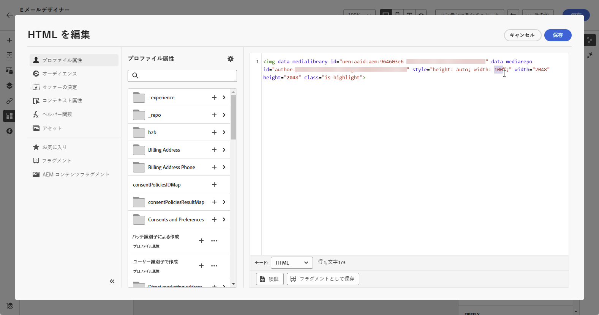

1. 「**[!UICONTROL 保存]**」をクリックします。

コンテンツに dynamic media が含まれるようになりました。 Experience Managerで行った更新は、Journey Optimizerに自動的に表示されます。

## テキストオーバーレイをパーソナライズ {#text-overlay}

既存のテキストオーバーレイを選択した新しいテキストに置き換えることで、Dynamic Media を簡単にカスタマイズし、シームレスな更新とパーソナライゼーションを可能にします。

例えば、実験機能を使用して、処理ごとに異なるテキストで置き換えることで、既存のテキストオーバーレイを更新し、メッセージを開いたときにプロファイルごとにカスタマイズされるようにします。

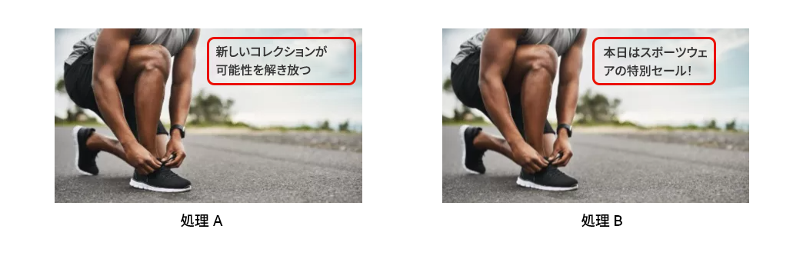

1. **[!UICONTROL HTML コンポーネント]** をコンテンツにドラッグ&amp;ドロップします。

1. **[!UICONTROL ソースコードを表示]** を選択します。

1. **[!UICONTROL HTMLを編集]** メニューから、**[!UICONTROL Assetsにアクセスし]** その後 **[!UICONTROL アセットセレクターを開く]** をクリックします。

   アセットの URL をコピーして貼り付けることもできます。

1. AEM アセットを参照して、コンテンツに追加するアセットを選択します。

1. オーバーレイを目的のテキストに置き換えます。

   

1. 画像パラメーターの更新：

   * **レイヤー**：テキストを配置するベース要素を入力します。
   * **サイズ**：テキストブロックのサイズを更新します。
   * **TextAttr**：テキストフォントのサイズを調整します。
   * **位置**：画像内のテキストの位置を設定します。

   >[!WARNING]
   >
   >Dynamic Media を更新するには、レイヤーパラメーターが必要です。

   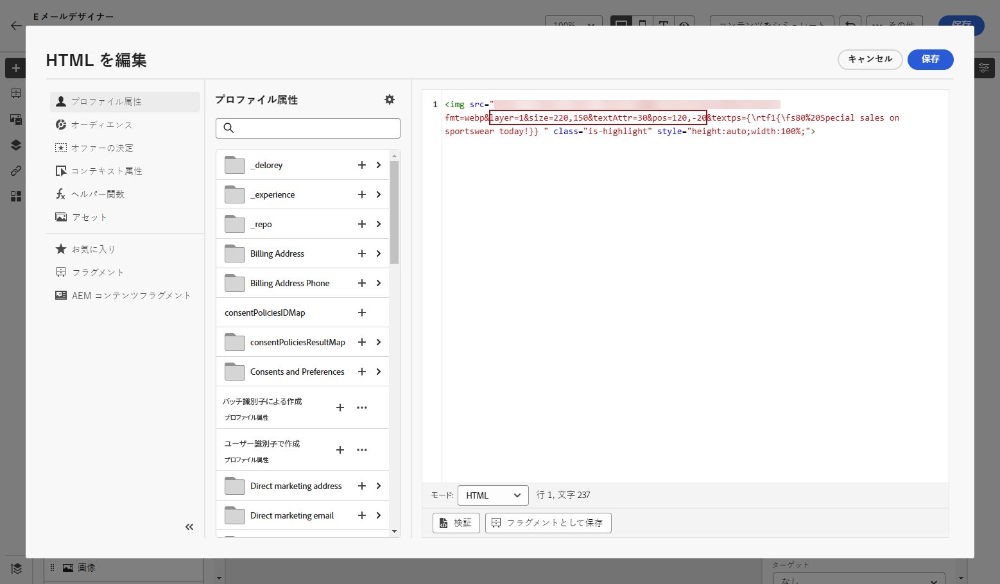

1. 「**[!UICONTROL 保存]**」をクリックします。

これで、更新されたテキストオーバーレイがコンテンツに含まれます。

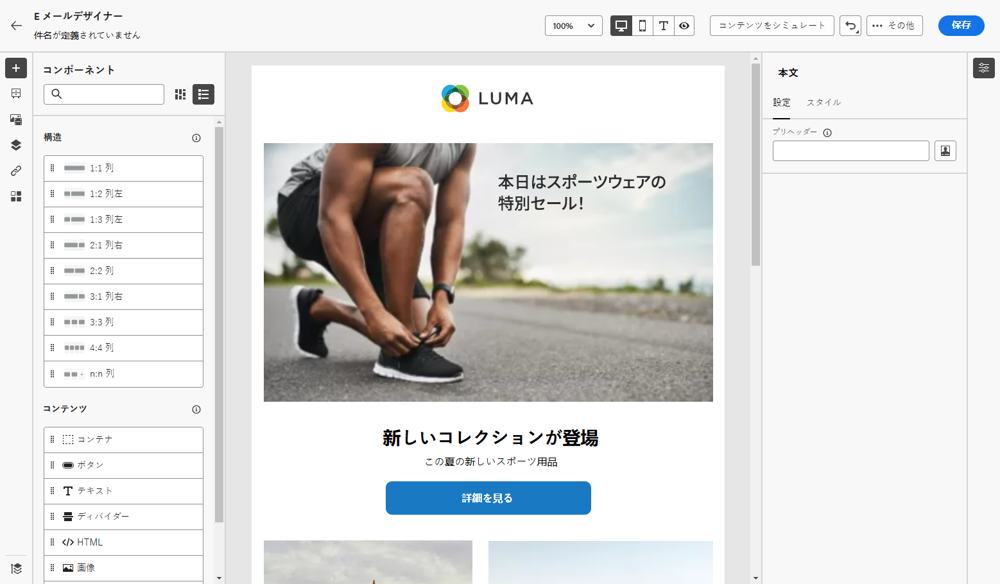

## Dynamic Media テンプレートの追加と管理 {#dynamic-media-template}

Journey Optimizerで Dynamic Media テンプレートを簡単に追加し、必要に応じてメディアコンテンツを更新できます。 パーソナライゼーションフィールドをメディアに組み込むことができるようになり、Journey Optimizer内で、よりカスタマイズされた魅力的なコンテンツを作成できるようになりました。

詳しくは、[Dynamic Media テンプレート ](https://experienceleague.adobe.com/ja/docs/dynamic-media-classic/using/template-basics/quick-start-template-basics) を参照してください。

### 画像コンポーネントを使用 {#image-component}

画像コンポーネントを使用して、動的テンプレートをコンテンツに直接挿入できます。

1. キャンペーンまたはジャーニーを開き、コンテンツにアクセスします。

1. **画像コンポーネント** をレイアウトにドラッグ&amp;ドロップします。

   画像コンポーネントについて詳しくは、[ このページ ](../email/content-components.md) を参照してください。

   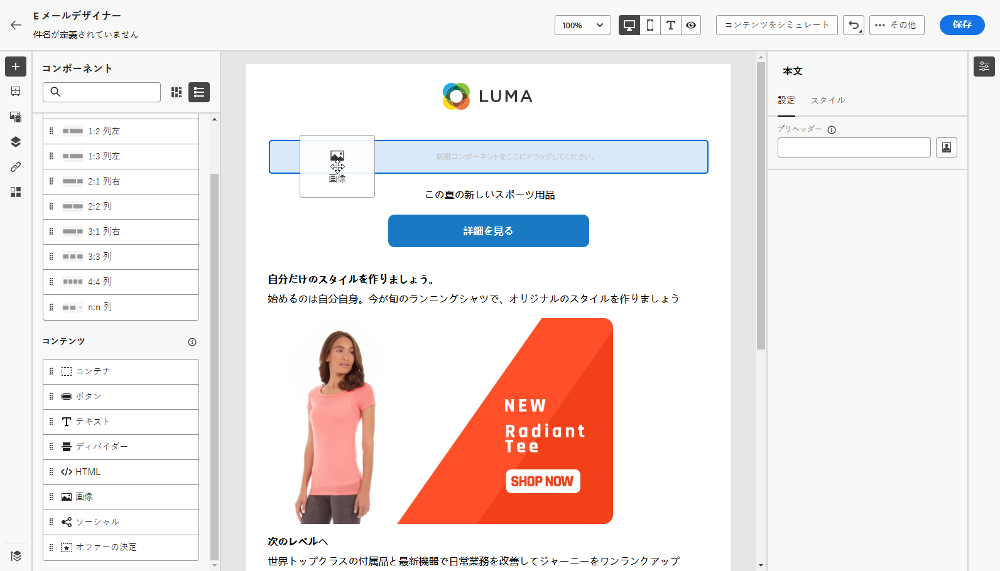

1. AEM アセットを参照し、コンテンツに追加する Dynamic Media テンプレートを選択します。

   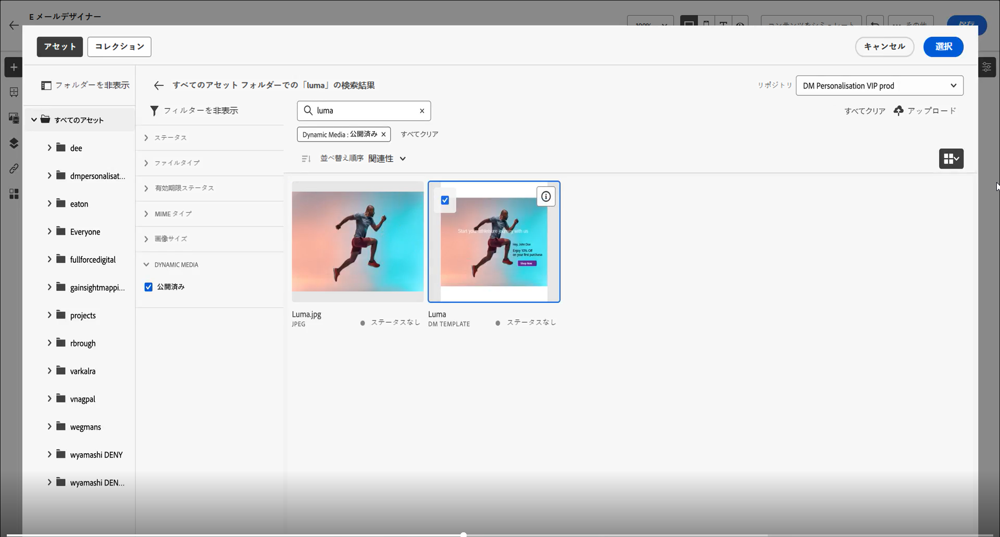

1. **画像設定** で、Dynamic Media テンプレートのパラメーターに移動します。

   使用可能なフィールドは、Adobe Experience Managerでの [ テンプレートの作成 ](https://experienceleague.adobe.com/ja/docs/dynamic-media-classic/using/template-basics/creating-template-parameters#creating_template_parameters) 時に追加されたパラメーターによって異なります。

   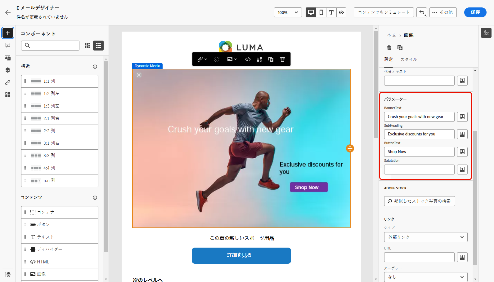

1. 様々なフィールドに入力し、パーソナライゼーションエディターを使用してパーソナライズされたコンテンツを追加します。 プロファイル名、市区町村、その他の関連する詳細など、任意の属性を使用して、よりカスタマイズされたエクスペリエンスを作成できます。

   パーソナライゼーションの詳細については、[ このページ ](../personalization/personalize.md) を参照してください。

   

1. 条件付きコンテンツを Dynamic Media コンポーネントに適用して、コンテンツの様々なバリアントを生成できます。 [詳細情報](../personalization/dynamic-content.md)

1. 「**[!UICONTROL 保存]**」をクリックします。

テストを実行し、コンテンツを検証したら、メッセージをオーディエンスに送信できます。

### HTML コンポーネントの使用 {#html-component}

HTML コンポーネントを使用して、動的テンプレートをコンテンツに直接挿入できます。

1. キャンペーンまたはジャーニーを開き、コンテンツにアクセスします。

1. **HTML コンポーネント** をレイアウトにドラッグ&amp;ドロップします。

   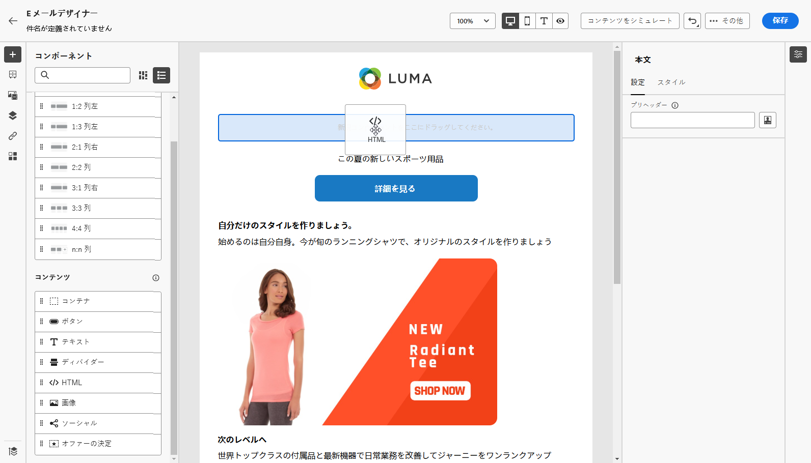

1. **[!UICONTROL ソースコードを表示]** を選択します。

   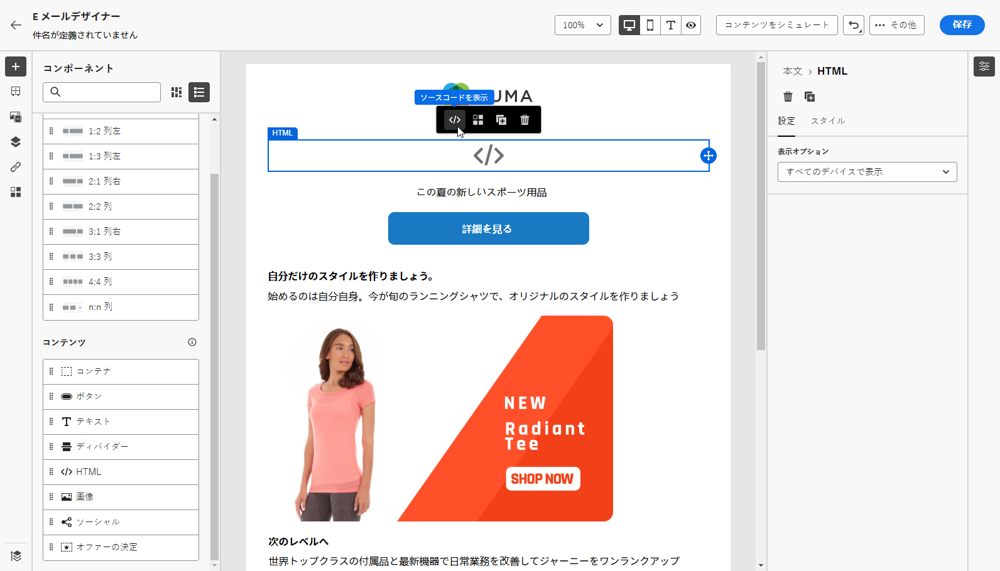

1. **[!UICONTROL HTMLを編集]** メニューから、**[!UICONTROL Assetsにアクセスし]** その後 **[!UICONTROL アセットセレクターを開く]** をクリックします。

   アセットの URL をコピーして貼り付けることもできます。

1. 必要に応じて、アセット要件に合わせて画像テキストパラメーターを調整します。

   

1. 「**[!UICONTROL 保存]**」をクリックします。

テストを実行し、コンテンツを検証したら、メッセージをオーディエンスに送信できます。

<!--
## Personalization with Text Overlay

Easily customize any dynamic media by replacing the existing text overlay with new text of your choice, allowing for seamless updates and personalization.

In this example, our goal is to update the existing text overlay by replacing it with a new validity date and adding a personalization block, ensuring it is customized for each profile when they open their messages.

1. Drag and drop an **[!UICONTROL HTML component]** into your content.

1. Select **[!UICONTROL Show the source code]**.

1. From the **[!UICONTROL Edit HTML]** menu, access **[!UICONTROL Assets]** then **[!UICONTROL Open asset selector]**.

    You can also simply copy and paste your assets URL.

1. Browse through your AEM assets and select the one you want to add to your content.

1. Replace the overlay with the desired text.

    Here we change the validity date from 31st December 2024 to the 1st July 2025.

1. Add the required personalization fields to your image.

1. Click **[!UICONTROL Save]**.

Your content now includes your updated text overlay and personalization.

## Add Dynamic media conditional content

Enable conditional content in your dynamic media to better target your audience and deliver a more personalized experience.

1. Drag and drop an **[!UICONTROL HTML component]** into your content.

1. Select **[!UICONTROL Show the source code]**.

1. From the **[!UICONTROL Edit HTML]** menu, access **[!UICONTROL Assets]** then **[!UICONTROL Open asset selector]**.

    You can also simply copy and paste your assets URL.

1. Browse through your AEM assets and select the one you want to add to your content.

1. Once your dynamic media is inserted to your content, select **[!UICONTROL Enable conditional]** content from your HTML component toolbar to create your different user experiences. 

1. From the Variant - 1, click **[!UICONTROL Select condition]** to fine tune your audience.

1. Choose your condition or create a new one if needed and click **[!UICONTROL Select]**.

    [Learn more about conditions](../personalization/create-conditions.md)

1. Select your **[!UICONTROL Component]** and access the **[!UICONTROL Settings]** menu.

1. In the **[!UICONTROL Custom Attributes]** menu, populate the Dynamic Media text and personalization fields to customize the content for your audience.

-->
