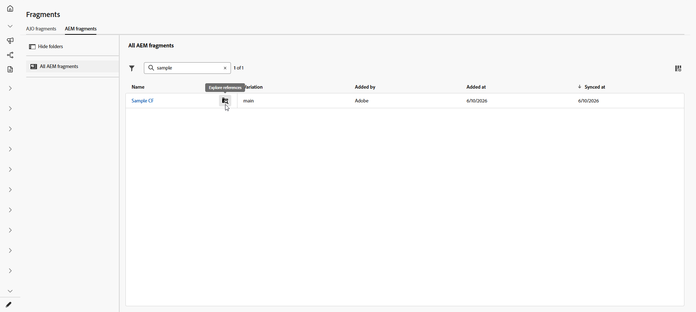
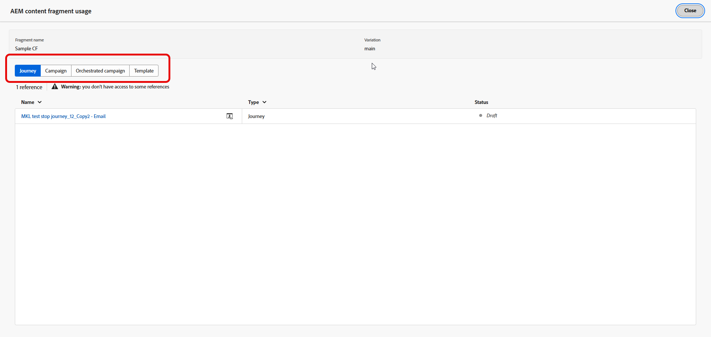

# Adobe Experience Manager コンテンツフラグメントの管理 {#aem-fragments}

Adobe Experience Manager as a Cloud ServiceまたはManaged ServicesとAdobe Journey Optimizerを統合することで、AEM コンテンツフラグメントをコンテンツで使用し、Journey Optimizerから離れることなくフラグメントのステータスを確認できます。

ジャーニーまたはCampaignですでに使用されているフラグメントを再公開すると、Adobe Experience Managerでフラグメントが&#x200B;**公開**&#x200B;された後に同期タイマーが開始されます。 更新されたコンテンツは、通常、Journey Optimizerで単一ジャーニーおよびキャンペーンの場合は約&#x200B;**5分以内に利用できます**。バッチ配信の場合は、**次の処理バッチ**&#x200B;に変更が表示されます。 [Adobe Experience Manager コンテンツフラグメントの操作](aem-fragments.md)を参照してください。 遅延が発生した場合は、そのフラグメントをJourney Optimizerから手動で同期して、最新の公開済みバージョンを取得できます。

## AEM コンテンツフラグメントへのアクセス {#access-aem-fragments}

1. **[!UICONTROL コンテンツ管理]** メニューから、**[!UICONTROL フラグメント]**&#x200B;を選択します。

1. 「**[!UICONTROL AEM フラグメント]**」タブを開いて、Adobe Experience Managerから使用可能なコンテンツフラグメントを表示します。

1. フラグメント リストから、から&#x200B;**[!UICONTROL 参照を検索]**&#x200B;をクリックします。

   

1. ステータスと使用可能なアクションを確認するには、フラグメントを選択します。

   * **[!UICONTROL 参照を検索]**: フラグメントを使用するジャーニー、キャンペーン、オーケストレーションされたキャンペーン、およびテンプレートを参照します。
   * **[!UICONTROL AEMで開く]**: Adobe Experience Managerでフラグメントを開いて、編集または再公開します。
   * **[!UICONTROL Sync]**：通常の同期ウィンドウの後に再公開されたコンテンツが表示されない場合など、Adobe Experience ManagerからJourney Optimizerに最新の公開済みバージョンを取り込みます。 コントロールが無効になっている場合、フラグメントはExperience Managerで公開されているバージョンと既に一致します。

     

1. **[!UICONTROL Details]** メニューでは、メタデータを確認し、同期されたペイロードをプレビューできます。

   * **[!UICONTROL 名前]**: Adobe Experience Managerから読み込まれたコンテンツフラグメントのタイトル。
   * **[!UICONTROL 説明]**：説明がAdobe Experience Managerから読み込まれました。
   * **[!UICONTROL バリエーション]**：現在、このフラグメントに対して表示されている公開済みのバリエーション。
   * **[!UICONTROL リポジトリ ID]**: Adobe Experience Managerのフラグメントのリポジトリ ID。
   * **[!UICONTROL AEM フラグメント ID]**:Adobe Experience Managerの一意のコンテンツフラグメント ID。
   * **[!UICONTROL タグ]**: Adobe Experience Managerで割り当てられたタグ。組織とサンドボックスのセレクターにフラグメントが表示されるかどうかを判断するJourney Optimizerのイネーブルメントタグが含まれます。 [ タグの作成と割り当て方法について説明します](aem-fragments.md#create-tag)
   * **[!UICONTROL JSON プレビュー]**:Journey Optimizerが使用するフラグメントコンテンツの読み取り専用JSON構造。

1. **[!UICONTROL 参照を検索]**&#x200B;で、タブを使用して、フラグメントを参照するジャーニー、キャンペーン、オーケストレーションされたキャンペーン、テンプレートを表示します。

   

➡️ [ コンテンツフラグメントの詳細](aem-fragments.md)

