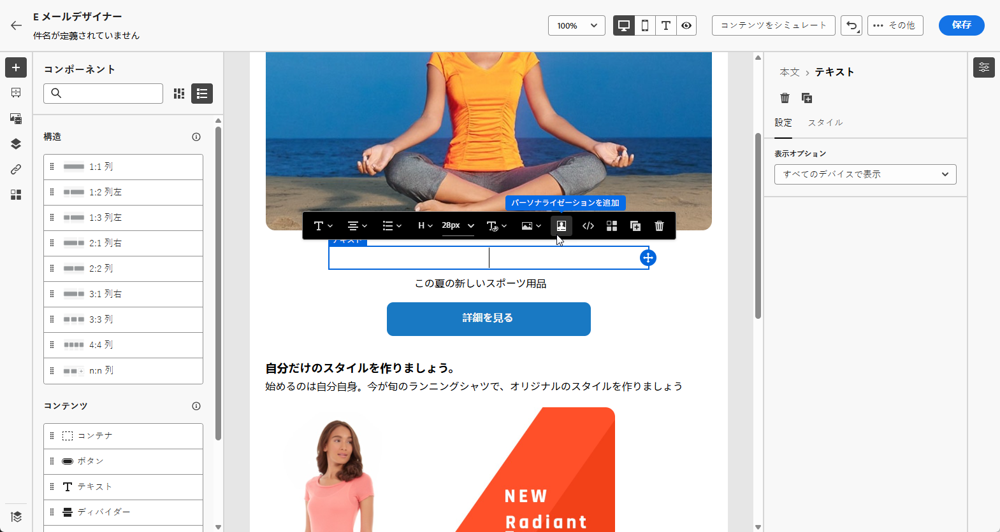
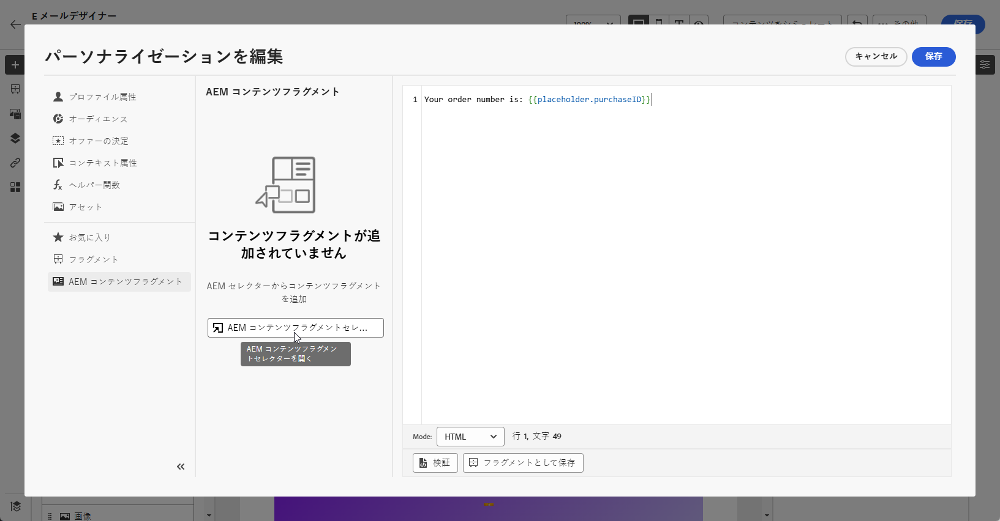
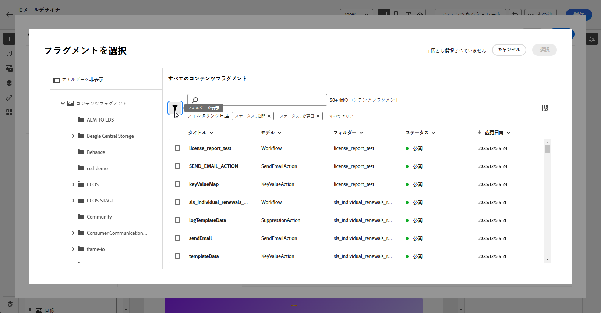
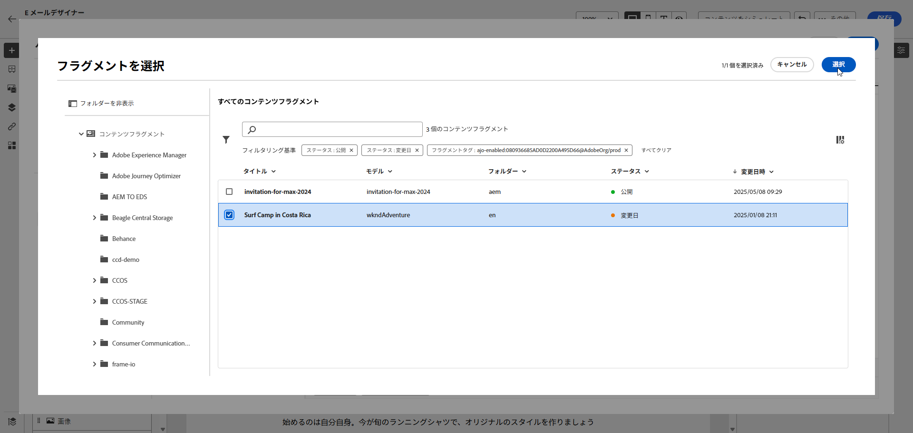
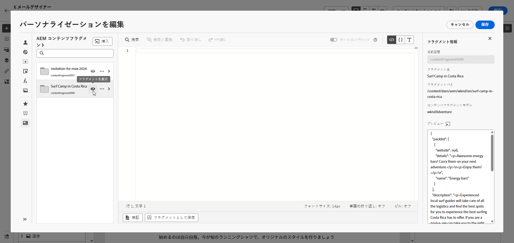
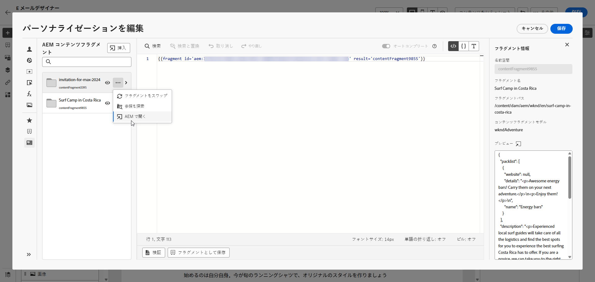
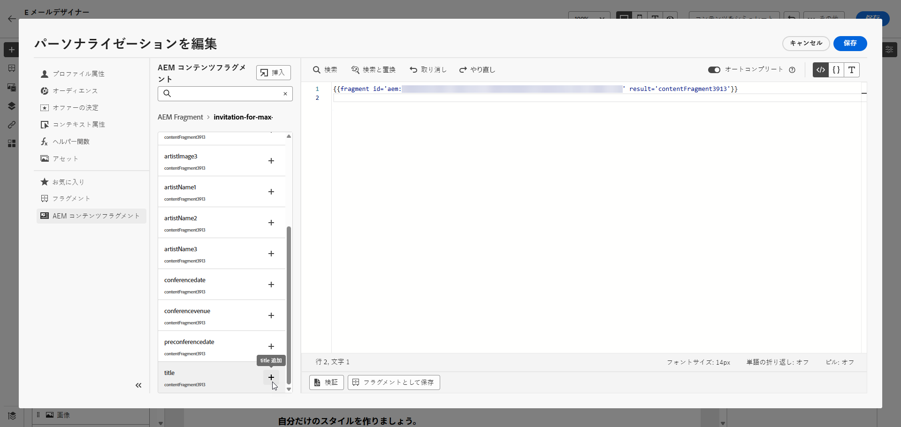
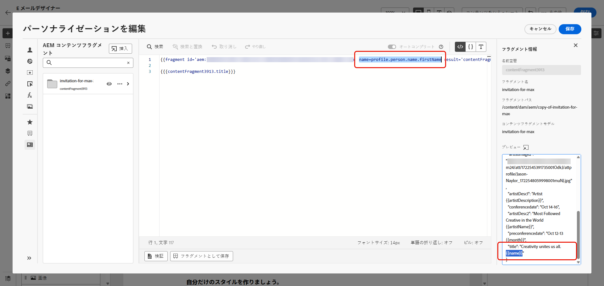

# Adobe Experience Manager コンテンツフラグメントの操作 {#aem-fragments}

>[!AVAILABILITY]
>
>この統合は、**コンテンツフラグメント**&#x200B;に対してのみ、**Adobe Experience Manager as a Cloud Service Sites**&#x200B;に適用されます。 Journey Optimizerは、**パブリッシュ**&#x200B;層からフラグメントを読み取ります（オーサーではありません）。

Adobe Experience ManagerとJourney Optimizerの連携は、次のデータフローに従います。

1. **[Dispatcherの設定](https://experienceleague.adobe.com/ja/docs/experience-manager-cloud-service/content/sites/administering/content-fragments/content-fragments-with-journey-optimizer#dispatcher-configuration){target="_blank"}**: Journey Optimizerがコンテンツフラグメント管理APIを介してAdobe Experience Manager コンテンツフラグメントにアクセスできるようにするには、まずDispatcherを設定する必要があります。 これは統合の前提条件です。

1. **[作成およびオーサー](https://experienceleague.adobe.com/en/docs/experience-manager-cloud-service/content/sites/administering/content-fragments/managing#creating-a-content-fragment)**: コンテンツは、Adobe Experience Managerでコンテンツフラグメントとして作成および設定されます。

1. **[タグ付け](https://experienceleague.adobe.com/en/docs/experience-manager-cloud-service/content/sites/administering/content-fragments/managing#manage-tags)**: コンテンツフラグメントには、Journey Optimizer固有のタグ （`ajo-enabled:{OrgId}/{SandboxName}`）を付ける必要があります。

1. **[公開](https://experienceleague.adobe.com/en/docs/experience-manager-cloud-service/content/sites/administering/content-fragments/managing#publishing-and-previewing-a-fragment)**: コンテンツフラグメントはAdobe Experience Managerで公開され、Journey Optimizerで利用できるようになります。

1. **[アクセス](#aem-add)**: Journey Optimizerは、Adobe Experience Manager パブリッシュインスタンスから利用可能なコンテンツフラグメントをリアルタイムで取得して表示します。

1. **[統合](#aem-add)**: コンテンツフラグメントが選択され、キャンペーンまたはジャーニーに統合されます。

コンテンツフラグメントがAdobe Experience Managerで公開されると、Journey Optimizer側のコンテンツを更新するイベントが送信されます。 更新が成功すると、単一ジャーニーの場合は約5分以内に、次の処理バッチのユースケースでコンテンツフラグメントが使用可能になります。 更新がJourney Optimizerで利用可能になると、最新の公開済みコンテンツが、該当するすべてのキャンペーンとジャーニーで使用されます。

>[!AVAILABILITY]
>
>ヘルスケアのお客様の場合、統合は、Journey Optimizer Healthcare ShieldおよびAdobe Experience Manager Extended Security for Healthcare アドオン製品のライセンスを取得した場合にのみ有効になります。

## Experience Manager でのタグの作成と割り当て

>[!IMPORTANT]
>
>Journey Optimizer が Content Fragment Management API を介して Adobe Experience Manager コンテンツフラグメントにアクセスできるようにするには、まず [Dispatcher を設定](https://experienceleague.adobe.com/ja/docs/experience-manager-cloud-service/content/sites/administering/content-fragments/content-fragments-with-journey-optimizer#dispatcher-configuration){target="_blank"}する必要があります。

Journey Optimizer でコンテンツフラグメントを使用する前に、Journey Optimizer 専用のタグを作成する必要があります。

1. **Experience Manager** 環境にアクセスします。

1. **ツール**&#x200B;メニューで、「**タグ付け**」を選択します。

   

1. 「**タグを作成**」をクリックします。

1. ID が次の構文 `ajo-enabled:{AJO-OrgId}/{AJO-SandboxName}` に従っていることを確認します。

1. 「**作成**」をクリックします。

1. [Experience Manager ドキュメント](https://experienceleague.adobe.com/ja/docs/experience-manager-cloud-service/content/sites/administering/content-fragments/content-fragment-models){target="_blank"}の説明に従ってコンテンツフラグメントモデルを定義し、新しく作成した Journey Optimizer タグを割り当てます。

このリアルタイムの連携により、コンテンツが常に最新の状態に保たれるだけでなく、公開されたフラグメントの変更が、アクティブなキャンペーンやジャーニーにすぐに影響を与えます。

これで、Journey Optimizer で後で使用するためにコンテンツフラグメントの作成と設定を開始できます。詳しくは、[Experience Manager ドキュメント](https://experienceleague.adobe.com/ja/docs/experience-manager-cloud-service/content/sites/administering/content-fragments/managing){target="_blank"}を参照してください。

## Experience Manager コンテンツフラグメントの追加 {#aem-add}

AEM コンテンツフラグメントを作成およびパーソナライズした後、それを Journey Optimizer キャンペーンまたはジャーニーに読み込めるようになりました。

1. [キャンペーン](../campaigns/create-campaign.md)または[ジャーニー](../building-journeys/journey-gs.md)を作成します。

1. AEM コンテンツフラグメントにアクセスするには、任意のテキストフィールド内のをクリックするか、HTML コンテンツコンポーネントを通じてソースコードを開きます。

   

1. 左側のペインの **[!UICONTROL AEM コンテンツフラグメント]**&#x200B;メニューで、「**[!UICONTROL AEM CF セレクターを開く]**」をクリックします。

   

1. リストを参照し、**[!UICONTROL コンテンツフラグメント]**&#x200B;を選択して、Journey Optimizer コンテンツに読み込みます。

   >[!NOTE]
   >
   > フラグメントに1つ以上の&#x200B;**公開済み** バリエーションがある場合、**[!UICONTROL バリエーション]** ドロップダウンがセレクターに表示されます。 **[!UICONTROL バリエーション]**&#x200B;が選択されていない場合、**メイン** バリエーションが自動的に使用されます。 詳しくは、[ コンテンツフラグメントのバリエーションの操作](#aem-variations)を参照してください。

1. 「**[!UICONTROL フィルターを表示]**」をクリックして、コンテンツフラグメントリストを微調整します。

   デフォルトでは、コンテンツフラグメントフィルターは承認済みコンテンツのみを表示するようにプリセットされています。

   

1. **[!UICONTROL コンテンツフラグメント]**&#x200B;を選択したら、**[!UICONTROL 選択]**&#x200B;をクリックして追加します。

   

1. 「**[!UICONTROL フラグメントを表示]**」をクリックして、フラグメント情報を表示します。**[!UICONTROL フラグメント情報]**&#x200B;メニューを開くと、エディターは読み取り専用モードになります。

   Adobe Experience Manager でフラグメントを表示するには、右側のメニューから「**[!UICONTROL プレビュー]**」を選択します。

   

1. をクリックして、フラグメントの詳細メニューにアクセスします。

   * **[!UICONTROL フラグメントをスワップ]**
   * **[!UICONTROL 参照を探索]**
   * **[!UICONTROL AEM で開く]**

   

1. **[!UICONTROL フラグメント]**&#x200B;から目的のフィールドを選択して、コンテンツに追加します。

   <!--
    Note that if you choose to copy the value, any future updates to the Content Fragment will not be reflected in your campaign or journey. However, using dynamic placeholders ensures real-time updates.-->

   

1. コンテンツフラグメント属性に保存されている画像URL （例：フラグメントモデルのパスまたはURL フィールド）を表示するには、HTMLに`` タグとフラグメント属性をソースとして挿入します。例：

   ```html
   
   ```

   >[!NOTE]
   >
   >Adobe Experience Managerの相対的な画像URLはサポートされていません。**絶対** URLを使用してください。

1. **丸薬：オフ**&#x200B;を選択して、丸薬のエクスペリエンスを有効にし、長い属性パスを非表示にして読みやすさを向上させます。

   

1. Adobe Experience Managerで作成された&#x200B;**パーソナライゼーションプレースホルダー**&#x200B;をフラグメントテキスト内で使用するには、Adobe Experience Managerのコンテンツフラグメントで次のように定義します。`{{name}}`。

   Journey Optimizerでは、これらのトークンはプレースホルダーです。 **丸薬**&#x200B;のエクスペリエンスがオンになっている状態で、右側のパネルの&#x200B;**[!UICONTROL AEM コンテンツフラグメント]** セクションにフラグメントフィールドと共に表示されます。

1. リアルタイムのパーソナライゼーションを有効にするには、**[!UICONTROL コンテンツフラグメント]**&#x200B;内で使用されるすべてのプレースホルダーを、フラグメントヘルパータグ内のパラメーターとしてユーザーが明示的に宣言する必要があります。次のように、これらのプレースホルダーをプロファイル属性、コンテキスト属性、静的文字列、または定義済み変数にマッピングします。

   1. **プロファイルまたはコンテキスト属性のマッピング**：プレースホルダーをプロファイルまたはコンテキスト属性に割り当てます（例：name = profile.person.name.firstName）。

   1. **静的文字列マッピング**：二重引用符で囲んで固定文字列値を割り当てます（例：name = &quot;John&quot;）。

   1. **変数マッピング**：同じ HTML 内で以前に宣言された変数を参照します（例：name = &#39;variableName&#39;）。
この場合、次の構文を使用して、フラグメント ID を追加する前に、**_variableName_** が宣言されていることを確認します。

      ```html
       
      ```

   次の例では、**_month_** プレースホルダーが、フラグメント内の&#x200B;**_profile.person.birthDate_**&#x200B;属性にマッピングされています。

   {zoomable="yes"}

1. 「**[!UICONTROL 保存]**」をクリックします。メッセージのコンテンツをテストして確認するには、[この節](../content-management/preview.md)を参照してください。

   <!--Note that the Content Fragment you selected stays active for this message. When you open the Personalization Editor in another field or content block, you can keep working with the same fragment from the **[!UICONTROL AEM Content Fragment]** section and add more fields without reopening **[!UICONTROL Open AEM CF selector]**.-->

テストを実行してコンテンツを検証したら、[キャンペーンを送信](../campaigns/review-activate-campaign.md)したり、オーディエンスに[ジャーニーを公開](../building-journeys/publish-journey.md)したりできます。

Adobe Experience Manager を使用すると、コンテンツフラグメントが使用されている Journey Optimizer キャンペーンまたはジャーニーを識別できます。詳しくは、[Adobe Experience Manager ドキュメント](https://experienceleague.adobe.com/ja/docs/experience-manager-cloud-service/content/sites/administering/content-fragments/extension-content-fragment-ajo-external-references){target="_blank"}を参照してください。

## コンテンツフラグメントのバリエーションの操作 {#aem-variations}

Adobe Experience Managerでは、各コンテンツフラグメントは次の要素で構成されています。

* **Main**：常に存在するフラグメントのコアコンテンツは削除できず、すべてのバリエーションの基礎となります。
* **バリエーション**：作成者が特定のチャネルまたはシナリオ用に作成する&#x200B;**メイン**&#x200B;の1つ以上の置換。 バリエーションはフラグメント内に存在し、個別のアセットとしてではなく、**Main**&#x200B;と比較して同期できます。

バリエーションの使用例：

* プッシュ通知のコピーの短いバージョンとメールの長いバージョン。
* 別のフラグメントを作成することなく、地域のトーンを調整。
* チャネル別メッセージ（モバイルと比較したwebなど）。

➡️ [詳しくは、Adobe Experience Manager ドキュメント ](https://experienceleague.adobe.com/en/docs/experience-manager-65/content/assets/content-fragments/content-fragments-variations)を参照してください

Journey Optimizerでは、フラグメントを挿入する際に使用するバリエーションを選択できるので、フラグメントを複製することなく、Adobe Experience Managerの同じソースコンテンツの異なるレンディションに依存して、様々なキャンペーンやジャーニーを作成できます。

バリエーションを選択するには：

1. [ キャンペーン ](../campaigns/create-campaign.md)または[ ジャーニー](../building-journeys/journey-gs.md)を開きます。

1. 任意のテキストフィールドでをクリックするか、HTML コンテンツコンポーネントからHTML ソースを開きます。

1. **[!UICONTROL AEM コンテンツフラグメント]**&#x200B;から、**[!UICONTROL CF セレクターを開く]**&#x200B;をクリックします。

   

1. テーブルビューでロケール固有のAdobe Experience Manager コンテンツフラグメントを選択するには、**[!UICONTROL テーブルのカスタマイズ]**&#x200B;を使用して&#x200B;**[!UICONTROL 言語]**&#x200B;列を追加します。 ロケール値がテーブルに表示され、適切なフラグメントを特定して選択できます。

   

1. **[!UICONTROL コンテンツフラグメント]**&#x200B;を選択します。

1. をクリックして、**[!UICONTROL 詳細]** メニューを開きます。 フラグメントに1つ以上の公開済みバリエーションがある場合、フラグメントの詳細の横に「**[!UICONTROL バリエーション]**」ドロップダウンが表示されます。

   

1. **[!UICONTROL クイックの詳細]** メニューで「**[!UICONTROL 参照を検索]**」をクリックすると、Adobe Experience Managerで関連オプションを開いて、バリエーションの詳細、プレビュー、プルーフが利用可能な場合に表示されます。

1. バリエーションを選択し、**[!UICONTROL 選択]**&#x200B;をクリックします。

   >[!NOTE]
   >
   > バリエーションを選択しない場合、またはバリエーションのサポートが利用可能になる前にフラグメントが追加された場合、Journey Optimizerは配信時に&#x200B;**Main** バリエーションを自動的に使用します。

バリエーションを含むフラグメントを挿入した後、Adobe Experience Managerでフラグメントを再公開すると、アクティブなキャンペーンまたはジャーニー内の&#x200B;**参照バリエーション**&#x200B;ごとに自動的に更新されます。 プレビューとプルーフでは、選択したバリエーションと、そのバリエーションの最新の公開コンテンツが引き続き使用されます。
