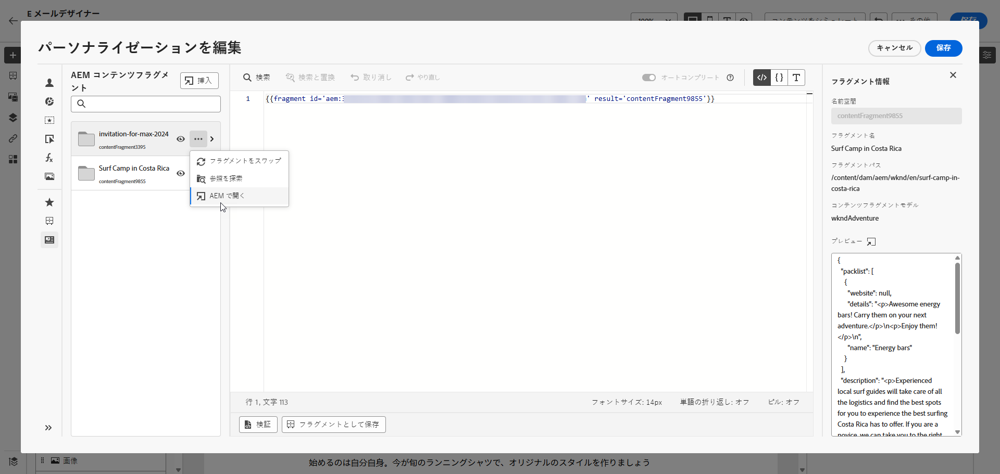

# Adobe Experience Manager コンテンツフラグメント {#aem-fragments}

>[!AVAILABILITY]
>
> ヘルスケアのお客様の場合、統合は、Journey Optimizer Healthcare Shield およびAdobe Experience Manager Enhanced Security アドオン製品のライセンスを取得した場合にのみ有効になります。

Adobe Experience Manager as a Cloud ServiceをAdobe Journey Optimizerと統合することで、AEM コンテンツフラグメントをJourney Optimizer コンテンツにシームレスに組み込めるようになりました。 この合理化された接続により、AEM コンテンツへのアクセスと活用のプロセスが簡略化され、パーソナライズされた動的なキャンペーンやジャーニーの作成が可能になります。

AEM コンテンツフラグメントについて詳しくは、Experience Manager ドキュメントの [ コンテンツフラグメントの操作 ](https://experienceleague.adobe.com/en/docs/experience-manager-cloud-service/content/sites/administering/content-fragments/overview) を参照してください。

## 制限事項 {#limitations}

* 誤ってエラーが発生するリスクを減らすために、コンテンツフラグメントを公開するアクセス権を持つユーザーの数を制限することをお勧めします。

* 多言語コンテンツの場合、手動フローのみがサポートされます。

* バリエーションは、現在サポートされていません。

## Experience Managerでのタグの作成と割り当て

Journey Optimizerでコンテンツフラグメントを使用する前に、Journey Optimizer専用のタグを作成する必要があります。

1. **Experience Manager** 環境にアクセスします。

1. **ツール** メニューから「**タグ付け**」を選択します。

   

1. **タグを作成** をクリックします。

1. ID が次の構文 `ajo-enabled:{AJO-OrgId}/{AJO-SandboxName}` に従っていることを確認します。

1. 「**作成**」をクリックします。

1. [Experience Manager ドキュメントの詳細に従ってコンテンツフラグメントモデルを定義し ](https://experienceleague.adobe.com/en/docs/experience-manager-cloud-service/content/sites/administering/content-fragments/content-fragment-models) 新しく作成したJourney Optimizer タグを割り当てます。

これで、後でJourney Optimizerで使用できるように、コンテンツフラグメントの作成と設定を開始できます。 詳しくは、[Experience Manager ドキュメント ](https://experienceleague.adobe.com/en/docs/experience-manager-cloud-service/content/sites/administering/content-fragments/managing) を参照してください。

## Experience Manager コンテンツフラグメントの追加 {#aem-add}

AEM コンテンツフラグメントを作成およびパーソナライズした後、それをジャーニーオプティマイザーキャンペーンまたはジャーニーに読み込めるようになりました。

1. [ キャンペーン ](../campaigns/create-campaign.md) または [ジャーニー](../building-journeys/journey-gs.md) を作成します。

1. AEM コンテンツフラグメントにアクセスするには、任意のテキストフィールド内で HTML コンテンツコンポーネントを使用してソースコードを開きます。

   

1. 左側のペインの **[!UICONTROL AEM コンテンツフラグメント]**&#x200B;メニューで、「**[!UICONTROL AEM CF セレクターを開く]**」をクリックします。

   

1. 使用可能なリストから&#x200B;**[!UICONTROL コンテンツフラグメント]**&#x200B;を選択して、Journey Optimizer コンテンツに読み込みます。

1. 「**[!UICONTROL フィルターを表示]**」をクリックして、コンテンツフラグメントリストを微調整します。

   デフォルトでは、コンテンツフラグメントフィルターは承認済みコンテンツのみを表示するようにプリセットされています。

   

1. **[!UICONTROL コンテンツフラグメント]**&#x200B;を選択したら、「**[!UICONTROL 選択]**」をクリックして開きます。

   

1. **[!UICONTROL フラグメントを表示]** をクリックして、フラグメント情報を表示します。 **[!UICONTROL フラグメント情報]** メニューを開くと、エディターは読み取り専用モードになります。

   右側のメニューから **[!UICONTROL プレビュー]** を選択して、Adobe Experience Managerでフラグメントを表示します。

   

1.  アイコンをクリックして、フラグメントの詳細メニューにアクセスします。

   * **[!UICONTROL フラグメントを入れ替え]**
   * **[!UICONTROL 参照を探索]**
   * **[!UICONTROL AEMで開く]**

   

1. **[!UICONTROL フラグメント]** から目的のフィールドを選択して、コンテンツに追加します。
   <!--
    Note that if you choose to copy the value, any future updates to the Content Fragment will not be reflected in your campaign or journey. However, using dynamic placeholders ensures real-time updates.-->

   

1. リアルタイムのパーソナライゼーションを有効にするには、**[!UICONTROL コンテンツフラグメント]** 内で使用されるすべてのプレースホルダーを、フラグメントヘルパータグのパラメーターとしてユーザーが明示的に宣言する必要があります。 次のメソッドを使用して、これらのプレースホルダーをプロファイル属性、コンテキスト属性、静的文字列または事前定義済みの変数にマッピングできます。

   1. **プロファイルまたはコンテキスト属性のマッピング**：プレースホルダーをプロファイルまたはコンテキスト属性（例：name = profile.person.name.firstName）に割り当てます。

   1. **静的文字列マッピング**：二重引用符で囲んで固定文字列値を割り当てます（例：name = &quot;John&quot;）。

   1. **変数マッピング**：同じHTML内で以前に宣言された変数を参照します（例：name = &#39;variableName&#39;）。
この場合、次の構文を使用して、フラグメント ID を追加する前に **_variableName_** が宣言されていることを確認します。

      ```html
       
      ```

   次の例では、「**_name_**」プレースホルダーがフラグメント内の **_profile.person.name.firstName_** 属性にマッピングされています。

   {zoomable="yes"}


1. 「**[!UICONTROL 保存]**」をクリックします。メッセージのコンテンツをテストして確認するには、[この節](../content-management/preview.md)を参照してください。

テストを実行してコンテンツを検証したら、[ キャンペーン ](../campaigns/review-activate-campaign.md) または [ジャーニー](../building-journeys/publishing-the-journey.md) をオーディエンスに送信できます。

Adobe Experience Managerを使用すると、コンテンツフラグメントが使用されているJourney Optimizer キャンペーンまたはジャーニーを特定できます。
