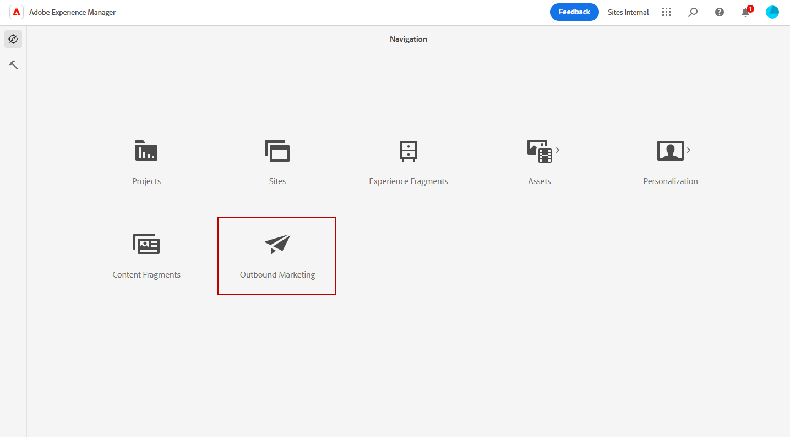
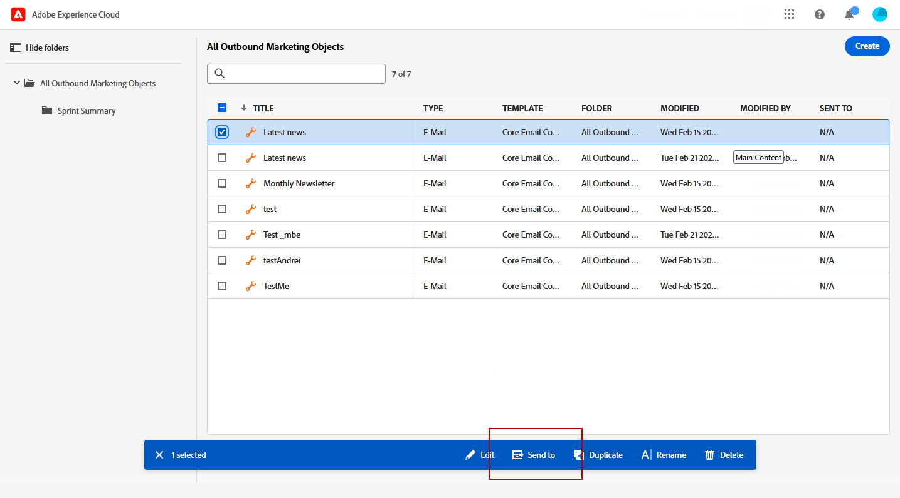
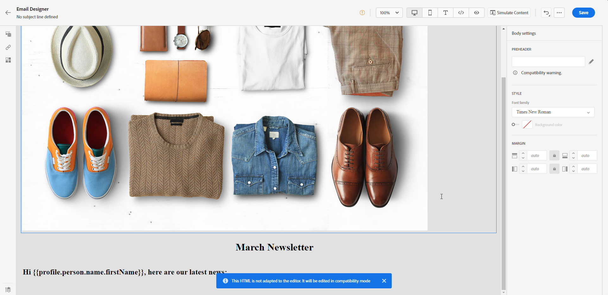
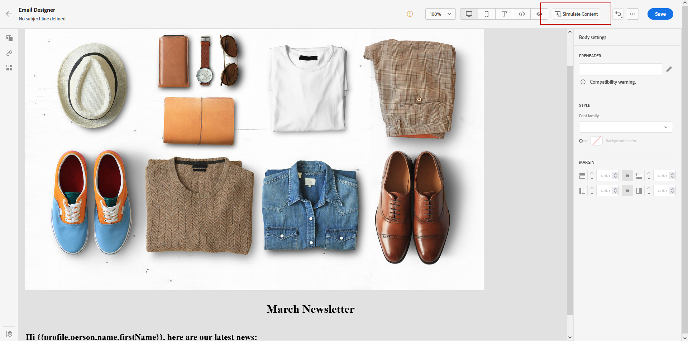

# Adobe Experience Manager テンプレートの操作 {#aem-templates}

## Adobe Experience Manager テンプレートの基本を学ぶ {#gs-aem-templates}

Adobe Journey Optimizer を使用すると、Adobe Experience Manager サイトを介してカスタマイズしたメッセージを作成できます。まず、Adobe Experience Manager のコンテンツソースを使用してテンプレートをデザインし、それらを Adobe Journey Optimizer に送信します。 共有した後は、これらのテンプレートは Adobe Journey Optimizer の E メールデザイナーでアクセスできるようになり、目的のオーディエンスにメッセージを簡単に作成して送信できます。

>[!AVAILABILITY]
>
>現在、Adobe Experience Manager との統合は、一部のユーザーのみがベータ版として利用できます。
>>ベータ版のユーザーは、[このフォーム](https://forms.office.com/pages/responsepage.aspx?id=Wht7-jR7h0OUrtLBeN7O4Wf0cbVTQ3tCpW_unE-w8-JUN1FaNlAzNkhPSUdaSkJXVFRCNTRJNVRFSy4u){target="_blank"}を使用してフィードバックを共有します。

### 前提条件 {#prerequisites}

この機能の使用を開始する前に、次の要件に従っていることを確認してください。

* **Experience Manager 設定**

  この機能は、[Adobe Experience Manager as a Cloud Service](https://experienceleague.adobe.com/docs/experience-manager-cloud-service/content/overview/introduction.html?lang=ja){target="_blank"} で使用できます。

  ベータ版プログラムの一環として、クラウドサービス設定は、Adobe Experience Manager でアドビが Adobe Journey Optimizer に接続するために実行します。

* **権限**

  コンテンツテンプレートを Adobe Journey Optimizerで 作成、編集および削除するには、**[!DNL Content Library Manager]** 製品プロファイルに含まれる **[!DNL Manage Library Items]** 権限を付与されている必要があります。[詳細情報](../administration/ootb-product-profiles.md#content-library-manager)

### ガードレールと制限{#aem-templates-limitations}

Adobe Journey Optimizer で Adobe Experience Manager の使用をさらに最適化するには、次の追加のガードレールおよび制限事項に注意する必要があります。

* Experience Manager テンプレートのパーソナライゼーションを有効にするには、適切な Journey Optimizer 構文が必要です。[詳細情報](../personalization/personalization-syntax.md)

* 一括テンプレートの書き出しは現在サポートされていません。テンプレートは個別に書き出す必要があります。

* Experience Manager および Journey Optimizer の同期は現在使用できません。Journey Optimizer にテンプレートを送信した後に Experience Manager テンプレートに変更を加えた場合、ユーザーはテンプレートを再度書き出し、Journey Optimizer に再送信する必要があります。

## テンプレートを Journey Optimizer に送信する{#aem-templates-send}

Adobe Experience Manager テンプレートを Adobe Journey Optimizer に書き出すには、次の手順に従います。

1. Adobe Experience Manager のホームページで「**[!UICONTROL アウトバウンドマーケティング]**」を選択します。

   

1. コンテンツライブラリから、事前に設定したテンプレートを使用することも、最初から作成することもできます。[詳細情報](https://experienceleague.adobe.com/docs/experience-manager-65/authoring/authoring/managing-pages.html?lang=ja#creating-a-new-page)

1. Journey Optimizer のパーソナライゼーション構文をテンプレートに組み込むことで、カスタマイズ機能を強化できます。[詳細情報](../personalization/personalization-syntax.md)

   

1. Journey Optimizer に書き出すテンプレートを選択し、詳細メニューから「**[!UICONTROL 送信先]**」を選択します。

   

1. コンテンツテンプレートの「**[!UICONTROL 名前]**」を入力し、ターゲットの「**[!UICONTROL サンドボックス]**」を選択します。

   

1. 「**[!UICONTROL 送信]**」ボタンをクリックした後、書き出し処理が開始されます。書き出しが完了すると、ユーザーインターフェイスに「（テンプレート名）が AJO に正常に送信されました」というメッセージが表示されます。

テンプレートは、選択したサンドボックスの Adobe Journey Optimizer コンテンツテンプレートに追加されます。

## Adobe Experience Manager テンプレートの使用とパーソナライズ{#aem-templates-perso}

Journey Optimizer で Experience Manager テンプレートをコンテンツテンプレートとして使用できるようになると、パーソナライゼーションなど、メールに必要なコンテンツを特定して組み込むことができます。

1. Journey Optimizer 内の&#x200B;**[!UICONTROL コンテンツテンプレート]**&#x200B;メニューから、読み込んだテンプレートにアクセスします。

   

1. **[!UICONTROL アラート]**&#x200B;ボタンをクリックすると、重要な設定がもれてないかどうかをすばやく確認できます。これにより、メッセージが正しく設定され、潜在的なエラーや問題を防ぐことができます。

   

1. **[!UICONTROL テンプレートのプロパティ]**&#x200B;ウィンドウで、「**[!UICONTROL アクセスを管理]**」ボタンを使用して、カスタムまたはコアのデータ使用ラベルをテンプレートに割り当てます。 [詳しくは、オブジェクトレベルのアクセス制御（OLAC）を参照してください](../administration/object-based-access.md)

1. Experience Manager テンプレートをさらにパーソナライズし、コンテンツにカスタムパーソナライゼーションを追加するには、「**[!UICONTROL コンテンツを編集]**」をクリックします。こうすることで、簡単に変更を加えたり、特定のニーズに合わせてテンプレートを調整したりできます。[詳細情報](../email/get-started-email-design.md)

   >[!WARNING]
   >
   > テンプレートを編集およびパーソナライズする場合は、互換性モードのみを使用できます。

1. コンテンツテンプレートの準備が整ったら、[テストして検証します](../content-management/content-templates.md#test-template)。

1. コンテンツが定義されると、**[!UICONTROL 保存済みのテンプレート]**&#x200B;コレクションを参照して、メールの新規作成時に使用できます。次に、「**[!UICONTROL このテンプレートを使用]**」を選択します。

   

1. これで、コンテンツを編集してパーソナライズできるようになりました。メールコンテンツの作成方法について詳しくは、この[ページ](../email/content-from-scratch.md)を参照してください。

   

1. パーソナライズしたコンテンツを Experience Manager のテンプレートに追加した場合は、「**[!UICONTROL コンテンツをシミュレート]**」をクリックし、テストプロファイルを使用して、メッセージでの表示をプレビューします。

[詳しくは、プレビューとテストプロファイルを参照してください](../content-management/preview-test.md)

   

1. メッセージのプレビューを表示すると、パーソナライズされた要素は、選択したテストプロファイルの対応データに自動的に置き換えられます。

   必要に応じて、「**[!UICONTROL テストプロファイルを管理]**」ボタンから追加のテストプロファイルを追加できます。

   

メールの準備ができたら、[ジャーニー](../building-journeys/journey-gs.md)または[キャンペーン](../campaigns/create-campaign.md)を設定し、アクティブ化して、メッセージが送信されるようにします。
