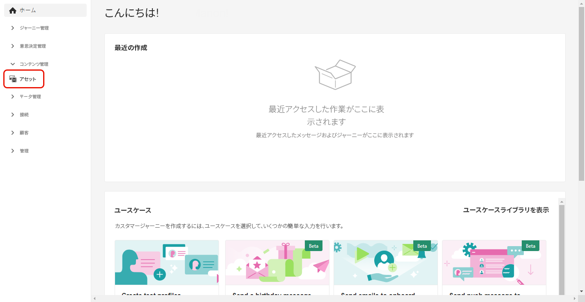
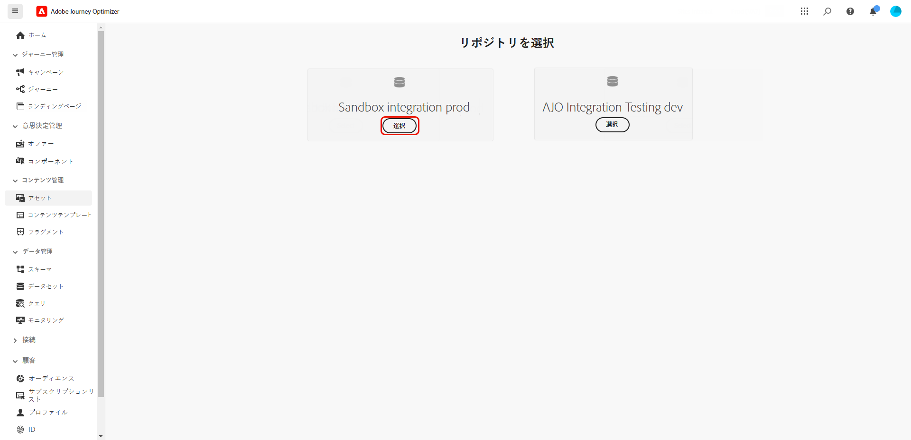
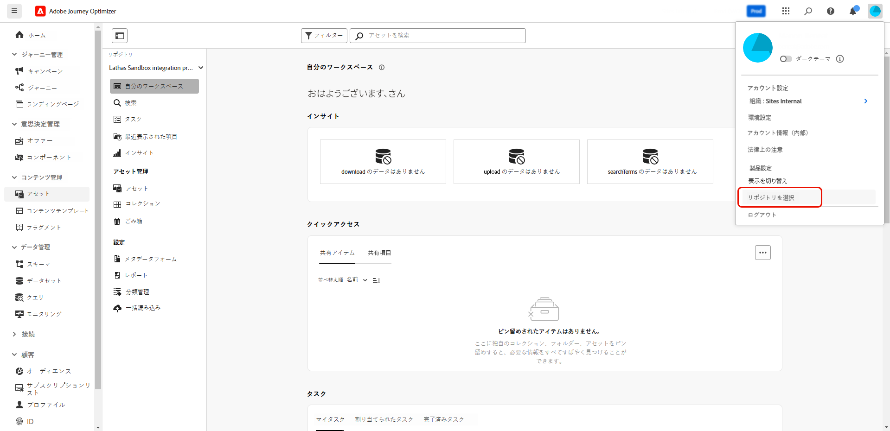
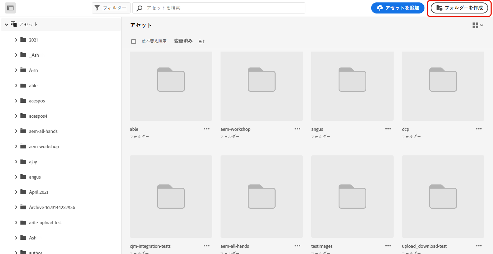
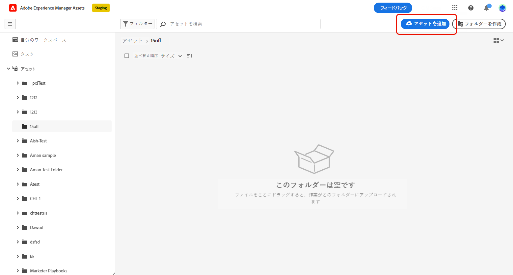
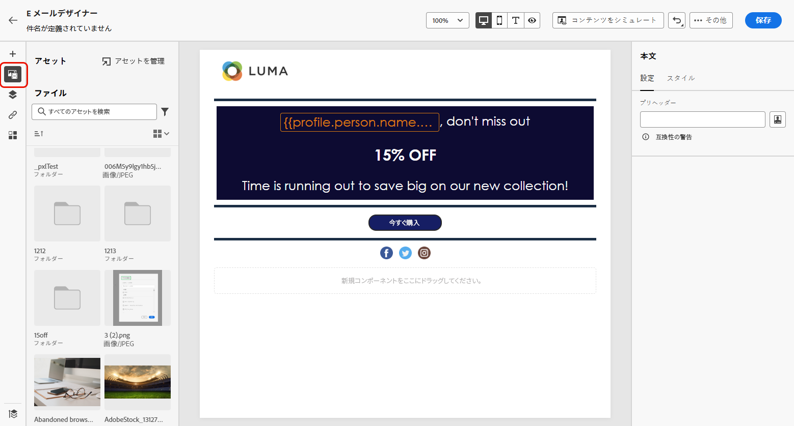
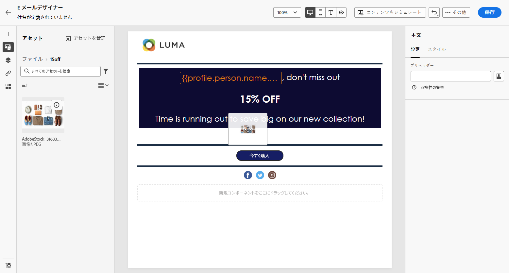
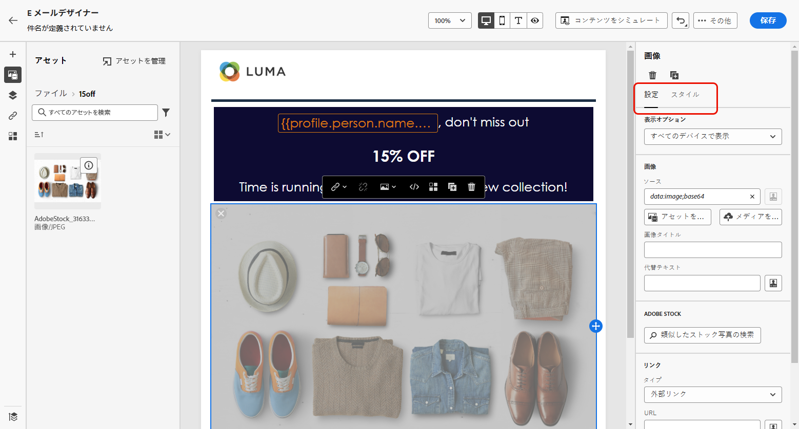

# [!DNL Experience Manager Assets] を使用したアセットの作成と管理{#experience-manager-assets}

## [!DNL Experience Manager Assets] の基本を学ぶ {#get-started-assets}

**[!DNL Adobe Experience Manager Assets]** を使用してマーケティングワークフローとクリエイティブワークフローを統合します。**[!DNL Adobe Journey Optimizer]** とネイティブに統合され、**[!DNL Assets Essentials]** または **[!DNL Assets as a Cloud Service]** へアクセスして、デジタルアセットの保存、管理、検出、配布を行います。メッセージの入力に使用できる、アセットの一元的なリポジトリを提供します。

**[!DNL Adobe Experience Manager Assets]** は、クリエイティブシステムを拡張し、デジタルアセットをエクスペリエンス配信に統合するために共同作業できる、一元化された 2 つのアセットワークスペースを提供します。

* **[!DNL Assets as a Cloud Service]**：Adobe Experience Manager Assets as a Cloud Service は、効率的なデジタルアセット管理と Dynamic Media 操作のための使いやすいクラウドソリューションを提供します。人工知能や機械学習などの高度な機能がシームレスに組み込まれています。

  詳しくは、[Adobe Experience Manager Assets as a Cloud Service ドキュメント](https://experienceleague.adobe.com/docs/experience-manager-cloud-service/content/assets/overview.html?lang=ja)を参照してください。

* **[!DNL Assets Essentials]**：Experience Manager Assets Essentials は、統合されたアセット管理と共同作業のための Assets as a Cloud Service の軽量ソリューションです。最新の簡素化されたインターフェイスにより、クリエイティブチームやマーケティングチームがデジタルアセットを簡単に保存、検出および配布できます。

  詳しくは、[Adobe Experience Manager Assets Essentials のドキュメント](https://experienceleague.adobe.com/docs/experience-manager-assets-essentials/help/introduction.html?lang=ja){target="_blank"}を参照してください。

契約に応じて、**[!DNL Adobe Experience Manager Assets Essentials]** または **[!DNL Adobe Experience Manager Assets as a Cloud Service]** には、左側のメニューの「**[!UICONTROL アセット]**」セクションを使用して **[!DNL Adobe Journey Optimizer]** から直接アクセスできます。また、[メールのコンテンツをデザイン](../email/get-started-email-design.md)する際に、アセットやフォルダーにアクセスすることもできます。

## 前提条件{#assets-prerequisites}

>[!BEGINTABS]

>[!TAB Adobe Experience Manager Assets Essentials]

[!DNL Adobe Experience Manager Assets Essentials] を使用する前に、ユーザーを **Assets Essentials コンシューマーユーザー**&#x200B;または **Assets Essentials ユーザー**&#x200B;製品プロファイルに追加する必要があります。詳しくは、[Assets Essentials のドキュメント](https://experienceleague.adobe.com/docs/experience-manager-assets-essentials/help/get-started-admins/deploy-administer.html?lang=ja#add-user-groups){target="_blank"}を参照してください。

>[!NOTE]
>2022年1月6日（PT）より前に入手した Journey Optimizer 製品の場合、組織に **[!DNL Adobe Experience Manager Assets Essentials]** をデプロイする必要があります。詳しくは、[Assets Essentials のデプロイ](https://experienceleague.adobe.com/docs/experience-manager-assets-essentials/help/deploy-administer.html?lang=ja){target="_blank"}の節をご覧ください。

>[!TAB Adobe Experience Manager Assets as a Cloud Service]

**[!DNL Adobe Experience Manager Assets as a Cloud Service]** を使用する前に、ユーザーを Assets Cloud Services に追加する必要があります。詳しくは、[Adobe Experience Manager Assets as a Cloud Service](https://experienceleague.adobe.com/docs/experience-manager-cloud-service/content/security/ims-support.html?lang=ja) を参照してください。

>[!ENDTABS]

## アセットのアップロードと挿入{#add-asset}

ファイルを **[!DNL Assets Essentials]** または **[!DNL Assets as a Cloud Service]** に読み込むには、まず保存先のフォルダーを参照または作成する必要があります。その後、メールコンテンツに挿入できます。

1. [!DNL Adobe Journey Optimizer] のホームページで、**[!UICONTROL コンテンツ管理]**&#x200B;メニューから「**[!UICONTROL Assets]**」タブを選択して **[!DNL Assets Essentials]** または **[!DNL Assets as a Cloud Service]** にアクセスします。

   

1. Journey Optimizer でアセットのリポジトリを選択します。このソリューションを所有している場合は、**[!DNL Assets Essentials]** または **[!DNL Assets as a Cloud Service]** リポジトリを選択できます。

   

+++ アセットリポジトリを切り替える方法を説明します。

   アセットリポジトリを変更するには、右上のアカウントアイコンを選択し、「**[!UICONTROL リポジトリを選択]**」をクリックします。

   

+++

1. 中央のセクションまたはツリービューでフォルダーをダブルクリックして開きます。

   また、「**[!UICONTROL フォルダーを作成]**」をクリックして新しいフォルダーを作成することもできます。

   

1. 選択または作成したフォルダーで、「**[!UICONTROL アセットを追加]**」をクリックして、新しいアセットをフォルダーにアップロードします。

   

1. **[!UICONTROL ファイルをアップロード]**&#x200B;画面で「**[!UICONTROL 参照]**」をクリックして、**[!UICONTROL ファイルを参照]**&#x200B;するか&#x200B;**[!UICONTROL フォルダーを参照]**&#x200B;するかを選択します。

1. アップロードするファイルを選択します。完了したら、「**[!UICONTROL アップロード]**」をクリックします。アセットの管理方法について詳しくは、この[ページ](https://experienceleague.adobe.com/docs/experience-manager-assets-essentials/help/manage-organize.html?lang=ja)を参照してください。

1. Adobe Photoshop Express でアセットをさらに編集するには、アセットをダブルクリックします。次に、右側のメニューから、「**[!UICONTROL 編集モード]**」アイコンを選択します。[詳細情報](https://experienceleague.adobe.com/docs/experience-manager-assets-essentials/help/edit-images.html?lang=ja){target="_blank"}。

   

1. [!DNL Adobe Journey Optimizer] で、E メールデザイナーの左パネルにある「**[!UICONTROL AEM Asset ピッカー]**」を選択します。

   

1. 以前に作成した **[!UICONTROL Assets]** フォルダーを選択します。検索バーで、アセットやフォルダーを検索することもできます。

1. アセットをメールコンテンツにドラッグ＆ドロップします。

   

1. 「**[!UICONTROL 設定]**」タブと「**[!UICONTROL スタイル]**」を使用して、外部リンクやテキストを追加するなど、アセットをさらにカスタマイズすることができます。詳しくは、[コンポーネント設定](../email/content-components.md)を参照してください。

   

   <!--
    After adding your asset to your email, use the **[!UICONTROL Find similar Stock photos]** option to locate Stock photos that match the content, color, and composition of your image. [Learn more about Adobe Stock](stock.md).

    Note that this option is available for licensed/unlicensed Stock images and images from your Assets folder. 

    
    -->

## [!DNL Adobe Experience Manager Assets] に関する FAQ {#faq-assets}

+++ Journey Optimizer 内でバンドルされた Assets Essentials リポジトリを引き続き使用できますか？

**[!DNL Adobe Experience Manager Assets as a Cloud Service]** でプロビジョニングされている場合、ユーザーに適切な権限があれば、**[!DNL Adobe Experience Manager Assets Essentials]** と **[!DNL Adobe Experience Manager Assets as a Cloud Service]** の両方のリポジトリへのアクセス権が付与されます。これらのリポジトリは個別に存在し、同期していません。Journey Optimizer のユーザーは、ステージ、開発などの使用権限のある他の環境を含む両方のリポジトリを表示でき、リポジトリセレクターを使用してシームレスに切り替えることができます。

+++

+++ アセットを管理するにはどうすればよいですか？Assets as a Cloud Service の変更は Journey Optimizer に反映されますか？

**[!DNL Adobe Experience Manager Assets as a Cloud Service]** は、**[!DNL Adobe Experience Manager Assets Essentials]** と同様に Journey Optimizer と統合されます。アセットを変更すると、バイナリコピーが生成されます。**[!DNL Assets as a Cloud Service]** の更新は、ライブメールキャンペーンに自動的には反映されません。アセットと継続中のメールキャンペーン間の同期を確保するには、変更をメールデザイナーで手動で再選択する必要があります。

+++

+++ Journey Optimizer でのメールの作成中に Dynamic Media URL を使用できますか？

はい、Journey Optimizer のメール作成内で Dynamic Media URL を使用できます。アセットセレクターから選択する代わりに、URL をペーストするだけです。

+++

+++ Journey Optimizer ユーザーは、Journey Optimizer インターフェイスから Adobe Experience Manager Assets as a Cloud Service リポジトリに変更を加えることができますか？

Journey Optimizer ユーザーが資格のある **[!DNL Adobe Experience Manager Assets as a Cloud Service]** 標準ユーザーで、リポジトリに関する編集権限がある限り、ユーザーは **[!DNL Adobe Experience Manager Assets as a Cloud Service]** リポジトリを編集できます。

+++
