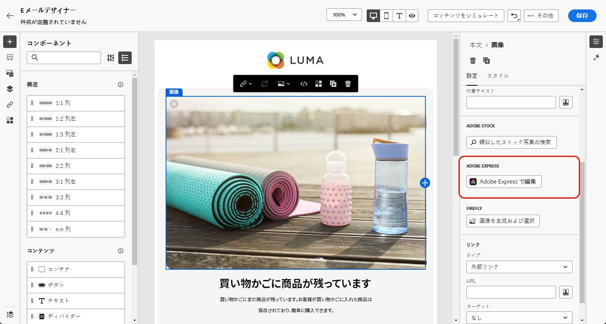
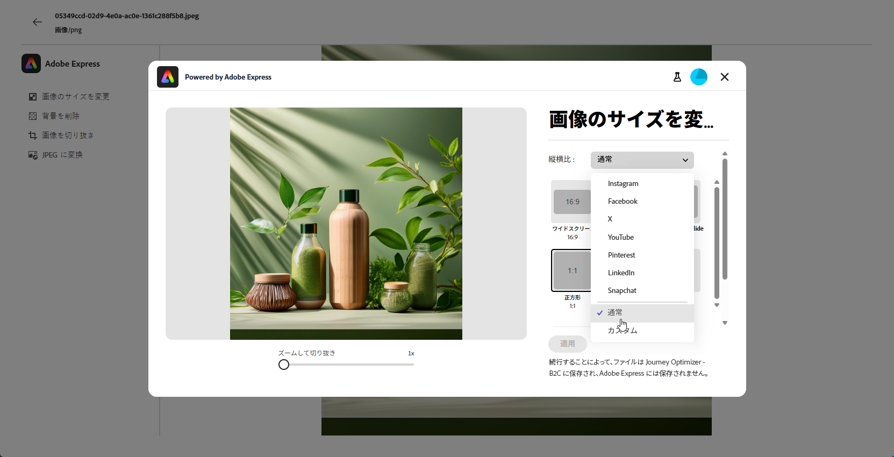
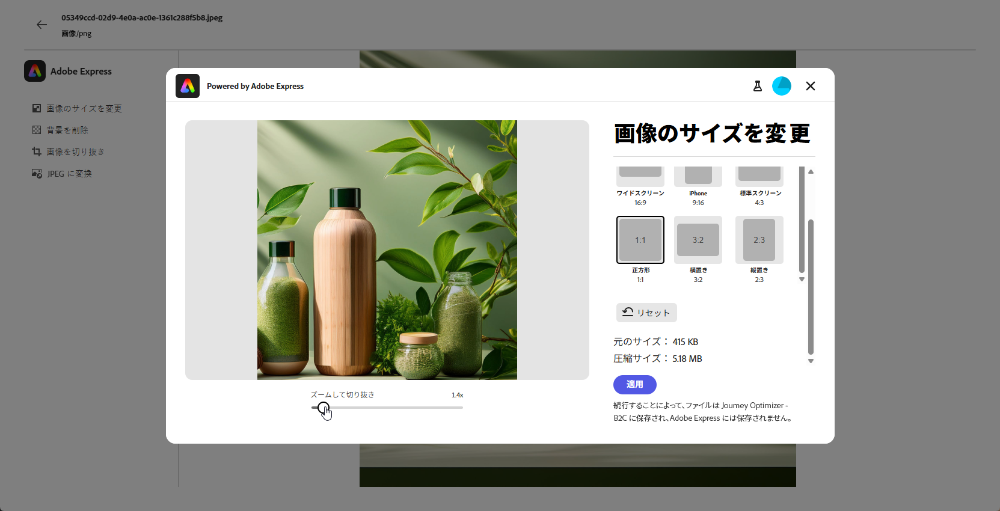
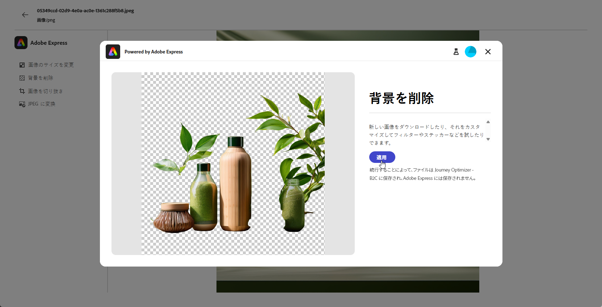
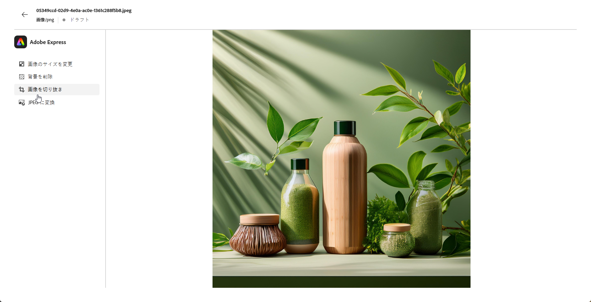
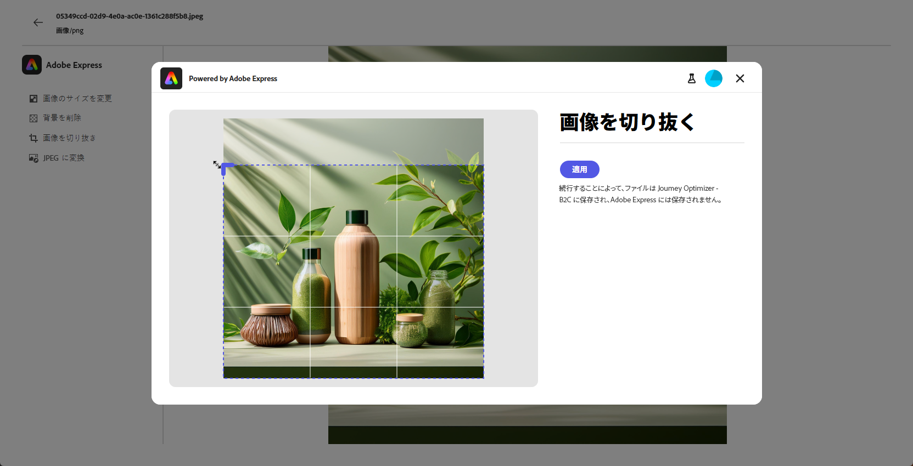
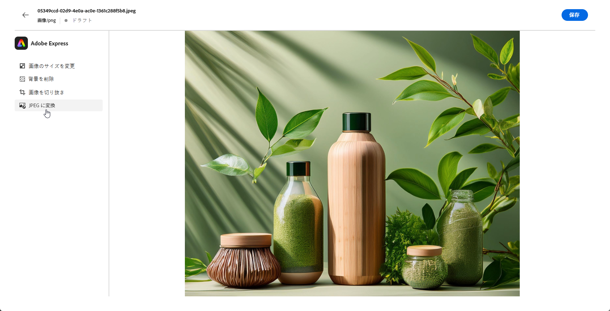
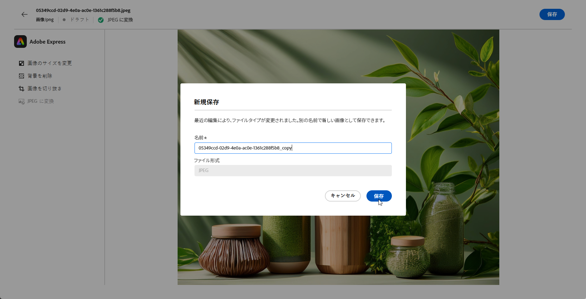

# [!DNL Adobe Express] を使用したアセットの編集{#express}

>[!CONTEXTUALHELP]
>id="ajo_express_menu"
>title="Adobe Express の統合"
>abstract="Adobe Express の統合を使用してアセットのパーソナライゼーションを開始します。この機能を使用すると、画像のサイズ変更、背景の削除、ビジュアルの切り抜き、アセットの JPEG または PNG への変換を行うことができます。"

>[!AVAILABILITY]
>
>Adobe Journey OptimizerのAdobe Express統合は、現在、Healthcare Shield またはプライバシーとセキュリティシールドでは使用できません。

Adobe Journey OptimizerのAdobe Express統合により、コンテンツを作成しながら、Adobe Expressの強力な編集ツールに簡単にアクセスできます。 この統合により、ソリューションを切り替える必要なく、画像のサイズ変更、背景の削除、ビジュアルの切り抜き、JPEGまたは PNG へのアセットの変換を行うことができます。

Adobe Expressについて詳しくは、[ このドキュメント ](https://helpx.adobe.com/jp/express/user-guide.html) を参照してください。

**[!DNL Adobe Express]** メニューにアクセスするには、電子メールデザイナーから **画像設定** にアクセスし、**[!UICONTROL Adobe Expressで編集]** をクリックします。

## 画像のサイズ変更 {#resize}

1. Adobe Expressメニューから、「**[!UICONTROL 画像のサイズ変更]**」を選択します。

   

1. アセットの縦横比に最も適した **[!UICONTROL 縦横比]** を選択します。

   

1. スライダーを使用してアセットをズームおよび切り抜き、ドラッグして表示領域をパンおよび調整します。

   

1. 「**[!UICONTROL リセット]**」をクリックして、アセットを元の状態に復元します。

1. 画像のサイズ変更が必要に応じたら、「**[!UICONTROL 適用]**」をクリックします。 次に、変更したアセットを **[!UICONTROL 保存]** します。

1. **[!UICONTROL 画像をアップロード]** ウィンドウで **[!UICONTROL 次へ]** をクリックし、変更したアセットを保存するフォルダーを選択します。

   次に、「**[!UICONTROL インポート]**」をクリックします。

これで、画像をコンテンツで使用する準備が整いました。

## 背景の削除 {#background}

1. Adobe Expressメニューから「**[!UICONTROL 背景を削除]**」を選択します。

   

1. アセットは、背景なしで自動的に表示されます。

   コンテンツでこれを使用するには、「**[!UICONTROL 適用]**」をクリックします。

   

1. 「**[!UICONTROL 保存]**」をクリックします。

1. **[!UICONTROL 画像をアップロード]** ウィンドウで **[!UICONTROL 次へ]** をクリックし、変更したアセットを保存するフォルダーを選択します。

   次に、「**[!UICONTROL インポート]**」をクリックします。

これで、画像をコンテンツで使用する準備が整いました。

## 画像を切り抜き {#crop-image}

1. Adobe Expressメニューから、「**[!UICONTROL 画像を切り抜き]**」を選択します。

   

1. 必要に応じて、コーナーハンドルをドラッグして画像を調整し、切り抜きます。

   

1. コンテンツでこれを使用するには、「**[!UICONTROL 適用]**」をクリックします。 次に、変更したアセットを **[!UICONTROL 保存]** します。

1. **[!UICONTROL 画像をアップロード]** ウィンドウで **[!UICONTROL 次へ]** をクリックし、変更したアセットを保存するフォルダーを選択します。

   次に、「**[!UICONTROL インポート]**」をクリックします。

これで、画像をコンテンツで使用する準備が整いました。

## JPEGまたは PNG に変換 {#convert}

1. Adobe Express メニューから、画像の元の形式に応じて **[!UICONTROL JPEGに変換]** または **[!UICONTROL PNG に変換]** を選択します。

   

1. 「**[!UICONTROL 適用]**」をクリックして、変換を開始します。

   

1. 「**[!UICONTROL 保存]**」をクリックします。

1. 形式を変更した場合は、別の名前で新しい画像として保存できます。 **[!UICONTROL 名前]** を更新し、「**[!UICONTROL 保存]**」をクリックします。

   

1. **[!UICONTROL 画像をアップロード]** ウィンドウで **[!UICONTROL 次へ]** をクリックし、変更したアセットを保存するフォルダーを選択します。

   次に、「**[!UICONTROL インポート]**」をクリックします。

これで、画像をコンテンツで使用する準備が整いました。
