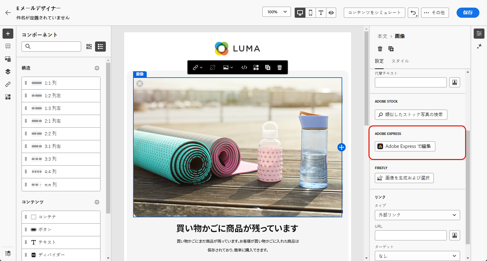
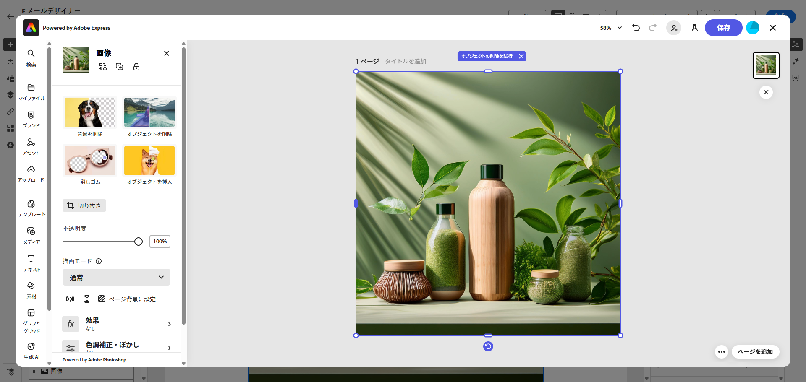
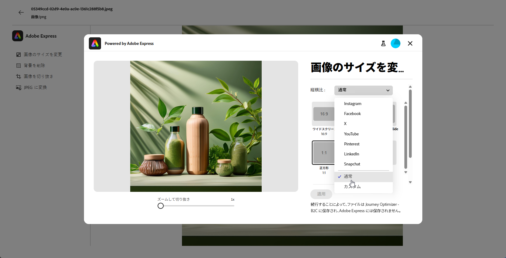
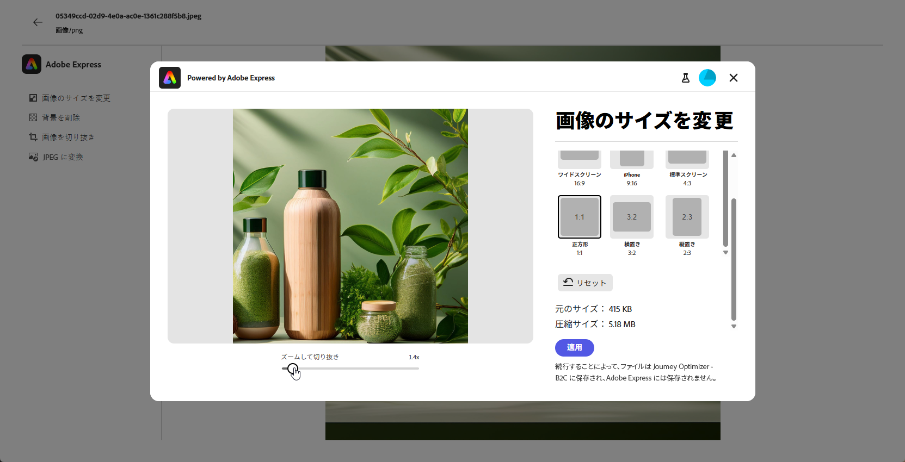
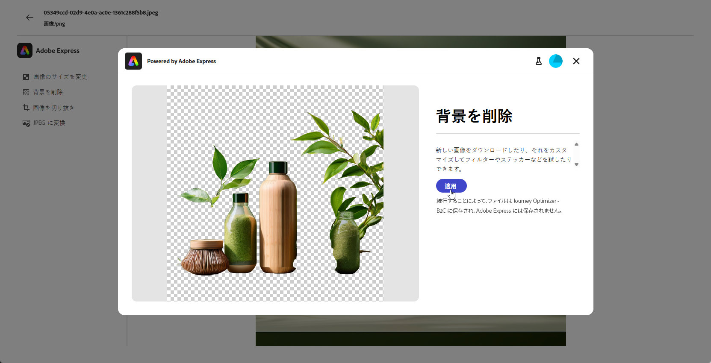
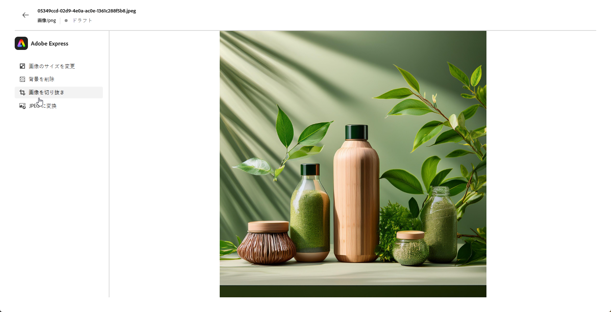
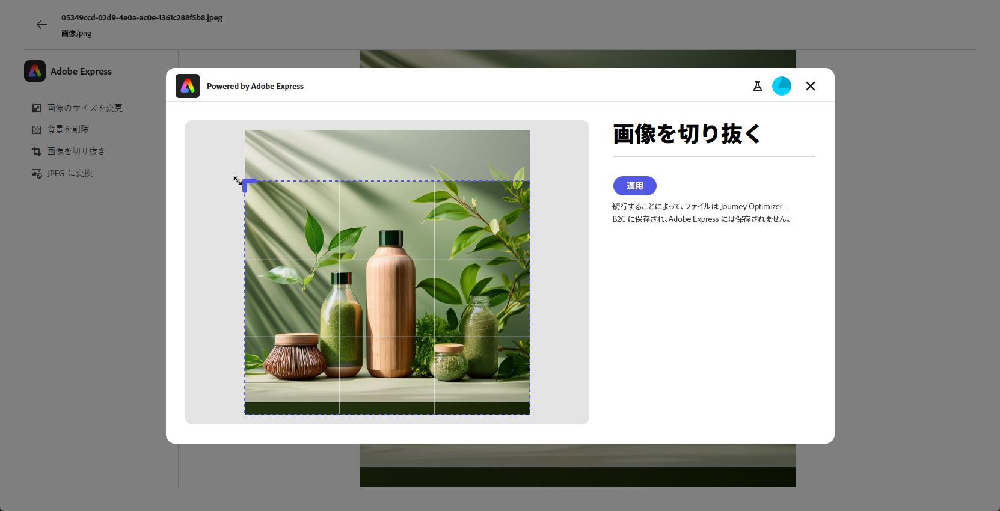
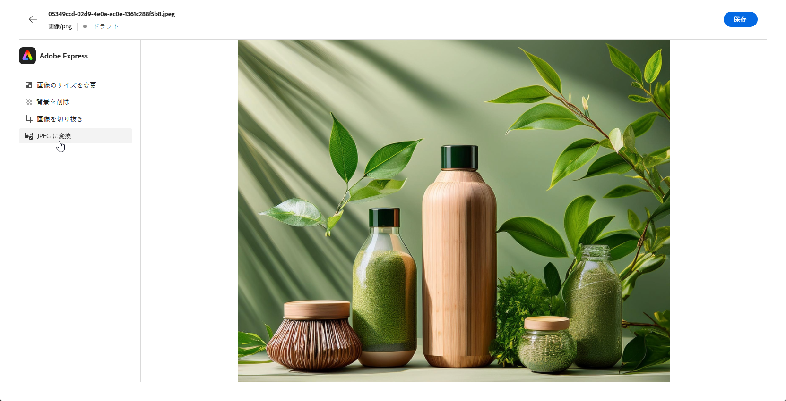
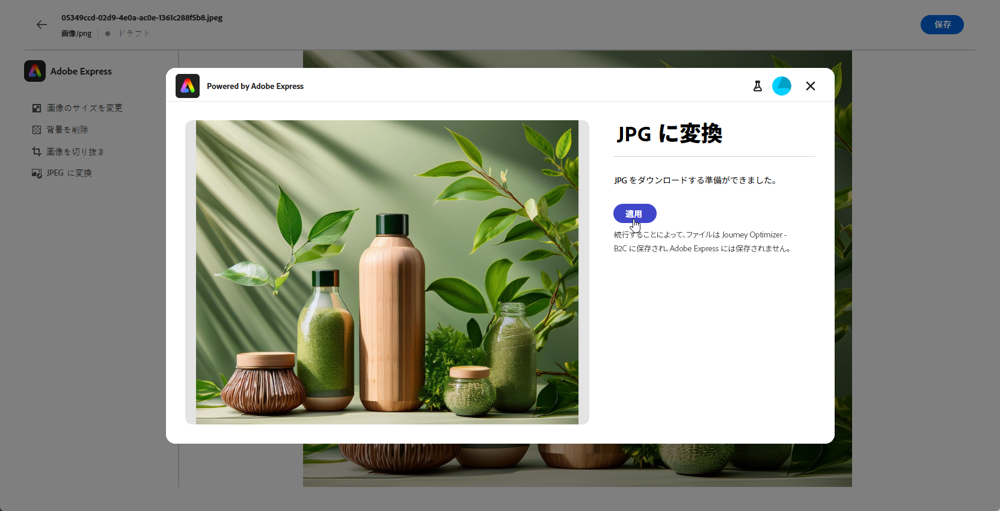
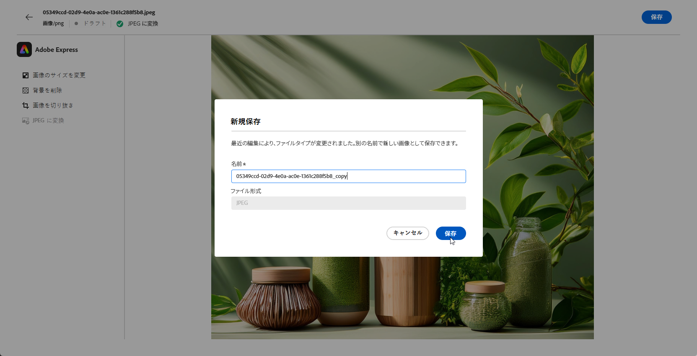

# [!DNL Adobe Express] を使用したアセットの編集{#express}

>[!BEGINSHADEBOX]

**このページでは：** Journey OptimizerのAdobe Expressとの連携を利用して、画像のサイズ変更、背景の削除、ビジュアルの切り抜き、JPEGまたはPNGへのアセットの変換を行う方法について説明します。

>[!ENDSHADEBOX]

>[!CONTEXTUALHELP]
>id="ajo_express_menu"
>title="Adobe Express の統合"
>abstract="Adobe Express の統合を使用してアセットのパーソナライゼーションを開始します。 この機能を使用すると、画像のサイズ変更、背景の削除、ビジュアルの切り抜き、アセットの JPEG または PNG への変換を行うことができます。"

>[!IMPORTANT]
>
>Adobe Expressとの連携によりデータはJourney Optimizerから離れます。 PHIやその他のヘルスデータとの統合は使用しないでください。

Adobe Journey Optimizer の Adobe Express 統合により、コンテンツの作成中に Adobe Express の強力な編集ツールに簡単にアクセスできます。 この統合により、ソリューションを切り替えることなく、画像のサイズ変更、背景の削除、ビジュアルの切り抜き、アセットの JPEG または PNG への変換が可能になります。

Adobe Express について詳しくは、[このドキュメント](https://helpx.adobe.com/jp/express/user-guide.html)を参照してください。

**[!DNL Adobe Express]** メニューにアクセスするには、E メールデザイナーから&#x200B;**画像設定**&#x200B;にアクセスし、「**[!UICONTROL Adobe Express で編集]**」をクリックします。

➡️ [この機能をビデオで確認](#video)

## エンタープライズ版ライセンスでの Adobe Express の使用 {#licence}

以下の節で説明する機能には、Adobe Express エンタープライズ版ライセンスを持たないユーザーもアクセスできます。

エンタープライズ版ライセンスを使用すると、ユーザーは Adobe Express web エディターにフルアクセスでき、アセット設定の調整、Firefly を使用したコンテンツの生成、テキストの追加、追加のカスタマイズの適用を行うことができます。

Adobe Express のエンタープライズ版ライセンスを持つユーザーが使用できるユースケースについて詳しくは、[Adobe Express web ドキュメント](https://helpx.adobe.com/jp/express/web.html)を参照してください。

## エンタープライズ版ライセンスなしでの Adobe Express の使用  {#edit}

エンタープライズ版ライセンスを持たないユーザーは、Adobe Express で使用可能な次のユースケースにアクセスできます。

* [画像のサイズ変更](#resize)
* [背景の削除](#background)
* [画像の切り抜き](#crop-image)
* [JPEG または PNG への変換](#convert)

### 画像のサイズ変更 {#resize}

1. Adobe Express メニューから、「**[!UICONTROL 画像をサイズ変更]**」を選択します。

   

1. アセットの縦横比に最も適した&#x200B;**[!UICONTROL 縦横比]**&#x200B;を選択します。

   

1. スライダーを使用してアセットをズームおよび切り抜き、ドラッグして表示領域をパンおよび調整します。

   

1. 「**[!UICONTROL リセット]**」をクリックして、アセットを元の状態に復元します。

1. 画像を適切にサイズ変更したら、「**[!UICONTROL 適用]**」をクリックします。 次に、変更したアセットを&#x200B;**[!UICONTROL 保存]**&#x200B;します。

1. **[!UICONTROL 画像をアップロード]**&#x200B;ウィンドウで、「**[!UICONTROL 次へ]**」をクリックし、変更したアセットを保存するフォルダーを選択します。

   次に、「**[!UICONTROL インポート]**」をクリックします。

これで、画像をコンテンツで使用する準備が整いました。

### 背景の削除 {#background}

1. Adobe Express メニューから、「**[!UICONTROL 背景を削除]**」を選択します。

   

1. アセットは、自動的に背景がない状態で表示されます。

   コンテンツで使用するには、「**[!UICONTROL 適用]**」をクリックします。

   

1. 「**[!UICONTROL 保存]**」をクリックします。

1. **[!UICONTROL 画像をアップロード]**&#x200B;ウィンドウで、「**[!UICONTROL 次へ]**」をクリックし、変更したアセットを保存するフォルダーを選択します。

   次に、「**[!UICONTROL インポート]**」をクリックします。

これで、画像をコンテンツで使用する準備が整いました。

### 画像の切り抜き {#crop-image}

1. Adobe Express メニューから、「**[!UICONTROL 画像を切り抜き]**」を選択します。

   

1. 必要に応じて、コーナーハンドルをドラッグして画像を調整および切り抜きます。

   

1. コンテンツで使用するには、「**[!UICONTROL 適用]**」をクリックします。 次に、変更したアセットを&#x200B;**[!UICONTROL 保存]**&#x200B;します。

1. **[!UICONTROL 画像をアップロード]**&#x200B;ウィンドウで、「**[!UICONTROL 次へ]**」をクリックし、変更したアセットを保存するフォルダーを選択します。

   次に、「**[!UICONTROL インポート]**」をクリックします。

これで、画像をコンテンツで使用する準備が整いました。

### JPEG または PNG への変換 {#convert}

1. Adobe Express メニューから、画像の元の形式に応じて「**[!UICONTROL JPEG に変換]**」または「**[!UICONTROL PNG に変換]**」を選択します。

   

1. 「**[!UICONTROL 適用]**」をクリックして変換を開始します。

   

1. 「**[!UICONTROL 保存]**」をクリックします。

1. 形式を変更すると、別の名前で新規画像として保存できます。 **[!UICONTROL 名前]**&#x200B;を更新し、「**[!UICONTROL 保存]**」をクリックします。

   

1. **[!UICONTROL 画像をアップロード]**&#x200B;ウィンドウで、「**[!UICONTROL 次へ]**」をクリックし、変更したアセットを保存するフォルダーを選択します。

   次に、「**[!UICONTROL インポート]**」をクリックします。

これで、画像をコンテンツで使用する準備が整いました。

## チュートリアルビデオ {#video}

Adobe Express ツールを使用して Adobe Journey Optimizer でアセットを編集する方法について説明します。

>[!VIDEO](https://video.tv.adobe.com/v/3455523/?quality=12)

