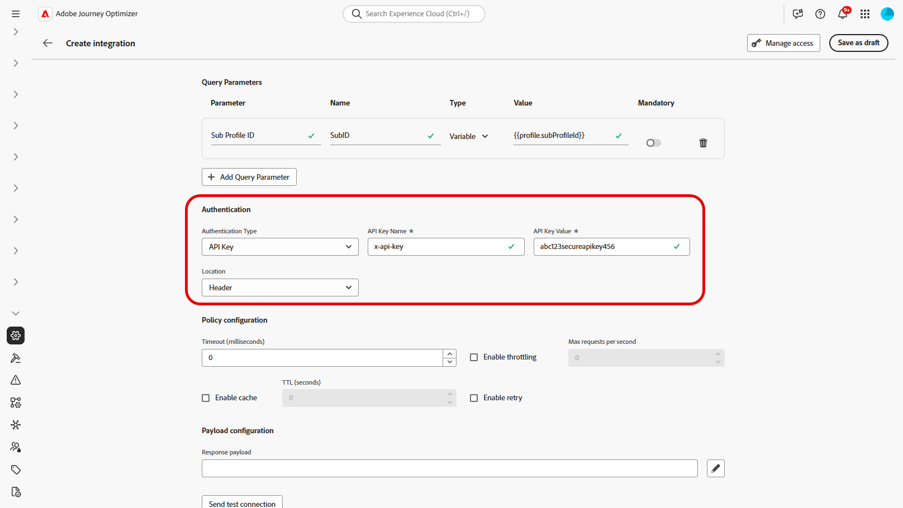

# 統合の操作 {#external-sources}

## 概要

**統合** 機能により、サードパーティのデータソースをAdobe Journey Optimizerにシームレスに統合できます。 この機能により、キャンペーンへの外部データおよびコンテンツソースの統合が効率化され、複数のチャネルにわたって高度にパーソナライズされた動的なメッセージを配信できるようになります。

この機能を使用して、外部データにアクセスし、次のようなサードパーティツールからコンテンツを取り込むことができます。

* ロイヤルティシステムからの **報酬ポイント**。
* 製品の **価格情報**。
* レコメンデーションエンジンの **製品レコメンデーション**。
* **ロジスティクス更新** 配信ステータスなど。

## 統合の設定 {#configure}

管理者は、次の手順で外部統合を設定できます。

1. 左側のメニューの **[!UICONTROL 設定]** セクションに移動し、**[!UICONTROL 統合]** カードから **[!UICONTROL 管理]** をクリックします。

   次に、「**[!UICONTROL 統合を作成]**」をクリックして、新しい設定を開始します。

   

1. 統合の **[!UICONTROL 名前]** と **[!UICONTROL 説明]** を入力します。

   >[!NOTE]
   >
   >これらのフィールドにスペースを含めることはできません。

1. API エンドポイント **[!UICONTROL URL]** を入力します。この URL には、ラベルやデフォルト値を使用して定義できる変数を持つパスパラメーターを含めることができます。

1. **[!UICONTROL 名前]** および **[!UICONTROL デフォルト値]** で **[!UICONTROL パステンプレート]** を設定します。

   

1. GETと POST の間の **[!UICONTROL HTTP メソッド]** を選択します。

1. 統合の必要に応じて、「**[!UICONTROL ヘッダーを追加]**」または「**[!UICONTROL クエリパラメーターを追加]**」をクリックします。 各パラメーターに対して、次の詳細を指定します。

   * **[!UICONTROL パラメーター]**：パラメーターを参照するために内部で使用される一意の ID。

   * **[!UICONTROL Name]**:API で想定されるパラメーターの実際の名前。

   * **[!UICONTROL タイプ]**：固定値の場合は「**定数**」、動的入力の場合は「**変数** を選択します。

   * **[!UICONTROL 値]**：定数の値を直接入力するか、変数のマッピングを選択します。

   * **[!UICONTROL 必須]**：このパラメーターが必須かどうかを指定します。

   

1. **[!UICONTROL 認証タイプ]** を選択します。

   * **[!UICONTROL 認証なし]**：認証情報を必要としないオープンな API の場合。

   * **[!UICONTROL API キー]**：静的 API キーを使用してリクエストを認証します。 **[!UICONTROL API キー名&#x200B;]**、**[!UICONTROL API キー値&#x200B;]** を入力し、**[!UICONTROL 場所]** を指定します。

   * **[!UICONTROL 基本認証]**：標準の HTTP 基本認証を使用します。 **[!UICONTROL ユーザー名]** と **[!UICONTROL パスワード]** を入力します。

   * **[!UICONTROL OAuth 2.0]**:OAuth 2.0 プロトコルを使用して認証します。  アイコンをクリックして、**[!UICONTROL ペイロード]** を設定または更新します。

   

1. API リクエストの **[!UICONTROL タイムアウト]** 期間などの **[!UICONTROL ポリシー設定]** を設定し、スロットル、キャッシュまたは再試行（あるいはその両方）を有効にするように選択します。

1. **[!UICONTROL 応答ペイロード]** フィールドを使用すると、サンプル出力のどのフィールドをメッセージのパーソナライゼーションに使用する必要があるかを決定できます。

    アイコンをクリックし、サンプルの JSON 応答ペイロードを貼り付けて、データタイプを自動的に検出します。

1. パーソナライゼーション用に公開するフィールドを選択し、対応するデータタイプを指定します。

   

1. **[!UICONTROL テスト接続の送信]** を使用して、統合を検証します。

   検証が完了したら、「**[!UICONTROL アクティベート]**」をクリックします。

## パーソナライゼーションのための外部統合の使用 {#personalization}

マーケターは、設定済みの統合を使用してコンテンツをパーソナライズできます。 次の手順に従います。

1. キャンペーンコンテンツにアクセスし、テキストまたはHTML **[!UICONTROL コンポーネント]** から「**[!UICONTROL パーソナライゼーションを追加]** をクリックします。

[コンポーネントの詳細情報](../email/content-components.md)

   

1. 「**[!UICONTROL 統合]**」セクションに移動し、「**[!UICONTROL 統合を開く]** をクリックして、アクティブな統合をすべて表示します。

   

1. 統合を選択し、「**[!UICONTROL 保存]**」をクリックします。

   

1. **[!UICONTROL ピル]** モードを有効にして、高度な統合メニューのロックを解除します。

   

1. 統合設定を完了するには、以前 [ 設定 ](#configure) で指定した統合属性を定義します。

   これらの属性に値を割り当てるには、静的な値（一定）またはプロファイル属性（ユーザープロファイルから情報を動的に取り込む）を使用します。

   

1. 統合属性を定義したら、「」アイコンをクリックして、コンテンツの統合フィールドを使用して、メッセージをパーソナライズできるようになりました。

   

1. 「**[!UICONTROL 保存]**」をクリックします。

これで、統合のパーソナライゼーションがコンテンツに正常に適用され、設定した属性に基づいてカスタマイズされた適切なエクスペリエンスが各受信者に届くようになりました。

