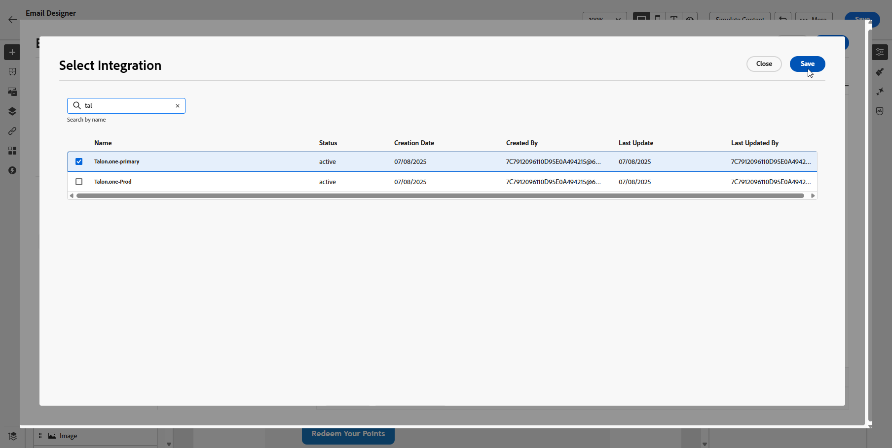
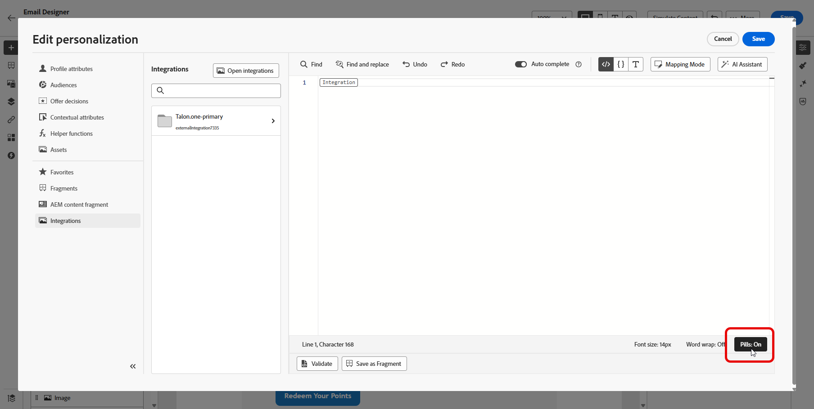

# 統合の操作 {#external-sources}

## 概要

**統合**&#x200B;機能により、サードパーティのデータソースを Adobe Journey Optimizer にシームレスに統合できます。この機能により、外部データとコンテンツソースのキャンペーンへの統合が効率化され、複数のチャネルをまたいで高度にパーソナライズされた動的なメッセージを配信できます。

この機能を使用して、外部データにアクセスし、次のようなサードパーティツールからコンテンツを取り込むことができます。

* ロイヤルティシステムからの&#x200B;**報酬ポイント**。
* 製品の&#x200B;**価格情報**。
* レコメンデーションエンジンからの&#x200B;**製品レコメンデーション**。
* 配送ステータスなどの&#x200B;**ロジスティックスの更新情報**。

## ベータ版の制限 {#limitations}

ベータ版リリースには、次の制限があります。

* アウトバウンドチャネルのみがサポートされます。

* API 呼び出し応答では、JSON 形式のみがサポートされます。HTML と Raw バイナリ画像の出力は使用できません。

* 特定のコンテンツをターゲットにする取得 API のみがサポートされ、リスト API は使用できません。

* 統合機能は、ジャーニーとキャンペーンの両方で使用できますが、フラグメントではサポートされていません。

## 統合の設定 {#configure}

管理者は、次の手順に従って外部統合を設定できます。

1. 左側のメニューの「**[!UICONTROL 設定]**」セクションに移動し、**[!UICONTROL 統合]**&#x200B;カードから「**[!UICONTROL 管理]**」をクリックします。

   次に、「**[!UICONTROL 統合を作成]**」をクリックして、新しい設定を開始します。

   

1. 統合の&#x200B;**[!UICONTROL 名前]**&#x200B;と&#x200B;**[!UICONTROL 説明]**&#x200B;を入力します。

   >[!NOTE]
   >
   >これらのフィールドにスペースを含めることはできません。

1. API エンドポイント **[!UICONTROL URL]** を入力します。この URL には、ラベルとデフォルト値を使用して定義できる変数を持つパスパラメーターを含めることができます。

1. **[!UICONTROL 名前]**&#x200B;と&#x200B;**[!UICONTROL デフォルト値]**&#x200B;を使用して、**[!UICONTROL パステンプレート]**&#x200B;を設定します。

   

1. GET と POST の間で **[!UICONTROL HTTP メソッド]**&#x200B;を選択します。

1. 統合の必要に応じて、「**[!UICONTROL ヘッダーを追加]**」や「**[!UICONTROL クエリパラメーターを追加]**」をクリックします。各パラメーターに対して、次の詳細情報を入力します。

   * **[!UICONTROL パラメーター]**：パラメーターの参照に内部的に使用される一意の ID。

   * **[!UICONTROL 名前]**：API で想定されるパラメーターの実際の名前。

   * **[!UICONTROL タイプ]**：固定値の場合は「**定数**」、動的入力の場合は「**変数**」を選択します。

   * **[!UICONTROL 値]**：定数の値を直接入力するか、変数のマッピングを選択します。

   * **[!UICONTROL 必須]**：このパラメーターが必須かどうかを指定します。

   

1. 次の&#x200B;**[!UICONTROL 認証タイプ]**&#x200B;を選択します。

   * **[!UICONTROL 認証なし]**：資格情報を必要としないオープンな API の場合。

   * **[!UICONTROL API キー]**：静的 API キーを使用してリクエストを認証します。**[!UICONTROL API キー名]**、**[!UICONTROL API キー値]**&#x200B;を入力し、**[!UICONTROL 場所]**&#x200B;を指定します。

   * **[!UICONTROL 基本認証]**：標準の HTTP 基本認証を使用します。**[!UICONTROL ユーザー名]**&#x200B;と&#x200B;**[!UICONTROL パスワード]**&#x200B;を入力します。

   * **[!UICONTROL OAuth 2.0]**：OAuth 2.0 プロトコルを使用して認証します。 アイコンをクリックして、**[!UICONTROL ペイロード]**&#x200B;を設定または更新します。

   

1. API リクエストの&#x200B;**[!UICONTROL タイムアウト]**&#x200B;期間などの&#x200B;**[!UICONTROL ポリシー設定]**&#x200B;を指定し、スロットル、キャッシュ、再試行を有効にすることを選択します。

1. 「**[!UICONTROL 応答ペイロード]**」フィールドを使用すると、サンプル出力のどのフィールドをメッセージのパーソナライゼーションに使用する必要があるかを決定できます。

    アイコンをクリックし、サンプルの JSON 応答ペイロードを貼り付けると、データタイプが自動的に検出されます。

1. パーソナライゼーション用に公開するフィールドを選択し、対応するデータタイプを指定します。

   

1. **[!UICONTROL テスト接続を送信]** を使用して、統合を検証します。

   検証が完了したら、「**[!UICONTROL アクティブ化]**」をクリックします。

## パーソナライゼーションに対する外部統合の使用 {#personalization}

マーケターは、設定済みの統合を使用してコンテンツをパーソナライズできます。次の手順に従います。

1. キャンペーンコンテンツにアクセスし、テキストまたは HTML **[!UICONTROL コンポーネント]**&#x200B;から「**[!UICONTROL パーソナライゼーションを追加]**」をクリックします。

[コンポーネントの詳細情報](../email/content-components.md)

   

1. 「**[!UICONTROL 統合]**」セクションに移動し、「**[!UICONTROL 統合を開く]**」をクリックして、アクティブな統合をすべて表示します。

   

1. 統合を選択し、「**[!UICONTROL 保存]**」をクリックします。

   

1. **[!UICONTROL ピル]**&#x200B;モードを有効にして、高度な統合メニューをロック解除します。

   

1. 統合設定を完了するには、[設定](#configure)時に以前指定した統合属性を定義します。

   これらの属性には、一定のままの静的値や、ユーザープロファイルから情報を動的に取り込むプロファイル属性のいずれかを使用して値を割り当てることができます。

   

1. 統合属性を定義したら、 アイコンをクリックして、パーソナライズされたメッセージに対してコンテンツの統合フィールドを使用できるようになります。

   

1. 「**[!UICONTROL 保存]**」をクリックします。

これで、統合パーソナライゼーションがコンテンツに正常に適用され、設定した属性に基づいて各受信者がカスタマイズされた関連性の高いエクスペリエンスを受信できるようになりました。

