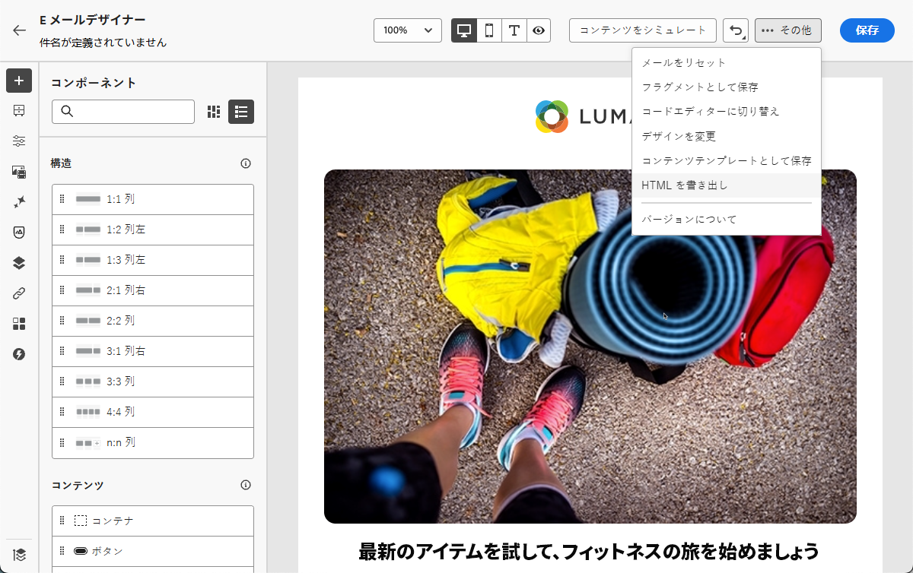
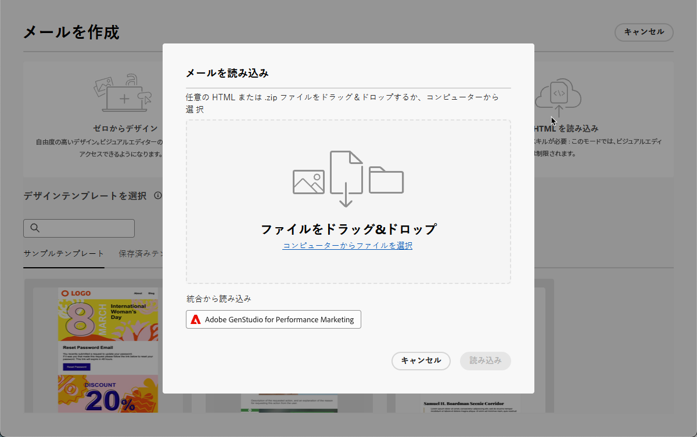
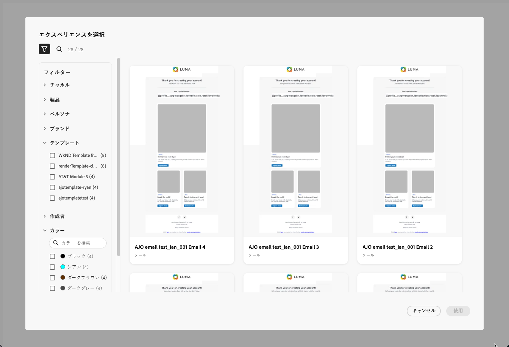
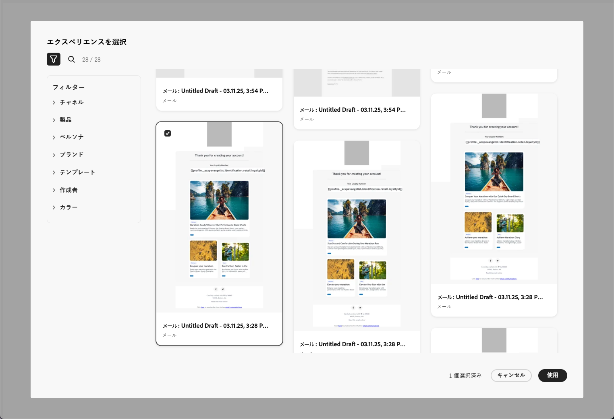
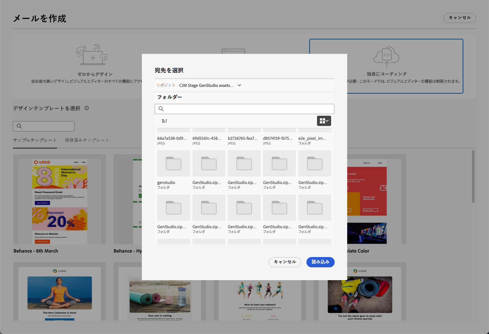
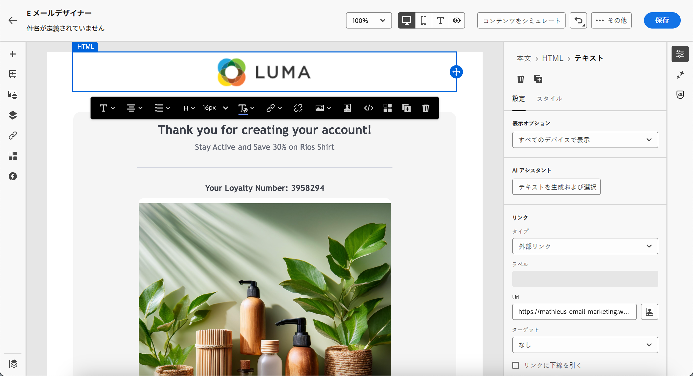
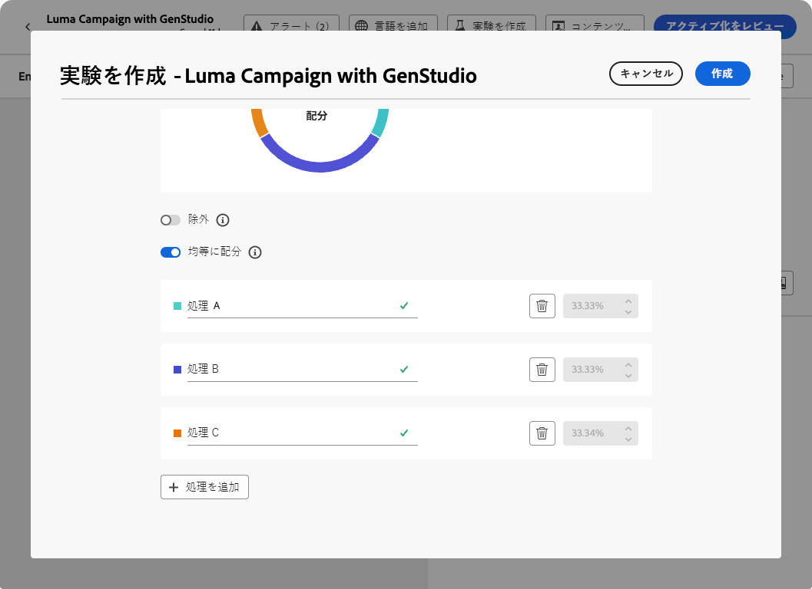
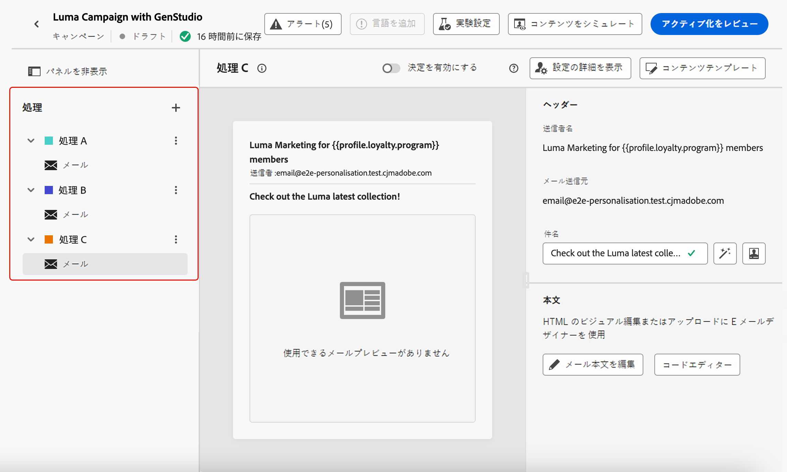

# GenStudio for Performance Marketing の操作 {#ajo-genstudio}

>[!CONTEXTUALHELP]
>id="ajo_genstudio_button"
>title="GenStudio で作成したテンプレートの使用"
>abstract="GenStudio for Performance Marketing とのシームレスな統合により、Adobe AI テクノロジーで強化された GenStudio テンプレートを簡単に読み込むことができます。"

## GenStudio の基本を学ぶ {#gs-genstudio}

[Adobe GenStudio for Performance Marketing](https://experienceleague.adobe.com/ja/docs/genstudio-for-performance-marketing/user-guide/home){target="_blank"} は、マーケティングチームが独自の広告やメールを作成し、ブランド標準および企業ポリシーに準拠した、効果的でパーソナライズされたマーケティングキャンペーンを推進できるようにする生成 AI 中心のアプリケーションです。アドビの AI テクノロジーを活用することで、コンテンツの作成と管理の複雑さを軽減し、クリエイターが革新性に焦点を当てることができるようにする包括的なツールスイートを提供します。

>[!AVAILABILITY]
>
>* [!DNL Adobe Journey Optimizer] での GenStudio 統合は、現在、**Healthcare Shield** または **Privacy and Security Shield** アドオン製品では使用できません。
>
>* この機能は、メールチャネルでのみ使用できます。

マーケティング効率を高め、ブランドの一貫性を維持するために、[!DNL **GenStudio for Performance Marketing**] エクスペリエンスを [!DNL **Adobe Journey Optimizer**] とシームレスに統合できます。これにより、[!DNL GenStudio] の AI を活用したコンテンツ作成と [!DNL Journey Optimizer] の高度なオーケストレーション機能を活用できるようになります。

>[!INFO]
>
>詳しくは、この[概要](https://business.adobe.com/products/genstudio-for-performance-marketing.html#watch-overview){target="_blank"}と [!DNL Adobe GenStudio for Performance Marketing] の[デモ](https://business.adobe.com/products/genstudio-for-performance-marketing.html#demo){target="_blank"}を参照してください。

➡️ [この機能をビデオで確認](#video)

<!--To access the GenStudio integration in [!DNL Adobe Journey Optimizer] feature, users need to be granted the **xxx** permission. [Learn more](../administration/permissions.md)

>[!IMPORTANT]
>
>* Before starting using this capability, read out related [Guardrails and Limitations](#generative-guardrails).-->

<!--Guardrails and limitations {#genstudio-guardrails}

General guidelines for using the GenStudio integration in [!DNL Adobe Journey Optimizer] for email generation are listed below:

See if guidelines/limitations such as the ones listed [here](../content-management/gs-generative.md#generative-guardrails) for AI Assistant can apply.

The following limitations apply to GenStudio integration in [!DNL Adobe Journey Optimizer]:-->

## Journey Optimizer での GenStudio 機能の使用 {#use-genstudio}

[!DNL GenStudio for Performance Marketing] と [!DNL Journey Optimizer] の統合により、会社のマーケターが共同作業を効率化してプロセスを合理化できます。

例えば、[!DNL GenStudio] を使用してメールキャンペーンを開発および自動処理するテクニカルマーケターは、[!DNL Journey Optimizer] を使用してコンテンツを作成するパフォーマンスマーケターと共同作業できます。

この統合により、両者は共同作業で [!DNL GenStudio] のブランドに即したコンテンツを [!DNL Journey Optimizer] に簡単に統合し、特定の顧客セグメントをターゲットにして売上を推進する魅力的なメールを配信できます。

### Journey Optimizer から GenStudio への HTML テンプレートのエクスポート {#export-from-ajo-to-genstudio}

まず、ブランドのガイドラインを含む [!DNL Journey Optimizer] の HTML テンプレートを [!DNL GenStudio for Performance Marketing] にエクスポートできます。次の手順に従います。

1. [!DNL Journey Optimizer] で、ジャーニーまたはキャンペーンのメールのコンテンツにアクセスします。[方法についてはこちらを参照](../email/get-started-email-design.md#key-steps)

1. E メールデザイナーで、「**[!UICONTROL 詳細]**」ボタンから「**[!UICONTROL HTML をエクスポート]**」を選択します。

   {zoomable="yes"}

1. この HTML をエクスポートしたテンプレートを [!DNL GenStudio for Performance Marketing] にアップロードします。<!--Make sure you detect the fields that the generative AI uses to insert content in order to create an actionable template.-->

   >[!NOTE]
   >
   >HTML テンプレートを [!DNL GenStudio] にアップロードする方法について詳しくは、[Adobe GenStudio for Performance Marketing ユーザーガイド](https://experienceleague.adobe.com/ja/docs/genstudio-for-performance-marketing/user-guide/content/templates/use-templates#templates-from-ajo-and-marketo){target="_blank"}の専用の節を参照してください。

1. GenStudio では、このテンプレートを使用して、AI プロンプトを含む複数のメールのバリエーションを作成し、保存します。

   >[!NOTE]
   >
   >メールエクスペリエンスを作成する方法について詳しくは、GenStudio 専用の[節](https://experienceleague.adobe.com/ja/docs/genstudio-for-performance-marketing/user-guide/create/create-email-experience){target="_blank"}を参照してください。

### Journey Optimizer での GenStudio エクスペリエンスの活用 {#leverage-genstudio-experiences}

作成した [!DNL GenStudio] のメールバリエーションを [!DNL Journey Optimizer] にインポートして活用するには、次の手順に従います。

1. [!DNL Journey Optimizer] で、キャンペーンに[メールを追加](../email/create-email.md)します。

1. キャンペーンの設定画面で、[コンテンツを編集画面](../email/create-email.md#define-email-content)に移動し、「**[!UICONTROL メール本文を編集]**」をクリックして、E メールデザイナーを開きます。[方法についてはこちらを参照](../email/get-started-email-design.md#key-steps)

1. E メールデザイナーのホームページで、「**[!UICONTROL HTML をインポート]**」を選択し、「**[!UICONTROL Adobe GenStudio for Performance Marketing]**」ボタンをクリックします。

   {zoomable="yes"}

1. GenStudio エクスペリエンスを参照して、コンテンツの作成を開始します。製品、ペルソナ、ブランド、カラーなど、複数の条件でエクスペリエンスをフィルタリングできます。

   <!--{zoomable="yes"}-->

1. エクスペリエンスを選択し、「**[!UICONTROL 使用]**」をクリックします。

   {zoomable="yes"}

1. GenStudio エクスペリエンスをインポートするフォルダーを選択します。

   {zoomable="yes"}

1. 選択したコンテンツが E メールデザイナーに表示されます。

   {zoomable="yes"}

   >[!NOTE]
   >
   >[ [!DNL Journey Optimizer]  テンプレートから作成](#export-from-ajo-to-genstudio)した GenStudio エクスペリエンスは、E メールデザイナーに直接インポートされます。[!DNL Journey Optimizer] テンプレートを使用せずに作成した GenStudio エクスペリエンスは、[互換モード](../email/existing-content.md)にインポートされます。

   [メールコンテンツ編集ツール](../email/content-from-scratch.md)と[パーソナライゼーションフィールド](../personalization/personalize.md)を使用して、必要に応じてメールを編集します。コンテンツを保存します。

1. キャンペーンの概要ページに戻り、「**[!UICONTROL 実験を作成]**」をクリックして、実験を使用します。[詳しくは、コンテンツ実験の作成方法を参照してください](../content-management/content-experiment.md)

   <!--{zoomable="yes"}-->

1. 複数の処理を作成し、上記の手順を繰り返して、[!DNL GenStudio] で作成した他のメールエクスペリエンスのバリエーションをインポートし、すばやく活用します。

   {zoomable="yes"}

1. 変更を保存し、キャンペーンを[アクティベート](../campaigns/review-activate-campaign.md)します。

実験を実行した後、[実験キャンペーンレポート](../reports/campaign-global-report-cja-experimentation.md)を使用して、キャンペーン処理のパフォーマンスを追跡します。その後、実験の結果を解釈できます。[方法についてはこちらを参照](../content-management/get-started-experiment.md#interpret-results)

## チュートリアルビデオ {#video}

Journey Optimizer から GenStudio for Performance Marketing にメールテンプレートをエクスポートし、GenStudio のテンプレートを使用してブランドに準拠したメールを作成し、Journey Optimizer にシームレスにインポートするプロセスについて説明します。

>[!VIDEO](https://video.tv.adobe.com/v/3456038/?quality=12)