# パーソナライゼーションに対する外部統合の使用 {#integrations-personalization}

>[!BEGINSHADEBOX]

**このページでは、** マーケターが設定された統合を適用して、メール、SMS、プッシュコンテンツをパーソナライズし、API呼び出しを別のAPIにチェーン付けして、より充実した動的なメッセージを作成する方法について説明します。

>[!ENDSHADEBOX]

コンテンツで外部統合を使用する前に、[統合の操作](integrations.md)で説明されているように、管理者が各統合（エンドポイント、認証、ポリシー、応答ペイロード、アクティベーション）を&#x200B;**設定およびアクティベート**&#x200B;していることを確認してください。

**[!UICONTROL フラグメント]**&#x200B;ごとに&#x200B;**3**&#x200B;件まで、メッセージに&#x200B;**5**&#x200B;件まで統合を追加できます。 フラグメントのみから取得された統合は、**5**&#x200B;にはカウントされません。

## コンテンツへの統合パーソナライゼーションの適用 {#apply-integration-personalization}

マーケターは、設定済みの統合を使用してコンテンツをパーソナライズできます。 次の手順に従います。

1. キャンペーンコンテンツにアクセスし、テキストまたは HTML **[!UICONTROL コンポーネント]**&#x200B;から「**[!UICONTROL パーソナライゼーションを追加]**」をクリックします。

   [コンポーネントの詳細情報](../email/content-components.md)

   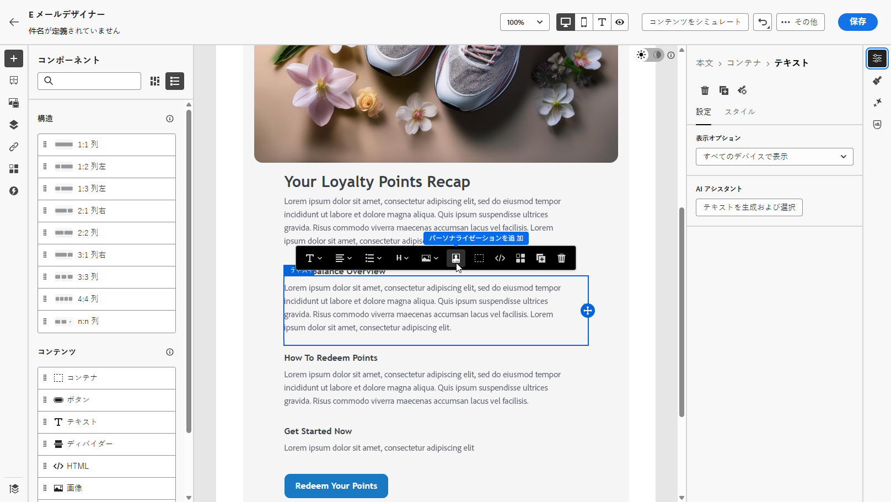

1. 「**[!UICONTROL 統合]**」セクションに移動し、「**[!UICONTROL 統合を開く]**」をクリックして、アクティブな統合をすべて表示します。

   **Journey Optimizer フラグメント**&#x200B;は統合機能で利用できますが、アウトバウンドチャネルのみをサポートすることに注意してください。 フラグメントが公開されると、既存のジャーニーやキャンペーンへの影響を避けるために、新しい統合の追加と保存が無効になります。

   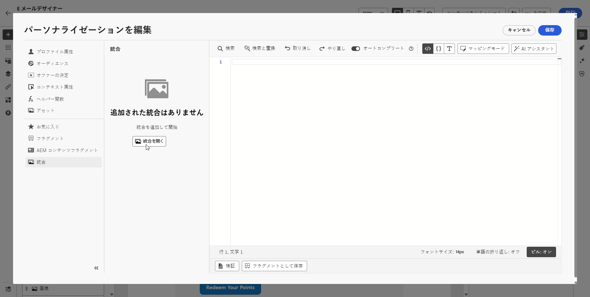

1. 統合を選択し、「**[!UICONTROL 保存]**」をクリックします。

   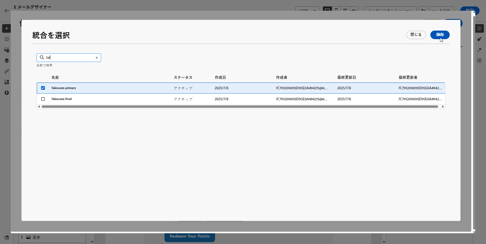

1. **[!UICONTROL ピル]**&#x200B;モードを有効にして、高度な統合メニューをロック解除します。

   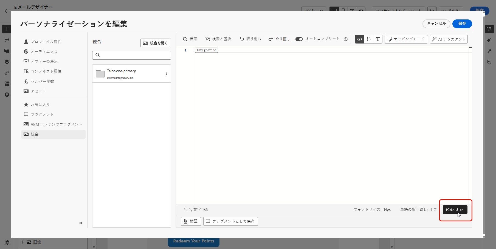

1. 統合パーソナライゼーションを作成する場合、統合ヘルパーには、エラーまたは不足しているデータがデフォルトコンテンツとどのように相互作用するかを定義する&#x200B;**`required`** フィールドが含まれます。

   * **`required=true`** （既定値）：そのメッセージのレンダリングが停止します。 送信は&#x200B;**`ExternalDataLookupExclusion`**&#x200B;で除外され、その除外は&#x200B;**メッセージフィードバックデータセット**&#x200B;に記録されます。
   * **`required=false`**：結果変数が&#x200B;**`null`**&#x200B;に設定され、レンダリングが続行されます。 テンプレートでデフォルトのテキスト、フォールバック、条件ロジックを使用することで、統合がデータを返さない場合にプロファイルが空のコンテンツを受け取らないようにします。

     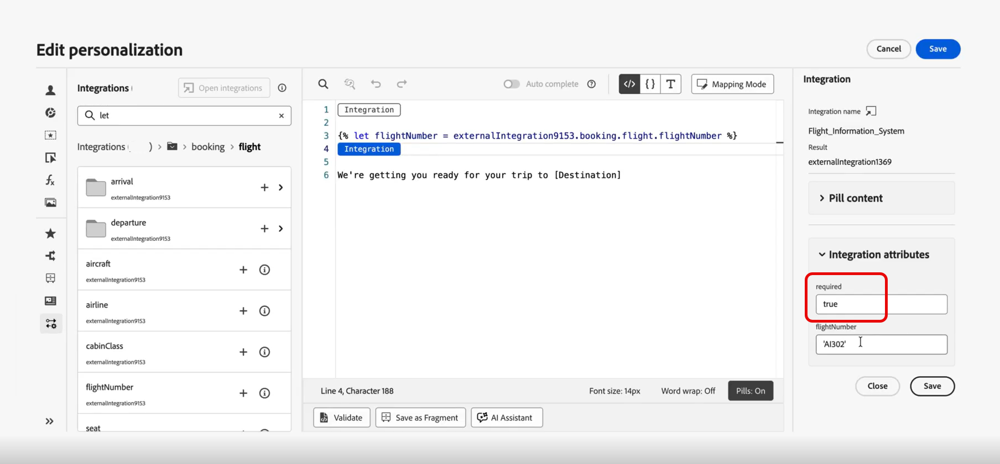

1. 統合設定を完了するには、[設定](integrations.md#configure)時に以前指定した統合属性を定義します。

   これらの属性には、一定のままの静的値や、ユーザープロファイルから情報を動的に取り込むプロファイル属性のいずれかを使用して値を割り当てることができます。

   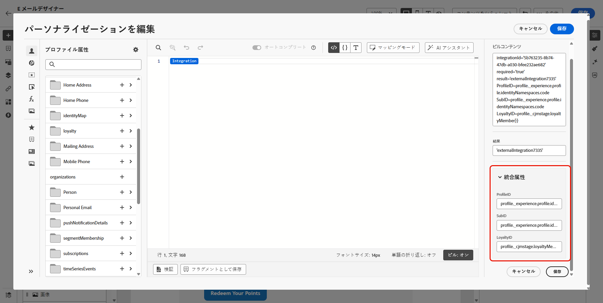

1. 統合属性を定義したら、 アイコンをクリックして、パーソナライズされたメッセージに対してコンテンツの統合フィールドを使用できるようになります。

   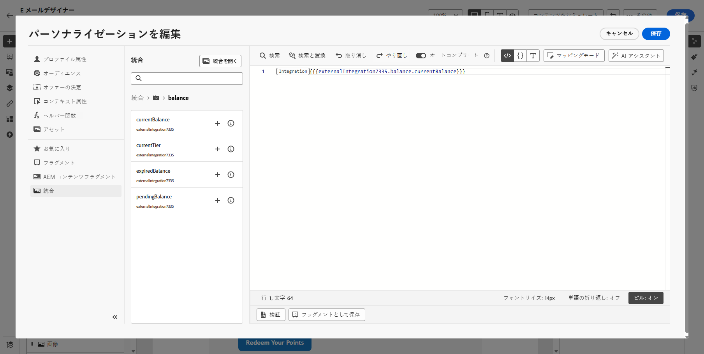

   >[!NOTE]
   >
   >テンプレート内のトークンは、統合設定で公開された管理者のフィールドのみを使用する必要があります。 例えば、`{{weatherResponse.temperature}}`は`temperature`が公開されたときに有効です。`humidity`が公開されなかった場合、`{{weatherResponse.humidity}}`はエディターで拒否されます。

1. 「**[!UICONTROL 保存]**」をクリックします。

これで、統合パーソナライゼーションがコンテンツに正常に適用され、設定した属性に基づいて各受信者がカスタマイズされた関連性の高いエクスペリエンスを受信できるようになりました。

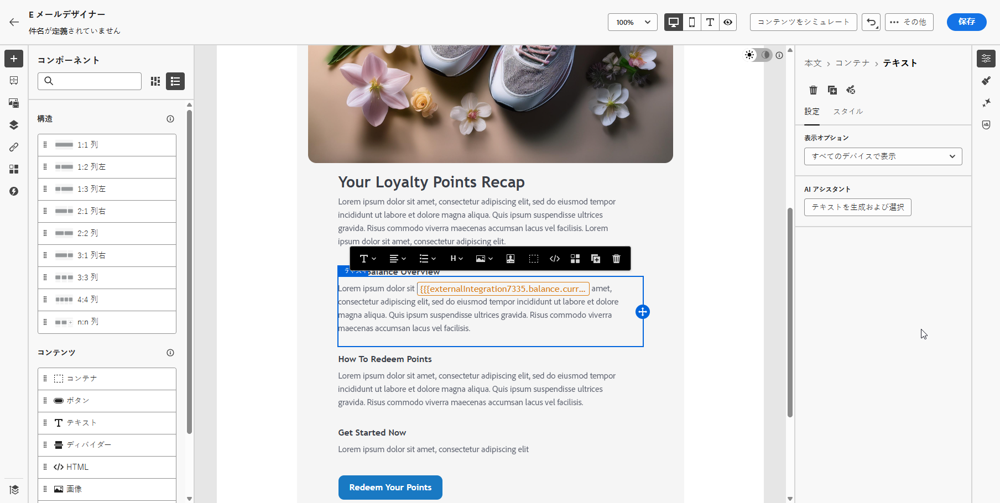

## あるAPI呼び出しを別のAPI呼び出しにマッピングする {#map-integration-chain}

統合をチェーン化して、1つの呼び出しの結果を次の呼び出し（パスセグメント、ヘッダー、クエリパラメーターなど）にフィードできます。 呼び出しは同じメッセージ内で順番に実行され、カスタムコードなしでより豊かなパーソナライゼーションがサポートされます。

まず、次のことを確認してください。

* 管理者は、必要なすべての統合を設定してアクティブ化しました。 [統合の設定](integrations.md)を参照してください。
* バリアブルパスのプレースホルダー、ヘッダー、クエリパラメーターは、マーケター向けのラベルを使用した統合設定で設定されます。
* 管理者は、各統合の&#x200B;**[!UICONTROL 応答ペイロード]**&#x200B;で必要な応答フィールドを公開して、オーサリング時に表示できるようにしました。

次の例では、プロファイルの予約からフライト番号を返す予約統合を使用し、その番号をライブステータス（遅延、宛先）に使用するフライト情報統合を使用します。 2番目の統合の入力を1番目の呼び出しの応答にマッピングします。

1. メッセージまたはフラグメントを開き、パーソナライゼーションエディターを開きます。

   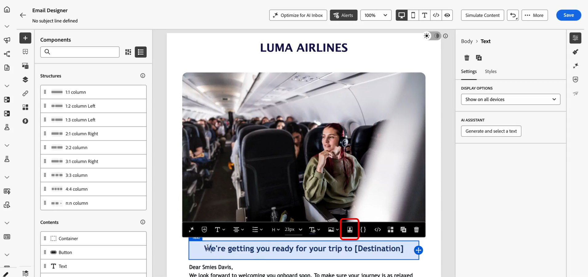

1. **[!UICONTROL 統合]**&#x200B;で、**[!UICONTROL 統合を開く]**&#x200B;をクリックします。

   

1. フライト識別子を含む予約または予約データなど、応答が次の呼び出しをフィードする統合を追加します。

   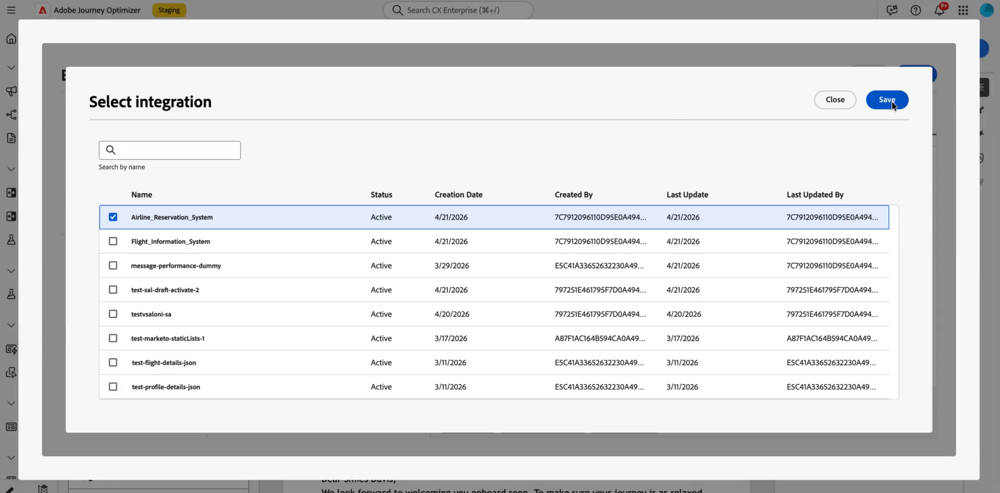

1. （オプション） **[!UICONTROL ヘルパー関数]** メニューを開き、予約応答に名前付き変数をバインドする場合は、`Let`関数などのヘルパーを追加します。

   >[!NOTE]
   >
   > 管理者が定義した&#x200B;**[!UICONTROL 応答ペイロード]**&#x200B;で公開されたフィールドのみが使用できます。 設定で公開されていないプロパティを参照することはできません。

1. ヘルパー変数を使用する場合は、その変数を、旅客または予約ペイロードのフライト番号など、予約統合が下流使用のために返すフィールドにマッピングします。

   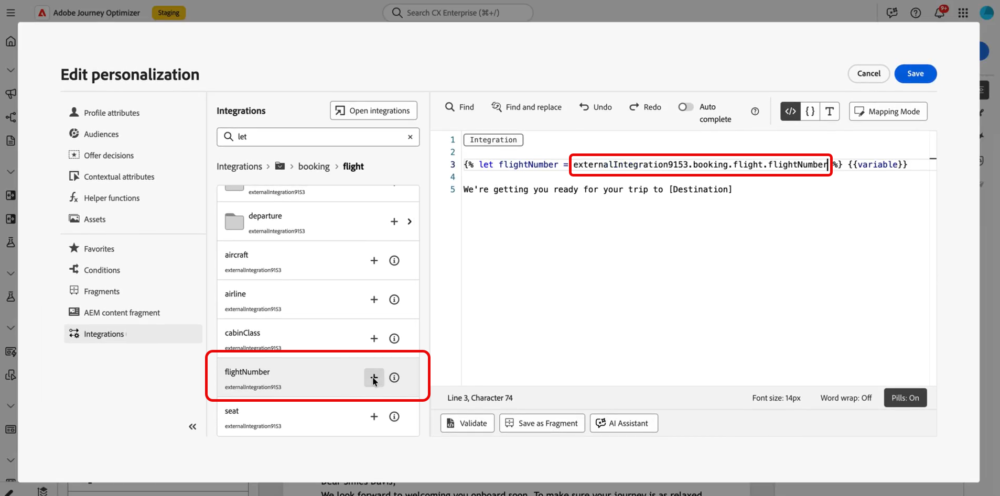

1. **[!UICONTROL 統合機能を開く]** メニューから、2番目の統合機能（フライトステータスなど）を追加します。

   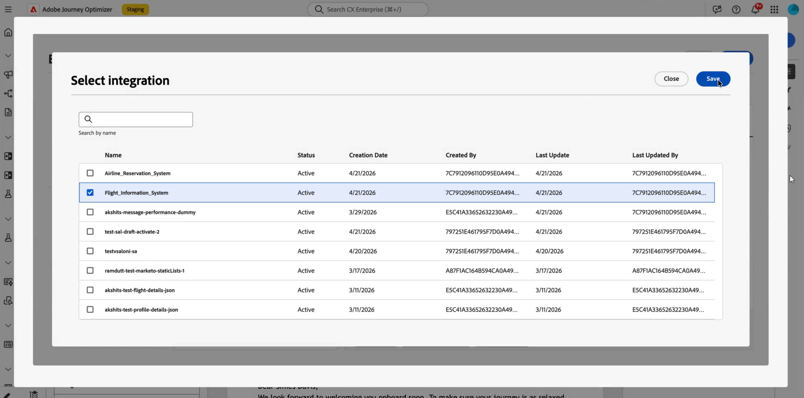

1. 2つ目の統合で、**[!UICONTROL 統合属性]**&#x200B;を開きます。 パス変数、ヘッダー、クエリパラメーターなど、最初の呼び出しのデータを再利用する必要がある各入力について、最初の統合応答からマッピングソースを選択します。

   **[!UICONTROL ピル]** エクスペリエンスでは、`Let` ステートメントを使用せずに、ファーストコール出力をセカンドコール入力に直接マッピングできます。 `Let`を使用した場合は、代わりにその変数をマッピングできます。

   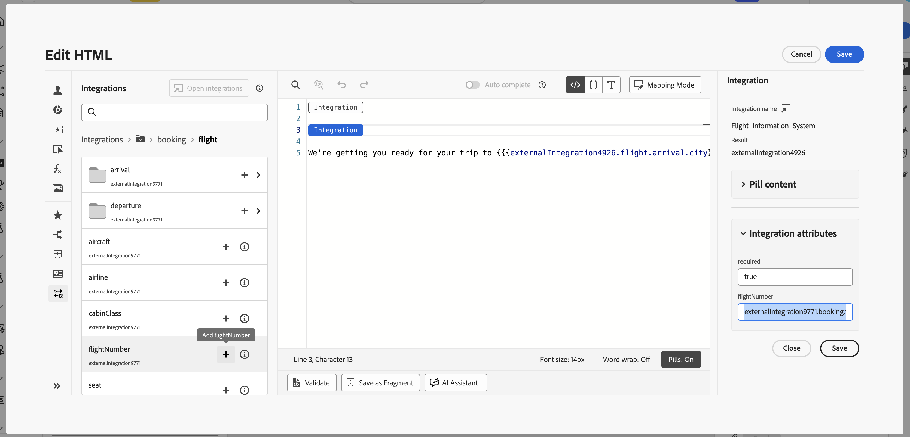

1. 2つ目の統合のトークンを、 コントロールを使用してコンテンツに挿入します。例えば、フライト情報の応答の宛先です。

   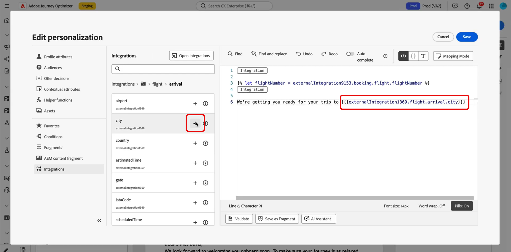

1. コンテンツを保存します。

**[!UICONTROL シミュレーション]**&#x200B;または送信時に、Journey Optimizerは次の順序で統合を実行します。最初の呼び出しは設定されたプロファイルコンテキストを使用し、その結果は2番目のリクエストをビルドします。 特定の統合がシミュレーションで実行されるか、送信時間が設定とチャネルによって異なります。


## テンプレートでのAdobe Target データの使用 {#use-adobe-target-in-templates}

この節では、Adobe Journey Optimizerで&#x200B;**統合**&#x200B;を使用して、送信時に&#x200B;**[!DNL Adobe Target]**&#x200B;からパーソナライゼーションデータを取得し、メッセージテンプレートで使用する方法について説明します。 Target Delivery APIが統合として既に設定されていることを前提としています。

設定手順については、[統合の操作](integrations.md)および[Adobe Target Recommendations](vendor-integration.md#adobe-target-recommendations)のサンプルを参照してください。

Target Delivery APIは`prefetch.mboxes`配列を返します。 各mboxには、`content`および`type`個のフィールドを持つ`options` オブジェクトが含まれます。 `type`の値によって、テンプレートでの`content`の使用方法が決まります。 mboxの応答に一致するタブを開き、次の手順に従ってメッセージでそのデータを使用します。

>[!BEGINTABS]

>[!TAB JSON コンテンツ ]

`type`が`json`の場合、`content` フィールドは&#x200B;**JSON文字列**&#x200B;です。 ネストされたフィールドにアクセスする前に解析します。 以下の例は、JSON mboxの一般的な配信API応答を示しています。

```json
{
  "status": 200,
  "prefetch": {
    "mboxes": [
      {
        "index": 0,
        "name": "SummerOffer",
        "options": {
          "content": "{\"recommendations\":[{\"productId\":\"p101\",\"name\":\"Noise Smartwatch\",\"price\":2999},{\"productId\":\"p205\",\"name\":\"Boat Earbuds\",\"price\":1499}],\"strategy\":\"collaborative-filtering\"}",
          "type": "json"
        }
      }
    ]
  }
}
```

3つのヘルパーを順番に使用して、Target レスポンスを取得、抽出、解析します。

1. **Targetの応答を取得します。** 設定済みのTarget統合を`externalDataLookup`と呼び出します。 `integrationName`をその統合の&#x200B;**[!UICONTROL Name]**&#x200B;に設定します（例のプレースホルダー`target_recommendations`を置き換えます）。 `result` パラメーターを使用して、完全な配信API ペイロードを保持するテンプレート変数（例：`targetResponse`）に名前を付けます。

   パーソナライゼーションエディターの左側のナビゲーションの&#x200B;**[!UICONTROL 統合]** メニューから直接統合を選択することもできます。 [ コンテンツに統合パーソナライゼーションを適用する](#apply-integration-personalization)を参照してください。

   ```handlebars
   {{externalDataLookup integrationName="target_recommendations" result="targetResponse"}}
   ```

1. **valueAtPathを使用して特定のmboxを抽出します。** `valueAtPath`は、0 ベースのインデックスで配列から要素を抽出し、テンプレート変数に割り当てます。 アクセスする要素を指定するには、`idx` パラメーターを使用します。

   ```handlebars
   {{valueAtPath targetResponse.prefetch.mboxes idx=0 result="summerOffer"}}
   ```

   | パラメーター | 説明 |
   | --- | --- |
   | `path` | 配列へのパス（位置、キーワードなし） |
   | `idx` | 配列アクセス用の0 ベースのインデックス（オプション） |
   | `result` | 抽出した値を格納する変数名 |

   >[!NOTE]
   >
   > `idx`が範囲外の場合、レンダリングは例外をスローします。 インデックスが無効である可能性がある場合は、無効なインデックスを``で保護します。 PQL エクスプレッションをパスとして使用することはできません。 **2025.9.0 リリース以降で利用可能。**

1. **parseJsonを使用してJSON文字列を解析します。** mbox `options.content` フィールドは生のJSON文字列です。 `parseJson`は、フィールドがテンプレート内で直接アクセスできる構造化オブジェクトに変換します。

   ```handlebars
   {{parseJson jsonStr=summerOffer.options.content result="summerOfferContent"}}
   ```

   | パラメーター | 説明 |
   | --- | --- |
   | `jsonStr` | 有効なJSONを含む文字列フィールドへのパス |
   | `result` | 解析されたオブジェクトを格納する変数名 |

   >[!NOTE]
   >
   > JSON文字列が無効であるか、参照がnullの場合、`result`は`null`に設定されます。レンダリング エラーはスローされません。 実際のTarget応答でテストし、コンテンツが有効なJSONであることを確認します。 **2026.6.0**&#x200B;以降で利用可能

1. **データにアクセスします。** 解析したら、ドット表記法を使用して`summerOfferContent`からフィールドにアクセスします。 レコメンデーションのリストをレンダリングするには：

   ```handlebars
   {{externalDataLookup integrationName="target_recommendations" result="targetResponse"}}
   {{valueAtPath targetResponse.prefetch.mboxes idx=0 result="summerOffer"}}
   {{parseJson jsonStr=summerOffer.options.content result="summerOfferContent"}}
   
   Strategy: {{summerOfferContent.strategy}}
   {{#each summerOfferContent.recommendations as |rec|}}
     {{rec.name}} — {{rec.price}}
   {{/each}}
   ```

>[!TAB HTML コンテンツ ]

`type`が`html`の場合、`content` フィールドはレンダリング可能なHTML文字列です。 解析する必要はありません。 次の例は、HTML mboxの一般的な配信API応答を示しています。

```json
{
  "status": 200,
  "prefetch": {
    "mboxes": [
      {
        "index": 0,
        "name": "SummerOffer",
        "options": {
          "content": "<div class=\"offer\"><h2>Summer Sale</h2><p>50% off Smartwatch</p></div>",
          "type": "html"
        }
      }
    ]
  }
}
```

mboxを取得して抽出し、`content`を直接レンダリングします。 `parseJson`をスキップします。

```handlebars
{{externalDataLookup integrationName="target_recommendations" result="targetResponse"}}
{{valueAtPath targetResponse.prefetch.mboxes idx=0 result="summerOffer"}}
{{{summerOffer.options.content}}}
```

>[!NOTE]
>
> **トリプルブレース** `{{{...}}}`を使用して、HTML コンテンツをそのままレンダリングします。 ダブルブレース `{{...}}`は、HTML エンティティをエスケープし、HTMLではなく生のタグ文字列をレンダリングします。

>[!ENDTABS]

## チュートリアルビデオ {#video}

このビデオでは、**統合**&#x200B;がAdobe Journey Optimizerを外部APIに接続して、ライブデータとコンテンツを&#x200B;**アウトバウンド**&#x200B;のチャネル、電子メール、SMS、プッシュ通知に取り込み、より適切なパーソナライゼーションを実現する方法を説明します。

>[!VIDEO](https://video.tv.adobe.com/v/3484118/?learn=on)
