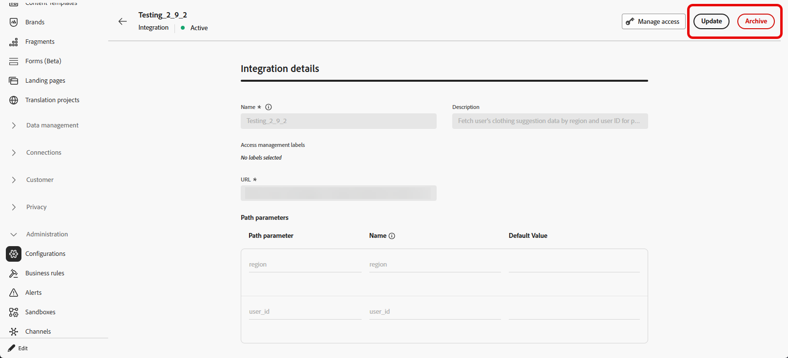
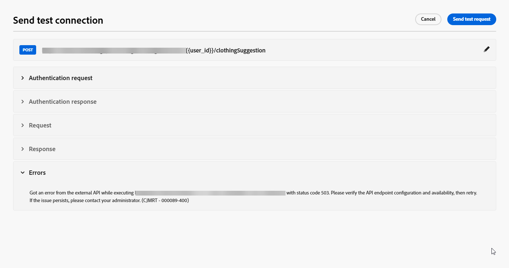

# 統合の操作 {#external-sources}

>[!BEGINSHADEBOX]

**このページでは、**&#x200B;管理者が、アウトバウンドチャネルでパーソナライズされた動的コンテンツを実現するために、Adobe Journey OptimizerをサードパーティのAPIに接続する外部統合を設定、テスト、アクティベートする方法について説明します。

>[!ENDSHADEBOX]

## 概要

**統合**&#x200B;機能は、Adobe Journey Optimizerを、既に他の場所で管理しているデータとコンポーザブルコンテンツを持つサードパーティシステムにリンクします。 オーサリング中や送信時にデータを確認できるため、Journey Optimizerで使用するチャネルをまたいで、よりレスポンシブでパーソナライズされたエクスペリエンスを実現できます。

この機能を使用して、外部データにアクセスし、次のようなサードパーティツールからコンテンツを取り込むことができます。

* ロイヤルティシステムからの&#x200B;**報酬ポイント**。
* 製品の&#x200B;**価格情報**。
* レコメンデーションエンジンからの&#x200B;**製品レコメンデーション**。
* 配送ステータスなどの&#x200B;**ロジスティックスの更新情報**。

統合の使用を開始するには、**[!UICONTROL AJO統合設定の管理]**&#x200B;および&#x200B;**[!UICONTROL AJO統合設定の表示]**&#x200B;権限を付与する必要があります。 [権限について詳しく見る](../administration/permissions.md)

+++ 統合関連の権限を割り当てる方法を説明します

1. **[!UICONTROL 権限]**&#x200B;付きの製品で、「**[!UICONTROL 役割]**」タブに移動し、目的の「**[!UICONTROL 役割]**」を選択します。

1. 「**[!UICONTROL 編集]**」をクリックして、権限を変更します。

1. **[!UICONTROL AJO Integration Configuration]** リソースを追加し、ドロップダウンメニューから適切な統合権限を選択します。

   

1. 「**[!UICONTROL 保存]**」をクリックして、変更を適用します。

   この役割に既に割り当てられているユーザーの権限は、自動的に更新されます。

1. この役割を新しいユーザーに割り当てるには、**[!UICONTROL 役割]**&#x200B;ダッシュボード内の「**[!UICONTROL ユーザー]**」タブに移動し、「**[!UICONTROL ユーザーを追加]**」をクリックします。

1. ユーザーの名前、メールアドレスを入力するか、リストから選択して、「**[!UICONTROL 保存]**」をクリックします。

まだユーザーを作成していない場合は、[このドキュメント](https://experienceleague.adobe.com/ja/docs/experience-platform/access-control/abac/permissions-ui/users)を参照してください。

+++

## 統合の設定 {#configure}

>[!AVAILABILITY]
>
> この統合機能は、アウトバウンドチャネル（電子メール、SMS、プッシュ通知）に限定されており、JSONまたはHTMLの取得をサポートしています。

管理者は、次の手順に従って外部統合を設定できます。

1. 左側のメニューの「**[!UICONTROL 設定]**」セクションに移動し、**[!UICONTROL 統合]**&#x200B;カードから「**[!UICONTROL 管理]**」をクリックします。

   次に、「**[!UICONTROL 統合を作成]**」をクリックして、新しい設定を開始します。

   

1. 必要に応じて、**cURL** コマンドを貼り付けて、URL、HTTP メソッド、ヘッダー、クエリパラメーターを自動入力します。

1. 統合の&#x200B;**[!UICONTROL 名前]**&#x200B;と&#x200B;**[!UICONTROL 説明]**&#x200B;を入力します。

   >[!NOTE]
   >
   >**[!UICONTROL 名前]** フィールドにスペースを含めることはできません。

1. API エンドポイント **[!UICONTROL URL]**&#x200B;を入力します。

   パス変数の場合は、URLの中かっこでラベルを二重中括弧で囲みます（例：`https://api.example.com/v1/products/{{productId}}`）。次に、**[!UICONTROL パステンプレート]**&#x200B;に各プレースホルダーを設定します。

1. URLに追加したすべてのプレースホルダーに対して、**[!UICONTROL パステンプレート]**&#x200B;を&#x200B;**[!UICONTROL 名前]**&#x200B;および&#x200B;**[!UICONTROL デフォルト値]**&#x200B;で設定します。

   **[!UICONTROL Name]**&#x200B;は、エディター内のマーケター向けラベルであり、API リクエストでは送信されないことに注意してください。

   

1. GET と POST の間で **[!UICONTROL HTTP メソッド]**&#x200B;を選択します。

1. 統合の必要に応じて、「**[!UICONTROL ヘッダーを追加]**」や「**[!UICONTROL クエリパラメーターを追加]**」をクリックします。 各パラメーターに対して、次の詳細情報を入力します。

   * **[!UICONTROL パラメーター]**: APIで想定される実際のヘッダーまたはクエリパラメーター名。

   * **[!UICONTROL 名前]**：このパラメーターのマーケターにとって使いやすいラベルです。作成者は、キャンペーンの値をマッピングするときにパラメーターを選択します。

   * **[!UICONTROL タイプ]**：固定値の場合は「**定数**」、動的入力の場合は「**変数**」を選択します。

   * **[!UICONTROL 値]**：定数の値を直接入力するか、変数のマッピングを選択します。

   * **[!UICONTROL 必須]**：このパラメーターが必須かどうかを指定します。 必須の&#x200B;**[!UICONTROL 変数]** パラメーターの場合、実行時に値が解決されず、デフォルトが指定されていない場合、リクエストの生成はエラーで失敗し、送信API呼び出しは行われません。

   

1. 次の&#x200B;**[!UICONTROL 認証タイプ]**&#x200B;を選択します。

   * **[!UICONTROL 認証なし]**：資格情報を必要としないオープンな API の場合。

   * **[!UICONTROL API キー]**：静的 API キーを使用してリクエストを認証します。 **[!UICONTROL API キー名]**、**[!UICONTROL API キー値]**&#x200B;を入力し、**[!UICONTROL 場所]**&#x200B;を指定します。

   * **[!UICONTROL 基本認証]**：標準の HTTP 基本認証を使用します。 **[!UICONTROL ユーザー名]**&#x200B;と&#x200B;**[!UICONTROL パスワード]**&#x200B;を入力します。

   * **[!UICONTROL OAuth 2.0]**：OAuth 2.0 プロトコルを使用して認証します。  アイコンをクリックして、**[!UICONTROL ペイロード]**&#x200B;を設定または更新します。

   

1. API要求の&#x200B;**[!UICONTROL タイムアウト]**&#x200B;期間など&#x200B;**[!UICONTROL ポリシー設定]**&#x200B;を設定し、スロットル、キャッシュ、再試行を有効にするように選択します。

   >[!NOTE]
   >
   >スロットルを有効にすると、サポートされるレートは50 ～ 5,000 TPSになります。 制限は、各API エンドポイントではなく、**統合**&#x200B;に適用されます。
   >
   >再試行を有効にすると、他の失敗はデフォルトで&#x200B;**3**&#x200B;回再試行され、試行間に&#x200B;**200 ms**、**400 ms**、**800 ms**&#x200B;が発生します。

1. 「**[!UICONTROL 応答ペイロード]**」フィールドを使用すると、サンプル出力のどのフィールドをメッセージのパーソナライゼーションに使用する必要があるかを決定できます。

    アイコンをクリックし、サンプルの JSON 応答ペイロードを貼り付けると、データタイプが自動的に検出されます。

1. パーソナライゼーション用に公開するフィールドを選択し、対応するデータタイプを指定します。

   

   >[!NOTE]
   >
   >**[!UICONTROL 応答ペイロード]**&#x200B;設定は、オーサリングに期待される応答を、その手順で適用されたスキーマを含めて定義します。 マーケターは公開されたフィールドのみを参照でき、他のパスのトークンはエディターでの検証に失敗します。

1. **[!UICONTROL テスト接続を送信]** を使用して、統合を検証します。 [接続をテストする方法の詳細](#connection)

   検証が完了したら、「**[!UICONTROL アクティブ化]**」をクリックします。

1. 新しく作成した統合にアクセスして、以下を行います。

   * **更新**: **認証**&#x200B;の詳細と&#x200B;**ポリシー設定**&#x200B;のみを変更します。 更新は、ライブジャーニーとキャンペーンに適用されます。 変更を保存する前に、**[!UICONTROL 参照を探索]** メニューを使用して、統合が使用される場所を確認します。
   * **アーカイブ**：統合設定をアーカイブします。

   

アクティブ化後、 アイコンをクリックして&#x200B;**[!UICONTROL 参照]** メニューにアクセスし、この設定の使用状況（それに依存するジャーニーやキャンペーンを含む）を確認します。

### 送信時間の制限と動作 {#configure-send-time}

送信時に、外部APIからの応答は、デフォルトで最大&#x200B;**4 MB**&#x200B;になる場合があります。 より大きい値は統合エラーとして扱われ、応答サイズが原因でエラーが発生した場合、**再試行は試行されません**。

呼び出しは、設定した&#x200B;**スロットリング**&#x200B;率を尊重します。Journey Optimizerは、外部システムがダウンしている場合やエラーが返された場合でも、その制限まで試行をスケジュールします。 **cache**&#x200B;が有効になっている場合、定義したキャッシュ **TTL**&#x200B;が期限切れになるまで、成功した&#x200B;**応答のみが保存および再利用されます。失敗した応答はキャッシュされません。**

キューに入れた各メッセージには、有効ウィンドウ（TTL）も含まれます。 処理が遅れてメッセージがそのウィンドウを過ぎている場合、システム **はそれを破棄し**、**`MessageValidityExclusion`** イベントを発生するので、古い作業はキューからクリアされ、リソースは引き続き利用できます。

## 接続をテストしています {#connection}

**[!UICONTROL 送信テスト接続]**&#x200B;は、エンドポイント URL、認証、およびリクエスト構造をアクティブ化前にターゲット APIに対して検証します。これにより、メッセージ処理中にランタイム エラーが発生するリスクを軽減できます。

1. URL、HTTP メソッド、ヘッダー、およびクエリパラメーターが定義されたら、**[!UICONTROL テスト接続を送信]**&#x200B;をクリックして接続テストを実行し、設定を確認します。

1. **[!UICONTROL テスト接続を送信]** ダイアログで、URL パス、ヘッダー、クエリパラメーターに&#x200B;**[!UICONTROL 変数]** プレースホルダーのデフォルト値を入力します。

   これらの値はテストリクエストに含まれます。 Journey Optimizerはエンドポイントを呼び出し、接続が成功したか失敗したかを報告します。

   

1. テストで正常な応答が返された場合は、「**[!UICONTROL 応答ペイロードとして使用]**」を選択して、応答本文を&#x200B;**[!UICONTROL 応答ペイロード]** フィールドにコピーします。[統合](#configure)の下の手順10を参照してください。ここで、データタイプを検出でき、パーソナライゼーション用にフィールドを選択できます。

   

1. テストが成功しない場合は、**[!UICONTROL エラー]** ドロップダウンを展開して、エラーの詳細を確認し、必要に応じて統合設定を更新して、**[!UICONTROL テスト接続を送信]**&#x200B;を再実行します。

   

テストが成功したら、統合設定で「**[!UICONTROL Activate]**」を選択します。 [統合の設定](#configure)を参照してください。

