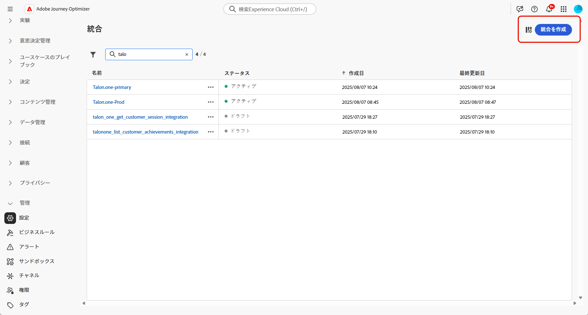
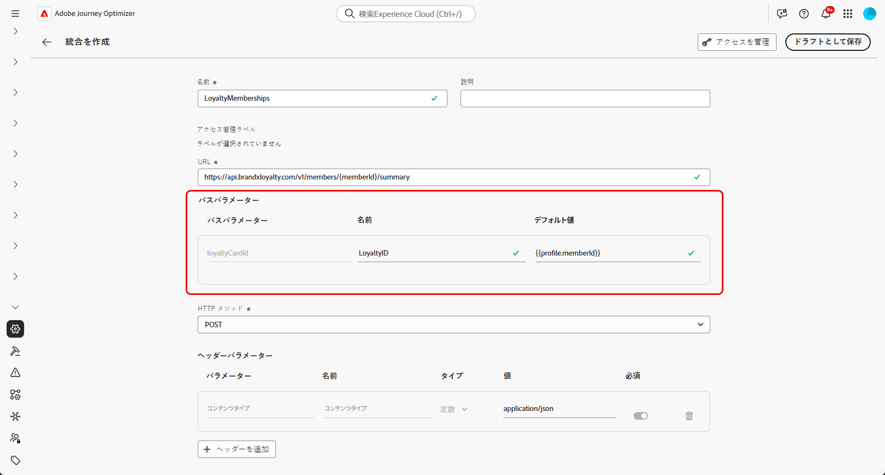
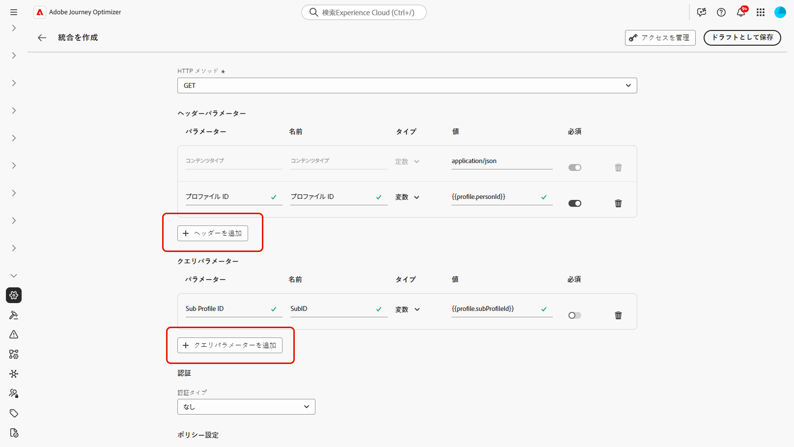
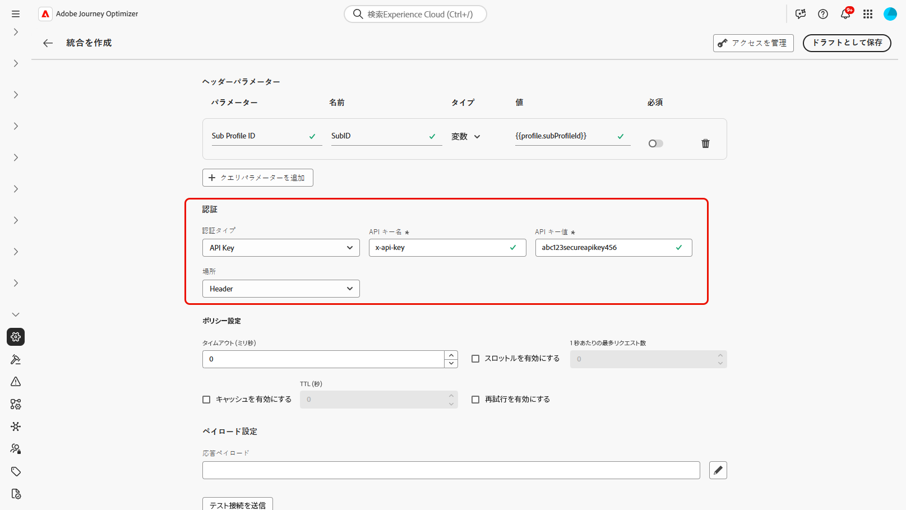
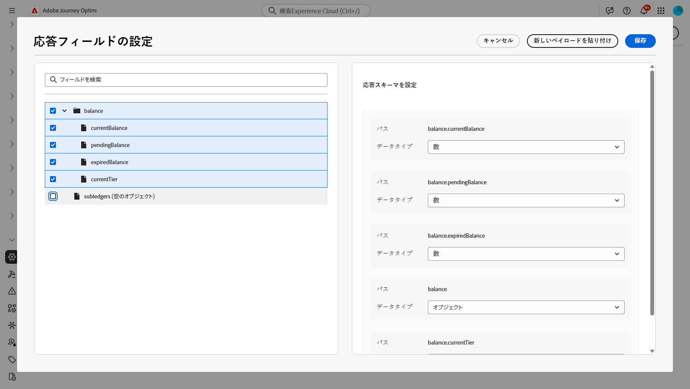

# 統合の操作 {#external-sources}

>[!BEGINSHADEBOX]

目次：

* **[統合の操作](integrations.md)**
* [基本を学ぶ](vendor-integration-gs.md)
* [利用可能なベンダー](vendor-integration.md)
* [FAQ](vendor-integration-faq.md)

>[!ENDSHADEBOX]

## 概要

**統合**&#x200B;機能は、Adobe Journey Optimizerを、既に他の場所で管理しているデータとコンポーザブルコンテンツを持つサードパーティシステムにリンクします。 オーサリング中や送信時にデータを確認できるため、Journey Optimizerで使用するチャネルをまたいで、よりレスポンシブでパーソナライズされたエクスペリエンスを実現できます。

この機能を使用して、外部データにアクセスし、次のようなサードパーティツールからコンテンツを取り込むことができます。

* ロイヤルティシステムからの&#x200B;**報酬ポイント**。
* 製品の&#x200B;**価格情報**。
* レコメンデーションエンジンからの&#x200B;**製品レコメンデーション**。
* 配送ステータスなどの&#x200B;**ロジスティックスの更新情報**。

統合の使用を開始するには、ユーザーに&#x200B;**[!UICONTROL AJO統合設定の管理]**&#x200B;権限と&#x200B;**[!UICONTROL AJO統合の表示]**&#x200B;権限を付与する必要があります。 [権限について詳しく見る](../administration/permissions.md)

+++ 統合関連の権限を割り当てる方法を説明します

1. **[!UICONTROL 権限]**&#x200B;付きの製品で、「**[!UICONTROL 役割]**」タブに移動し、目的の「**[!UICONTROL 役割]**」を選択します。

1. 「**[!UICONTROL 編集]**」をクリックして、権限を変更します。

1. **[!UICONTROL AJO Integration Configuration]** リソースを追加し、ドロップダウンメニューから適切な統合権限を選択します。

   

1. 「**[!UICONTROL 保存]**」をクリックして、変更を適用します。

   この役割に既に割り当てられているユーザーの権限は、自動的に更新されます。

1. この役割を新しいユーザーに割り当てるには、**[!UICONTROL 役割]**&#x200B;ダッシュボード内の「**[!UICONTROL ユーザー]**」タブに移動し、「**[!UICONTROL ユーザーを追加]**」をクリックします。

1. ユーザーの名前、メールアドレスを入力するか、リストから選択して、「**[!UICONTROL 保存]**」をクリックします。

まだユーザーを作成していない場合は、[このドキュメント](https://experienceleague.adobe.com/ja/docs/experience-platform/access-control/abac/permissions-ui/users)を参照してください。

+++

## 統合の設定 {#configure}

>[!AVAILABILITY]
>
> この統合機能は、アウトバウンドチャネル（電子メール、SMS、プッシュ通知）に限定され、JSONまたはHTML形式でデータを提供します。 APIは読み取り専用で、取得操作のみをサポートしています。

管理者は、次の手順に従って外部統合を設定できます。

1. 左側のメニューの「**[!UICONTROL 設定]**」セクションに移動し、**[!UICONTROL 統合]**&#x200B;カードから「**[!UICONTROL 管理]**」をクリックします。

   次に、「**[!UICONTROL 統合を作成]**」をクリックして、新しい設定を開始します。

   

1. 必要に応じて、**cURL** コマンドを貼り付けて、URL、HTTP メソッド、ヘッダー、クエリパラメーターを自動入力します。

1. 統合の&#x200B;**[!UICONTROL 名前]**&#x200B;と&#x200B;**[!UICONTROL 説明]**&#x200B;を入力します。

   >[!NOTE]
   >
   >これらのフィールドにスペースを含めることはできません。

1. API エンドポイント **[!UICONTROL URL]** を入力します。この URL には、ラベルとデフォルト値を使用して定義できる変数を持つパスパラメーターを含めることができます。

1. **[!UICONTROL 名前]**&#x200B;と&#x200B;**[!UICONTROL デフォルト値]**&#x200B;を使用して、**[!UICONTROL パステンプレート]**&#x200B;を設定します。

   

1. GET と POST の間で **[!UICONTROL HTTP メソッド]**&#x200B;を選択します。

1. 統合の必要に応じて、「**[!UICONTROL ヘッダーを追加]**」や「**[!UICONTROL クエリパラメーターを追加]**」をクリックします。 各パラメーターに対して、次の詳細情報を入力します。

   * **[!UICONTROL パラメーター]**：パラメーターの参照に内部的に使用される一意の ID。

   * **[!UICONTROL 名前]**：API で想定されるパラメーターの実際の名前。

   * **[!UICONTROL タイプ]**：固定値の場合は「**定数**」、動的入力の場合は「**変数**」を選択します。

   * **[!UICONTROL 値]**：定数の値を直接入力するか、変数のマッピングを選択します。

   * **[!UICONTROL 必須]**：このパラメーターが必須かどうかを指定します。

   

1. 次の&#x200B;**[!UICONTROL 認証タイプ]**&#x200B;を選択します。

   * **[!UICONTROL 認証なし]**：資格情報を必要としないオープンな API の場合。

   * **[!UICONTROL API キー]**：静的 API キーを使用してリクエストを認証します。 **[!UICONTROL API キー名]**、**[!UICONTROL API キー値]**&#x200B;を入力し、**[!UICONTROL 場所]**&#x200B;を指定します。

   * **[!UICONTROL 基本認証]**：標準の HTTP 基本認証を使用します。 **[!UICONTROL ユーザー名]**&#x200B;と&#x200B;**[!UICONTROL パスワード]**&#x200B;を入力します。

   * **[!UICONTROL OAuth 2.0]**：OAuth 2.0 プロトコルを使用して認証します。  アイコンをクリックして、**[!UICONTROL ペイロード]**&#x200B;を設定または更新します。

   

1. API要求の&#x200B;**[!UICONTROL タイムアウト]**&#x200B;期間など&#x200B;**[!UICONTROL ポリシー設定]**&#x200B;を設定し、スロットル、キャッシュ、再試行を有効にするように選択します。

   スロットルが有効になっている場合、サポートされるレートの範囲は、**50** TPS （最小）～**5000** TPS （最大）です。
再試行が有効になっている場合、その他の失敗はデフォルトで**3**&#x200B;回の再試行に続き、**200 ms**、**400 ms**、および&#x200B;**800 ms**&#x200B;が連続して試行されます。

1. 「**[!UICONTROL 応答ペイロード]**」フィールドを使用すると、サンプル出力のどのフィールドをメッセージのパーソナライゼーションに使用する必要があるかを決定できます。

    アイコンをクリックし、サンプルの JSON 応答ペイロードを貼り付けると、データタイプが自動的に検出されます。

1. パーソナライゼーション用に公開するフィールドを選択し、対応するデータタイプを指定します。

   

   >[!NOTE]
   >
   >**[!UICONTROL 応答ペイロード]**&#x200B;設定は、オーサリングに期待される応答を、その手順で適用されたスキーマを含めて定義します。 マーケターは公開されたフィールドのみを参照でき、他のパスのトークンはエディターでの検証に失敗します。

1. **[!UICONTROL テスト接続を送信]** を使用して、統合を検証します。

   検証が完了したら、「**[!UICONTROL アクティブ化]**」をクリックします。

### 送信時間の制限と動作 {#configure-send-time}

送信時に、外部APIからの応答は、デフォルトで最大&#x200B;**4 MB**&#x200B;になる場合があります。 より大きい値は統合エラーとして扱われ、応答サイズが原因でエラーが発生した場合、**再試行は試行されません**。

呼び出しは、設定した&#x200B;**スロットリング**&#x200B;率を尊重します。Journey Optimizerは、外部システムがダウンしている場合やエラーが返された場合でも、その制限まで試行をスケジュールします。 **cache**&#x200B;が有効になっている場合、定義したキャッシュ **TTL**&#x200B;が期限切れになるまで、成功した&#x200B;**応答のみが保存および再利用されます。失敗した応答はキャッシュされません。**

キューに入れた各メッセージには、有効ウィンドウ（TTL）も含まれます。 処理が遅れてメッセージがそのウィンドウを過ぎている場合、システム **はそれを破棄し**、**`MessageValidityExclusion`** イベントを発生するので、古い作業はキューからクリアされ、リソースは引き続き利用できます。

## パーソナライゼーションに対する外部統合の使用 {#personalization}

パーソナライゼーションに外部統合を使用する前に、統合呼び出しのスケジュールと分離は実行コンテキストに依存することに注意してください。

* **バッチ実行** （バッチキャンペーン、オーケストレーションされたキャンペーン、およびAPI トリガーによるマーケティングキャンペーン）：各バッチ実行は、専用の隔離された環境で動作します。 したがって、外部システムを呼び出す同時バッチ実行は、互いに競合したり妨害したりしません。

* **単一の実行** （単一ジャーニー、バッチジャーニー、およびAPI トリガーのトランザクションキャンペーン）：統合トラフィックはブランドのサンドボックスごとに分離されるため、あるブランドの外部APIが遅いと、別のブランドが遅延することはありません。 サンドボックス内では、同時統合によって他の統合に基づくメッセージを一時的に遅らせることができます。各メッセージは、有効期限が切れるまで最大12時間試行されます。

マーケターは、設定済みの統合を使用してコンテンツをパーソナライズできます。 次の手順に従います。

1. キャンペーンコンテンツにアクセスし、テキストまたは HTML **[!UICONTROL コンポーネント]**&#x200B;から「**[!UICONTROL パーソナライゼーションを追加]**」をクリックします。

   [コンポーネントの詳細情報](../email/content-components.md)

   

1. 「**[!UICONTROL 統合]**」セクションに移動し、「**[!UICONTROL 統合を開く]**」をクリックして、アクティブな統合をすべて表示します。

   コンテンツフラグメントは統合機能で利用できますが、アウトバウンドチャネルのみをサポートしているため、インバウンド公開は成功しません。 フラグメントが公開されると、既存のジャーニーやキャンペーンへの影響を避けるために、新しい統合の追加と保存が無効になります。

   

1. 統合を選択し、「**[!UICONTROL 保存]**」をクリックします。

   

1. **[!UICONTROL ピル]**&#x200B;モードを有効にして、高度な統合メニューをロック解除します。

   

1. 統合パーソナライゼーションを作成する場合、統合ヘルパーには、エラーまたは不足しているデータがデフォルトコンテンツとどのように相互作用するかを定義する&#x200B;**`required`** フィールドが含まれます。

   * **`required=true`** （既定値）：そのメッセージのレンダリングが停止します。 送信は&#x200B;**`ExternalDataLookupExclusion`**&#x200B;で除外され、その除外は&#x200B;**メッセージフィードバックデータセット**&#x200B;に記録されます。
   * **`required=false`**：結果変数が&#x200B;**`null`**&#x200B;に設定され、レンダリングが続行されます。 テンプレートでデフォルトのテキスト、フォールバック、条件ロジックを使用することで、統合がデータを返さない場合にプロファイルが空のコンテンツを受け取らないようにします。

     

1. 統合設定を完了するには、[設定](#configure)時に以前指定した統合属性を定義します。

   これらの属性には、一定のままの静的値や、ユーザープロファイルから情報を動的に取り込むプロファイル属性のいずれかを使用して値を割り当てることができます。

   

1. 統合属性を定義したら、 アイコンをクリックして、パーソナライズされたメッセージに対してコンテンツの統合フィールドを使用できるようになります。

   

   >[!NOTE]
   >
   >テンプレート内のトークンは、統合設定で公開された管理者のフィールドのみを使用する必要があります。 例えば、`{{weatherResponse.temperature}}`は`temperature`が公開されたときに有効です。`humidity`が公開されなかった場合、`{{weatherResponse.humidity}}`はエディターで拒否されます。

1. 「**[!UICONTROL 保存]**」をクリックします。

これで、統合パーソナライゼーションがコンテンツに正常に適用され、設定した属性に基づいて各受信者がカスタマイズされた関連性の高いエクスペリエンスを受信できるようになりました。

