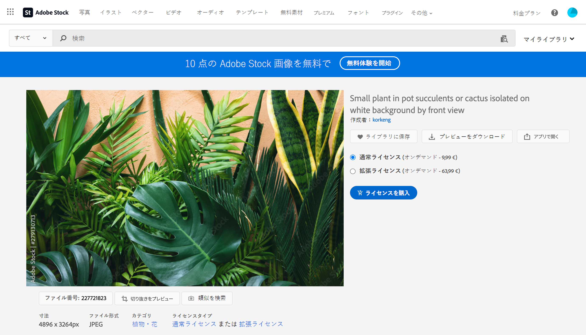

# [!DNL Adobe Stock] 画像の操作 {#stock}

## [!DNL Adobe Stock] の基本を学ぶ {#get-started-stock}

[!DNL Adobe Stock] と [!DNL Adobe Journey Optimizer] E メールデザイナーの統合プラグインを使用すると、メッセージオーサリングで使用する画像のナビゲーション、ライセンス取得および保存を簡単に行うことができます。

[Adobe Stock](https://helpx.adobe.com/jp/stock/get-started.html){target="_blank"} では、数百万もの厳選された高品質な、ロイヤリティフリーの写真、ビデオ、イラスト、ベクターグラフィックを利用できます。クレジットパックを購入してアセットのライセンスを取得するか、必要なアセットに対して通常ライセンスまたは強化ライセンスを 1 つだけ購入するかどうかを選択できます。Adobe Stock はまた、アセットの無料コレクションを提供しています。

[!DNL Adobe Journey Optimizer] を使用すると、[!DNL Adobe Stock] からメールに画像を直接アップロードし、「**[!UICONTROL Adobe Stock フォトを検索]**」オプションを使用して&#x200B;**[!UICONTROL アセット]**&#x200B;フォルダーに追加できます。「**[!UICONTROL 類似のストックフォトを検索]**」オプションを使用すると、配信で使用されるアセットのコンテンツ、カラー、構成に一致する画像を検索することができます。

## 権限{#stock-permissions}

「**[!UICONTROL Adobe Stock フォトを検索]**」および「**[!UICONTROL 類似画像を検索]**」オプションは、AEM Assets Essentials 製品プロファイルにアクセスできるユーザーが使用できます。

詳しくは、[Experience Manager Assets ドキュメント](https://experienceleague.adobe.com/docs/experience-manager-assets-essentials/help/get-started-admins/deploy-administer.html?lang=ja#add-users-to-essentials){target="_blank"}を参照してください。

## [!DNL Adobe Stock] からの画像の挿入 {#add-stock-image}

[!DNL Adobe Stock] からコンテンツに画像を追加するには、次の手順に従います。

1. E メールデザイナーの「**[!UICONTROL コンテンツ コンポーネント]**」セクションから、**画像**&#x200B;をドラッグ＆ドロップします。

1. E メールデザイナーの左側にある「**[!UICONTROL Adobe Stock フォトを検索]**」ボタンをクリックします。

   

1. ライブラリを参照するか、検索フィールドに語句を入力します。

   

1. 選んだ画像を選択し、「**[!UICONTROL 保存]**」をクリックします。

   選択した画像がライセンス済みでない場合は、[ライセンスを取得](#license-stock-image)する必要があります。

## 類似フォトの検索 {#similar-stock-image}

メールコンテンツ内の既存の画像を [!DNL Adobe Stock] のフォトに置き換えることができます。このオプションは、ライセンス済み／未ライセンスのストック画像、アセットフォルダー内の画像などすべての画像に対して使用できます。

類似フォトを参照するには、次の手順に従います。

1. 置き換える画像を選択します。
1. 「**[!UICONTROL 類似のストックフォトを検索]**」ボタンをクリックして、画像のコンテンツ、カラー、構成に一致する [!DNL Adobe Stock] のアセットを表示します。

   

1. 選んだ画像を選択し、「**[!UICONTROL 保存]**」をクリックします。

   

   選択した画像がライセンス済みでない場合は、[ライセンスを取得](#license-stock-image)する必要があります。

1. 必要に応じて、「**[!UICONTROL 設定]**」タブと「**[!UICONTROL スタイル]**」タブで画像をカスタマイズします。[コンポーネント設定の詳細情報](../email/content-components.md)。

## [!DNL Adobe Stock] からのライセンスの取得 {#license-stock-image}

画像がライセンス済みの場合は、 アイコンによって表示されます。そうでない場合は、ライセンスが必要です。

画像のライセンスを取得してダウンロードするには、次の手順に従います。

1. 画像を選択して「**[!UICONTROL Adobe Stock 画像のライセンス]**」アイコンをクリックします。

   

   その後、ライセンスを購入するための [!DNL Adobe Stock] web サイトにリダイレクトされます。

   

1. [!DNL Adobe Stock] web サイトで、画像をダウンロードして透かしを削除するには、アセットを購入する必要があります。

   購入価格は、Adobe Stock のプランまたはサブスクリプションによって異なります。複数の Adobe Stock アカウントがある場合は、最後に使用した Stock ID にリダイレクトされます。 この場合、アセットのライセンスを取得する前に、正しいアカウントにサインインしていることを確認してください。

   Adobe Stock のプランと価格について詳しくは、[Adobe Stock ドキュメント](https://stock.adobe.com/jp/plans){target="_blank"}を参照してください。

   >[!WARNING]
   > 未ライセンスの画像を含むメールが送信された場合、画像は透かしのある未ライセンスのフォームを保持します。

1. 購入が完了したら、[!DNL Adobe Journey Optimizer] でメールに戻り、「**[!UICONTROL ストック画像をインポート]**」を選択して、ライセンス済みの画像をアセットに読み込むことができます。

   

1. アセットを保存するフォルダーを選択します。[!DNL Experience Manager Assets] について詳しくは、[この節](assets.md#get-started-assets)を参照してください。

## 関連トピック{#stock-related-topics}

* [Journey Optimizer でのメールのデザイン](../email/get-started-email-design.md)
* [メールのデザインのコンポーネント設定](../email/content-components.md)
* [Adobe Stock の概要](https://helpx.adobe.com/jp/stock/get-started.html){target="_blank"}。

