# ランディングページの作成と公開 {#create-lp}

>[!CAUTION]
>
>ランディングページは現在、一部のユーザーのみが早期アクセスで利用できます。この機能を利用する場合は、アドビアカウント担当者にお問い合わせください。

## ランディングページへのアクセス {#access-landing-pages}

ランディングページのリストにアクセスするには、**[!UICONTROL ジャーニー管理]**／**[!UICONTROL ランディングページ]**&#x200B;を選択します。

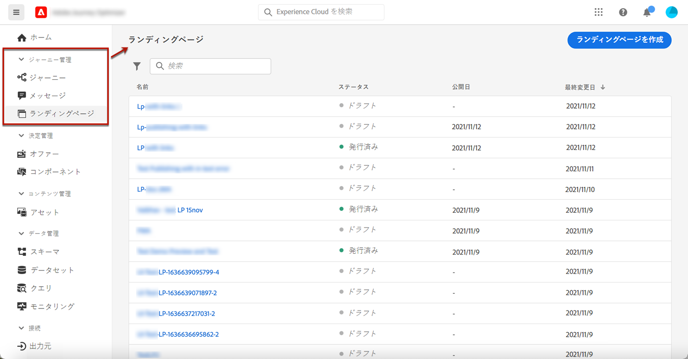

**[!UICONTROL ランディングページ]**&#x200B;のリストには、作成されたすべての項目が表示されます。ステータスや変更日に基づいてフィルター処理できます。

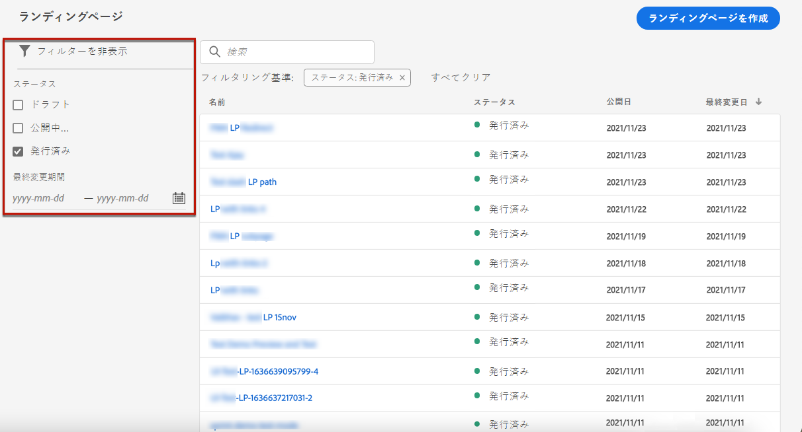

## ランディングページの作成 {#create-landing-page}

ランディングページの作成手順は次のとおりです。

1. ランディングページのリストから、「**[!UICONTROL ランディングページの作成]**」をクリックします。

   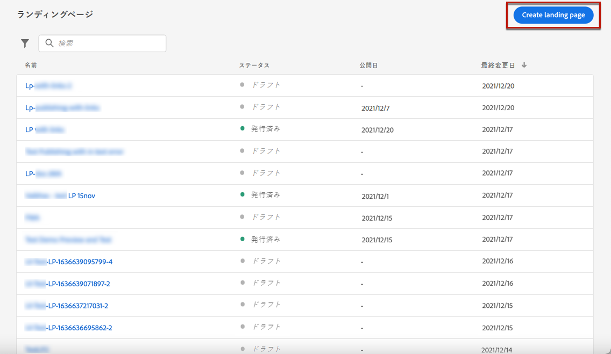

1. タイトルを追加します。 必要に応じて、説明を追加できます。

   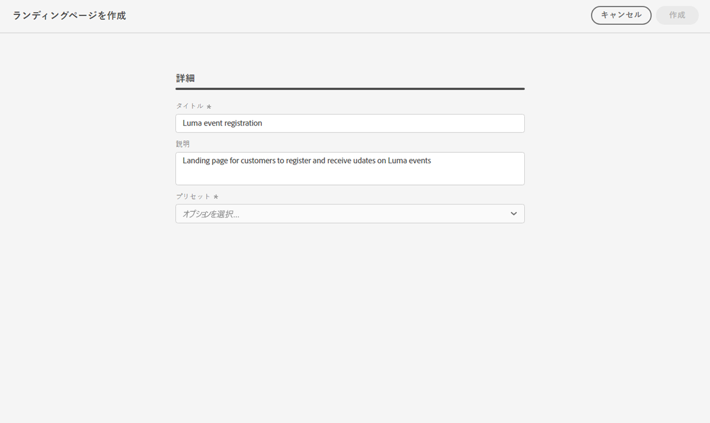

1. プリセットを選択します。

   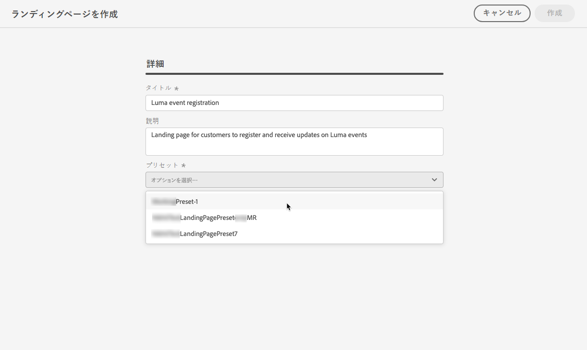

   >[!NOTE]
   >
   >ランディングページのプリセットを定義するには、アドビアカウント担当者または [アドビカスタマーケアサポートチーム](https://helpx.adobe.com/jp/enterprise/admin-guide.html/enterprise/using/support-for-experience-cloud.ug.html){target=&quot;_blank&quot;}にお問い合わせください。

1. 「**[!UICONTROL 作成]**」をクリックします。

1. プライマリページとそのプロパティが表示されます。 プライマリページの設定方法については、[こちら](#configure-primary-page)を参照してください。

   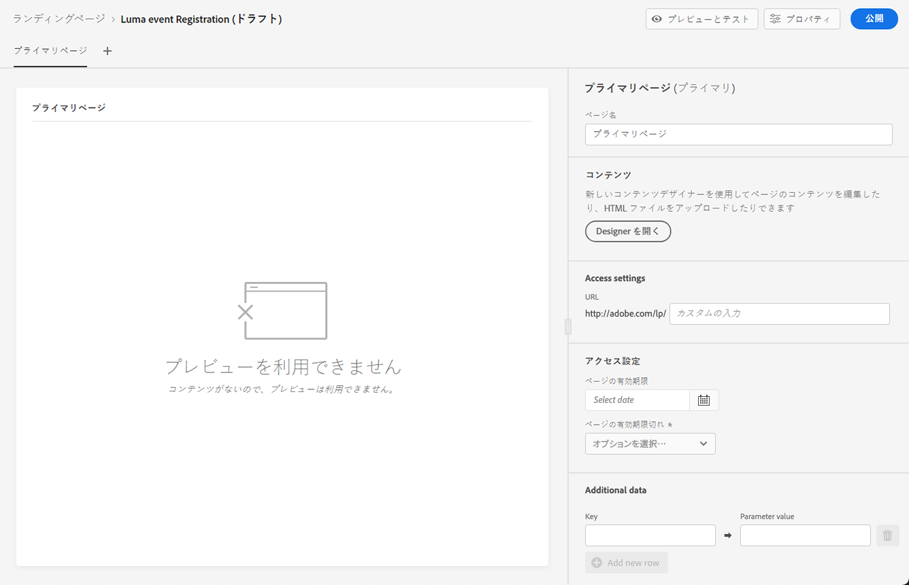

1. 「+」アイコンをクリックしてサブページを追加します。サブページの設定方法については、[こちら](#configure-subpages)を参照してください。

   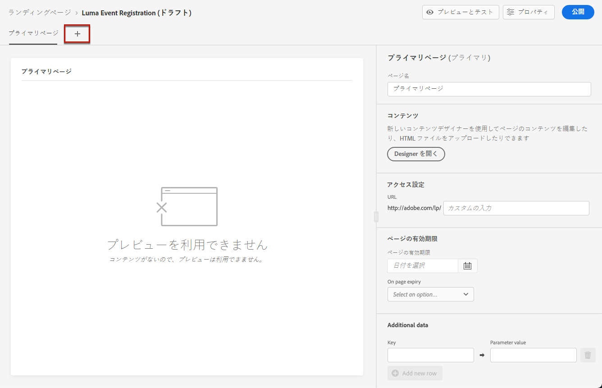

[プライマリページ](#configure-primary-page)と[サブページ](#configure-subpages)（存在する場合）を設定およびデザインしたら、ランディングページを[テスト](#test-landing-page)して[公開](#publish-landing-page)できます。

## プライマリページの設定 {#configure-primary-page}

プライマリページとは、メールや web サイトなど、ユーザーがランディングページへのリンクをクリックした直後に表示されるページです。

プライマリページの設定を定義するには、次の手順に従います。

1. ページ名（デフォルトは「**[!UICONTROL プライマリページ]**」）を変更できます。

1. コンテンツデザイナーを使用してページのコンテンツを編集します。ランディングページのコンテンツを定義する方法については、[こちら](design-lp.md)を参照してください。

   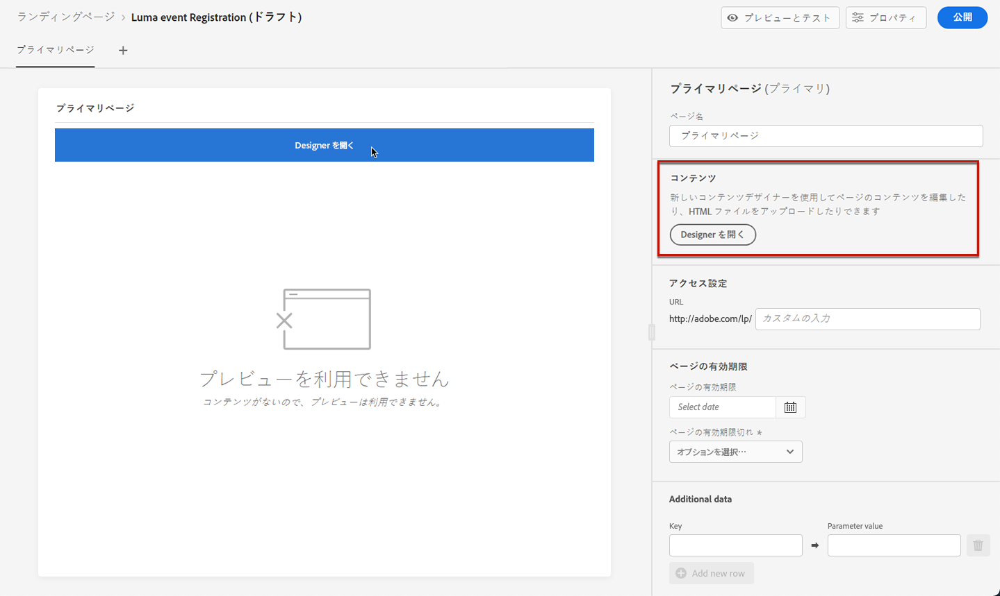

1. ランディングページの URL を定義します。URL の最初の部分では、ドメインのデリゲーションを実行する必要があります。事前入力されており、ユーザーインターフェイスから編集することはできません。設定するには、アドビアカウント担当者または [アドビカスタマーケアサポートチーム](https://helpx.adobe.com/enterprise/admin-guide.html/enterprise/using/support-for-experience-cloud.ug.html){target=&quot;_blank&quot;}にお問い合わせください。

   >[!CAUTION]
   >
   >ランディングページの URL は一意にする必要があります。

   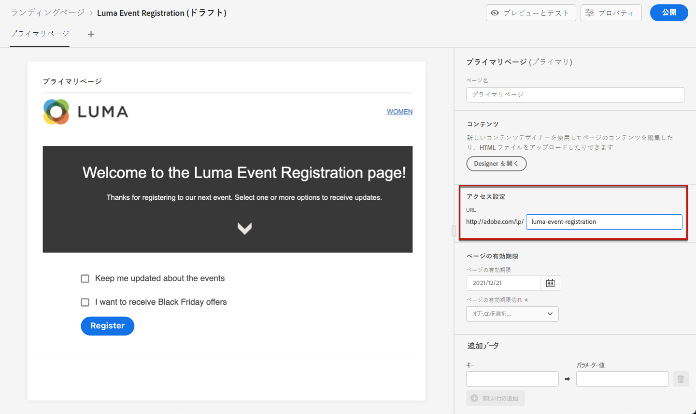

1. ページの有効期限を定義できます。その場合、ページの有効期限が切れたらアクションを選択する必要があります。

   * **[!UICONTROL リダイレクト URL]**：ページの有効期限が切れたときにユーザーがリダイレクトされるページの URL を入力します。
   * **[!UICONTROL カスタムページ]**：[サブページを設定](#configure-subpages)し、表示されるドロップダウンリストから選択します。
   * **[!UICONTROL ブラウザーエラー]**：ページの代わりに表示するエラーテキストを入力します。

   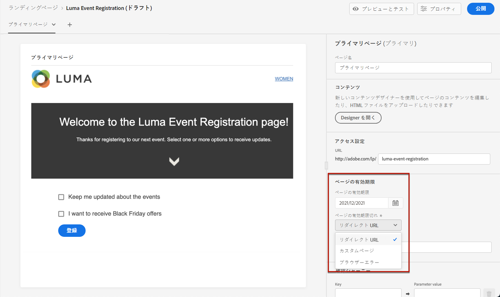

   <!--1. In the **[!UICONTROL Additional data]** section, define a **[!UICONTROL Key]** and the corresponding **[!UICONTROL Parameter value]**. // you can define how the data entered in the landing page is managed once it has been submitted by a user??-->

1. [プライマリページのデザイン時に](design-lp.md) 1 つ以上の購読リストを選択した場合、「**[!UICONTROL 購読リスト]**」セクションに表示されます。

   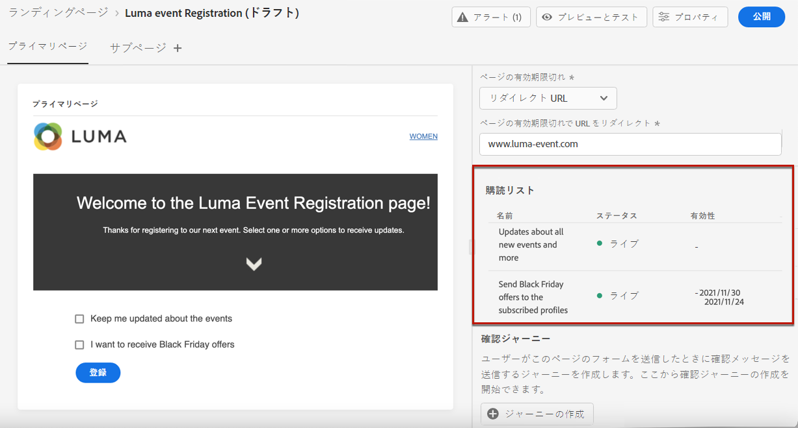

1. ランディングページから直接、ユーザーがフォームを送信したときに確認メッセージを送信する[ジャーニーを作成](../building-journeys/journey-gs.md#jo-build)できます。この[ユースケース](lp-use-cases.md#subscription-to-a-service)の最後に、このようなジャーニーの作成方法について説明します。

   

   「**[!UICONTROL ジャーニーを作成]**」をクリックして、**[!UICONTROL ジャーニー管理]**／**[!UICONTROL ジャーニー]**&#x200B;リストにリダイレクトします。

## サブページの設定 {#configure-subpages}

最大 2 つのサブページを追加できます。例えば、ユーザーがフォームを送信すると表示される「ありがとうございました」ページを作成したり、ランディングページで問題が発生した場合に呼び出されるエラーページを定義したりできます。

サブページ設定を定義するには、次の手順に従います。

1. ページ名（デフォルトは「**[!UICONTROL サブページ 1]**」）を変更できます。

1. コンテンツデザイナーを使用してページのコンテンツを編集します。ランディングページのコンテンツを定義する方法については、[こちら](design-lp.md)を参照してください。

1. ランディングページの URL を定義します。URL の最初の部分では、ドメインのデリゲーションを実行する必要があります。事前入力されており、ユーザーインターフェイスから編集することはできません。設定するには、アドビアカウント担当者または [アドビカスタマーケアサポートチーム](https://helpx.adobe.com/enterprise/admin-guide.html/enterprise/using/support-for-experience-cloud.ug.html){target=&quot;_blank&quot;}にお問い合わせください。

   >[!CAUTION]
   >
   >ランディングページの URL は一意にする必要があります。

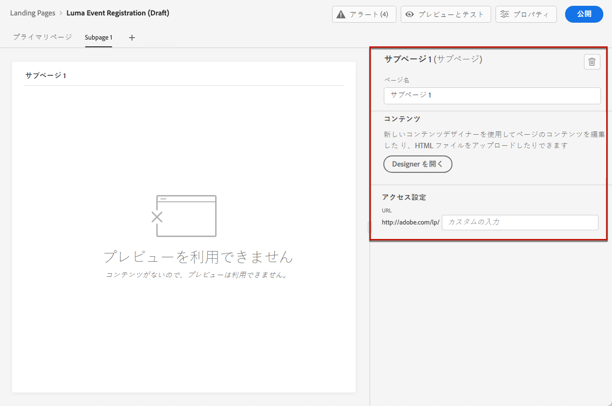

## ランディングページのテスト {#test-landing-page}

ランディングページの設定とコンテンツを定義したら、テストプロファイルを使用してプレビューできます。[パーソナライズされたコンテンツ](../personalization/personalize.md)を挿入した場合は、そのコンテンツがランディングページにどのように表示されるかを、テストプロファイルデータを利用して確認できます。

>[!CAUTION]
>
>メッセージのプレビューや配達確認の送信をおこなうには、テストプロファイルを使用可能にしておく必要があります。[テストプロファイルを作成](../building-journeys/creating-test-profiles.md)する方法について説明します。

1. ランディングページのインターフェイスから、「**[!UICONTROL プレビューとテスト]**」ボタンをクリックして、テストプロファイルの選択にアクセスします。

   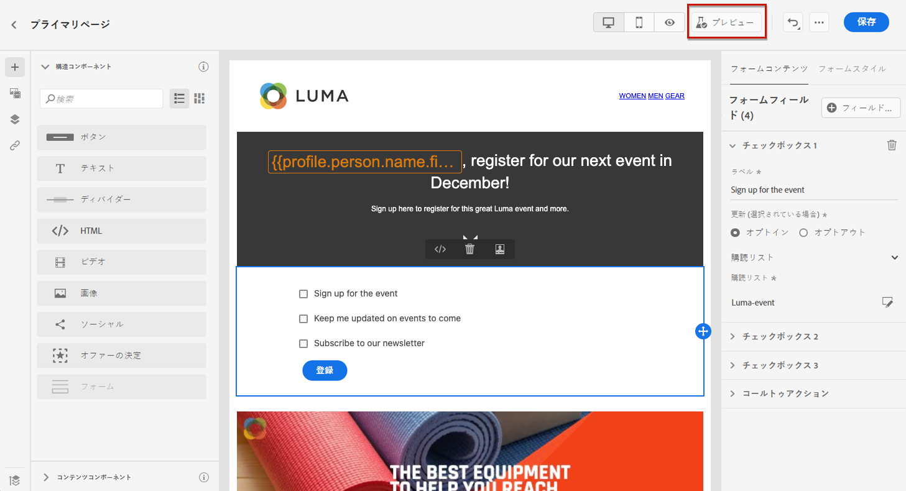

   >[!NOTE]
   >
   >「**[!UICONTROL プレビュー]**」ボタンには、コンテンツデザイナーからもアクセスできます。

1. 「**[!UICONTROL プレビューとテスト]**」画面から、1 つ以上のテストプロファイルを選択します。

   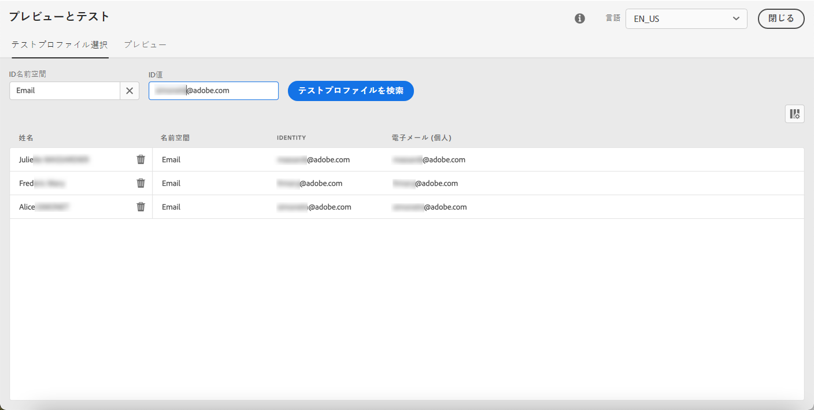

   テストプロファイルの選択手順は、メッセージをテストする場合と同じです。詳しくは、[この節](../messages/preview.md#select-test-profiles)を参照してください。

1. 「**[!UICONTROL プレビュー]**」タブを選択し、「**[!UICONTROL プレビューを開く]**」をクリックしてランディングページをテストします。

   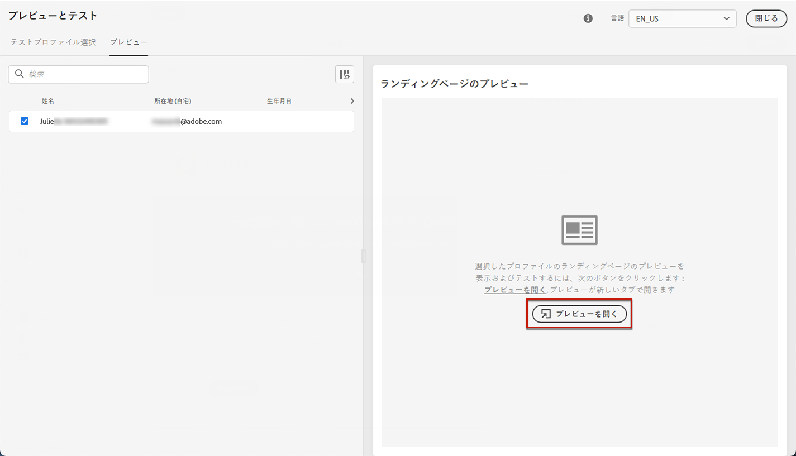

1. ランディングページのプレビューが新しいタブで開きます。パーソナライズされた要素が、選択したテストプロファイルデータに置き換えられます。

   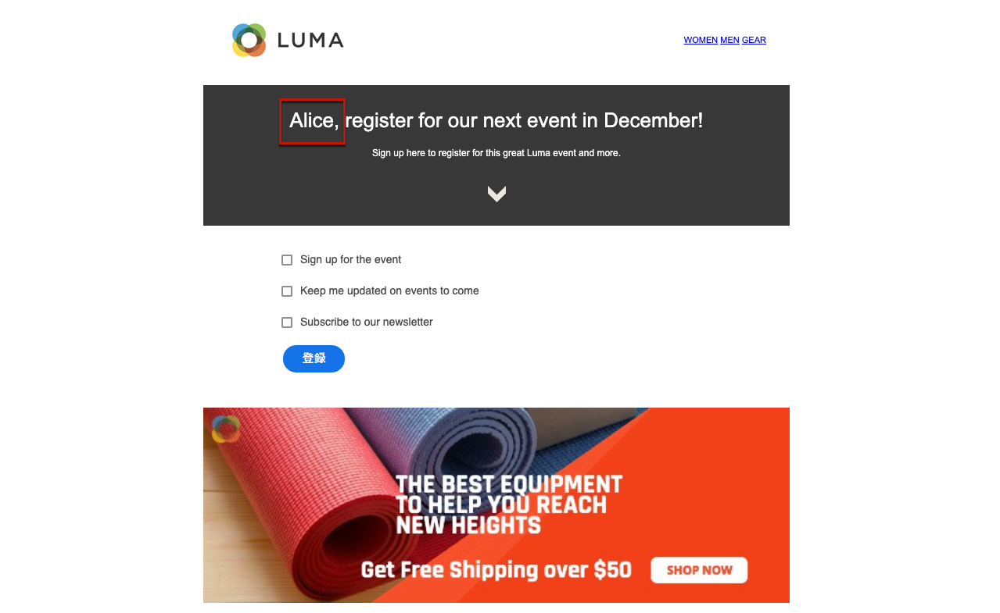

1. ランディングページの各バリエーションに対してレンダリングをプレビューするには、別のテストプロファイルを選択します。

## アラートの確認 {#check-alerts}

ランディングページの作成中、公開前に重要なアクションを実行する必要がある場合は、アラートが表示されます。

次に示すように、画面の右上にアラートが表示されます。

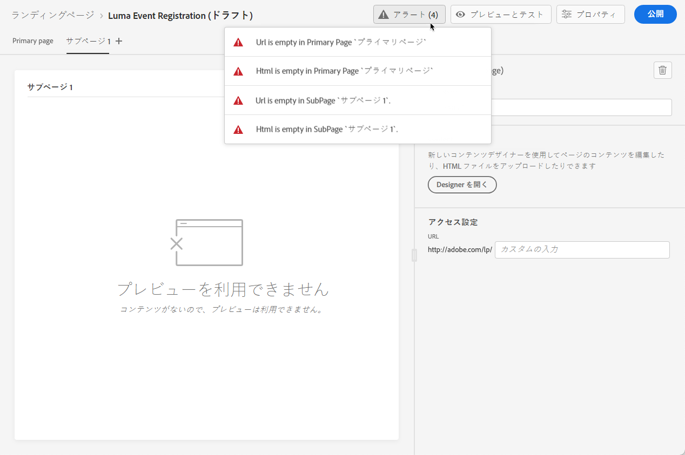

>[!NOTE]
>
>このボタンが表示されない場合、アラートは検出されていません。

次の 2 種類のアラートが発生する可能性があります。

* **警告**&#x200B;は、推奨奨事項とベストプラクティスを表します。<!--For example, a message will display if -->

* **エラー**&#x200B;は、解決されない限り、メッセージを公開することができません。例えば、プライマリページの URL が欠落している場合はアラートが表示されます。

<!--All possible warnings and errors are detailed [below](#alerts-and-warnings).-->

>[!CAUTION]
>
> 公開する前に、すべての&#x200B;**エラー**&#x200B;アラートを解決する必要があります。

<!--The settings and elements checked by the system are listed below. You will also find information on how to adapt your configuration to resolve the corresponding issues.

**Warnings**:

* 

**Errors**:

* 

>[!CAUTION]
>
> To be able to publish your message, you need to resolve all **error** alerts.
-->

## ランディングページの公開 {#publish-landing-page}

ランディングページの準備が整ったら、ページを公開し、メッセージで使用できる状態にできます。

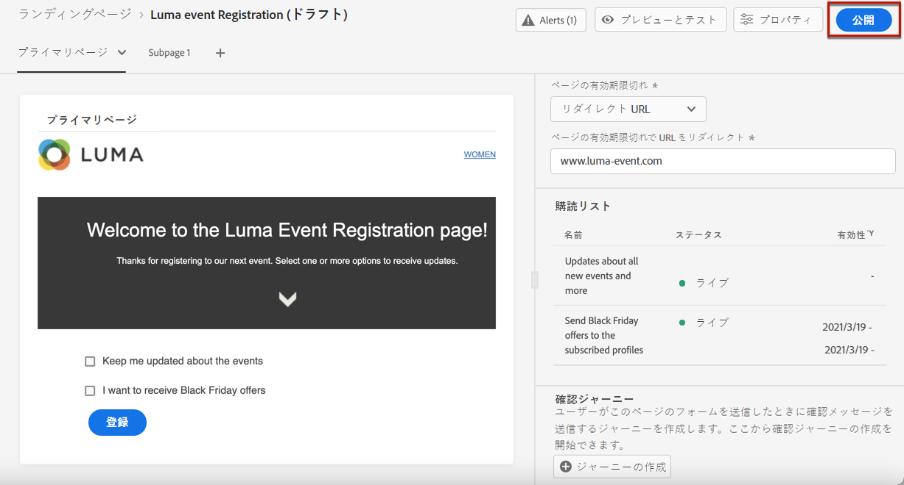

>[!CAUTION]
>
>公開する前に、アラートを確認して解決します。[詳細情報](#check-alerts)

ランディングページが公開されると、**[!UICONTROL 公開中のアイテム]**&#x200B;ステータスでランディングページリストに追加されます。

これでライブになり、[!DNL Journey Optimizer] [ メッセージ](../messages/create-message.md)で使用できるようになります。このメッセージは[ジャーニー](../building-journeys/journey.md)を通じて送信されます。

>[!NOTE]
>
>特定のレポートを通じて、ランディングページの影響を監視できます。[詳細情報](lp-report.md)

