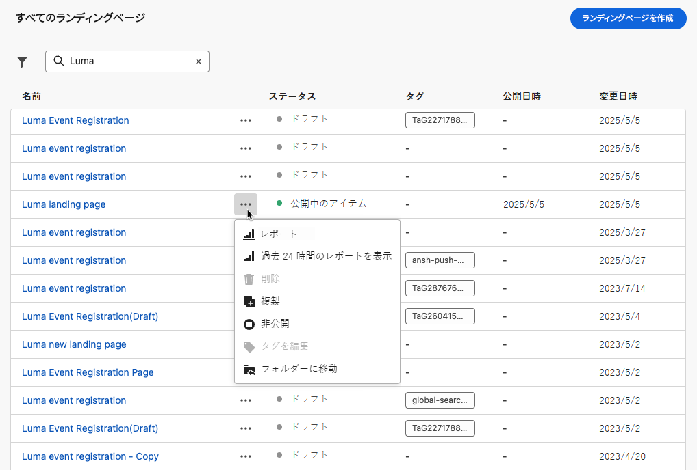
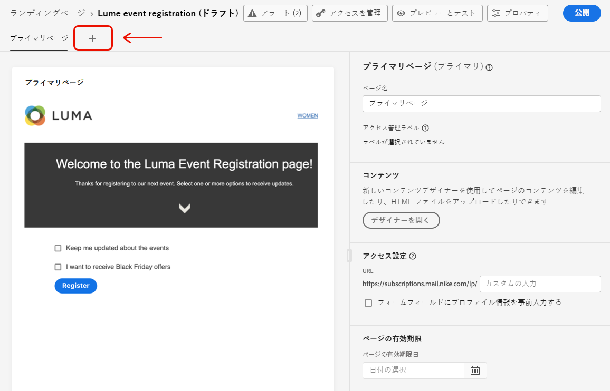
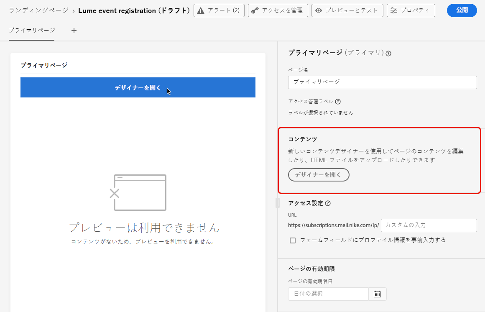
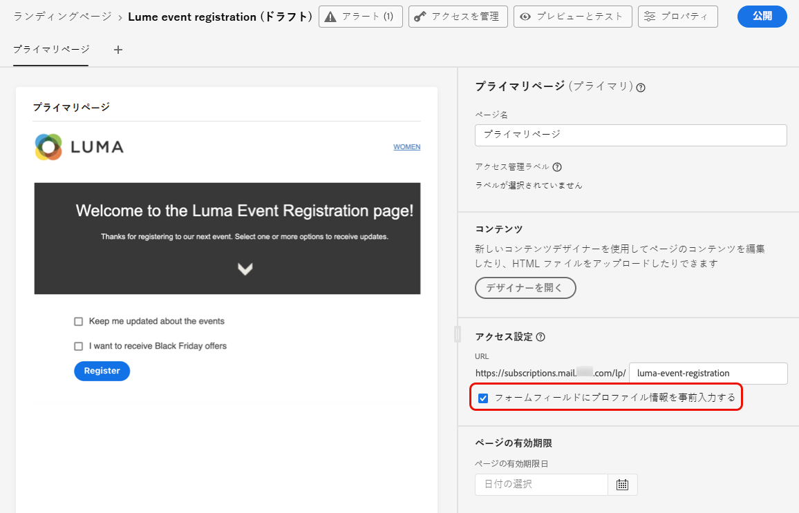
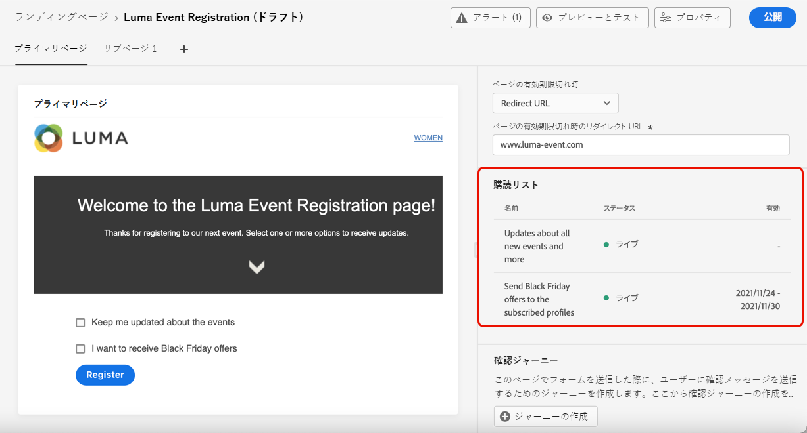

# ランディングページの作成とパブリッシュ {#create-lp}

## ランディングページへのアクセス {#access-landing-pages}

ランディングページのリストにアクセスするには、左側のメニューから「> **[!UICONTROL Landing pages]** 」を選択し **[!UICONTROL Journey Management]** ます。

リストに **[!UICONTROL Landing Pages]** は、作成したすべてのアイテムが表示されます。 状態または変更日に基づいて、それらのフィルターを適用することができます。

このリストから、パブリッシュされたアイテムのランディングページライブレポート ](../reports/lp-report-live.md) または [ ランディングページのグローバルレポート ](../reports/lp-report-global.md) に [ アクセスできます。

また、ジャンプページの削除、複製、非公開を行うこともできます。

>[!CAUTION]
>
>メッセージ内で参照されているランディングページを非公開にすると、ランディングページへのリンクが解除され、エラーページが表示されます。

ランディングページの横にある3つの点をクリックして、目的の操作を選択します。

>[!NOTE]
>
>パブリッシュ ](#publish-landing-page) されたランディングページを [ 削除することはできません。このファイルを削除するには、最初にその公開を取り下げる必要があります。

## ランディングページの作成 {#create-landing-page}

>[!CONTEXTUALHELP]
>id="ajo_lp_create"
>title="ランディングページの定義と設定"
>abstract="ランディングページを作成するには、プリセットを選択してから、プライマリページとサブページを設定し、最後にパブリッシュする前にページをテストする必要があります。"
>additional-url="https://experienceleague.adobe.com/docs/journey-optimizer/using/landing-pages/lp-configuration/lp-presets.html#lp-create-preset" text="ランディングページのプリセットの作成"
>additional-url="https://experienceleague.adobe.com/docs/journey-optimizer/using/landing-pages/create-lp.html#publish-landing-page" text="ランディングページのパブリッシュ"

>[!CONTEXTUALHELP]
>id="ajo_lp_access_management_labels"
>title="ランディングページへのラベルの割り当て"
>abstract="秘匿性の高いデジタルアセットを保護するには、ラベルを使用してランディングページへのデータアクセスを管理するための認証を定義します。"
>additional-url="https://experienceleague.adobe.com/docs/journey-optimizer/using/access-control/object-based-access.html" text="ランディングページのプリセットの作成"

ランディングページを作成する手順は、次のとおりです。

1. 「ランディングページ」リストで、をクリック **[!UICONTROL Create landing page]** します。

   

1. タイトルを追加します。 必要に応じて説明を追加することができます。

   

1. カスタムまたはコアデータ使用状況のラベルをランディングページに割り当てるには、を選択 **[!UICONTROL Manage access]** します。 [オブジェクトレベルのアクセス制御について詳しくは、OLAC の説明を参照してください。](../administration/object-based-access.md)

   <!--You can add a tag. See AEP documentation?-->

1. プリセットを選択します。 この節 ](../landing-pages/lp-presets.md#lp-create-preset) では、ランディングページの [ プリセットを作成する方法について説明します。

   

1. をクリック **[!UICONTROL Create]** します。

1. プライマリページとそのプロパティが表示されます。 ここで ](#configure-primary-page) は、プライマリページ設定 [ の設定方法について説明します。

   

1. サブページを追加するには、+ アイコンをクリックします。 ここで ](#configure-subpages) は、サブページの設定 [ を構成する方法について説明します。

   

プライマリページと ](#configure-subpages) [ サブページ ](#configure-primary-page) を設定して作成し [ た後は、ランディングページをテスト ](#test-landing-page) し [ てパブリッシュ ](#publish-landing-page) することができ [ ます。

## プライマリページの設定 {#configure-primary-page}

>[!CONTEXTUALHELP]
>id="ajo_lp_primary_page"
>title="主ページ設定の定義"
>abstract="電子メールや web サイトなどのランディングページへのリンクをクリックした後に、プライマリページが直ちにユーザーに表示されます。"
>additional-url="https://experienceleague.adobe.com/docs/journey-optimizer/using/landing-pages/landing-pages-design/design-lp.html" text="ランディングページのコンテンツのデザイン"

>[!CONTEXTUALHELP]
>id="ajo_lp_access_settings"
>title="ランディングページの URL の定義"
>abstract="この節では、一意のランディングページの URL を定義します。 URL の最初の部分では、選択したプリセットの一部としてランディングページサブドメインを事前に設定しておく必要があります。"
>additional-url="https://experienceleague.adobe.com/docs/journey-optimizer/using/landing-pages/lp-configuration/lp-subdomains.html" text="ランディングページのサブドメインの設定"
>additional-url="https://experienceleague.adobe.com/docs/journey-optimizer/using/landing-pages/lp-configuration/lp-presets.html#lp-create-preset" text="ランディングページのプリセットの作成"

プライマリページは、電子メールや web サイトなどのランディングページへのリンクをクリックした直後に、ユーザーに対してすぐに表示されるページです。

一次ページの設定を定義するには、次の手順に従います。

1. 初期設定では **[!UICONTROL Primary page]** 、ページ名は変更できます。

1. コンテンツデザイナーを使用して、ページのコンテンツを編集します。 ここでは ](design-lp.md) 、ランディングページのコンテンツ [ を定義する方法について説明します。

   

1. ランディングページの URL を定義します。 URL の最初の部分では、選択したプリセット ](../landing-pages/lp-presets.md#lp-create-preset) の [ 一部としてランディングページサブドメインを事前に設定しておく必要があります。[詳細情報](../landing-pages/lp-subdomains.md)

   >[!CAUTION]
   >
   >ランディングページの URL は一意である必要があります。

   

   >[!NOTE]
   >
   >この URL がパブリッシュされている場合でも、この URL を web ブラウザーに単純にコピー &amp; ペーストするだけで、ランディングページにアクセスすることはできません。 このセクション ](#test-landing-page) で [ 説明するように、プレビュー機能を使用してテストすることができます。

1. 既に使用可能なフォームデータのランディングページを事前に行うには、を選択 **[!UICONTROL Pre-fill form fields with profile information]** します。

   

   このオプションが有効になっていると、プロファイルに既にオプトイン/オプトアウトが設定されている場合、または既に購読リストに追加されている場合は、その選択内容がランディングページの表示時に反映されます。

   例えば、プロファイルが将来のイベントに関する通信を受信することを選択した場合、次にそのプロファイルにランディングページが表示されるときに、対応するチェックボックスが既に選択されています。

   

1. ページの有効期限日を定義することができます。 そのような場合は、ページの有効期限に応じてアクションを選択する必要があります。

   * **[!UICONTROL Redirect URL]**: ページの有効期限が切れた場合に、ユーザーがリダイレクトされるページの URL を入力します。
   * **[!UICONTROL Custom page]**: [ サブページ ](#configure-subpages) を設定し、表示されるドロップダウンリストから選択します。
   * **[!UICONTROL Browser error]**: ページではなく表示されるエラーテキストを入力します。

   

1. **[!UICONTROL Additional data]**&#x200B;セクションで、1つ以上のキーと、それに対応するパラメーター値を定義します。このようなキーは、エクスプレッションエディター ](../personalization/personalization-build-expressions.md) を使用して [ 、プライマリページおよびサブページのコンテンツで利用できます。詳しくは、ここを  参照してください。

   

1. プライマリページ ](design-lp.md) をデザインするときに [ 購読リストを選択した場合は、そのリストが **[!UICONTROL Subscription list]** セクションに表示されます。

   

1. ランディングページでは、ユーザーがフォームを送信したときに確認メッセージを表示するための、フライト ](../building-journeys/journey-gs.md#jo-build) を直接 [ 作成することができます。このようなユースケース ](lp-use-cases.md#subscription-to-a-service) の終わりに、この [ ような旅を構築する方法を説明します。

   

   > **[!UICONTROL Journeys]** リストにリダイレクトするには、 **[!UICONTROL Journey Management]** をクリック **[!UICONTROL Create journey]** します。

## サブページの設定 {#configure-subpages}

>[!CONTEXTUALHELP]
>id="ajo_lp_subpage"
>title="サブページの設定の定義"
>abstract="1つのサブページを追加することができます。 例えば、ユーザーがフォームを送信したときに表示される「お礼」ページを作成したり、ランディングページに問題が発生したときに呼び出されるエラーページを定義することができます。"
>additional-url="https://experienceleague.adobe.com/docs/journey-optimizer/using/landing-pages/landing-pages-design/design-lp.html" text="ランディングページのコンテンツのデザイン"

>[!CONTEXTUALHELP]
>id="ajo_lp_access_settings-subpage"
>title="ランディングページの URL の定義"
>abstract="この節では、一意のランディングページの URL を定義します。 URL の最初の部分では、選択したプリセットの一部としてランディングページサブドメインを事前に設定しておく必要があります。"
>additional-url="https://experienceleague.adobe.com/docs/journey-optimizer/using/landing-pages/lp-configuration/lp-subdomains.html" text="ランディングページのサブドメインの設定"
>additional-url="https://experienceleague.adobe.com/docs/journey-optimizer/using/landing-pages/lp-configuration/lp-presets.html#lp-create-preset" text="ランディングページのプリセットの作成"

1つのサブページを追加することができます。 例えば、ユーザーがフォームを送信したときに表示される「お礼」ページを作成したり、ランディングページに問題が発生したときに呼び出されるエラーページを定義することができます。

サブページの設定を定義するには、次の手順に従います。

1. 初期設定では **[!UICONTROL Subpage 1]** 、ページ名は変更できます。

1. コンテンツデザイナーを使用して、ページのコンテンツを編集します。 ここでは ](design-lp.md) 、ランディングページのコンテンツ [ を定義する方法について説明します。

   >[!NOTE]
   >
   >同一のランディングページの任意のサブページからプライマリページへのリンクを挿入できます。 例えば、間違いを犯したユーザーをリダイレクトし、再度購読する場合は、確認のサブページから購読メインページへのリンクを追加することができます。 このセクション ](../email/message-tracking.md#insert-links) に [ リンクを挿入する方法について説明します。

1. ランディングページの URL を定義します。 URL の最初の部分では、事前にランディングページのサブドメインを設定しておく必要があります。 [詳細情報](../landing-pages/lp-subdomains.md)

   >[!CAUTION]
   >
   >ランディングページの URL は一意である必要があります。

## ランディングページのテスト {#test-landing-page}

ランディングページの設定とコンテンツを定義した後は、テストプロファイルを使用してプレビューすることができます。 パーソナライズされたコンテンツ ](../personalization/personalize.md) を挿入 [ した場合、このコンテンツがどのように表示されるかは、テストプロファイルデータを使用して、ランディングページにどのように表示されるかを確認することができます。

>[!CAUTION]
>
>メッセージをプレビューして、校正刷りを送信するには、使用可能なテストプロファイルが必要です。 テストプロファイル ](../segment/creating-test-profiles.md) の作成方法に [ ついて説明します。

1. ランディングページのインターフェイスで、ボタンをクリック **[!UICONTROL Preview & test]** して、テストプロファイルの選択にアクセスします。

   

   >[!NOTE]
   >
   >**[!UICONTROL Preview]**&#x200B;このボタンは、コンテンツデザイナーからもアクセスできます。

1. **[!UICONTROL Preview & test]**&#x200B;画面で、1つ以上のテストプロファイルを選択します。

   

   テストプロファイルを選択する手順は、メッセージをテストするときと同じです。 詳細については、このセクション ](../email/preview.md#select-test-profiles) で [ 詳しく説明しています。

1. **[!UICONTROL Preview]**&#x200B;タブを選択し、をクリック **[!UICONTROL Open preview]** して、ランディングページをテストします。

   

1. ランディングページのプレビューが、新しいタブに表示されます。 パーソナライズされたエレメントは、選択したテストプロファイルデータに置き換えられます。

   

1. ランディングページの各バリエーション用にレンダリングをプレビューするには、他のテストプロファイルを選択します。

## アラートの確認 {#check-alerts}

ランディングページの作成中に、公開前に重要なアクションを実行する必要がある場合は警告が表示されます。

アラートは、次に示すように、画面の右上に表示されます。

>[!NOTE]
>
>このボタンが表示されていない場合は、警告が検出されていません。

アラートは、次の2種類の方法で発生する可能性があります。

* **警告** は「推奨事項」および「ベストプラクティス」を参照してください。 <!--For example, a message will display if -->

* **エラーが発生** すると、解決されていない限り、ランディングページをパブリッシュすることはできません。 例えば、主ページ URL が指定されていない場合は、警告が表示されます。

<!--All possible warnings and errors are detailed [below](#alerts-and-warnings).-->

>[!CAUTION]
>
> 公開する前に、すべて **のエラー** 警告を解決する必要があります。

<!--The settings and elements checked by the system are listed below. You will also find information on how to adapt your configuration to resolve the corresponding issues.

**Warnings**:

* 

**Errors**:

* 

>[!CAUTION]
>
> To be able to publish your message, you must resolve all **error** alerts.
-->

## ランディングページのパブリッシュ {#publish-landing-page}

ランディングページの準備ができたら、それをパブリッシュして、メッセージで使用できるようにします。

>[!CAUTION]
>
>公開する前に、アラートを確認して解決します。 [詳細情報](#check-alerts)

ランディングページは、公開されると、状態と共 **[!UICONTROL Published]** にランディングページのリストに追加されます。

この機能は現在ライブ状態で、メッセージに [!DNL Journey Optimizer] 使用して、旅 ](../building-journeys/journey.md) に送ら [ れるようになりました。

>[!NOTE]
>
>特定のレポートを使用して、ランディングページへの影響を監視することができます。 [詳細情報](../reports/lp-report-live.md)

