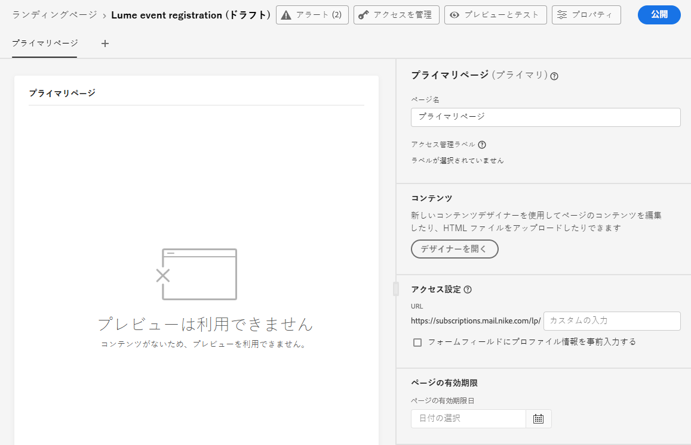
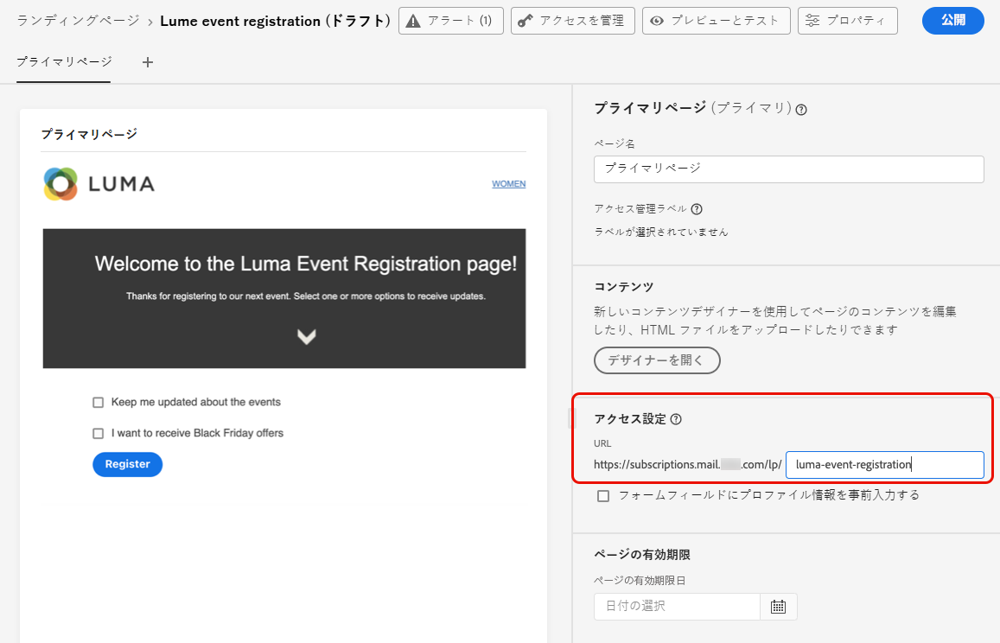
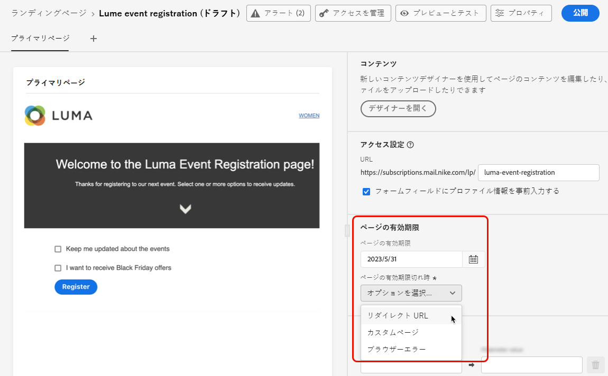
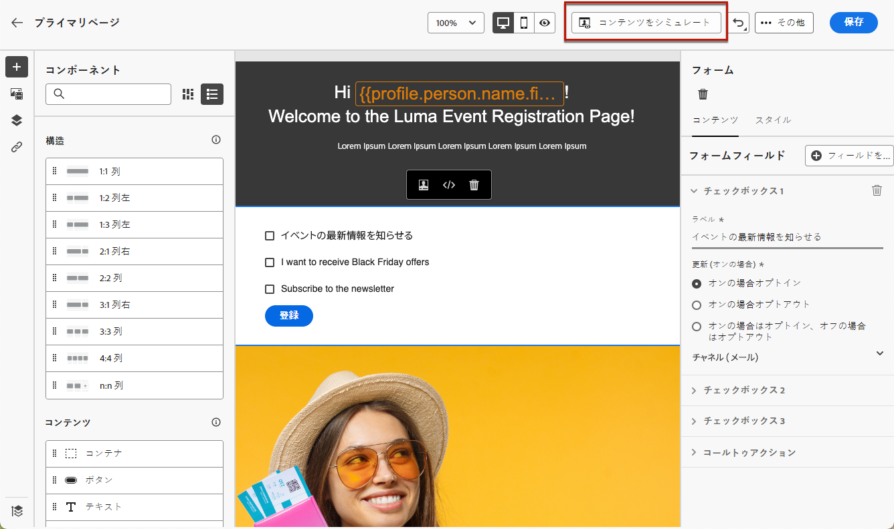

# ランディングページの作成と公開 {#create-lp}

>[!CAUTION]
>
>ランディングページをテストして公開するには、**[!UICONTROL メッセージを公開]**&#x200B;権限が必要です。

特定のリンクをクリックした際に表示する定義済みの web ページに顧客を誘導するには、[!DNL Journey Optimizer] でランディングページを作成し、プライマリページとサブページを設定し、テストして公開します。

>[!CAUTION]
>
>ランディングページが公開されている場合でも、[ページの作成](#create-landing-page)時に定義した URL を web ブラウザーにコピー＆ペーストするだけでランディングページにアクセスすることはできません。代わりに、[この節](#test-landing-page)で説明されているように、プレビュー機能を使用してテストすることができます。

## ランディングページへのアクセス {#access-landing-pages}

ランディングページのリストにアクセスするには、**[!UICONTROL ジャーニー管理]**／**[!UICONTROL ランディングページ]**&#x200B;を選択します。

**[!UICONTROL ランディングページ]**&#x200B;のリストには、作成されたすべての項目が表示されます。ステータスや変更日に基づいてフィルター処理できます。

公開された項目の場合、このリストから[ランディングページのライブレポート](../reports/lp-report-live.md)または[ランディングページのグローバルレポート](../reports/lp-report-global.md)にアクセスすることができます。

ランディングページの削除、複製および非公開も行えます。

>[!CAUTION]
>
>メッセージで参照されているランディングページを非公開にした場合、そのランディングページへのリンクが壊れ、エラーページが表示されます。

ランディングページの横にある「...」をクリックして、目的のアクションを選択します。

>[!NOTE]
>
>[公開済み](#publish-landing-page)のランディングページは削除できません。削除するには、まず非公開にする必要があります。

## ランディングページの作成 {#create-landing-page}

>[!CONTEXTUALHELP]
>id="ajo_lp_create"
>title="ランディングページの定義と設定"
>abstract="ランディングページを作成するには、プリセットを選択し、プライマリページとサブページを設定してから、公開する前にページをテストする必要があります。"
>additional-url="https://experienceleague.adobe.com/docs/journey-optimizer/using/landing-pages/lp-configuration/lp-presets.html?lang=ja#lp-create-preset" text="ランディングページプリセットの作成"
>additional-url="https://experienceleague.adobe.com/docs/journey-optimizer/using/landing-pages/create-lp.html?lang=ja#publish-landing-page" text="ランディングページの公開"

>[!CONTEXTUALHELP]
>id="ajo_lp_access_management_labels"
>title="ランディングページへのラベルの割り当て"
>abstract="機密性の高いデジタルアセットを保護するために、ラベルを使用してランディングページへのデータアクセスを管理する権限を定義できます。"
>additional-url="https://experienceleague.adobe.com/docs/journey-optimizer/using/access-control/object-based-access.html?lang=ja" text="オブジェクトレベルのアクセス制御"

ランディングページを作成するための主な手順は次のとおりです。

1. ランディングページのリストから、「**[!UICONTROL ランディングページの作成]**」をクリックします。

   

1. タイトルを追加します。必要に応じて、説明を追加できます。

   

1. ランディングページにカスタムデータ使用ラベルまたはコアデータ使用ラベルを割り当てるには、「**[!UICONTROL アクセスを管理]**」を選択します。[オブジェクトレベルのアクセス制御（OLAC）について詳しくはこちらから](../administration/object-based-access.md)

1. 「**[!UICONTROL タグ]**」フィールドから Adobe Experience Platform タグを選択または作成してランディングページを分類し、検索の向上を図ります。[詳細情報](../start/search-filter-categorize.md#tags)

1. プリセットを選択します。ランディングページプリセットを作成する方法については、[この節](../landing-pages/lp-presets.md#lp-create-preset)を参照してください。

   

1. 「**[!UICONTROL 作成]**」をクリックします。

1. プライマリページとそのプロパティが表示されます。プライマリページの設定方法については、[こちら](#configure-primary-page)を参照してください。

   

1. 「+」アイコンをクリックしてサブページを追加します。サブページの設定方法については、[こちら](#configure-subpages)を参照してください。

   

[プライマリページ](#configure-primary-page)と[サブページ](#configure-subpages)（存在する場合）を設定およびデザインしたら、ランディングページを[テスト](#test-landing-page)して[公開](#publish-landing-page)できます。

>[!CAUTION]
>
>ランディングページが公開されている場合でも、定義した URL を web ブラウザーにコピー＆ペーストするだけでランディングページにアクセスすることはできません。代わりに、[この節](#test-landing-page)で説明されているように、プレビュー機能を使用してテストすることができます。

## プライマリページの設定 {#configure-primary-page}

>[!CONTEXTUALHELP]
>id="ajo_lp_primary_page"
>title="プライマリページ設定の定義"
>abstract="プライマリページとは、メールや web サイトなどで、ユーザーがランディングページへのリンクをクリックした直後に表示されるページです。"
>additional-url="https://experienceleague.adobe.com/docs/journey-optimizer/using/landing-pages/landing-pages-design/design-lp.html?lang=ja" text="ランディングページのコンテンツのデザイン"

>[!CONTEXTUALHELP]
>id="ajo_lp_access_settings"
>title="ランディングページ URL の定義"
>abstract="このセクションでは、一意のランディングページ URL を定義します。 URL の最初の部分では、選択したプリセットの一部としてランディングページのサブドメインを事前に設定する必要があります。"
>additional-url="https://experienceleague.adobe.com/ja/docs/journey-optimizer/using/landing-pages/lp-configuration/lp-subdomains" text="ランディングページのサブドメインの設定"
>additional-url="https://experienceleague.adobe.com/docs/journey-optimizer/using/landing-pages/lp-configuration/lp-presets.html?lang=ja#lp-create-preset" text="ランディングページプリセットの作成"

プライマリページとは、メールや web サイトなど、ユーザーがランディングページへのリンクをクリックした直後に表示されるページです。

プライマリページの設定を定義するには、次の手順に従います。

1. ページ名（デフォルトは「**[!UICONTROL プライマリページ]**」）を変更できます。

1. コンテンツデザイナーを使用してページのコンテンツを編集します。ランディングページのコンテンツを定義する方法については、[こちら](design-lp.md)を参照してください。

   

1. ランディングページの URL を定義します。URL の最初の部分では、選択した[プリセット](../landing-pages/lp-presets.md#lp-create-preset)の一部としてランディングページのサブドメインを事前に設定する必要があります。[詳細情報](../landing-pages/lp-subdomains.md)

   >[!CAUTION]
   >
   >ランディングページの URL は一意にする必要があります。
   >
   >公開済みの場合でも、この URL を web ブラウザーにコピー＆ペーストするだけでランディングページにアクセスすることはできません。代わりに、[この節](#test-landing-page)で説明されているように、プレビュー機能を使用してテストすることができます。

   

1. ランディングページで、既に使用可能なフォームデータをプリロードする場合は、**[!UICONTROL プロファイル情報を含むフォームフィールドの事前入力]**&#x200B;を選択します。

   

   このオプションを有効にした場合、プロファイルが既にオプトイン／オプトアウトしているか、既に購読リストに追加されている場合、その選択はランディングページの表示時に反映されます。

   例えば、プロファイルが将来のイベントに関する通信の受信をオプトインした場合、次にそのプロファイルにランディングページが表示されたときに、対応するチェックボックスが既に選択されています。

   

1. ページの有効期限を定義できます。その場合、ページの有効期限が切れたらアクションを選択する必要があります。

   * **[!UICONTROL リダイレクト URL]**：ページの有効期限が切れたときにユーザーがリダイレクトされるページの URL を入力します。
   * **[!UICONTROL カスタムページ]**：[サブページを設定](#configure-subpages)し、表示されるドロップダウンリストから選択します。
   * **[!UICONTROL ブラウザーエラー]**：ページの代わりに表示するエラーテキストを入力します。

   

1. 「**[!UICONTROL 追加データ]**」セクションで、1 つ以上のキーと、それらに対応するパラメーター値を定義します。[パーソナライゼーションエディター](../personalization/personalization-build-expressions.md)を使用して、これらのキーをプライマリページとサブページのコンテンツで活用することができます。詳しくは、[この節](lp-content.md#use-form-component#use-additional-data)を参照してください。

   

1. [プライマリページのデザイン時に](design-lp.md) 1 つ以上の購読リストを選択した場合、「**[!UICONTROL 購読リスト]**」セクションに表示されます。

   

1. ランディングページから直接、ユーザーがフォームを送信したときに確認メッセージを送信する[ジャーニーを作成](../building-journeys/journey-gs.md#jo-build)できます。この[ユースケース](lp-use-cases.md#subscription-to-a-service)の最後に、このようなジャーニーの作成方法について説明します。

   

   「**[!UICONTROL ジャーニーを作成]**」をクリックして、**[!UICONTROL ジャーニー管理]**／**[!UICONTROL ジャーニー]**&#x200B;リストにリダイレクトします。

## サブページの設定 {#configure-subpages}

>[!CONTEXTUALHELP]
>id="ajo_lp_subpage"
>title="サブページ設定の定義"
>abstract="最大 2 つのサブページを追加できます。例えば、ユーザーがフォームを送信すると表示される「ありがとうございました」ページを作成したり、ランディングページで問題が発生した場合に呼び出されるエラーページを定義したりできます。"
>additional-url="https://experienceleague.adobe.com/ja/docs/journey-optimizer/using/landing-pages/landing-pages-design/design-lp" text="ランディングページのコンテンツのデザイン"

>[!CONTEXTUALHELP]
>id="ajo_lp_access_settings-subpage"
>title="ランディングページ URL の定義"
>abstract="このセクションでは、一意のランディングページ URL を定義します。 URL の最初の部分では、選択したプリセットの一部としてランディングページのサブドメインを事前に設定する必要があります。"
>additional-url="https://experienceleague.adobe.com/docs/journey-optimizer/using/landing-pages/lp-configuration/lp-subdomains.html?lang=ja" text="ランディングページのサブドメインの設定"
>additional-url="https://experienceleague.adobe.com/docs/journey-optimizer/using/landing-pages/lp-configuration/lp-presets.html?lang=ja#lp-create-preset" text="ランディングページプリセットの作成"

最大 2 つのサブページを追加できます。例えば、ユーザーがフォームを送信すると表示される「ありがとうございました」ページを作成したり、ランディングページで問題が発生した場合に呼び出されるエラーページを定義したりできます。

サブページ設定を定義するには、次の手順に従います。

1. ページ名（デフォルトは「**[!UICONTROL サブページ 1]**」）を変更できます。

1. コンテンツデザイナーを使用してページのコンテンツを編集します。ランディングページのコンテンツを定義する方法については、[こちら](design-lp.md)を参照してください。

   >[!NOTE]
   >
   >同じランディングページの任意のサブページからプライマリページへのリンクを挿入できます。例えば、操作を誤ったので再度購読したいユーザーをリダイレクトするには、確認サブページから購読プライマリページへのリンクを追加します。リンクの挿入について詳しくは、[この節](../email/message-tracking.md#insert-links)を参照してください。

1. ランディングページの URL を定義します。URL の最初の部分では、ランディングページのサブドメインを事前に設定しておく必要があります。[詳細情報](../landing-pages/lp-subdomains.md)

   >[!CAUTION]
   >
   >ランディングページの URL は一意にする必要があります。
   >
   >ページが公開されている場合でも、この URL を web ブラウザーにコピー＆ペーストするだけでサブページにアクセスすることはできません。代わりに、[この節](#test-landing-page)で説明されているように、プレビュー機能を使用してテストすることができます。

## ランディングページのテスト {#test-landing-page}

>[!CONTEXTUALHELP]
>id="ac_preview_lp_profiles"
>title="ランディングページのプレビューとテスト"
>abstract="ランディングページの設定とコンテンツを定義したら、テストプロファイルを使用してプレビューできます。"
>additional-url="https://experienceleague.adobe.com/docs/journey-optimizer/using/audiences-profiles-identities/profiles/creating-test-profiles.html?lang=ja" text="テストプロファイルを選択"

ランディングページの設定とコンテンツを定義したら、テストプロファイルを使用してプレビューできます。[パーソナライズされたコンテンツ](../personalization/personalize.md)を挿入した場合は、このコンテンツがランディングページにどのように表示されるかを、テストプロファイルデータを利用して確認できます。

>[!CAUTION]
>
>ランディングページをテストするには、**[!UICONTROL メッセージを公開]**&#x200B;権限が必要です。
>
>メッセージのプレビューや配達確認の送信を行うには、テストプロファイルを使用可能にしておく必要があります。詳細は、[テストプロファイルを作成](../audience/creating-test-profiles.md)する方法を参照してください。

1. ランディングページのインターフェイスから、「**[!UICONTROL コンテンツをシミュレート]**」ボタンをクリックして、テストプロファイルの選択にアクセスします。

   

   >[!NOTE]
   >
   >「**[!UICONTROL コンテンツをシミュレート]**」ボタンには、コンテンツデザイナーからもアクセスできます。

1. 「**[!UICONTROL シミュレート]**」画面から、1 つ以上のテストプロファイルを選択します。

   

   テストプロファイルの選択手順は、メッセージをテストする場合と同じです。詳しくは、[コンテンツ管理](../content-management/test-profiles.md)の節を参照してください。

1. 「**[!UICONTROL プレビューを開く]**」を選択してランディングページをテストします。

   

1. ランディングページのプレビューが新しいタブで開きます。パーソナライズされた要素が、選択したテストプロファイルデータに置き換えられます。

   <!---->

1. ランディングページの各バリエーションに対してレンダリングをプレビューするには、別のテストプロファイルを選択します。

## アラートの確認 {#check-alerts}

ランディングページの作成中、公開前に重要なアクションを実行する必要がある場合は、アラートが表示されます。

次に示すように、画面の右上にアラートが表示されます。

>[!NOTE]
>
>このボタンが表示されない場合、アラートは検出されていません。

次の 2 種類のアラートが発生する可能性があります。

* **警告**&#x200B;は、レコメンデーションとベストプラクティスを表します。<!--For example, a message will display if -->

* **エラー**&#x200B;を解決しない限り、ランディングページを公開することはできません。例えば、プライマリページの URL が欠落している場合はアラートが表示されます。

<!--All possible warnings and errors are detailed [below](#alerts-and-warnings).-->

>[!CAUTION]
>
> 公開する前に、すべての&#x200B;**エラー**&#x200B;アラートを解決する必要があります。

<!--The settings and elements checked by the system are listed below. You will also find information on how to adapt your configuration to resolve the corresponding issues.

**Warnings**:

* 

**Errors**:

* 

>[!CAUTION]
>
> To be able to publish your message, you must resolve all **error** alerts.
-->

## ランディングページの公開 {#publish-landing-page}

>[!CAUTION]
>
>ランディングページを公開するには、**[!UICONTROL メッセージを公開]**&#x200B;権限が必要です。

ランディングページの準備が整ったら、ページを公開し、メッセージで使用できる状態にできます。

>[!CAUTION]
>
>公開する前に、アラートを確認して解決します。[詳細情報](#check-alerts)

ランディングページが公開されると、**[!UICONTROL 公開中のアイテム]**&#x200B;ステータスでランディングページリストに追加されます。

これで稼働し、[!DNL Journey Optimizer] メッセージで使用できるようになります。このメッセージは[ジャーニー](../building-journeys/journey.md)を通じて送信されます。

>[!NOTE]
>
>ランディングページが公開されている場合でも、[ページの作成](#create-landing-page)時に定義した URL を web ブラウザーにコピー＆ペーストするだけでランディングページにアクセスすることはできません。代わりに、[この節](#test-landing-page)で説明されているように、プレビュー機能を使用してテストすることができます。

特定のレポートを通じて、ランディングページの影響を監視できます。[詳細情報](../reports/lp-report-live.md)
