# ランディングページのコンテンツの作成 {#design-lp-content}

ランディング用のコンテンツの作成を開始するには[プライマリページ](create-lp.md#configure-primary-page)または[サブページ](create-lp.md#configure-subpages)をクリックし、プライマリページコンテンツにマウスポインターを置いて、「**[!UICONTROL Designer を開く]**」をクリックします。右側のパレットで、対応するボタンをクリックすることもできます。

ここから、次のことができます。

* コンテンツデザイナーのインターフェイスで&#x200B;**ランディングページをゼロからデザイン**&#x200B;し、[Adobe Experience Manager Assets Essentials](../messages/assets-essentials.md) の画像を活用します。メールコンテンツの作成方法や、組み込みのテンプレートについては、[この節](../messages/create-email-content.md)を参照してください。

* コンテンツデザイナーに直接 **Raw HTML をコーディングまたは貼り付け**&#x200B;ます。独自のコンテンツの作成方法については、[iこの節](../messages/existing-content.md#import-raw-html-code)を参照してください。

* ファイルまたは .zip フォルダーから&#x200B;**既存の HTML コンテンツを読み込み**&#x200B;ます。コンテンツの読み込み方法については、[この節](../messages/existing-content.md#import-html-content-from-file)を参照してください。

>[!NOTE]
>
>ランディングページのコンテンツデザイナーは、メールデザイナーと非常に似ています。詳細は[ [!DNL Journey Optimizer]](../messages/design-emails.md) でのコンテンツのデザインを参照してください。

## ランディングページ固有のコンテンツの定義 {#define-lp-specific-content}

ユーザーがランディングページからオプションを選択して送信できる特定のコンテンツを定義するには、次の手順に従います。

1. ランディングページ固有の&#x200B;**[!UICONTROL フォーム]**&#x200B;コンポーネントを左側のパレットからメインのワークスペースにドラッグ＆ドロップします。

   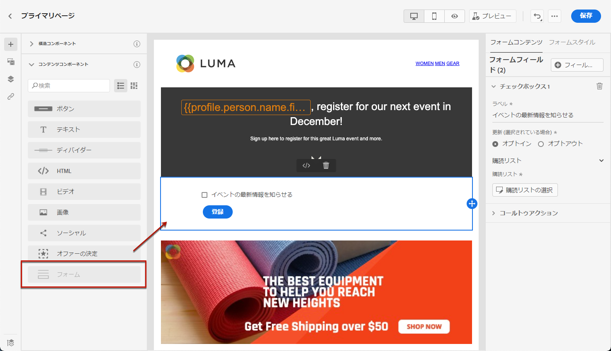

   >[!NOTE]
   >
   >**[!UICONTROL フォーム]**&#x200B;コンポーネントは、同じページで 1 回だけ使用できます。

1. 選択します。「**[!UICONTROL フォームコンテンツ]**」タブが右側のパレットに表示され、フォームの様々なフィールドを編集できます。

   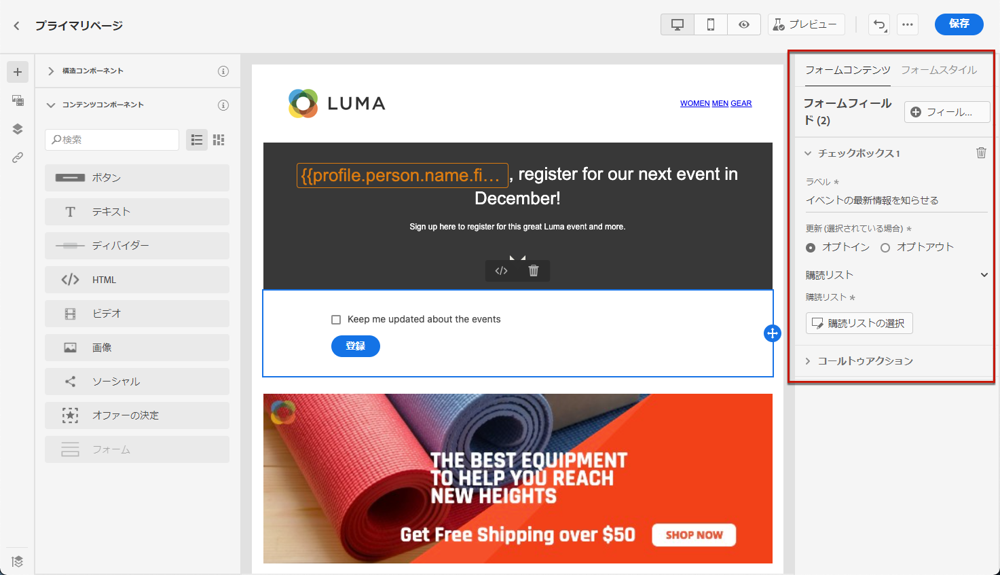

   >[!NOTE]
   >
   >「**[!UICONTROL フォームスタイル]**」タブに切り替えると、フォームコンポーネントコンテンツのスタイルをいつでも編集できます。[詳細情報](#define-lp-styles)

1. 「**[!UICONTROL チェックボックス 1]**」セクションでは、このチェックボックスに対応するラベルを編集できます。

1. このチェックボックスでユーザーのオプトイン／オプトアウトを行うかどうかを定義します（お知らせの受信に同意する、または以降の連絡を望まない）。

   

1. 次の 3 つのオプションの間で、更新する項目を選択します。

   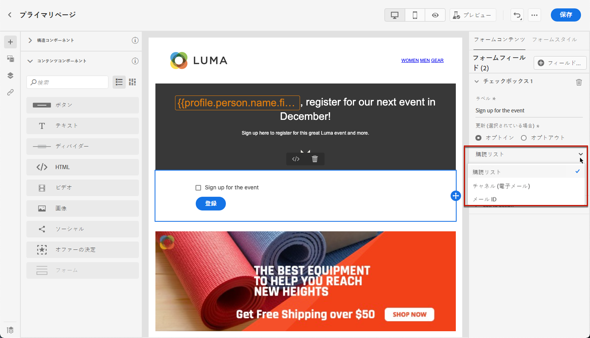

   * **[!UICONTROL 購読リスト]**：プロファイルがこのチェックボックスを選択した場合に更新される購読リストを選択する必要があります。詳しくは、[購読リスト](subscription-list.md)を参照してください。

      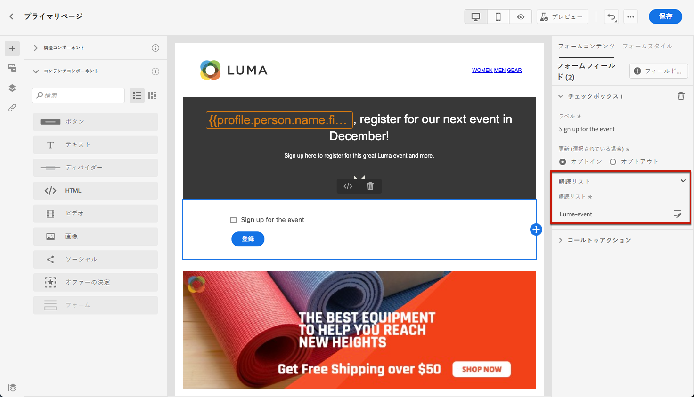

   * **[!UICONTROL チャネル（メール）]**：オプトインまたはオプトアウトは、チャネル全体に適用されます。 例えば、オプトアウトするプロファイルに 2 つのメールアドレスがある場合、両方のアドレスはすべてのコミュニケーションから除外されます。

   * **[!UICONTROL メール ID]**：オプトインまたはオプトアウトは、ランディングページへのアクセスに使用したメールアドレスにのみ適用されます。例えば、プロファイルに 2 つのメールアドレスがある場合、ブランドからのお知らせはオプトインに使用されたメールアドレスにのみ届きます。

1. **[!UICONTROL フィールドを追加]**／**[!UICONTROL チェックボックス]**&#x200B;をクリックし、別のチェックボックスを追加します。上記の手順を繰り返して、プロパティを定義します。

   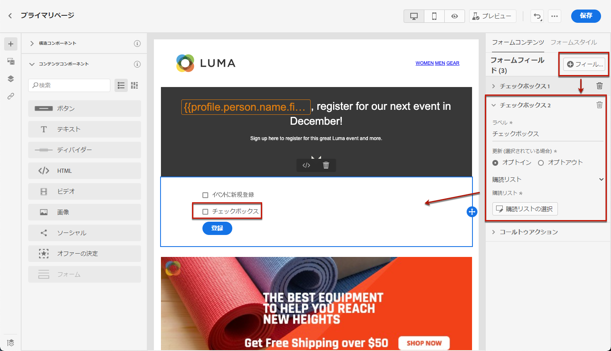

1. 必要なチェックボックスをすべて追加したら、「**[!UICONTROL コールトゥアクション]**」をクリックして、対応するセクションを展開します。これにより、**[!UICONTROL フォーム]**&#x200B;コンポーネントでボタンの動作を定義できるようになります。

   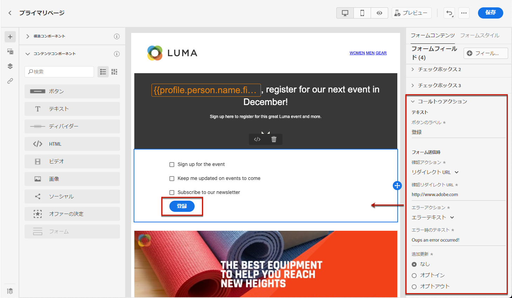

1. ボタンをクリックしたときの動作を定義します。

   * **[!UICONTROL リダイレクト URL]**：ユーザーのリダイレクト先となるページの URL を入力します。
   * **[!UICONTROL 確認テキスト]**：表示する確認テキストを入力します。
   * **[!UICONTROL サブページへのリンク]**：[サブページ](create-lp.md#configure-subpages)を設定し、表示されるドロップダウンリストから選択します。

   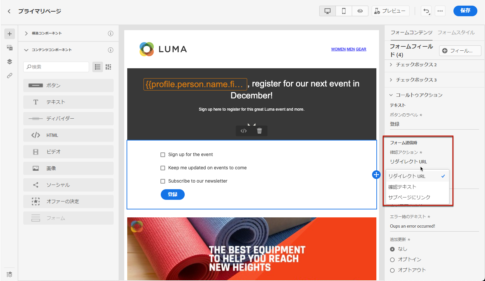

1. エラーが発生した場合にボタンをクリックしたときの動作を定義します。

   * **[!UICONTROL リダイレクト URL]**：ユーザーのリダイレクト先となるページの URL を入力します。
   * **[!UICONTROL エラーテキスト]**：表示するエラーテキストを入力します。 エラーテキストは、[フォームスタイル](#define-lp-styles)を定義する際にプレビューできます。

   * **[!UICONTROL サブページへのリンク]**：[サブページ](create-lp.md#configure-subpages)を設定し、表示されるドロップダウンリストから選択します。

   

1. フォームの送信時に追加の更新を行う場合は、「**[!UICONTROL オプトイン]**」または「**[!UICONTROL オプトアウト]**」を選択し、購読リスト、チャネル、または使用するメールアドレスのみを更新するかどうかを定義します。

   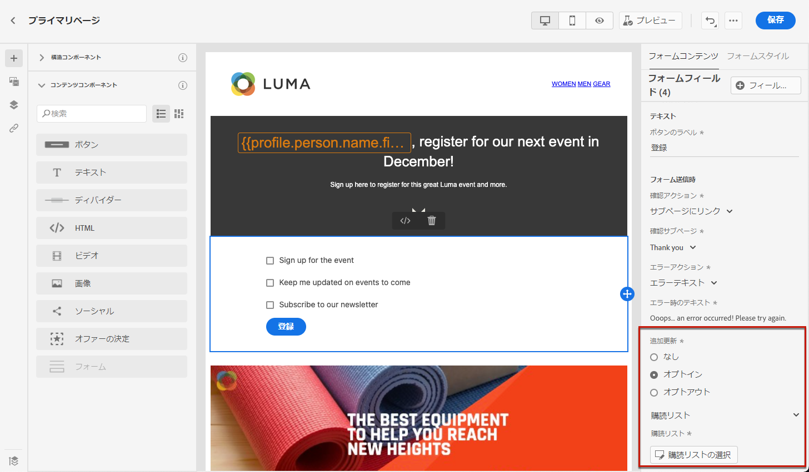

1. コンテンツを保存し、ページ名の横の矢印をクリックして、[ランディングページのプロパティ](create-lp.md#configure-primary-page)に戻ります。

   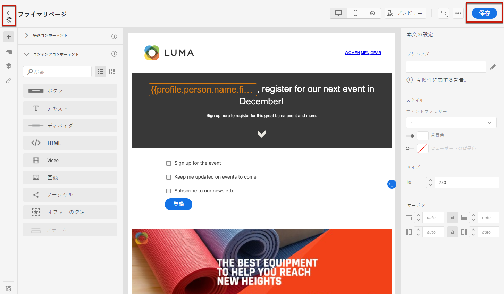

<!--Will the name Email Designer be kept if you can also design LP with the same tool? > To modify in Messages section > content designer or Designer-->

## ランディングページのフォームスタイルを定義 {#define-lp-styles}

1. フォームコンポーネントコンテンツのスタイルを変更するには、いつでも「**[!UICONTROL フォームスタイル]**」タブに切り替えます。

   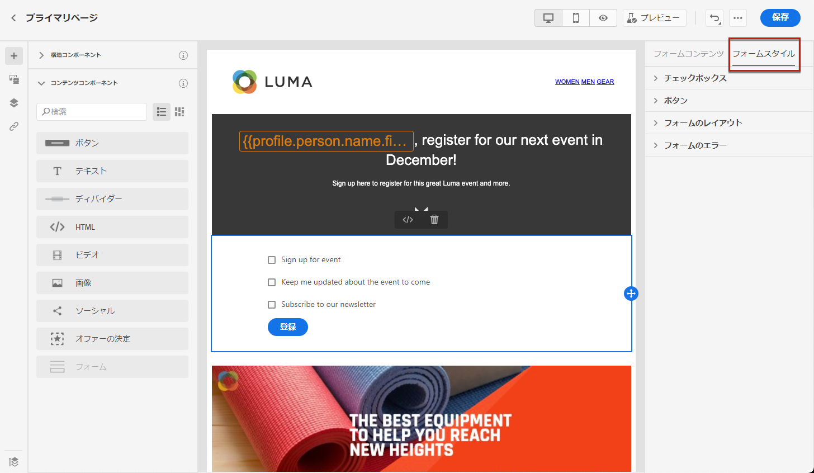

1. 「**[!UICONTROL チェックボックス]**」セクションを展開し、チェックボックスと対応するテキストの外観を定義します。例えば、フォントファミリーやサイズ、チェックボックスの境界線の色を調整できます。

   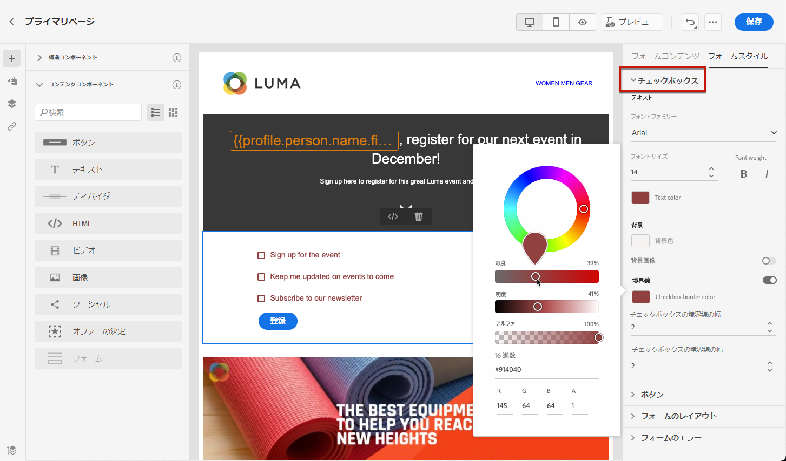

1. 「**[!UICONTROL ボタン]**」セクションを展開し、コンポーネントフォーム内のボタンの外観を変更します。例えば、境界線を追加したり、マウスポインターを置いたときのラベルの色を編集したり、ボタンの配置を調整したりできます。

   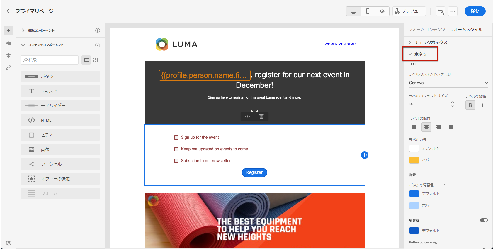

   マウスポインタ―を置いたときにボタンのラベルの色などの設定の一部をプレビューするには、「**[!UICONTROL プレビュー]**」ボタンを使用します。 ランディングページのテストについては、[こちら](create-lp.md#test-landing-page)を参照してください。

   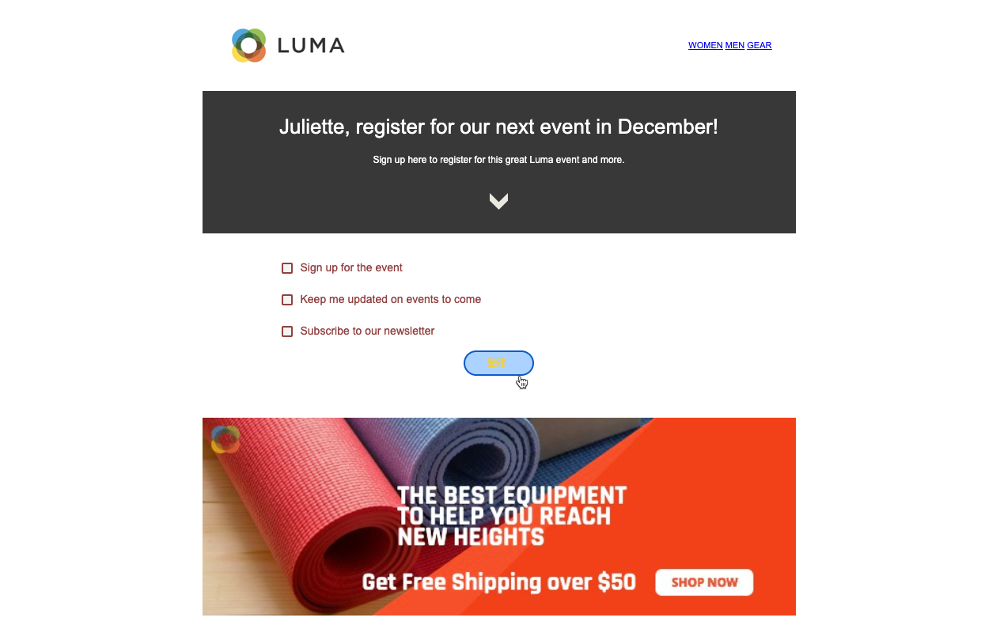

1. 「**[!UICONTROL フォームレイアウト]**」セクションを展開し、背景色、パディング、余白などのレイアウト設定を編集します。

   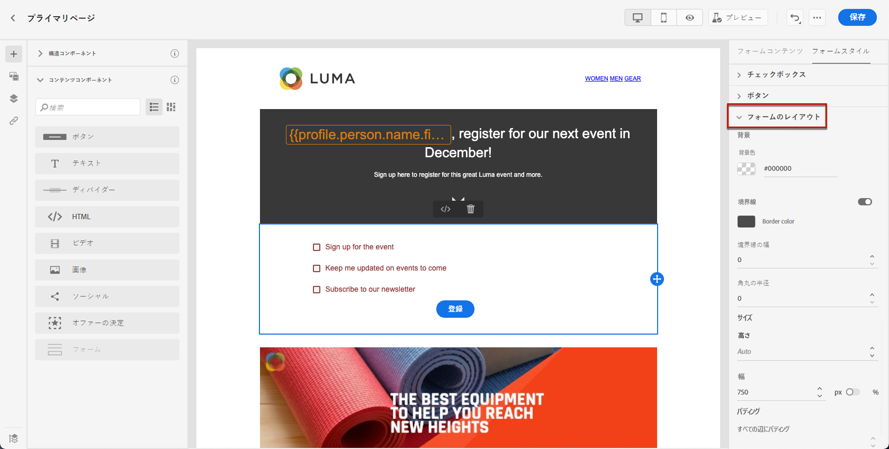

1. 「**[!UICONTROL フォームエラー]**」セクションを展開し、問題が発生した場合に表示されるエラーメッセージの表示を調整します。 フォーム上のエラーテキストをプレビューするには、対応するオプションをオンにします。

   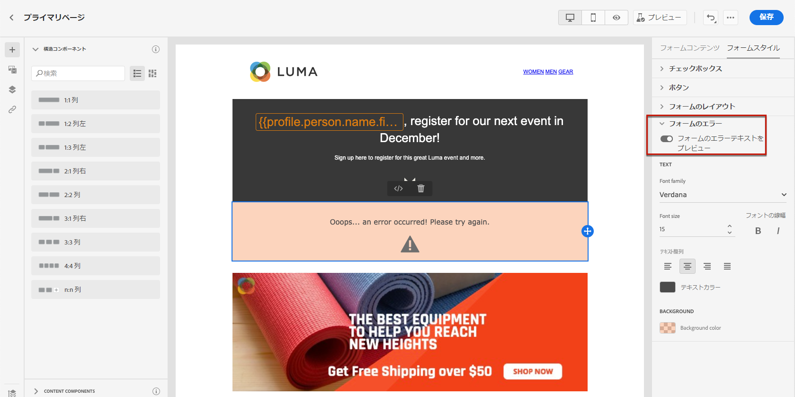

