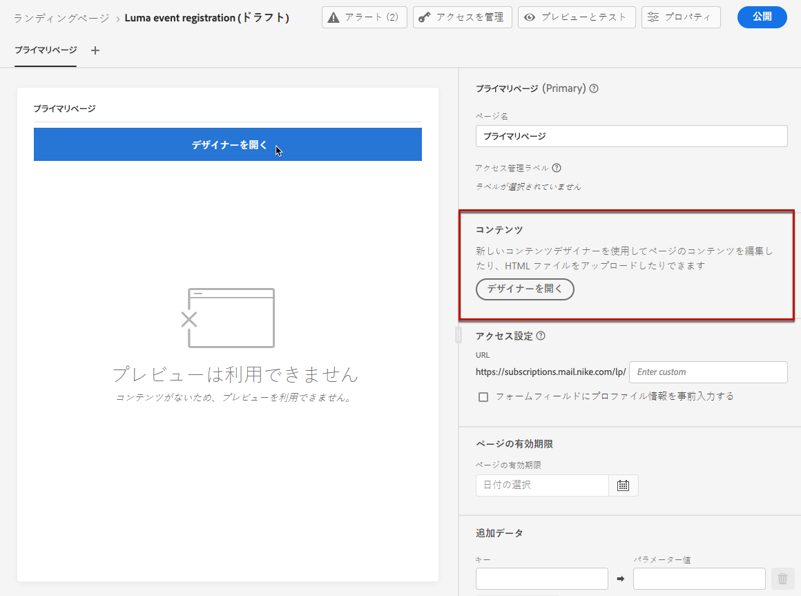

# ランディングページのコンテンツのデザイン {#design-lp}

ランディング用の[プライマリページ](create-lp.md#configure-primary-page)または[サブページ](create-lp.md#configure-subpages)のコンテンツ作成を開始するには、ページコンテンツにマウスポインターを置いて、「**[!UICONTROL Designer を開く]**」をクリックします。右側のパレットで、対応するボタンをクリックすることもできます。

ここから、次のことができます。

* コンテンツ designer のインターフェイスで&#x200B;**ランディングページをゼロから設計**&#x200B;し、[Adobe Experience Manager Assets](../integrations/assets.md) の画像を活用します。コンテンツ<!--or use built-in templates--> のデザイン方法については、 [この節](../email/content-from-scratch.md)を参照してください。

* **AI アシスタントを使用してコンテンツを生成**&#x200B;し、AI 生成のテキストと画像を使用したランディングページの作成を高速化します。[AI アシスタントの詳細情報](../content-management/generative-full-content.md)。

* コンテンツ designer に直接 **Raw HTML をコーディングまたは貼り付け**&#x200B;ます。独自のコンテンツの作成方法については、[この節](../email/code-content.md)を参照してください。

* ファイルまたは .zip フォルダーから&#x200B;**既存の HTML コンテンツを読み込み**&#x200B;ます。コンテンツの読み込み方法については、[この節](../email/existing-content.md)を参照してください。

* [!DNL Journey Optimizer] で作成された&#x200B;**保存済みランディングページテンプレートを使用**&#x200B;します。[詳細情報](lp-templates.md)

ランディングページコンテンツデザイナーで、メールと同じコンポーネントを使用し、フォームコンポーネントを使用してランディングページ固有のコンテンツを定義できます。 [詳細情報](lp-content.md)

>[!NOTE]
>
>ランディングページのコンテンツデザイナーは、E メールデザイナーと非常に似ています。詳しくは、[ [!DNL Journey Optimizer]](../email/get-started-email-design.md) でのコンテンツのデザインを参照してください。
>
>[欧州アクセシビリティ法](https://eur-lex.europa.eu/legal-content/EN/TXT/?uri=CELEX%3A32019L0882){target="_blank"}では、すべてのデジタル通信がアクセス可能である必要があると規定しています。[!DNL Journey Optimizer] でコンテンツをデザインする際は、[このページ](../email/accessible-content.md)に記載されている特定のガイドラインに従ってください。
