# ランディングページ固有のコンテンツの定義 {#lp-content}

ユーザーがランディングページからオプションを選択および送信できる特定のコンテンツを定義するには、**[!UICONTROL フォーム]**&#x200B;コンポーネントを使用します。これを行うには、以下の手順に従います。

>[!NOTE]
>
>また、**[!UICONTROL フォーム]**&#x200B;コンポーネントを使用せずにクリックスルーのランディングページを作成することもできます。この場合、ランディングページはユーザーに表示されますが、フォームの送信には必要ありません。これは、オプトインやオプトアウトなどの受信者からのアクションを必要とせずにランディングページを表示したい場合や、ユーザー入力が不要な情報を提供したい場合にのみ役立ちます。

## フォームコンポーネントの使用 {#use-form-component}

1. ランディングページ固有の&#x200B;**[!UICONTROL フォーム]**&#x200B;コンポーネントを左側のパレットからメインのワークスペースにドラッグ＆ドロップします。

   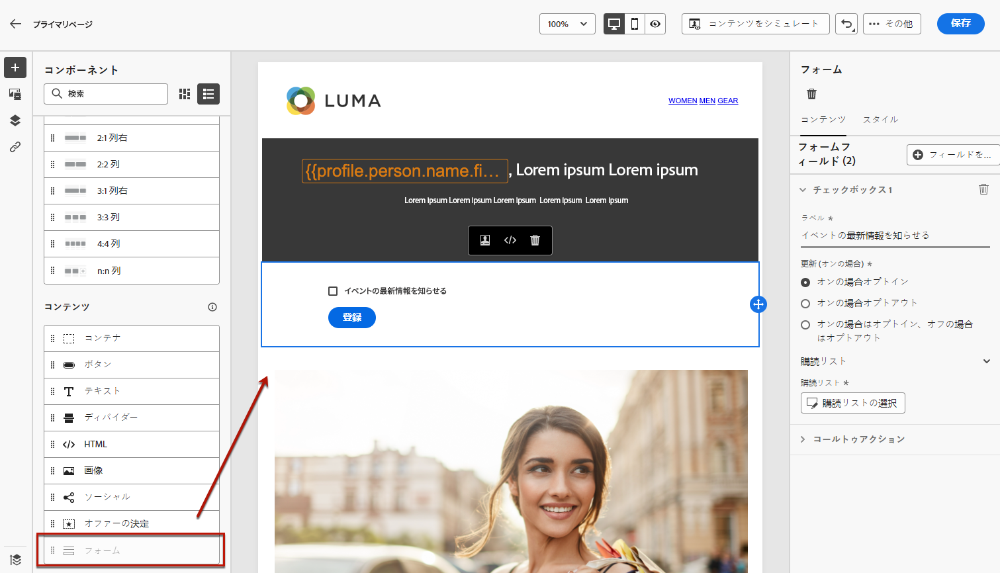

   >[!NOTE]
   >
   >**[!UICONTROL フォーム]**&#x200B;コンポーネントは、同じページで 1 回だけ使用できます。

1. 選択します。「**[!UICONTROL フォームコンテンツ]**」タブが右側のパレットに表示され、フォームの様々なフィールドを編集できます。

   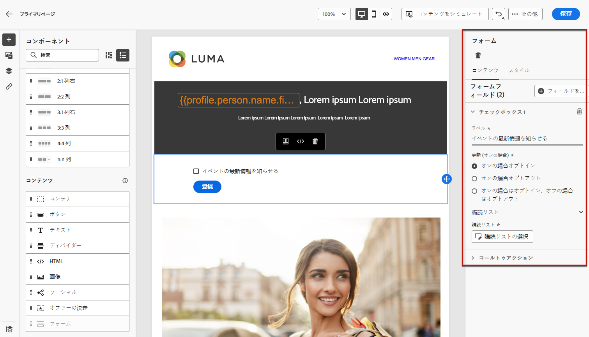

   >[!NOTE]
   >
   >「**[!UICONTROL フォームスタイル]**」タブに切り替えると、フォームコンポーネントコンテンツのスタイルをいつでも編集できます。[詳細情報](#define-lp-styles)

1. 「**[!UICONTROL チェックボックス 1]**」セクションでは、このチェックボックスに対応するラベルを編集できます。

1. このチェックボックスでユーザーのオプトイン／オプトアウトを行うかどうかを定義します（お知らせの受信に同意する、または以降の連絡を望まない）。

   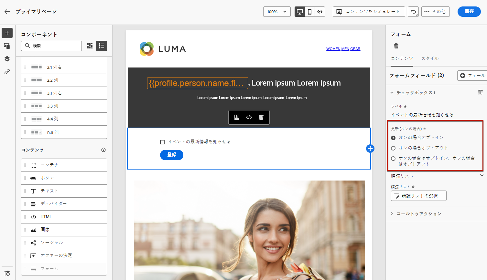

   次の 3 つのオプションの中から選択します。

   * **[!UICONTROL オンの場合オプトイン]**：ユーザーが同意するには、チェックボックスをオンにする必要があります（オプトイン）。
   * **[!UICONTROL オンの場合オプトアウト]**：ユーザーが同意を削除するには、このチェックボックスをオンにする必要があります（オプトアウト）。
   * **[!UICONTROL オンの場合はオプトイン、オフの場合はオプトアウト]**：このオプションを使用すると、オプトイン／オプトアウト用の 1 つのチェックボックスを挿入できます。ユーザーは、同意（オプトイン）するにはチェックボックスをオンにし、同意を削除（オプトアウト）するにはオフにする必要があります。

1. 次の 3 つのオプションの間で、更新する項目を選択します。

   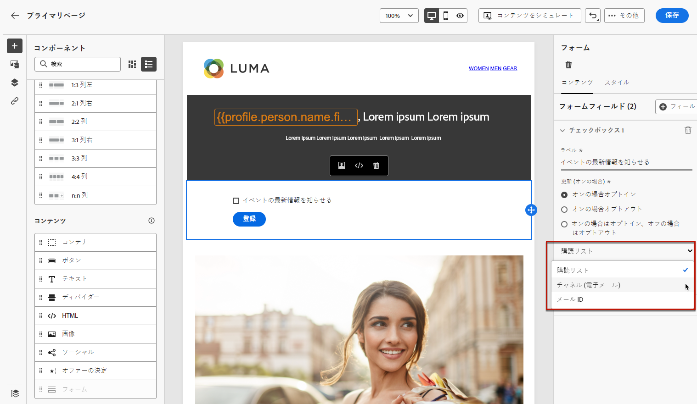

   * **[!UICONTROL 購読リスト]**：プロファイルがこのチェックボックスを選択した場合に更新される購読リストを選択する必要があります。詳しくは、[購読リスト](subscription-list.md)を参照してください。

      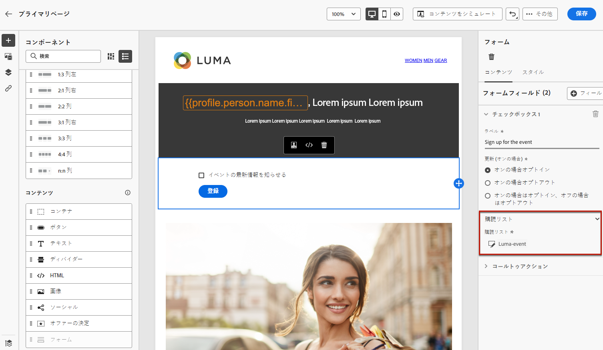

   * **[!UICONTROL チャネル（メール）]**：オプトインまたはオプトアウトは、チャネル全体に適用されます。例えば、オプトアウトするプロファイルに 2 つのメールアドレスがある場合、両方のアドレスはすべてのコミュニケーションから除外されます。

   * **[!UICONTROL メール ID]**：オプトインまたはオプトアウトは、ランディングページへのアクセスに使用したメールアドレスにのみ適用されます。例えば、プロファイルに 2 つのメールアドレスがある場合、ブランドからのお知らせはオプトインに使用されたメールアドレスにのみ届きます。

1. **[!UICONTROL フィールドを追加]**／**[!UICONTROL チェックボックス]**&#x200B;をクリックし、別のチェックボックスを追加します。上記の手順を繰り返して、プロパティを定義します。

   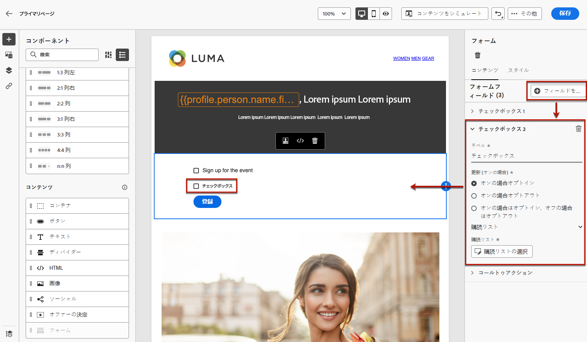

1. 必要なチェックボックスをすべて追加したら、「**[!UICONTROL コールトゥアクション]**」をクリックして、対応するセクションを展開します。これにより、**[!UICONTROL フォーム]**&#x200B;コンポーネントでボタンの動作を定義できるようになります。

   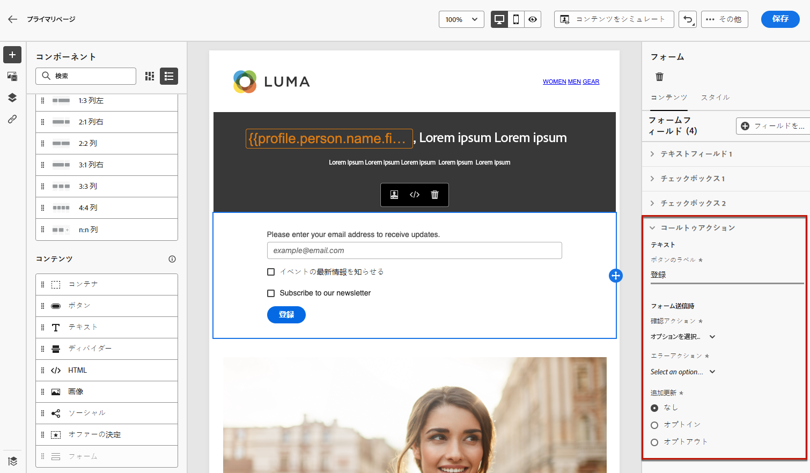

1. ボタンをクリックしたときの動作を定義します。

   * **[!UICONTROL リダイレクト URL]**：ユーザーのリダイレクト先となるページの URL を入力します。
   * **[!UICONTROL 確認テキスト]**：表示する確認テキストを入力します。
   * **[!UICONTROL サブページへのリンク]**：[サブページ](create-lp.md#configure-subpages)を設定し、表示されるドロップダウンリストから選択します。

   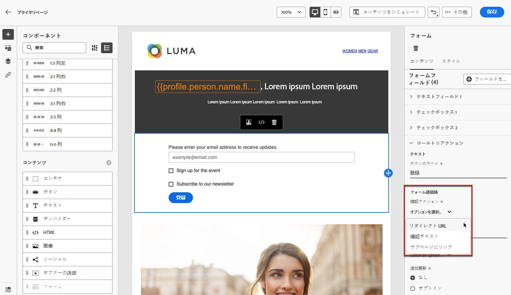

1. エラーが発生した場合にボタンをクリックしたときの動作を定義します。

   * **[!UICONTROL リダイレクト URL]**：ユーザーのリダイレクト先となるページの URL を入力します。
   * **[!UICONTROL エラーテキスト]**：表示するエラーテキストを入力します。エラーテキストは、[フォームスタイル](#define-lp-styles)を定義する際にプレビューできます。

   * **[!UICONTROL サブページへのリンク]**：[サブページ](create-lp.md#configure-subpages)を設定し、表示されるドロップダウンリストから選択します。

   

1. フォームの送信時に追加の更新を行う場合は、「**[!UICONTROL オプトイン]**」または「**[!UICONTROL オプトアウト]**」を選択し、購読リスト、チャネル、または使用するメールアドレスのみを更新するかどうかを定義します。

   

1. コンテンツを保存し、ページ名の横の矢印をクリックして、[ランディングページのプロパティ](create-lp.md#configure-primary-page)に戻ります。

   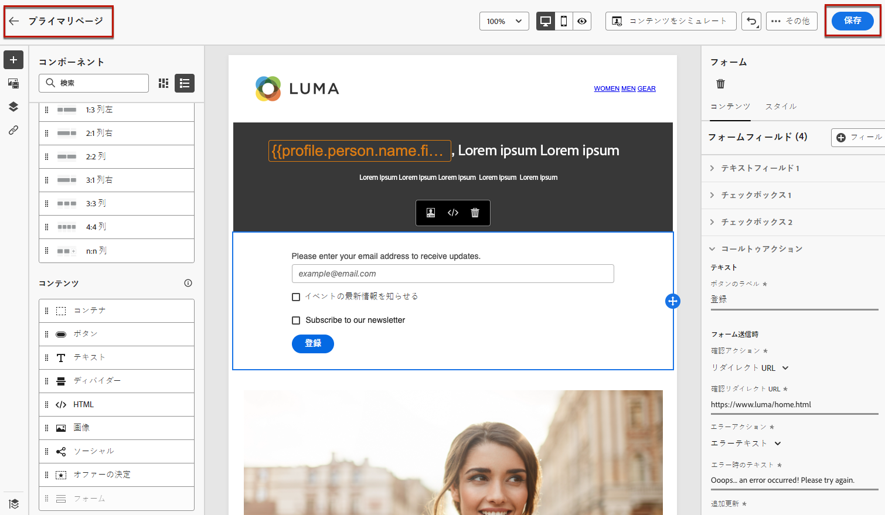

## ランディングページのフォームスタイルを定義 {#lp-form-styles}

1. フォームコンポーネントコンテンツのスタイルを変更するには、いつでも「**[!UICONTROL フォームスタイル]**」タブに切り替えます。

   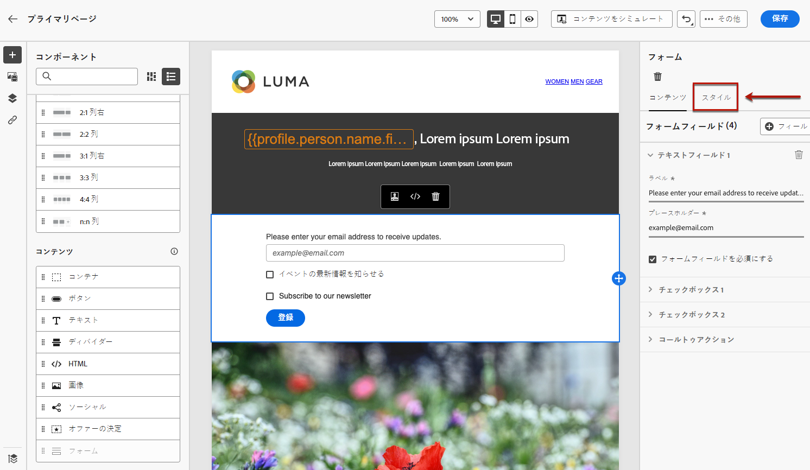

1. 「**[!UICONTROL チェックボックス]**」セクションを展開し、チェックボックスと対応するテキストの外観を定義します。例えば、フォントファミリーやサイズ、チェックボックスの境界線の色を調整できます。

   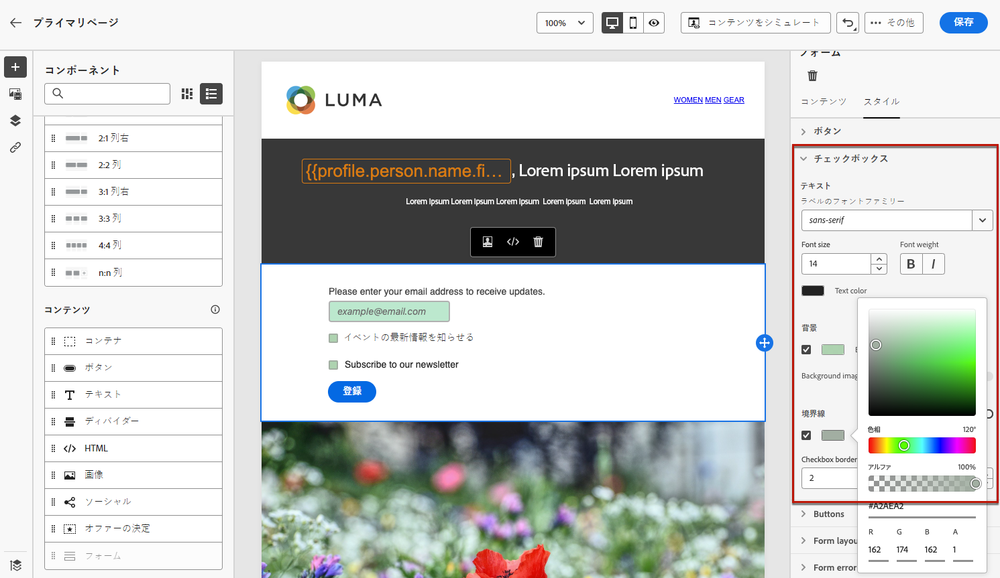

1. 「**[!UICONTROL ボタン]**」セクションを展開し、コンポーネントフォーム内のボタンの外観を変更します。例えば、境界線を追加したり、マウスポインターを置いたときのラベルの色を編集したり、ボタンの配置を調整したりできます。

   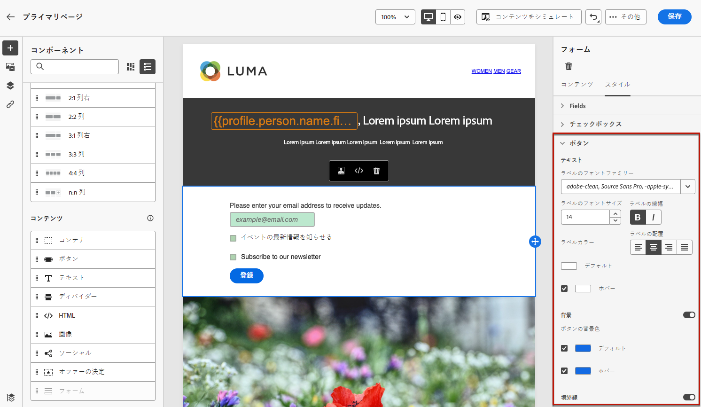

   マウスポインターを置いたときにボタンのラベルの色などの設定の一部をプレビューするには、「**[!UICONTROL プレビュー]**」ボタンを使用します。ランディングページのテストについては、[こちら](create-lp.md#test-landing-page)を参照してください。

   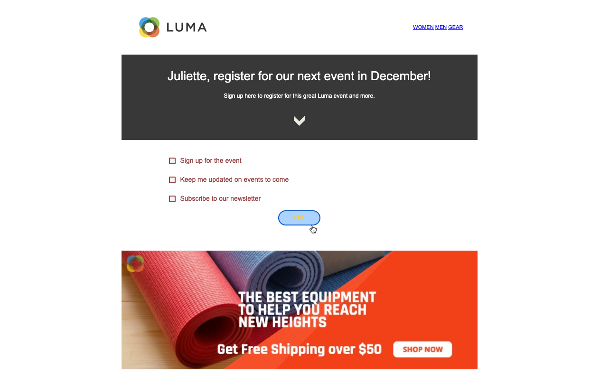

1. 「**[!UICONTROL フォームレイアウト]**」セクションを展開し、背景色、パディング、余白などのレイアウト設定を編集します。

   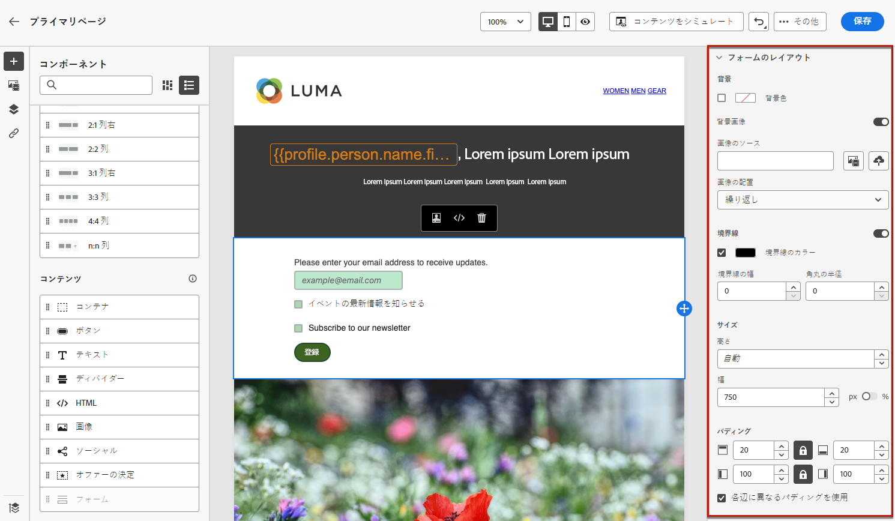

1. 「**[!UICONTROL フォームエラー]**」セクションを展開し、問題が発生した場合に表示されるエラーメッセージの表示を調整します。フォーム上のエラーテキストをプレビューするには、対応するオプションをオンにします。

   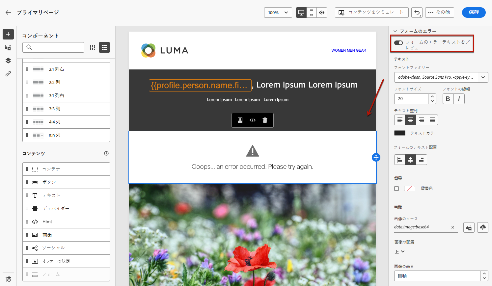

## プライマリページコンテキストを使用 {#use-primary-page-context}

同じランディングページ内の別のページから得られるコンテキストデータを使用できます。

例えば、チェックボックスをリンクする場合は、<!-- or the submission of the page--> から [購読リスト](subscription-list.md) プライマリランディングページの「ありがとうございました」サブページで、その購読リストを使用できます。

例えば、プライマリページの 2 つのチェックボックスを、2 つの異なる購読リストにリンクしたとします。 ユーザーがこれらのいずれかを購読している場合、選択したチェックボックスに応じて、フォームの送信時に特定のメッセージを表示する必要があります。

これをおこなうには、以下の手順に従います。

1. プライマリページで、各チェックボックスを該当する購読リストにリンクします。 [詳細情報](#use-form-component)。

   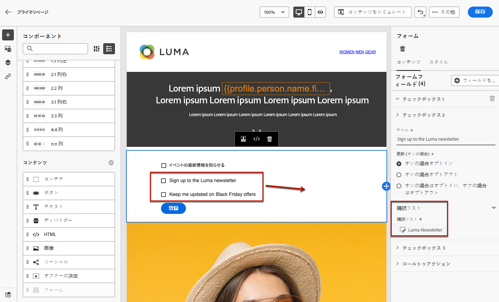

1. サブページ上で、テキストを挿入する位置にマウスのポインターを置き、「 **[!UICONTROL パーソナライゼーションを追加]** を選択します。

   

1. 内 **[!UICONTROL パーソナライゼーションを編集]** ウィンドウ：選択 **[!UICONTROL コンテキスト属性]** > **[!UICONTROL ランディングページ]** > **[!UICONTROL プライマリページコンテキスト]** > **[!UICONTROL 購読]**.

1. プライマリページで選択したすべての購読リストが表示されます。 「 + 」アイコンを使用して、関連する項目を選択します。

   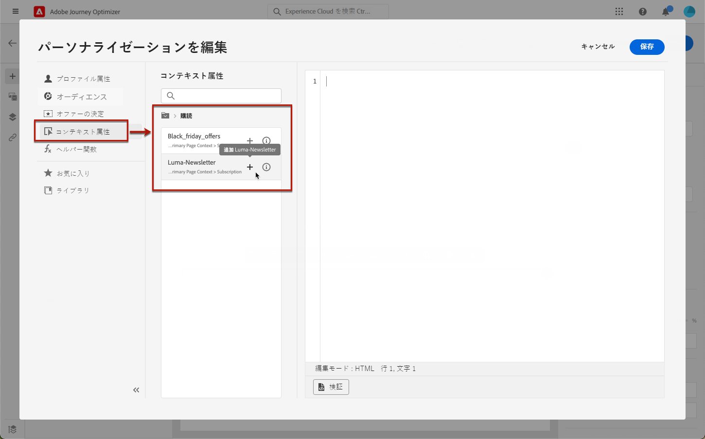

1. 式エディターのヘルパー関数を使用して、関連する条件を追加します。 [詳細情報](../personalization/functions/functions.md)

   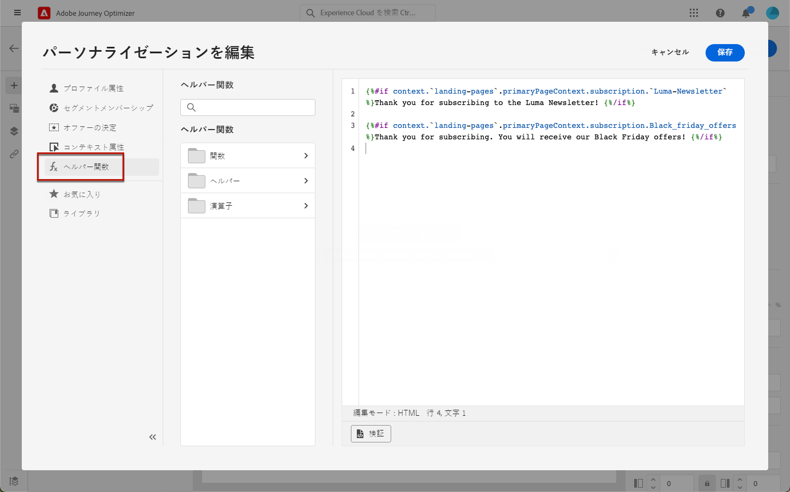

   >[!CAUTION]
   >
   >式にハイフンなどの特殊文字が含まれている場合は、ハイフンを含むテキストをエスケープする必要があります。

1. 変更を保存します。

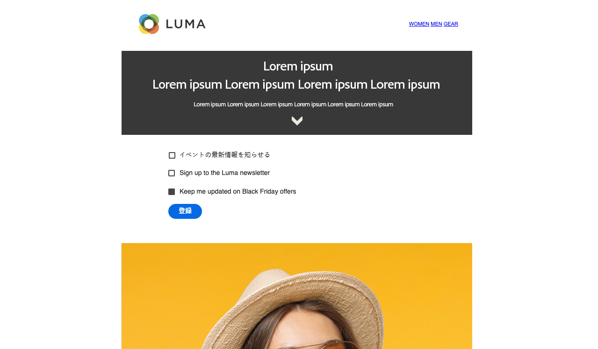

これで、ユーザーがチェックボックスの 1 つを選択すると、フォームの送信時に、選択したチェックボックスに対応するメッセージが表示されるようになります。

>[!NOTE]
>
>ユーザーが 2 つのチェックボックスを選択すると、両方のテキストが表示されます。

<!--
## Use landing page additional data {#use-additional-data}

When [configuring the primary page](create-lp.md#configure-primary-page), you can create additional data to enable storing information when the landing page is being submitted.

>[!NOTE]
>
>This data may not be visible to users who visit the page.

If you defined one or more keys with their corresponding values when [configuring the primary page](create-lp.md#configure-primary-page), you can leverage these keys in the content of your primary page and subpages using the [Expression editor](../personalization/personalization-build-expressions.md).

///When you reuse the same text on a page, this enables you to dynamically change that text if needed, without going through each occurrence.

For example, if you define the company name as a key, you can quickly update it everywhere (on all the pages of a given landing page) by changing it only once in the [primary page settings](create-lp.md#configure-primary-page).///

To leverage these keys in a landing page, follow the steps below:

1. When configuring the primary page, define a key and its corresponding value in the **[!UICONTROL Additional data]** section. [Learn more](create-lp.md#configure-primary-page)

    

1. When editing your primary page with the designer, place the pointer of your mouse where you want to insert your key and select **[!UICONTROL Add personalization]** from the contextual toolbar.

    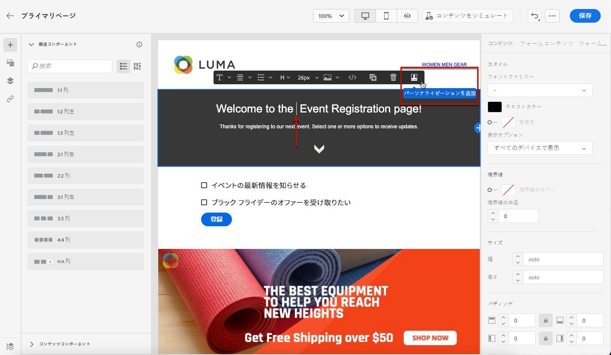

1. In the **[!UICONTROL Edit Personalization]** window, select **[!UICONTROL Contextual attributes]** > **[!UICONTROL Landing Pages]** > **[!UICONTROL Additional Context]**.

    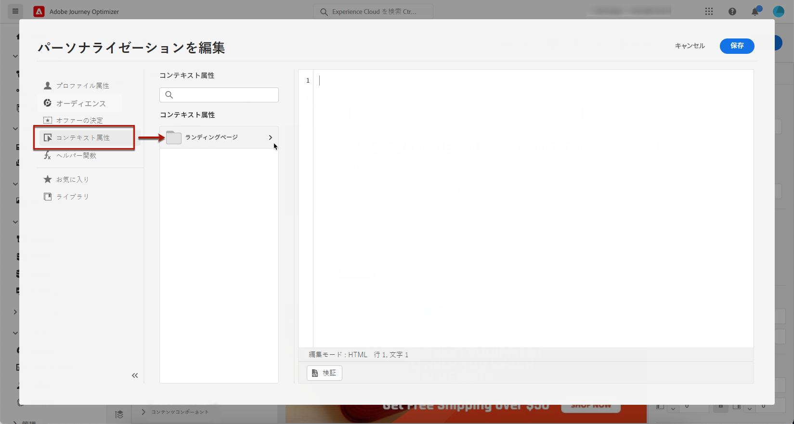

1. All the keys that you created when configuring the primary page are listed. Select the key of your choice using the + icon.

    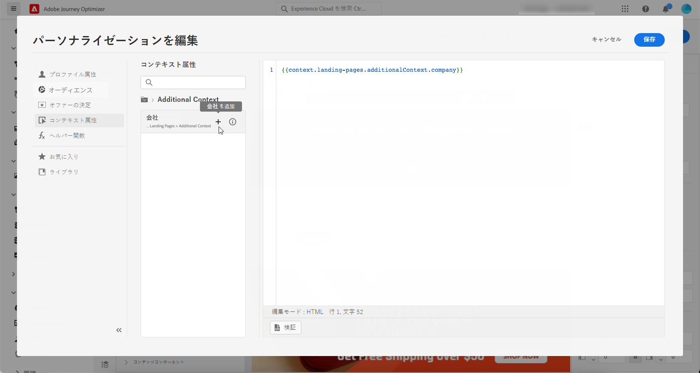

1. Save your changes and repeat the steps above as many times as needed.

    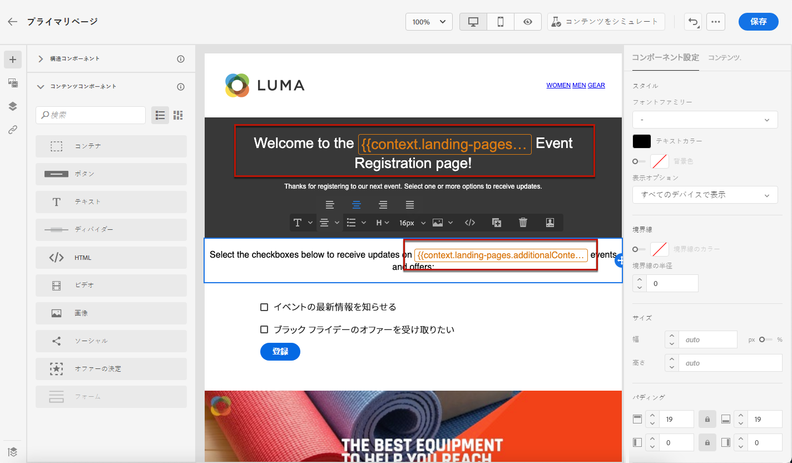

    You can see that the personalization item corresponding to your key is now displayed everywhere you inserted it.
-->