# ランディングページ固有のコンテンツの定義 {#lp-content}

>[!CONTEXTUALHELP]
>id="ac_lp_components"
>title="コンテンツコンポーネントの使用"
>abstract="コンテンツコンポーネントは、ランディングページのレイアウトの作成に使用できる、空のコンテンツプレースホルダーです。 ユーザーが選択肢を選択して送信できる特定のコンテンツを定義するには、フォームコンポーネントを使用します。"
>additional-url="https://experienceleague.adobe.com/en/docs/journey-optimizer/using/channels/email/design-email/add-content/content-components#add-content-components" text="コンテンツコンポーネントを追加"

ランディングページコンテンツをデザインするには、メールと同じコンポーネントを使用できます。 [詳細情報](../email/content-components.md#add-content-components)

ユーザーが選択肢を選択して送信できる特定のコンテンツをデザインするには、**フォームコンポーネント**&#x200B;を使用します。

* オプトイン、オプトアウト、サブスクリプションのシナリオについては、[組み込みのフォームコンポーネント &#x200B;](#use-form-component)を使用し、[&#x200B; ランディングページ固有のスタイル &#x200B;](#lp-form-styles)を定義します。

* ユーザーが特定のフォームを通じてデータを送信できるようにするには（例えば、[!DNL Experience Platform] データセットをエンリッチするには）、[公開されたフォーム &#x200B;](#embed-form)を&#x200B;**[!UICONTROL データキャプチャ]** ランディングページに埋め込みます。 [&#x200B; フォームの作成について詳しく見る](lp-forms.md)

>[!NOTE]
>
>**[!UICONTROL Form]** コンポーネントを使用せずにクリックスルーランディングページを作成することもできます。 その場合、ランディングページはユーザーに表示されますが、フォームを送信する必要はありません。 これは、オプトインやオプトアウトなど、受信者のアクションを必要とせずにランディングページを表示したい場合や、ユーザーの入力を必要としない情報を提供したい場合にのみ便利です。

ランディングページコンテンツデザイナーを使用すると、サブページのプライマリページからのコンテキストデータを活用することもできます。 [詳細情報](#use-primary-page-context)

>[!NOTE]
>
>[欧州アクセシビリティ法](https://eur-lex.europa.eu/legal-content/EN/TXT/?uri=CELEX%3A32019L0882){target="_blank"}では、すべてのデジタル通信にアクセスできるようにすることが規定されています。 [!DNL Journey Optimizer]でコンテンツをデザインするときは、[このページ &#x200B;](../email/accessible-content.md)に記載されている特定のガイドラインに従ってください。

## フォームコンポーネントの使用 {#use-form-component}

>[!CONTEXTUALHELP]
>id="ac_lp_formfield"
>title="フォームコンポーネントフィールドの設定"
>abstract="受信者がランディングページの選択内容をどのように表示および送信するかを定義します。"
>additional-url="https://experienceleague.adobe.com/en/docs/journey-optimizer/using/landing-pages/landing-pages-design/lp-content#lp-form-styles" text="ランディングページのフォームスタイルの定義"

>[!CONTEXTUALHELP]
>id="ac_lp_submission"
>title="ボタンをクリックするとどうなるか"
>abstract="ユーザーがランディングページフォームを送信したときに何が起こるかを定義します。"

ユーザーがランディングページから選択肢を選択して送信できる特定のコンテンツを定義するには、**[!UICONTROL Form]** コンポーネントを使用します。 これを行うには、次の手順に従います。

1. ランディングページ固有の&#x200B;**[!UICONTROL Form]** コンポーネントを左側のパレットからメインワークスペースにドラッグ&amp;ドロップします。

   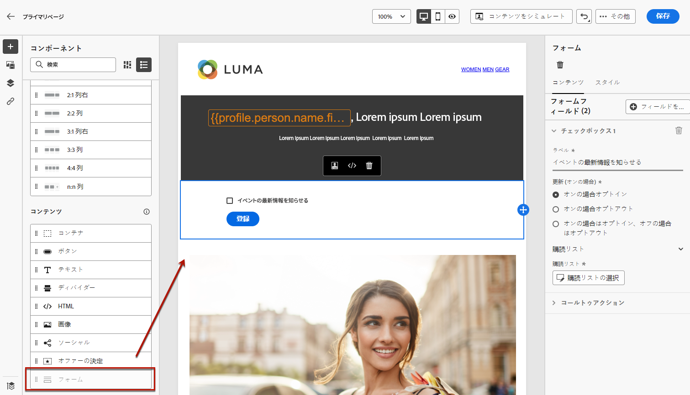

   >[!NOTE]
   >
   >**[!UICONTROL Form]** コンポーネントは、同じページで1回のみ使用できます。

1. 選択します。 「**[!UICONTROL フォームコンテンツ]**」タブが右側のパレットに表示され、フォームのさまざまなフィールドを編集できます。

   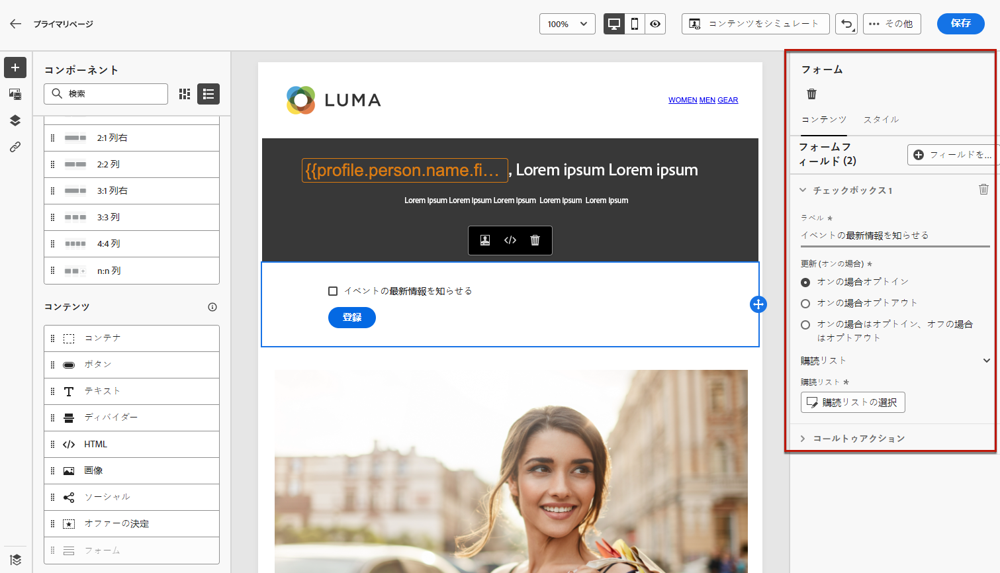

   >[!NOTE]
   >
   >いつでも「**[!UICONTROL スタイル]**」タブに切り替えて、フォームコンポーネントコンテンツのスタイルを編集できます。 [詳細情報](#define-lp-styles)

1. **[!UICONTROL チェックボックス 1]** セクションから、このチェックボックスに対応するラベルを編集できます。

1. このチェックボックスがユーザーをオプトインまたはオプトアウトするかどうかを定義します。ユーザーはコミュニケーションの受信に同意しますか？それとも、もう連絡を取らないことを求めますか？

   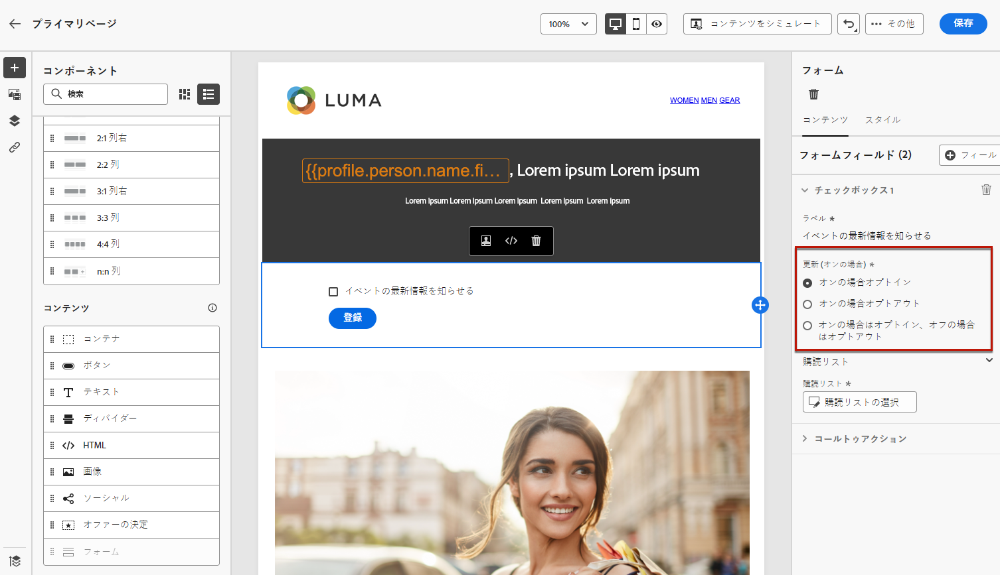

   次の3つのオプションから選択します。

   * **[!UICONTROL オンの場合はオプトイン]**：同意（オプトイン）するには、ユーザーがこのチェックボックスをオンにする必要があります。
   * **[!UICONTROL オンにした場合はオプトアウト]**：ユーザーが同意を削除するには、このチェックボックスをオンにする必要があります（オプトアウト）。
   * **[!UICONTROL オンにした場合はオプトイン、オフにした場合はオプトアウト]**：このオプションを使用すると、オプトイン/オプトアウト用の単一のチェックボックスを挿入できます。 ユーザーは、同意（オプトイン）にチェックボックスをオンにし、同意（オプトアウト）を削除するためにチェックボックスをオフにする必要があります。

1. 次の3つのオプションから更新する内容を選択します。

   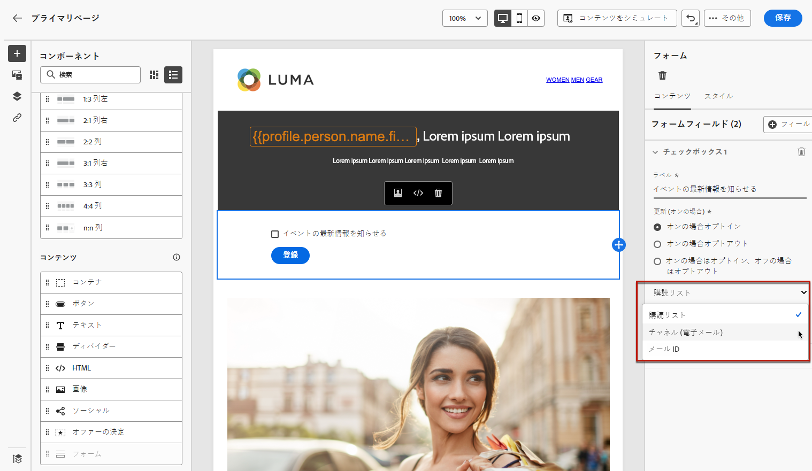

   * **[!UICONTROL 購読リスト]**: プロファイルがこのチェックボックスを選択した場合に更新される購読リストを選択する必要があります。 [購読リスト &#x200B;](subscription-list.md)の詳細をご覧ください。

     <!--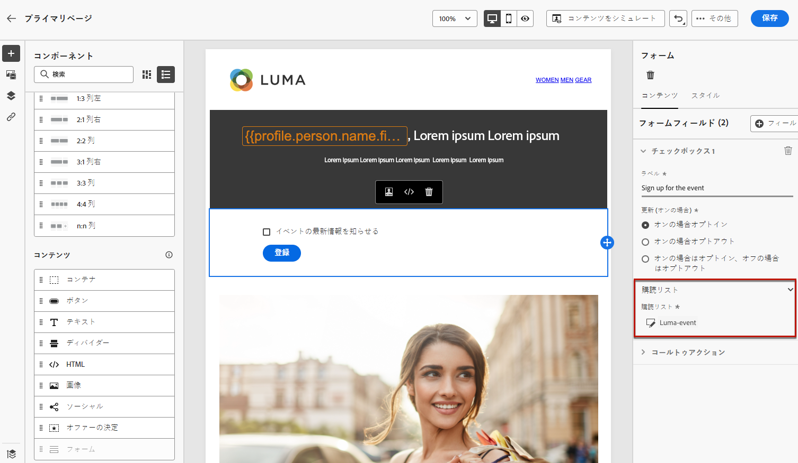-->

   * **[!UICONTROL チャネル（メール）]**: オプトインまたはオプトアウトは、チャネル全体に適用されます。 例えば、オプトアウトするプロファイルに2つのメールアドレスがある場合、両方のアドレスはすべてのコミュニケーションから除外されます。

   * **[!UICONTROL 電子メール ID]**: オプトインまたはオプトアウトは、ランディングページへのアクセスに使用された電子メールアドレスにのみ適用されます。 例えば、プロファイルに2つのメールアドレスがある場合、オプトインに使用されたものだけが、企業からのコミュニケーションを受け取ります。

1. **[!UICONTROL フィールドを追加]** > **[!UICONTROL チェックボックス]**&#x200B;をクリックして、別のチェックボックスを追加します。 上記の手順を繰り返して、プロパティを定義します。

   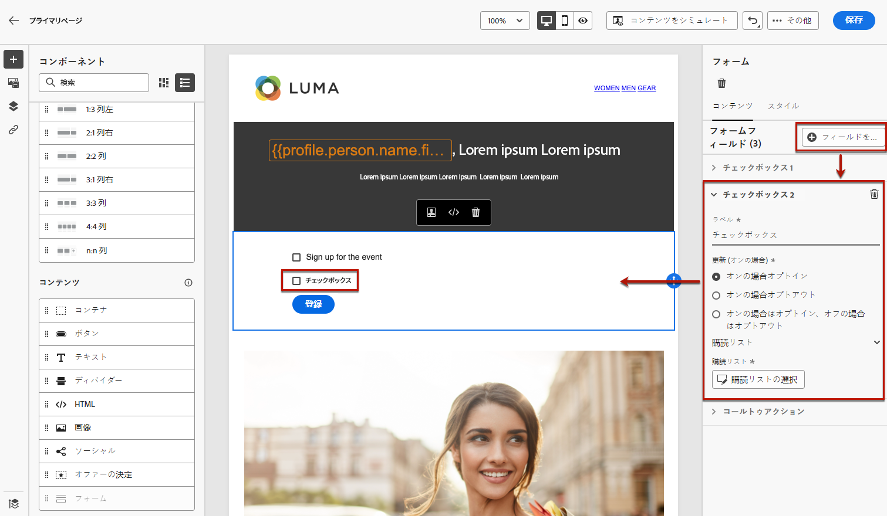

1. **[!UICONTROL テキストフィールド]**&#x200B;を追加することもできます。

   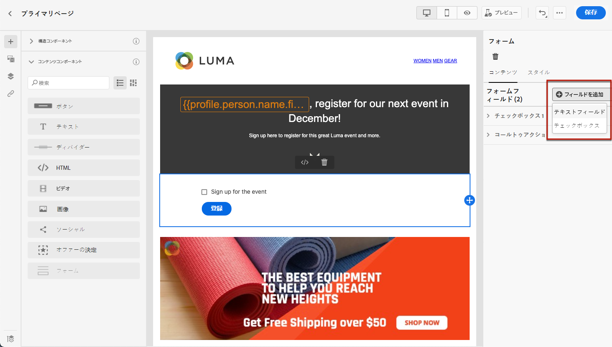

   * フォームのフィールドの上に表示される&#x200B;**[!UICONTROL Label]**&#x200B;を入力します。

   * **[!UICONTROL プレースホルダー]**&#x200B;のテキストを入力します。 ユーザーがフィールドに入力する前に、フィールド内に表示されます。

   * 必要に応じて、「**[!UICONTROL フォームフィールドを必須にする]**」オプションをオンにします。 その場合、ランディングページは、ユーザーがこのフィールドに入力した場合にのみ送信できます。 必須フィールドが入力されていない場合、ユーザーがページを送信するとエラーメッセージが表示されます。

   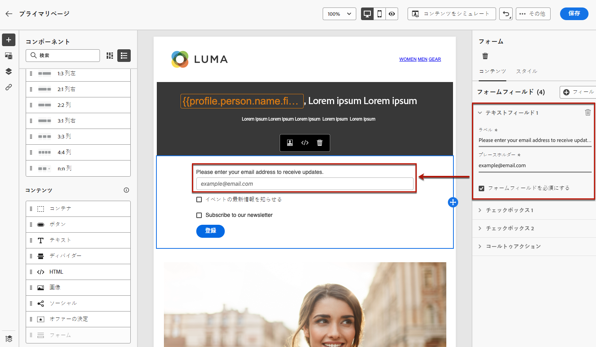

1. 目的のすべてのチェックボックスやテキストフィールドを追加したら、**[!UICONTROL Call to action]**&#x200B;をクリックして、対応するセクションを展開します。 これにより、**[!UICONTROL Form]** コンポーネント内のボタンの動作を定義できます。

   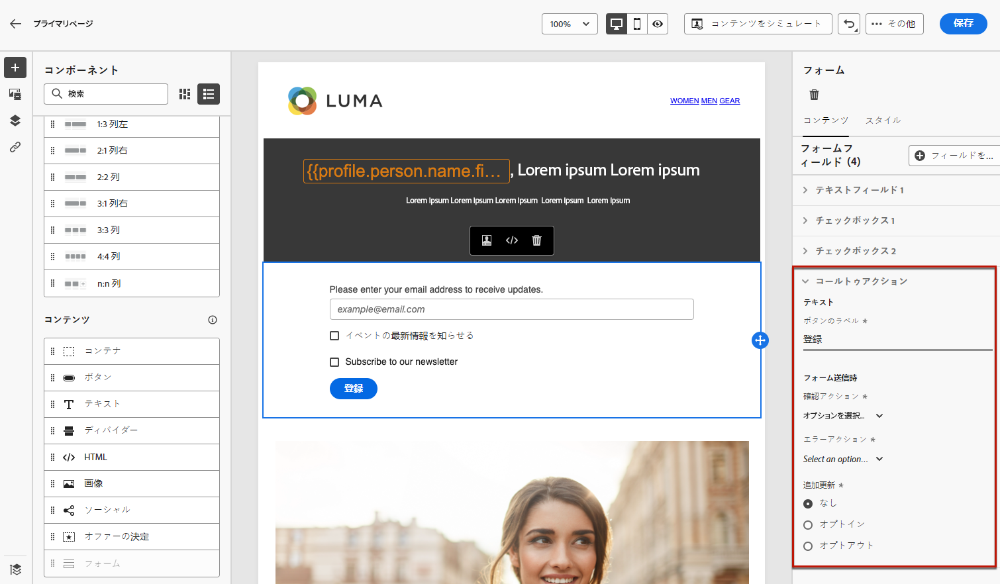

1. ボタンをクリックした際に何が起こるかを定義します。

   * **[!UICONTROL リダイレクト URL]**: ユーザーがリダイレクトされるページのURLを入力します。
   * **[!UICONTROL 確認テキスト]**：表示される確認テキストを入力します。
   * **[!UICONTROL サブページへのリンク]**: [&#x200B; サブページ &#x200B;](create-lp.md#configure-subpages)を設定し、表示されるドロップダウンリストから選択します。

   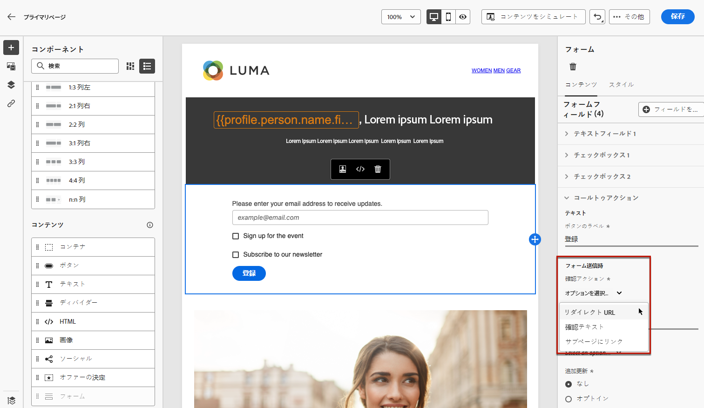

1. エラーが発生した場合にボタンをクリックしたときに何が起こるかを定義します。

   * **[!UICONTROL リダイレクト URL]**: ユーザーがリダイレクトされるページのURLを入力します。
   * **[!UICONTROL エラーテキスト]**：表示されるエラーテキストを入力します。 [&#x200B; フォームスタイル &#x200B;](#define-lp-styles)を定義する際に、エラーテキストをプレビューできます。

   * **[!UICONTROL サブページへのリンク]**: [&#x200B; サブページ &#x200B;](create-lp.md#configure-subpages)を設定し、表示されるドロップダウンリストから選択します。

   

1. フォームの送信時に追加の更新を行う場合は、**[!UICONTROL オプトイン]**&#x200B;または&#x200B;**[!UICONTROL オプトアウト]**&#x200B;を選択し、サブスクリプションリストを更新するか、チャネルまたは使用するメールアドレスのみを更新するかを定義します。

   

1. コンテンツを保存し、ページ名の横にある矢印をクリックして、[&#x200B; ランディングページのプロパティ &#x200B;](create-lp.md#configure-primary-page)に戻ります。

   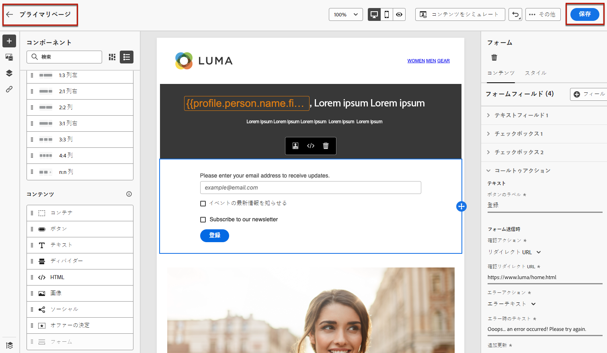

## ランディングページのフォームスタイルの定義 {#lp-form-styles}

1. フォームコンポーネントコンテンツのスタイルを変更するには、いつでも「**[!UICONTROL スタイル]**」タブに切り替えます。

   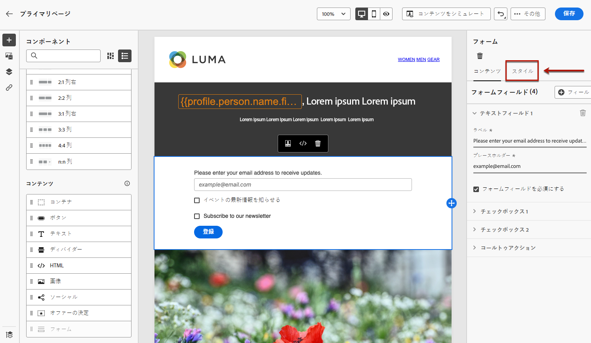

1. 「**[!UICONTROL フィールド]**」セクションはデフォルトで展開され、ラベルやプレースホルダーフォント、ラベルの位置、フィールドの背景色、フィールドの境界線など、テキストフィールドのアピアランスを編集できます。

   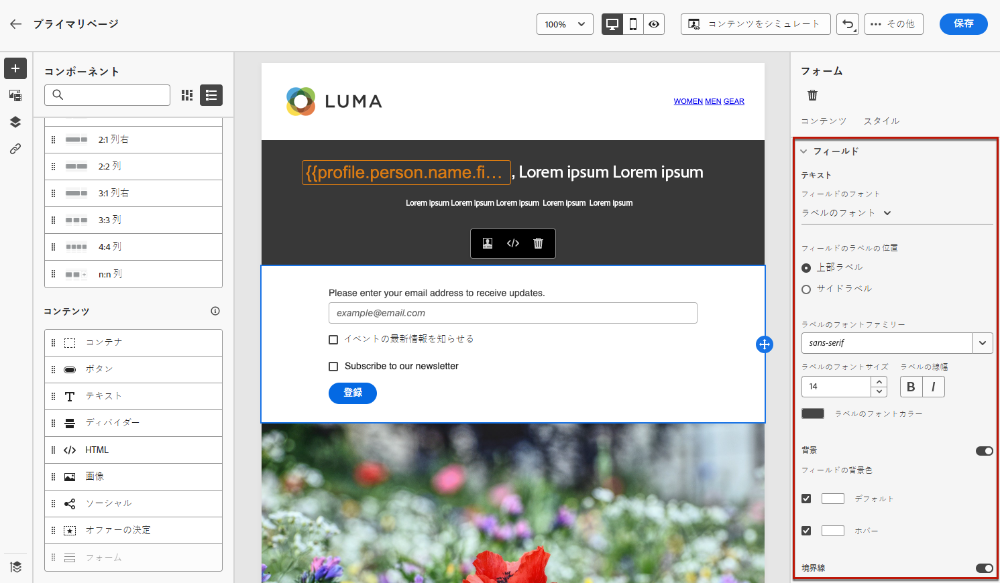

1. 「**[!UICONTROL チェックボックス]**」セクションを展開して、チェックボックスと対応するテキストの外観を定義します。 例えば、フォントファミリーやサイズ、チェックボックスの境界線の色を調整できます。

   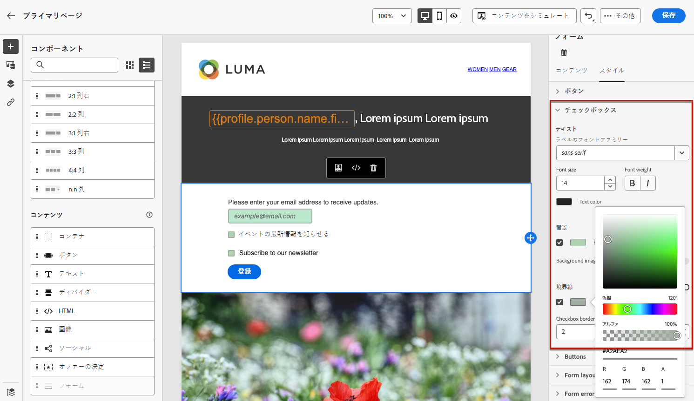

1. 「**[!UICONTROL ボタン]**」セクションを展開して、コンポーネントフォームのボタンの外観を変更します。 例えば、フォントを変更したり、境界線を追加したり、カーソルを合わせてラベルの色を編集したり、ボタンの配置を調整したりできます。

   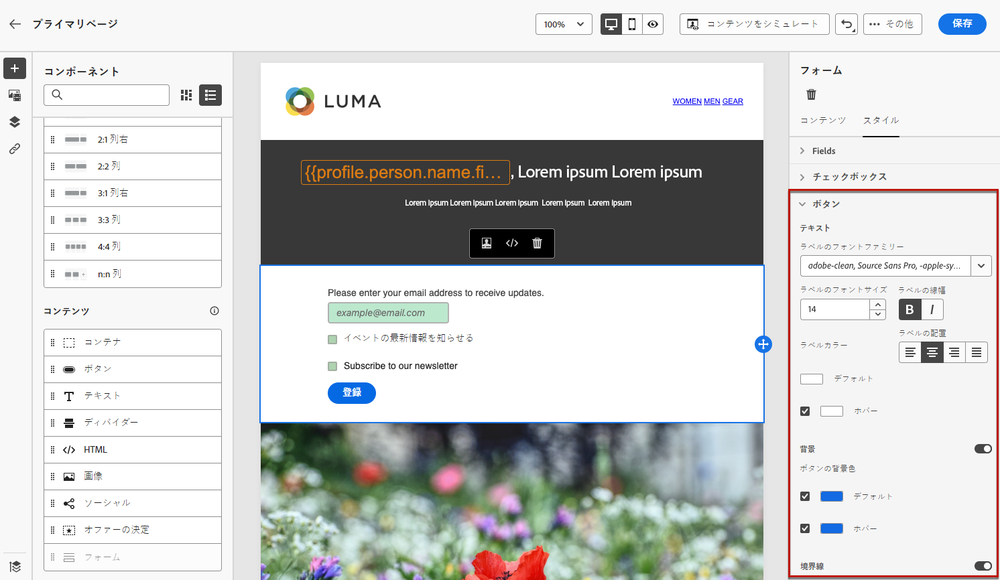

   「**[!UICONTROL コンテンツをシミュレート]**」ボタンを使用すると、カーソルを合わせたときにボタンラベルの色などの設定の一部をプレビューできます。 ランディングページのテストについて詳しくは、[こちら](create-lp.md#test-landing-page)を参照してください。

   <!--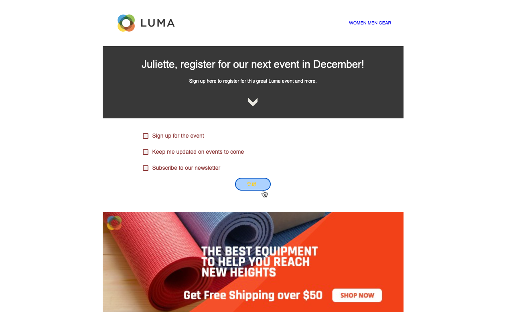-->

1. 「**[!UICONTROL フォームレイアウト]**」セクションを展開して、背景色、パディング、マージンなどのレイアウト設定を編集します。

   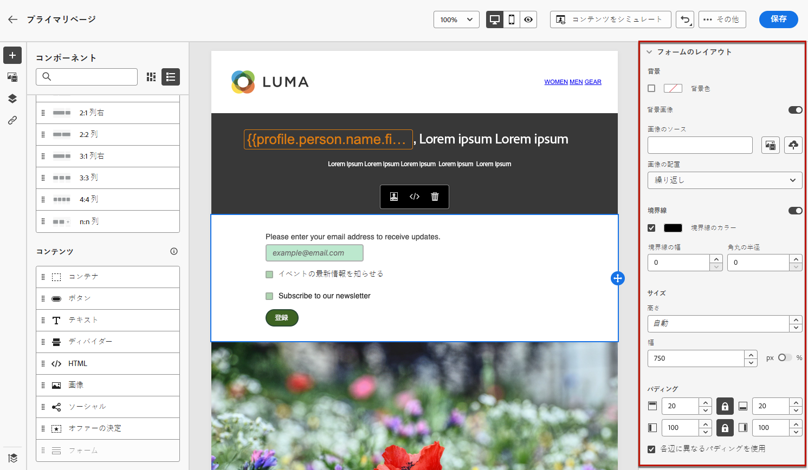

1. 「**[!UICONTROL フォームエラー]**」セクションを展開して、問題が発生した場合に表示されるエラーメッセージの表示を調整します。 対応するオプションをオンにして、フォームのエラーテキストをプレビューします。

   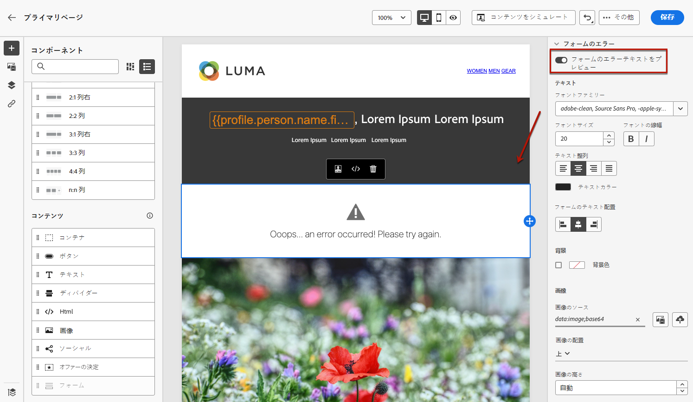

## フォームの埋め込み（データキャプチャ） {#embed-form}

[Data Capture](get-started-lp.md#data-capture-lp) タイプで作成されたランディングページの場合、作成した[公開フォーム &#x200B;](lp-forms.md)を埋め込むことができます。 送信は、フォームプリセットで設定されたストリーミング接続とデータセットに送信されます。

ランディングページコンテンツデザイナーで、次の手順に従います。

1. **[!UICONTROL 構造]** コンポーネントをコンテンツにドラッグ&amp;ドロップしてから、**[!UICONTROL フォーム]** コンポーネントをその構造にドラッグ&amp;ドロップします。

   >[!NOTE]
   >
   >ランディングページで選択できるのは、**公開された** フォームのみです。

1. 「**[!UICONTROL フォームを埋め込む]**」セクションで、表示するフォームを選択します。

   

   >[!NOTE]
   >
   >フォームのコンテンツまたはサンキューページの動作を変更する必要がある場合は、**[!UICONTROL フォームを編集]**&#x200B;してください。フォームは新しいタブで開きます。 [&#x200B; フォームの編集について詳しく見る](lp-forms.md#edit-form)

1. 「**[!UICONTROL フォローアップタイプ]**」セクションで、送信後の処理を定義します。

   * **[!UICONTROL Form defined]** – 埋め込みフォームで設定された「ありがとうございます」ページアクションを使用します。 [詳細情報](lp-forms.md#thank-you-page)
   * **公開されたランディングページ** – 別の公開された[&#x200B; ランディングページ &#x200B;](create-lp.md)にリダイレクトします。
   * **外部URL** – 完全なURLにリダイレクトします。

1. 編集が完了したら、ランディングページのコンテンツを保存します。

完全なワークフロー（ランディングページの作成、テスト、公開）については、[&#x200B; ランディングページでのフォームの活用](lp-forms.md#leverage-form-in-lp)を参照してください。

>[!NOTE]
>
>この埋め込みフォームのエクスペリエンスは、**[!UICONTROL データキャプチャ]**&#x200B;のランディングページにのみ適用されます。

## プライマリページコンテキストの使用 {#use-primary-page-context}

同じランディングページ内の別のページからのコンテキストデータを使用できます。

例えば、チェックボックス <!-- or the submission of the page-->をプライマリランディングページの[購読リスト &#x200B;](subscription-list.md)にリンクすると、その購読リストを「ありがとうございます」サブページで使用できます。

プライマリページの2つのチェックボックスを、2つの異なるサブスクリプションリストにリンクするとします。 ユーザーがこれらのいずれかを購読している場合、選択したチェックボックスに応じて、フォームの送信時に特定のメッセージを表示する必要があります。

これを行うには、次の手順に従います。

1. プライマリページで、**[!UICONTROL Form]** コンポーネントの各チェックボックスを関連するサブスクリプションリストにリンクします。 [詳細情報](#use-form-component)。

   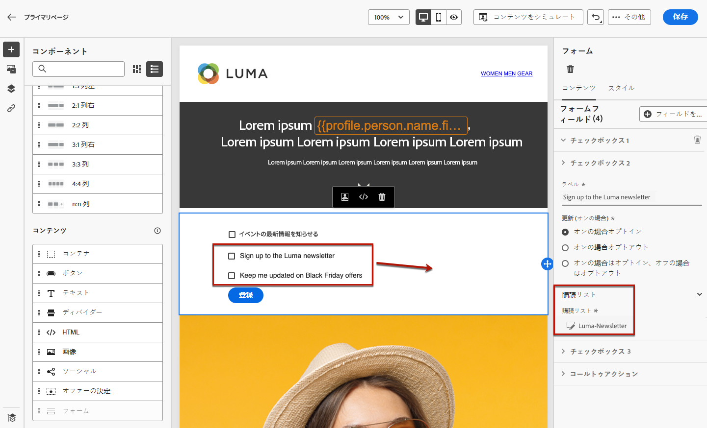

1. サブページで、テキストを挿入する位置にマウスのポインターを置き、コンテキストツールバーから「**[!UICONTROL パーソナライゼーションを追加]**」を選択します。

   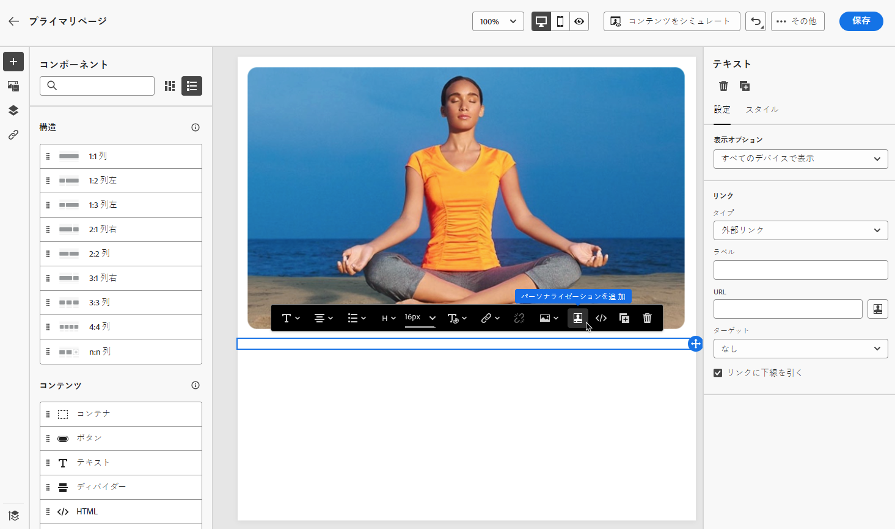

1. **[!UICONTROL パーソナライゼーションを編集]** ウィンドウで、**[!UICONTROL コンテキスト属性]** > **[!UICONTROL ランディングページ]** > **[!UICONTROL プライマリページコンテキスト]** > **[!UICONTROL サブスクリプション]**&#x200B;を選択します。

1. プライマリページで選択したすべての購読リストが一覧表示されます。 「+」アイコンを使用して関連する項目を選択します。

   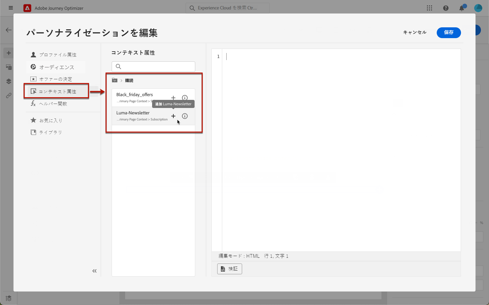

1. パーソナライゼーションエディターのヘルパー関数を使用して、関連する条件を追加します。 [詳細情報](../personalization/functions/functions.md)

   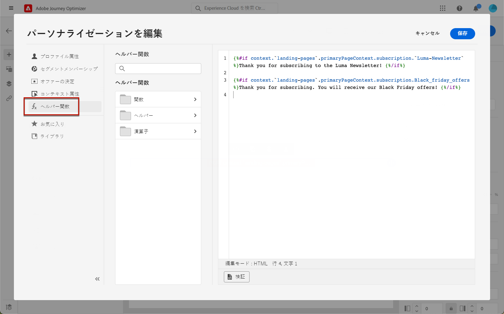

   >[!CAUTION]
   >
   >式にハイフンなどの特殊文字がある場合は、ハイフンを含むテキストをエスケープする必要があります。

1. 変更を保存します。

ユーザーがチェックボックスのいずれかを選択すると，

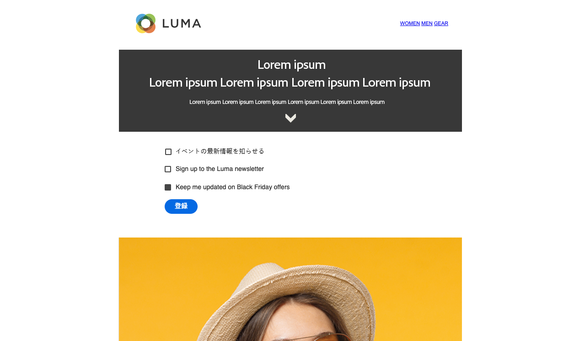

選択したチェックボックスに対応するメッセージは、フォームの送信時に表示されます。

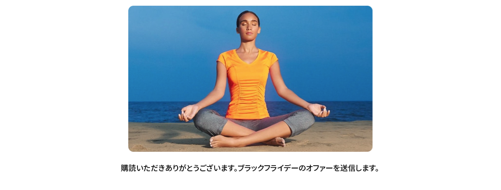

<!--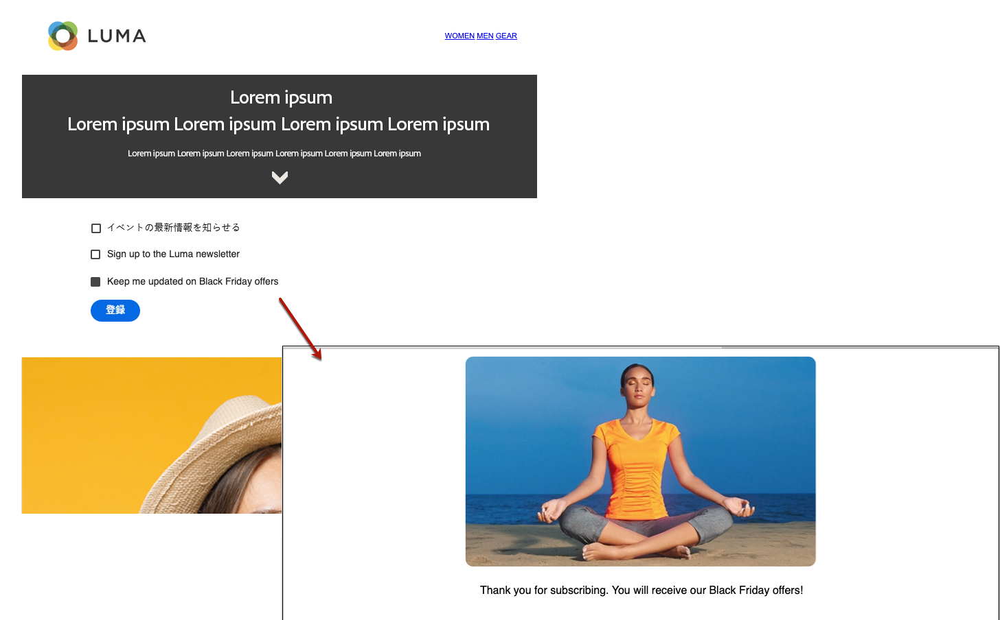-->

>[!NOTE]
>
>ユーザーが2つのチェックボックスを選択すると、両方のテキストが表示されます。

<!--
## Use landing page additional data {#use-additional-data}

When [configuring the primary page](create-lp.md#configure-primary-page), you can create additional data to enable storing information when the landing page is being submitted.

>[!NOTE]
>
>This data may not be visible to users who visit the page.

If you defined one or more keys with their corresponding values when [configuring the primary page](create-lp.md#configure-primary-page), you can leverage these keys in the content of your primary page and subpages using the [personalization editor](../personalization/personalization-build-expressions.md).

///When you reuse the same text on a page, this enables you to dynamically change that text if needed, without going through each occurrence.

For example, if you define the company name as a key, you can quickly update it everywhere (on all the pages of a given landing page) by changing it only once in the [primary page settings](create-lp.md#configure-primary-page).///

To leverage these keys in a landing page, follow the steps below:

1. When configuring the primary page, define a key and its corresponding value in the **[!UICONTROL Additional data]** section. [Learn more](create-lp.md#configure-primary-page)

    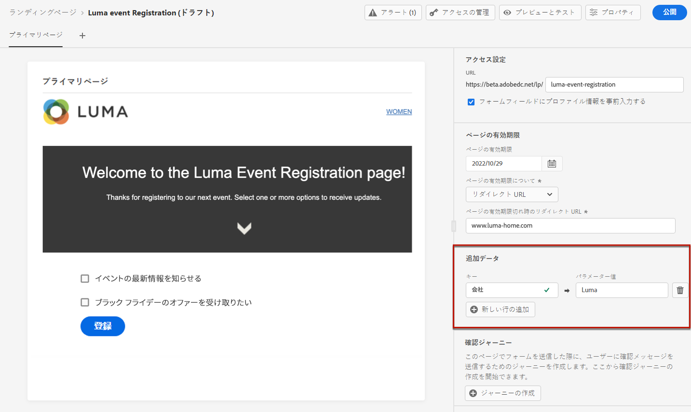

1. When editing your primary page with the designer, place the pointer of your mouse where you want to insert your key and select **[!UICONTROL Add personalization]** from the contextual toolbar.

    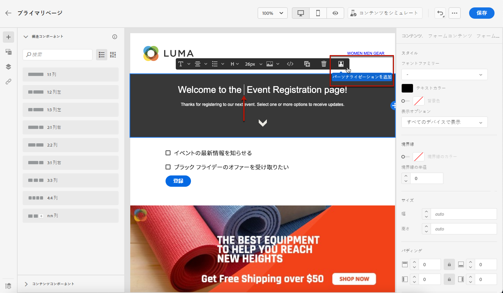

1. In the **[!UICONTROL Edit Personalization]** window, select **[!UICONTROL Contextual attributes]** > **[!UICONTROL Landing Pages]** > **[!UICONTROL Additional Context]**.

    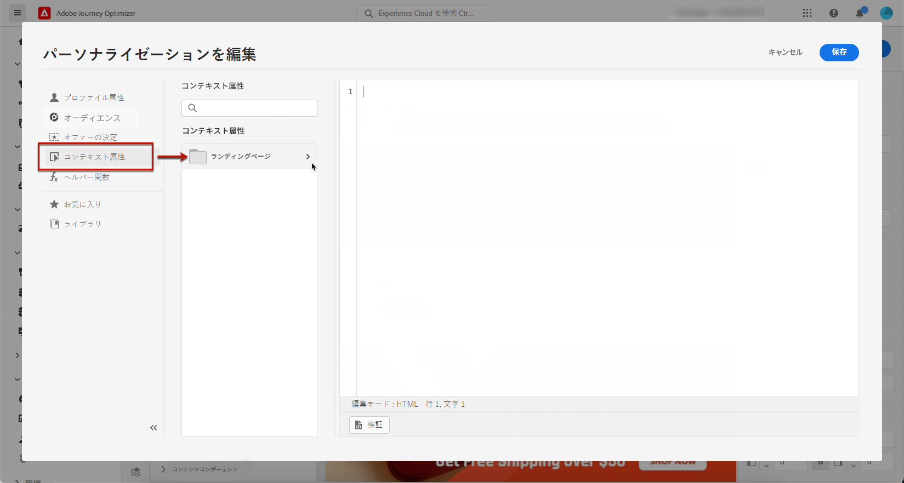

1. All the keys that you created when configuring the primary page are listed. Select the key of your choice using the + icon.

    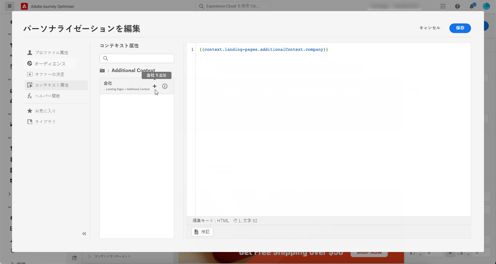

1. Save your changes and repeat the steps above as many times as needed.

    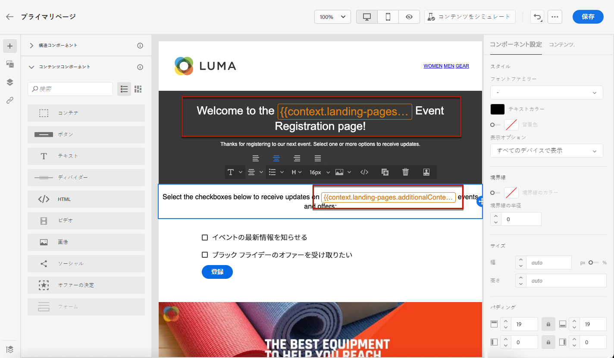

    You can see that the personalization item corresponding to your key is now displayed everywhere you inserted it.
-->