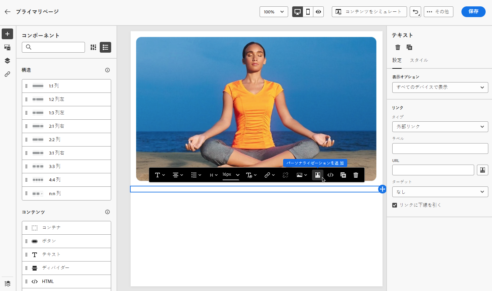
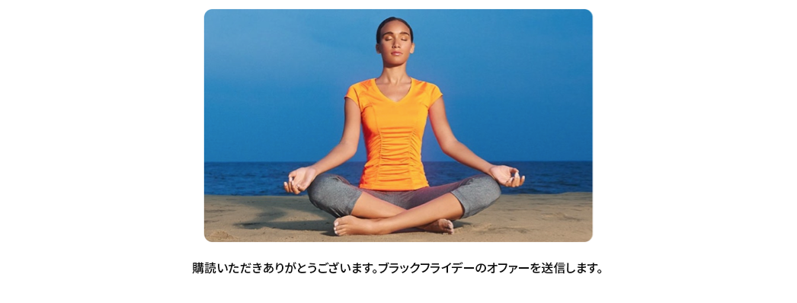

# ランディングページ特有のコンテンツの定義 {#lp-content}

ユーザーが選択した内容をランディングページから選択できるようにするための特定のコンテンツを定義するには、そのコンポーネントを使用 **[!UICONTROL Form]** します。 そのためには、次の手順を実行します。

>[!NOTE]
>
>コンポーネントを **[!UICONTROL Form]** 使用せずにクリックスルーランディングページを作成することもできます。 この場合、ユーザーには表示されますが、フォームを送信する必要はありません。 これは、オプトインまたはオプトアウトなどの受信者による操作が不要である場合や、ユーザーが入力する必要のない情報を提供する場合などに便利です。

## フォームコンポーネントの使用 {#use-form-component}

1. 左側のパレットからメインワークスペースに、ランディングページ特有 **[!UICONTROL Form]** のコンポーネントをドラッグ &amp; ドロップします。

   

   >[!NOTE]
   >
   >このコンポーネントは **[!UICONTROL Form]** 、同じページで1回だけ使用することができます。

1. このオプションを選択します。 **[!UICONTROL Form content]**&#x200B;右側のパレットにタブが表示され、フォームの様々なフィールドを編集できるようになります。

   

   >[!NOTE]
   >
   >いつでもタブに **[!UICONTROL Form style]** 切り替えて、フォームコンポーネントのコンテンツのスタイルを編集できます。 [詳細情報](#define-lp-styles)

1. **[!UICONTROL Checkbox 1]**&#x200B;セクションでは、このチェックボックスに対応するラベルを編集できます。

1. このチェックボックスをオンにするかどうかを指定します。これは、通信の受信には同意されますか、それとも連絡を求めることはありませんか?

   

   次の3つのオプションのいずれかを選択します。

   * **[!UICONTROL Opt in if checked]**&#x200B;ユーザーが同意するには、チェックボックスをオンにする必要があります (オプトイン)。
   * **[!UICONTROL Opt out if checked]**: ユーザーが同意を削除するには、チェックボックスをオンにする必要があります (オプトアウト)。
   * **[!UICONTROL Opt in if checked, opt out if unchecked]**&#x200B;このオプションを使用すると、オプトイン/オプトアウト用に1つのチェックボックスを挿入することができます。 ユーザーが同意 (オプトイン) する場合は、このチェックボックスをオンにして、その同意を削除するかどうかを確認する必要があります (オプトアウト)。

1. 次の3つのオプション間で、更新する対象を選択します。

   

   * **[!UICONTROL Subscription list]**: プロファイルによってこのチェックボックスが選択された場合は、更新される購読リストを選択する必要があります。 購読リスト ](subscription-list.md) について [ 説明します。

      

   * **[!UICONTROL Channel (email)]**: オプトインまたはオプトアウトはチャンネル全体に適用されます。 例えば、1つの電子メールアドレスを指定した場合、どちらのアドレスもすべての通信から除外されます。

   * **[!UICONTROL Email identity]**: オプトインまたはオプトアウトは、ランディングページにアクセスするために使用された電子メールアドレスにのみ適用されます。 例えば、プロファイルに2つの電子メールアドレスがある場合は、オプトインに使用されたものだけが、自分のブランドからの通信を受信することになります。

1. 「> **[!UICONTROL Checkbox]** 」をクリックし **[!UICONTROL Add field]** て、他のチェックボックスを追加します。前述の手順を繰り返して、プロパティを定義します。

   

1. 目的のチェックボックスをすべて追加したら、該当するセクションをクリック **[!UICONTROL Call to action]** して展開します。 これを使用すると、コンポーネント内 **[!UICONTROL Form]** のボタンの動作を定義することができます。

   

1. ボタンをクリックしたときの動作を次のように定義します。

   * **[!UICONTROL Redirect URL]**: ユーザーをリダイレクトするページの URL を入力します。
   * **[!UICONTROL Confirmation text]**: 表示される確認テキストを入力します。
   * **[!UICONTROL Link to a subpage]**: サブページ ](create-lp.md#configure-subpages) を設定 [ し、表示されるドロップダウンリストから選択します。

   

1. エラーが発生したときにボタンをクリックしたときの動作を定義します。

   * **[!UICONTROL Redirect URL]**: ユーザーをリダイレクトするページの URL を入力します。
   * **[!UICONTROL Error text]**: 表示されるエラーテキストを入力します。 フォームスタイル ](#define-lp-styles) を [ 定義するときに、エラーテキストをプレビューできます。

   * **[!UICONTROL Link to a subpage]**: サブページ ](create-lp.md#configure-subpages) を設定 [ し、表示されるドロップダウンリストから選択します。

   

1. フォームを送信したときに追加のアップデートが必要な場合は、または **[!UICONTROL Opt out]** を選択して、購読リスト、チャンネルまたは使用されている電子メールアドレスを更新するかどうかを選択 **[!UICONTROL Opt in]** します。

   

1. コンテンツを保存し、ページ名の横にある矢印をクリックして、ランディングページの [ プロパティ ](create-lp.md#configure-primary-page) に戻ります。

   

## ランディングページのフォームスタイルの定義 {#lp-form-styles}

1. フォームコンポーネントのコンテンツのスタイルを変更するには、いつでもタブに **[!UICONTROL Form style]** 切り替えてください。

   

1. **[!UICONTROL Checkboxes]**「」セクションを展開して、チェックボックスとそれに対応するテキストの外観を定義します。例えば、フォントの種類やサイズ、およびチェックボックスの境界線の色を調整することができます。

   

1. **[!UICONTROL Buttons]**「」セクションを展開して、コンポーネントフォームのボタンの外観を変更します。例えば、境界線を追加したり、マウスでポイントしたときにラベルのカラーを編集したり、ボタンの位置を調整することができます。

   

   ボタンを使用 **[!UICONTROL Preview]** して、ボタンのラベルカラーなどの一部の設定をマウスでポイントしたときにプレビューすることができます。 ランディングページ [ のテストについて詳しくは、こちら ](create-lp.md#test-landing-page) を参照してください。

   

1. セクションを **[!UICONTROL Form layout]** 展開して、背景色、余白、余白などのレイアウト設定を編集します。

   

1. 問題が発生したときに表示されるエラーメッセージの表示を調整するには、 **[!UICONTROL Form error]** 「」セクションを展開します。 対応するオプションをオンにして、フォーム上のエラーテキストをプレビューします。

   

## プライマリページのコンテキストを使用 {#use-primary-page-context}

同じランディングページ内の別のページからコンテキストデータを使用することができます。

例えば、1つ <!-- or the submission of the page--> [ のリンクをクリックすると、その購読リスト ](subscription-list.md) に「お礼」というサブページが表示されます。

ここでは、1つのプライマリページ上の2つのチェックボックスを、2つの異なる購読リストにリンクします。 ユーザーがこれらのいずれかの操作を行っている場合は、フォームを送信したときに、どのチェックボックスを選択したかによって、特定のメッセージが表示されるようにすることができます。

これを行うには、次の手順を実行します。

1. プライマリページで、それぞれのチェックボックスを適切な購読リストにリンクします。 [詳しく ](#use-form-component) は、こちらを参照してください。

   

1. サブページで、テキストを挿入する位置にマウスポインターを置き、状況に応じたツールバーを選択 **[!UICONTROL Add personalization]** します。

   

1. **[!UICONTROL Edit personalization]**&#x200B;ウィンドウで、> **[!UICONTROL Landing Pages]** > **[!UICONTROL Primary Page Context]** > **[!UICONTROL Subscription]** を選択 **[!UICONTROL Contextual attributes]** します。

1. プライマリページで選択したすべてのサブスクリプションリストが表示されます。 「+」アイコンを使用して、関連するアイテムを選択します。

   

1. 式エディターヘルパー関数を使用して、関連する条件を追加します。 [詳細情報](../personalization/functions/functions.md)

   

   >[!CAUTION]
   >
   >ハイフンなどの特殊文字が含まれている場合は、ハイフンも含めてテキストをエスケープする必要があります。

1. 変更内容を保存します。

これで、ユーザーがいずれかのチェックボックスをオンにすると、フォームを送信したときに、選択されたチェックボックスに対応するメッセージが表示されるようになりました。

>[!NOTE]
>
>ユーザーがチェックボックスをオンにすると、両方のテキストが表示されます。

<!--
## Use landing page additional data {#use-additional-data}

When [configuring the primary page](create-lp.md#configure-primary-page), you can create additional data to enable storing information when the landing page is being submitted.

>[!NOTE]
>
>This data may not be visible to users who visit the page.

If you defined one or more keys with their corresponding values when [configuring the primary page](create-lp.md#configure-primary-page), you can leverage these keys in the content of your primary page and subpages using the [Expression editor](../personalization/personalization-build-expressions.md).

///When you reuse the same text on a page, this enables you to dynamically change that text if needed, without going through each occurrence.

For example, if you define the company name as a key, you can quickly update it everywhere (on all the pages of a given landing page) by changing it only once in the [primary page settings](create-lp.md#configure-primary-page).///

To leverage these keys in a landing page, follow the steps below:

1. When configuring the primary page, define a key and its corresponding value in the **[!UICONTROL Additional data]** section. [Learn more](create-lp.md#configure-primary-page)

    

1. When editing your primary page with the designer, place the pointer of your mouse where you want to insert your key and select **[!UICONTROL Add personalization]** from the contextual toolbar.

    

1. In the **[!UICONTROL Edit Personalization]** window, select **[!UICONTROL Contextual attributes]** > **[!UICONTROL Landing Pages]** > **[!UICONTROL Additional Context]**.

    

1. All the keys that you created when configuring the primary page are listed. Select the key of your choice using the + icon.

    

1. Save your changes and repeat the steps above as many times as needed.

    

    You can see that the personalization item corresponding to your key is now displayed everywhere you inserted it.
-->